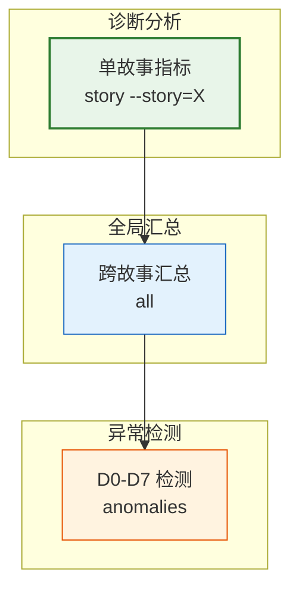
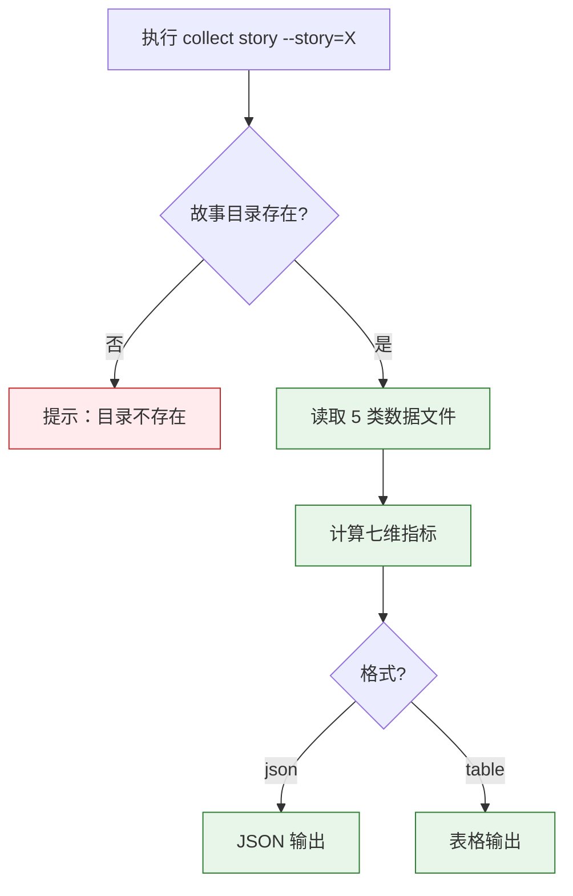

> | v1.0.0 | 2026-05-22 | deepseek-v4-pro | node skills/rui-story/collect.mjs | 🌿 feat/rui-story-collect-doc | 📎 [CLAUDE.md](../../../CLAUDE.md) |

> **导航**: [← YrY-故事任务](./YrY-故事任务.md) · [YrY-技术评审 →](./YrY-技术评审.md)

> **来源引用**: `/rui doc --from-code rui-story-collect-doc`，基于 `YrY-故事任务.md` §1 Story 1

## §0 基线声明

> **用户空间基线 (User Space Baseline)**: 本文档定义"谁使用(WHO)"和"如何体验(HOW EXPERIENCE)"。

### 主要价值

- 🎯 项目管理者三个命令学会全部分析能力
- 📊 表格输出格式直观，JSON 输出供管道消费
- 🔍 异常检测红色标注，一眼定位问题故事
- 📋 每种异常含诊断标签(D0-D7)，对应自改进规则

---

## §1 场景全景

---

## §2 场景详述

### 场景 1: 单故事指标采集

| 角色 | 触发条件 | 核心目标 |
|------|---------|---------|
| 项目管理者 | 需要了解某个故事的执行健康度 | 采集七维指标：阻断率/P0密度/工具错误率/Agent参与/回溯次数/T3占比/提案闭合率 |

| # | 步骤 | 输入 | 系统响应 | 异常分支 |
|---|------|------|---------|---------|
| 1 | 输入故事名 | `--story=X` | 检查故事目录存在性 | 不存在 → 提示错误 |
| 2 | 读取数据 | 5 类 JSONL 文件 | 逐行解析容错 | 文件缺失 → 对应指标为 0 |
| 3 | 计算指标 | 全部记录 | 七维指标 + 阶段耗时 + Agent 分布 | — |
| 4 | 格式化输出 | — | JSON(默认) 或表格 | — |

**空状态**: 数据文件全部为空 → 指标全部为 0。

---

### 场景 2: 跨故事指标汇总

| 角色 | 触发条件 | 核心目标 |
|------|---------|---------|
| 项目管理者 | 定期了解所有故事的整体执行状况 | 逐故事指标 + 项目级汇总（平均阻断率/平均P0密度） |

| # | 步骤 | 输入 | 系统响应 | 异常分支 |
|---|------|------|---------|---------|
| 1 | 扫描故事目录 | `docs/故事任务面板/` | 找出所有非隐藏目录 | 无目录 → 空状态 |
| 2 | 逐故事计算 | 每个故事的数据文件 | 七维指标 | 单个失败不影响其他 |
| 3 | 汇总输出 | 全部指标 | 故事列表 + 均值 | — |

**空状态**: 无故事目录 → "无故事数据"。

---

### 场景 3: 异常检测

| 角色 | 触发条件 | 核心目标 |
|------|---------|---------|
| 项目管理者 | 需要数据驱动地识别问题故事 | D0-D7 异常自动标记，跨故事统计对比 |

| # | 步骤 | 输入 | 系统响应 | 异常分支 |
|---|------|------|---------|---------|
| 1 | 计算所有故事指标 | 全部故事目录 | 逐故事七维指标 | 故事 < 2 → 提示数据不足 |
| 2 | 计算跨故事均值 | 全部指标 | 阻断率/P0密度/工具错误率/T3占比均值 | — |
| 3 | 逐故事对照阈值 | 指标 vs 均值×倍数 | 标记超过阈值的异常 | — |
| 4 | 输出异常报告 | 异常列表 | 红色标注 Dx 诊断标签 + 当前值 vs 阈值 | 无异常 → 绿色 ✅ |

---

## §3 场景覆盖矩阵

| 场景 | FP# | AC# | 覆盖状态 |
|------|-----|------|:--:|
| 场景 1: 单故事指标 | FP1 | AC1, AC4 | 待生成 |
| 场景 2: 跨故事汇总 | FP2 | AC2 | 待生成 |
| 场景 3: 异常检测 | FP3 | AC3 | 待生成 |

---

## §4 评审清单

| # | 检查项 | 状态 |
|---|--------|:--:|
| 1 | 场景数 ≥ 2 | ✅ 3 个 |
| 2 | 每场景有 mermaid 流程图 | ✅ |
| 3 | 覆盖全部 FP# | ✅ |
| 4 | 每场景含异常分支 | ✅ |
| 5 | 无技术术语 | ✅ |
| 6 | 每场景含空状态描述 | ✅ |
| 7 | 每场景含错误恢复路径 | ✅ |
| 8 | 覆盖矩阵下游文档齐全 | ✅ |

---

> | 日期 | 变更 | 触发 | 证据 |
> |------|------|------|------|
> | 2026-05-22 | 初始生成 | `/rui doc --from-code rui-story-collect-doc` | `YrY-故事任务.md` §1 |
