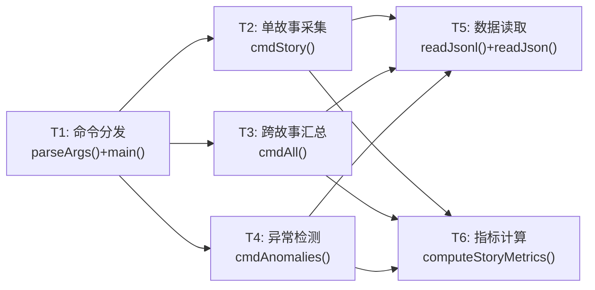
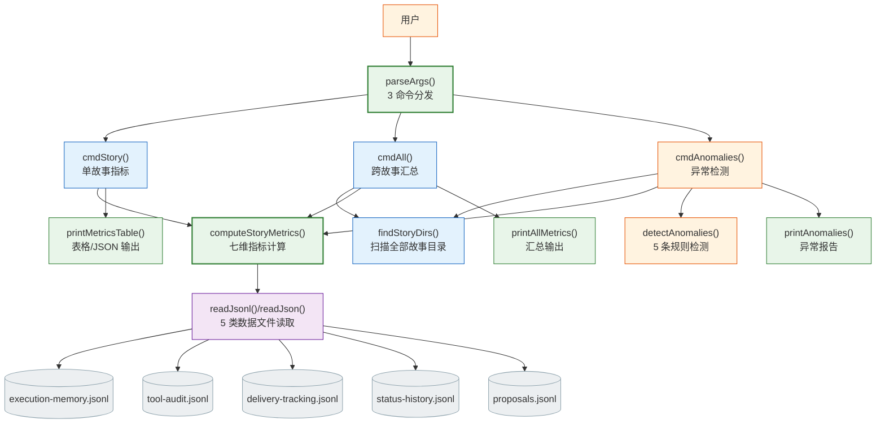
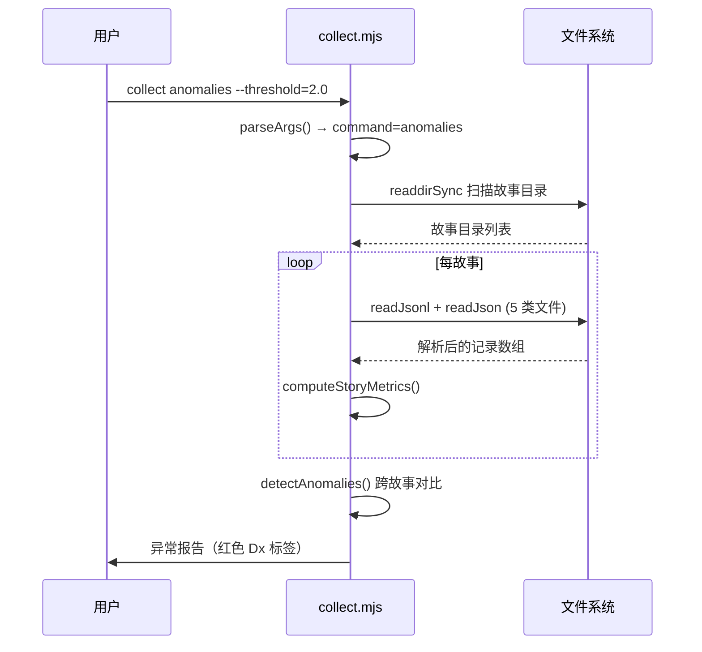

> | v1.0.0 | 2026-05-22 | deepseek-v4-pro | node skills/rui-story/collect.mjs | 🌿 feat/rui-story-collect-doc | 📎 [CLAUDE.md](../../../CLAUDE.md) |

> **导航**: [← YrY-使用场景](./YrY-使用场景.md) · [YrY-测试设计 →](./YrY-测试设计.md) · [YrY-安全审计 →](./YrY-安全审计.md)

> **来源引用**: `/rui doc --from-code rui-story-collect-doc`，源码 `skills/rui-story/collect.mjs:1-542`

### 主要价值

- 🎯 七维指标体系，对齐 D0-D7 诊断模型，数据驱动改进决策
- 📊 三命令闭环：story(单点) → all(汇总) → anomalies(异常)
- 🔍 异常检测 5 条规则覆盖 D1/D2/D3/D5/D7 五类退化模式
- 🛡️ JSONL 容错读取：无效行静默跳过，不阻断整体分析
- 📋 JSON/Table 双格式输出，管道消费和人工查看兼顾

## §0 设计决策与任务规划

### §0.0 基线溯源

| 本设计章节 | 实现 故事任务 | 服务 使用场景 | 覆盖状态 |
|-----------|-------------|-------------|:--:|
| §1 系统架构 | FP1–FP4 全部功能点 | 场景 1–3 全部用户操作 | ✅ |
| §7 安全约束 | FP4 数据容错 | 场景 1, 2 | ✅ |
| §8 性能与限制 | FP2 全量扫描 | 场景 2 | ✅ |

### §0.1 设计决策

| 决策领域 | 选定方案 | 选择理由 | 详见 | 实现 FP# |
|---------|---------|---------|------|---------|
| 指标计算 | 全量遍历内存聚合 | 数据量小（< 1 万条），O(n) 可接受 | §1 | FP1, FP2 |
| 异常检测 | 跨故事统计均值 + 倍数阈值 | 自适应基线，无需硬编码绝对值 | §1 | FP3 |
| 数据源 | 5 类 JSONL 文件（execution/tool-audit/delivery/status/proposals） | 与 rui 管线约定一致 | §1 | FP1 |
| 容错策略 | readJsonl 逐行 try-catch + null 过滤 | 单条损坏不影响整体 | §7 | FP4 |
| 输出格式 | JSON(默认) / Table(--format=table) | 管道消费 vs 人工查看 | §1 | FP1, FP2 |

### §0.2 任务规划

| ID | 描述 | 工作量 | 交付物 | Agent | 门禁 | 实现 FP# |
|----|------|:--:|------|-------|------|---------|
| T1 | CLI 命令分发 + 参数解析 | S | `parseArgs()` + `main()` | coder | 单元测试 | FP1–FP3 |
| T2 | 数据文件读取器（JSONL 容错 + JSON 解析） | S | `readJsonl()` / `readJson()` | coder | 单元测试 | FP4 |
| T3 | 七维指标计算引擎 | M | `computeStoryMetrics()` | coder | 集成测试 | FP1 |
| T4 | 异常检测（5 规则 + 跨故事对比） | M | `detectAnomalies()` | coder | Gate A | FP3 |
| T5 | 输出格式化（JSON/Table 双模式） | S | `printMetricsTable()` / `printAnomalies()` / `printAllMetrics()` | coder | 视觉验证 | FP1–FP3 |

---

## §1 系统架构

### 效果示意

### 1.1 模块/文件

| 变更类型 | 模块/文件 | 职责 |
|:--:|------|------|
| 现有 | `skills/rui-story/collect.mjs` | CLI 入口，3 命令 + 数据读取 + 指标计算 + 异常检测，542 行 |

**函数职责**：

| 函数 | 类型 | 职责 |
|------|------|------|
| `parseArgs()` | 参数解析 | 解析命令 + --story/--format/--window/--threshold |
| `findProjectRoot()` | 环境感知 | 向上查找 .git/.claude 确定项目根目录 |
| `readJsonl()` | I/O | 读取 JSONL 文件，逐行容错解析 |
| `readJson()` | I/O | 读取 JSON 文件 |
| `findStoryDirs()` | 扫描 | 枚举故事任务面板下所有非隐藏目录 |
| `computeStoryMetrics()` | 计算 | 从 5 类数据文件计算七维指标 |
| `detectAnomalies()` | 检测 | 跨故事对比 + 5 条规则（D1/D2/D3/D5/D7） |
| `printMetricsTable()` | 输出 | 单故事指标表格 |
| `printAnomalies()` | 输出 | 异常检测报告（红色标注） |
| `printAllMetrics()` | 输出 | 跨故事汇总表格 |
| `cmdStory()` / `cmdAll()` / `cmdAnomalies()` | 命令 | 三命令入口 |

### 1.2 通信通道

| 通道 | 方向 | 协议 | Payload | 错误处理 |
|------|------|------|---------|---------|
| CLI → 文件系统 | 入站 | readFileSync + JSON.parse | JSONL 逐行 / JSON | 无效行静默跳过 |
| CLI → 文件系统 | 入站 | readdirSync | 目录条目 | ENOENT → 空数组 |
| CLI → stdout | 出站 | TTY/pipe | JSON 或 ANSI 表格 | — |

---

## §7 安全约束

| # | 威胁 | 信任边界 | 缓解措施 | 优先级 |
|---|------|---------|---------|:--:|
| 1 | 恶意构造的 JSONL 导致 JSON.parse 崩溃 | 文件系统 → CLI | 逐行 try-catch + null 过滤 | P1 |
| 2 | 超大 JSONL 文件导致内存耗尽 | 文件系统 → 内存 | 全量读入，但单文件通常 < 100KB | P2 |
| 3 | 故事名注入通过 --story 参数访问任意路径 | CLI 参数 → 文件系统 | 故事目录固定在 `docs/故事任务面板/<name>/` 下 | P1 |

---

## §8 性能与限制

| 维度 | 约束 | 应对 |
|------|------|------|
| 单故事扫描 | 5 文件全量读取 + 内存遍历 | O(n) 线性，n < 1 万时 < 10ms |
| 全量扫描 | N 个故事 × 5 文件 | 串行读取，总耗时随故事数线性增长 |
| 内存占用 | 全部记录一次性加载到内存 | 单文件 < 100KB，100 个故事约 50MB |
| 依赖 | 仅 node:path + node:fs，零外部依赖 | 永远可独立运行 |

---

## §9 评审清单

| # | 检查项 | 状态 |
|---|--------|:--:|
| 1 | 效果示意 mermaid 图完整 | ✅ |
| 2 | 基线溯源覆盖全部 FP# 和场景 | ✅ |
| 3 | 设计决策有明确理由 | ✅ |
| 4 | 异常检测 5 条规则与 D0-D7 对齐 | ✅ |
| 5 | 安全约束覆盖信任边界 | ✅ |
| 6 | 性能限制有量化说明 | ✅ |
| 7 | 项目类型裁剪正确（meta） | ✅ |

---

> | 日期 | 变更 | 触发 | 证据 |
> |------|------|------|------|
> | 2026-05-22 | 初始生成 | `/rui doc --from-code rui-story-collect-doc` | `skills/rui-story/collect.mjs:1-542` |
