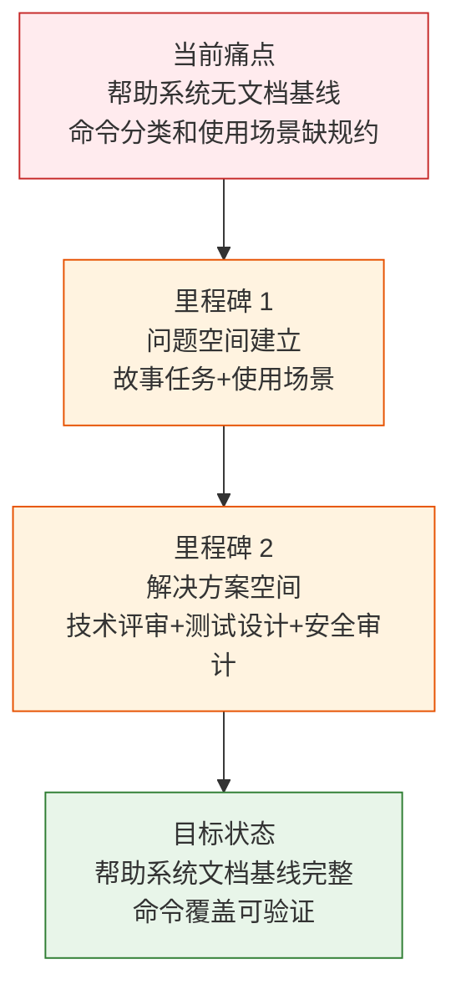
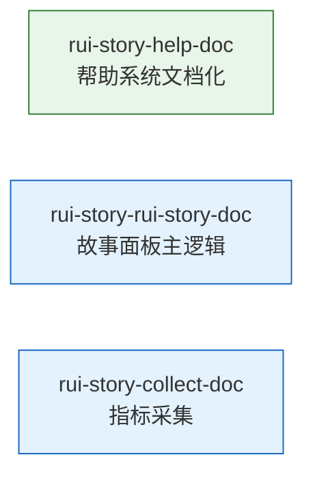

> | v1.0.0 | 2026-05-23 | deepseek-v4-pro | 🌿 feat/rui-story-help-doc | 📎 [CLAUDE.md](../../../CLAUDE.md) |

> **导航**: [YrY-使用场景 →](./YrY-使用场景.md)

> **来源引用**: 本文档由 `/rui doc --from-code rui-story-help-doc` 触发，从 `skills/rui-story/help.mjs` 源码反推生成。证据 Level B + 源码路径。

### 需求概述

故事任务面板的命令行入口需要统一的帮助系统，让用户了解所有可用命令、参数格式、使用场景。当前帮助文本由 help.mjs 生成，覆盖只读查询、状态管理、指标采集、写入操作四类命令及 12 个使用场景。但帮助系统本身缺少文档基线——命令分类逻辑、输出格式约定、使用场景覆盖度——没有规约约束。

### 效果示意

### 主要价值

- 📋 为故事面板帮助系统建立正式问题空间基线，使命令分类和输出格式有规约可依
- 🔗 让下游文档可溯源至明确的帮助系统功能需求
- 🎯 覆盖 4 类命令（只读/状态/指标/写入）和 12 个使用场景的功能点定义
- 🛡 明确帮助输出格式约定，防止命令描述风格不一致

---

## §1 Story

### Story 1: 故事面板帮助系统 — 问题空间基线

| 字段 | 内容 |
|------|------|
| 作为 | 开发者/用户 |
| 我想要 | 通过命令行查看故事任务面板的完整帮助信息 |
| 以便 | 理解所有可用命令、参数和使用方式 |
| 优先级 | P0 |
| 范围边界 | 仅建立文档基线，不涉及源码修改 |
| 依赖 | 源码文件可读 |

#### 范围外

- 不修改源码
- 不修改命令行为
- 不覆盖已有故事文档

#### §1.1 User Operations

| # | 操作 | 触发条件 | 操作步骤 | 预期结果 |
|---|------|---------|---------|---------|
| 1 | 查看完整帮助 | 执行帮助命令 | 启动 help.mjs → 输出格式化帮助文本 | 显示快速入门、子命令分类、使用场景 |
| 2 | 按分类查找命令 | 用户在帮助中搜索 | 定位到只读/状态/指标/写入分类 | 找到对应命令的格式和描述 |
| 3 | 按场景学习用法 | 用户需要特定场景的操作指南 | 定位到使用场景段 → 找到匹配的命令 | 获得可复制执行的命令示例 |

---

### §2 Requirements

#### 功能点

| FP# | 描述 | 输入 | 输出 | 错误行为 | 优先级 |
|-----|------|------|------|---------|--------|
| FP1 | 帮助文本生成 — 输出完整格式化的帮助信息 | 无 | 含颜色标记的结构化文本 | — | P0 |
| FP2 | 命令分类展示 — 按只读/状态/指标/写入四类分组 | 无 | 分组标题 + 命令列表 | 分类遗漏命令时偏差 | P0 |
| FP3 | 使用场景展示 — 12 个典型场景的命令示例 | 无 | 场景标题 + 对应命令 | — | P1 |
| FP4 | TTY 颜色适配 — 终端支持时彩色输出，否则纯文本 | 无 | ANSI 转义序列或纯文本 | — | P1 |
| FP5 | 格式一致性 — 所有命令使用统一的缩进和列对齐 | 无 | 40 字符命令列 + 描述列 | 对齐偏差影响可读性 | P1 |

#### 业务规则

| R# | 描述 | 校验方式 | 证据级别 |
|----|------|---------|---------|
| R1 | 帮助文本覆盖所有已实现的命令 | grep 命令名 vs 源码 | A |
| R2 | 命令分类不交叉（一个命令只在一个分类） | 检查分类边界 | A |
| R3 | TTY 非交互时降级为纯文本 | 检查 isTTY 逻辑 | A |

#### 数据约束

| 约束 | 类型 | 范围/格式 | 来源 |
|------|------|----------|------|
| 命令名 | string | kebab-case + 可选参数占位符 | 各 skill 入口 |
| 颜色代码 | enum | bold/dim/underline/yellow/cyan | ANSI 转义序列常量 |
| 缩进 | number | 2 空格(子标题) / 4 空格(命令项) | 代码常量 |

---

### §3 成功标准

| SC# | 描述 | 度量方式 | 目标值 | 优先级 | 关联 FP# |
|-----|------|---------|--------|--------|---------|
| SC1 | 用户执行帮助命令可看到完整命令列表 | 终端输出行数 | ≥ 100 行 | P0 | FP1, FP2 |
| SC2 | 所有已实现命令在帮助中有对应条目 | 命令数对比 | 100% 覆盖 | P0 | FP2 |
| SC3 | 帮助输出在管道中不出现 ANSI 乱码 | `\| cat` 后无转义序列 | 0 个转义字符 | P0 | FP4 |
| SC4 | 12 个使用场景全部有可执行命令示例 | 场景数 | ≥ 12 | P1 | FP3 |

---

### §4 范围边界

#### 范围内

| # | 条目 | 关联 FP# | 边界说明 |
|---|------|---------|---------|
| 1 | 帮助文本结构定义 | FP1, FP2 | 快速入门 + 子命令 + 使用场景 |
| 2 | 命令分类与展示 | FP2 | 只读/状态管理/指标采集/写入 |
| 3 | TTY 兼容 | FP4 | isTTY 检测 + 降级 |

#### 范围外

| # | 条目 | 排除原因 | 替代方案 |
|---|------|---------|---------|
| 1 | 命令实际执行逻辑 | 各 skill 入口负责 | — |
| 2 | 帮助文本翻译 | 当前仅中文 | — |
| 3 | 交互式帮助（分页） | 当前为一次性输出 | — |

---

### §5 AC

| AC# | Given | When | Then | 门禁 |
|-----|-------|------|------|------|
| AC1 | 帮助脚本存在 | 执行帮助命令 | 输出含"快速入门""子命令""使用场景"三段 | Gate A |
| AC2 | 终端支持颜色 | 执行帮助命令 | 输出含 ANSI 转义序列的颜色标记 | Gate A |
| AC3 | 管道到非 TTY | 执行 `help \| cat` | 输出纯文本无 ANSI 序列 | Gate A |
| AC4 | 新增命令后 | 用户查看帮助 | 新命令出现在对应分类中 | Gate B |

---

### §6 风险与假设

| # | 风险/假设 | 类型 | 可能性 | 影响 | 缓解/验证策略 | 关联 FP# |
|---|----------|------|--------|------|-------------|---------|
| 1 | 新增命令后帮助文本未同步更新 | 风险 | M | M | help.mjs 手动维护，需规约保证同步 | FP2 |
| 2 | 命令重命名后帮助仍引用旧名 | 风险 | M | M | version --up 的 §4a 扫描修正 | FP1 |
| 3 | 所有命令入口遵循统一命名规范 | 假设 | — | — | 命名规范约束 | FP2 |

---

### §7 跨文档索引

| 本文档章节 | 基线内容 | 下游文档编号 | 预期覆盖 | 状态 |
|-----------|---------|-------------|---------|------|
| §2 FP1–FP5 | 功能点定义 | 技术评审 | 架构与实现方案 | 待生成 |
| §5 AC1–AC4 | 验收标准 | 测试设计 | 测试用例覆盖 | 待生成 |
| §6 风险 | 安全风险 | 安全审计 | 威胁建模 | 待生成 |

---

### §R 关联故事

---

> **变更记录**
> | 日期 | 变更 | 触发 | 证据 |
> |------|------|------|------|
> | 2026-05-23 | 初始生成 — 从 skills/rui-story/help.mjs 源码反推 | /rui doc --from-code rui-story-help-doc | recommend.mjs 扫描 + 源码分析 |
