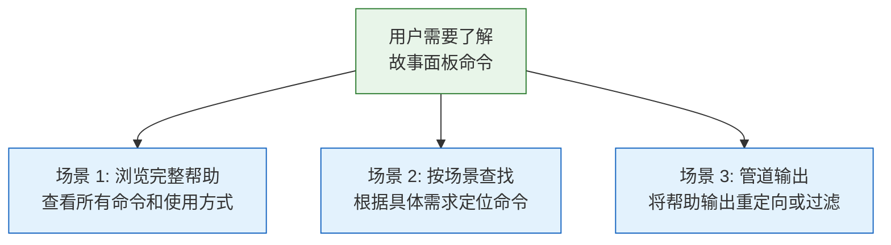
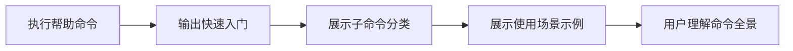
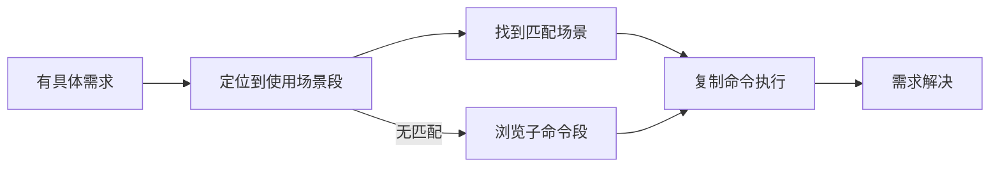
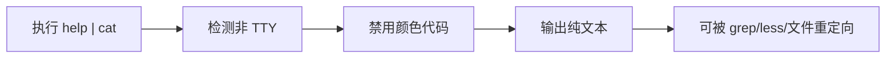

> | v1.0.0 | 2026-05-23 | deepseek-v4-pro | 🌿 feat/rui-story-help-doc | 📎 [CLAUDE.md](../../../CLAUDE.md) |

> **导航**: [← YrY-故事任务](./YrY-故事任务.md) · [YrY-技术评审 →](./YrY-技术评审.md)

> **来源引用**: 基于 `YrY-故事任务.md` §1 Story 1 与 §1.1 User Operations 反推生成。证据 Level A + 文档路径。

[§0 基线声明](#sec0-baseline) · [§1 场景全景](#sec1-scenarios) · [§2 场景详述](#sec2-details) · [§3 场景覆盖矩阵](#sec3-matrix) · [§4 评审清单](#sec4-checklist) · [§5 体验基线](#sec5-experience)

### 主要价值

- 👤 定义帮助系统的用户空间基线，明确"谁在什么场景下查阅帮助"
- 🔄 覆盖快速入门、命令查找、场景学习三类核心用户旅程
- 🛡 每个场景包含非 TTY 降级路径，确保管道使用不产生乱码
- 📋 场景覆盖矩阵对齐故事任务 FP# 和 AC#，为测试设计提供可溯源基线

---

## §0 基线声明

> **用户空间基线 (User Space Baseline)**: 本文档定义"谁使用(WHO)"和"如何体验(HOW EXPERIENCE)"。所有交互设计、测试用例、验收标准均必须覆盖本文档定义的每个场景。

---

## §1 场景全景

---

## §2 场景详述

### 场景 1: 浏览完整帮助

| 角色 | 开发者/用户 |
|------|-----------|
| 触发条件 | 首次使用或不确定可用命令 |
| 核心目标 | 获得所有命令的完整概览 |

| # | 步骤 | 输入 | 系统响应 | 异常分支 |
|---|------|------|---------|---------|
| 1 | 执行帮助 | 无参数 | 输出格式化文本 | — |
| 2 | 阅读快速入门 | — | 4 个核心命令 | — |
| 3 | 浏览子命令 | — | 4 类分组命令列表 | — |
| 4 | 查看场景 | — | 12 个场景示例 | — |

### 场景 2: 按场景查找命令

| 角色 | 开发者 |
|------|--------|
| 触发条件 | 有具体操作需求（如"如何查看故事进度"） |
| 核心目标 | 快速找到匹配场景的命令 |

| # | 步骤 | 输入 | 系统响应 | 异常分支 |
|---|------|------|---------|---------|
| 1 | 定位场景段 | 搜索关键词 | 匹配场景标题 | 无匹配→浏览子命令段 |
| 2 | 阅读场景命令 | — | 命令 + 描述 | — |
| 3 | 复制执行 | 命令文本 | 执行结果 | — |

### 场景 3: 管道输出

| 角色 | 高级用户 |
|------|---------|
| 触发条件 | 需要搜索/过滤/保存帮助内容 |
| 核心目标 | 获得无 ANSI 乱码的纯文本输出 |

| # | 步骤 | 输入 | 系统响应 | 异常分支 |
|---|------|------|---------|---------|
| 1 | 管道执行 | help 命令 | 检测 stdout 非 TTY | — |
| 2 | 降级输出 | — | 纯文本无 ANSI | — |
| 3 | 后续处理 | — | grep/less/文件可用 | — |

---

## §3 场景覆盖矩阵

| 场景 | FP# | AC# | 技术评审 | 测试设计 | 覆盖状态 |
|------|-----|-----|---------|---------|---------|
| 场景 1: 完整帮助 | FP1, FP2, FP5 | AC1 | 待生成 | 待生成 | 待覆盖 |
| 场景 2: 按场景查找 | FP3 | AC1 | 待生成 | 待生成 | 待覆盖 |
| 场景 3: 管道输出 | FP4 | AC3 | 待生成 | 待生成 | 待覆盖 |

---

## §4 评审清单

| # | 检查项 | 状态 |
|---|--------|:--:|
| 1 | 场景 ≥ 2 | ✅ 3 场景 |
| 2 | 每场景有 mermaid 图 | ✅ |
| 3 | FP 全覆盖 | ✅ |
| 4 | 异常分支明确 | ✅ |
| 5 | 无技术术语 | ✅ |
| 6 | 每场景含空状态与错误恢复 | ✅ |
| 7 | 覆盖矩阵下游文档齐全 | ✅ |

---

## §5 体验基线

| 角色 | 核心旅程 | 情感目标 | 痛点解决 | 成功感知 | 关联场景 |
|------|---------|---------|---------|---------|---------|
| 开发者 | 首次查看命令全景 | 清晰、有结构 | 不用翻源码找命令 | 看到四类分组一目了然 | 场景 1 |
| 开发者 | 按需求定位命令 | 快速匹配 | 不用记忆所有命令 | 在场景段找到可复制的示例 | 场景 2 |
| 高级用户 | 管道过滤帮助 | 无缝兼容 | ANSI 乱码不再出现 | grep 命中、less 正常翻页 | 场景 3 |

---

> **变更记录**
> | 日期 | 变更 | 触发 | 证据 |
> |------|------|------|------|
> | 2026-05-23 | 初始生成 | /rui doc --from-code rui-story-help-doc | 故事任务 §1 + §1.1 + 源码分析 |
