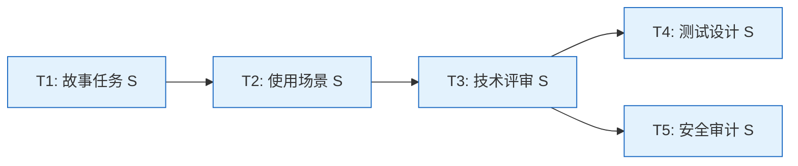
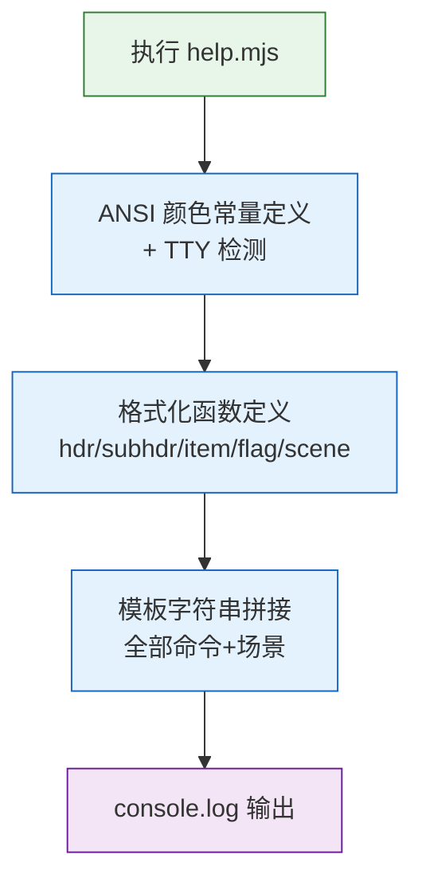

> | v1.0.0 | 2026-05-23 | deepseek-v4-pro | 🌿 feat/rui-story-help-doc | 📎 [CLAUDE.md](../../../CLAUDE.md) |

> **导航**: [← YrY-使用场景](./YrY-使用场景.md) · [YrY-测试设计 →](./YrY-测试设计.md) · [YrY-安全审计 →](./YrY-安全审计.md)

> **来源引用**: 基于 `YrY-故事任务.md` §2 + `YrY-使用场景.md` §2 生成。技术事实从源码反推。证据 Level B + 源码路径。

[§0 设计决策与任务规划](#sec0-design) · [§1 系统架构](#sec1-architecture) · [§7 安全约束](#sec7-security) · [§9 评审清单](#sec9-checklist)

### 主要价值

- 🏗 定义帮助系统的技术架构：模板字符串构建 → ANSI 颜色注入 → TTY 检测降级
- 🔗 明确 5 个格式化函数的职责边界和颜色常量约定
- 🛡 建立 TTY 检测防御：非交互时禁用全部 ANSI 转义，防止管道乱码
- ⚡ 提供可执行的技术基线，使测试设计和安全审计有明确的技术攻击面

---

## §0 设计决策与任务规划

### §0.0 基线溯源

| 本设计章节 | 实现 YrY-故事任务 | 服务 YrY-使用场景 | 覆盖状态 |
|-----------|-----------------|-----------------|---------|
| §1 系统架构 | FP1–FP5 | 场景 1–3 | 已覆盖 |
| §7 安全约束 | FP1 | 场景 3 | 已覆盖 |
| §0.1 设计决策 | FP4, FP5 | 场景 3 | 已覆盖 |

### §0.1 设计决策

| 决策领域 | 选定方案 | 选择理由 | 实现 FP# |
|---------|---------|---------|---------|
| 输出构建 | 模板字符串直接拼接 | 帮助文本静态，无动态数据；模板字符串可读性最好 | FP1 |
| 颜色模型 | 5 色 ANSI（bold/dim/underline/yellow/cyan） | 足够区分标题/命令/描述/参数；不依赖复杂库 | FP4 |
| TTY 降级 | isTTY 检测 + 函数替换 | 非 TTY 时所有颜色函数变为透传，零性能开销 | FP4 |
| 列对齐 | 固定 40 字符命令列 + 动态 padding | 视觉效果一致，适配不同命令长度 | FP5 |

### §0.2 任务规划

---

## §1 系统架构

### 效果示意

### 1.1 模块清单

| 变更类型 | 模块/文件 | 职责 |
|---------|----------|------|
| 现有 | skills/rui-story/help.mjs | 纯输出：定义格式化函数 → 构建帮助字符串 → 输出 |
| 无外部依赖 | — | 不调用其他脚本或 API |

### 1.2 格式化函数

| 函数 | 参数 | 输出格式 | 用途 |
|------|------|---------|------|
| hdr(text) | 标题文本 | 加粗 + 前后空行 | 一级标题（快速入门/子命令/使用场景） |
| subhdr(text) | 子标题文本 | 缩进 2 + 加粗 | 二级标题（只读命令/状态管理/...） |
| item(cmd, desc, colorFn) | 命令名+描述+可选颜色 | 缩进 4 + 40 列命令 + 描述 | 命令列表项 |
| flag(name, desc) | 参数名+描述 | `--name` 格式 + 黄色 | 参数说明 |
| scene(title) | 场景标题 | 缩进 4 + 加粗 | 使用场景标题 |

---

## §7 安全约束

| # | 威胁 | 信任边界 | 缓解措施 | 优先级 |
|---|------|---------|---------|--------|
| 1 | 帮助文本注入恶意 ANSI 序列 | 无外部输入 | 所有字符串为编译时静态文本，无用户输入拼接 | P2 |
| 2 | TTY 检测被欺骗导致管道出现 ANSI | stdout.isTTY | Node.js 原生属性，不可伪造 | P2 |

---

## §9 评审清单

| # | 检查项 | 状态 |
|---|--------|:--:|
| 1 | 基线溯源完备 | ✅ |
| 2 | 效果示意完整 | ✅ |
| 3 | 格式化函数职责明确 | ✅ |
| 4 | TTY 降级路径存在 | ✅ |
| 5 | 无外部依赖风险 | ✅ |

---

> **变更记录**
> | 日期 | 变更 | 触发 | 证据 |
> |------|------|------|------|
> | 2026-05-23 | 初始生成 | /rui doc --from-code rui-story-help-doc | skills/rui-story/help.mjs |
