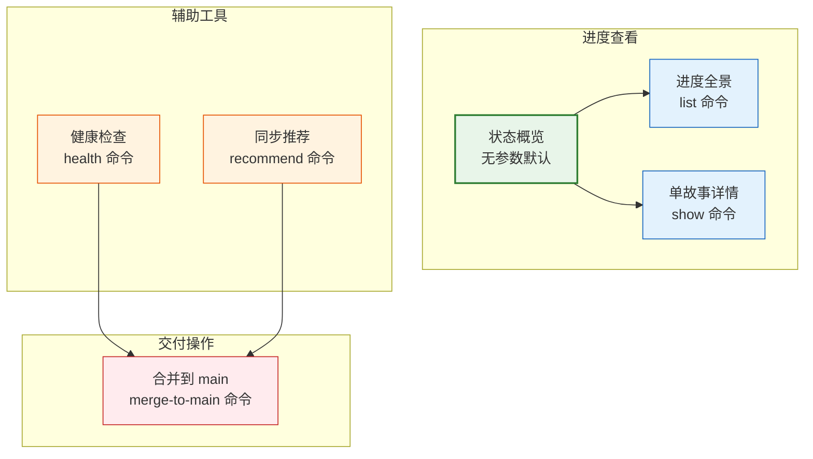
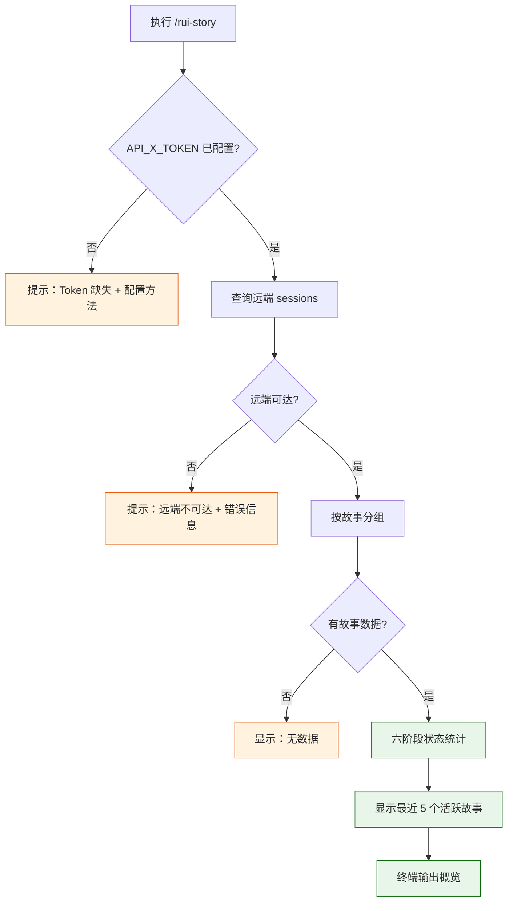
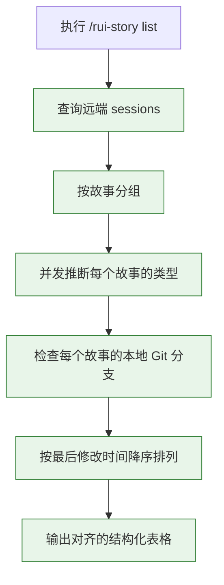
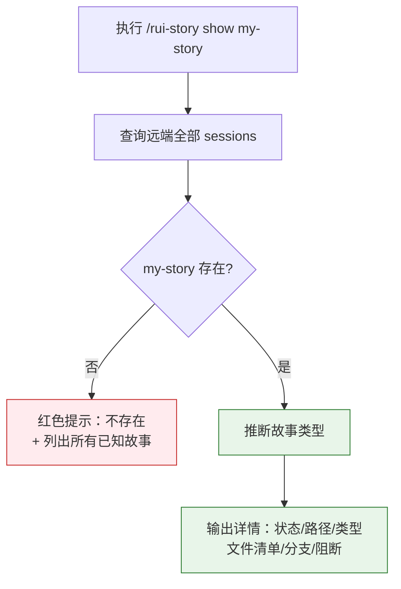
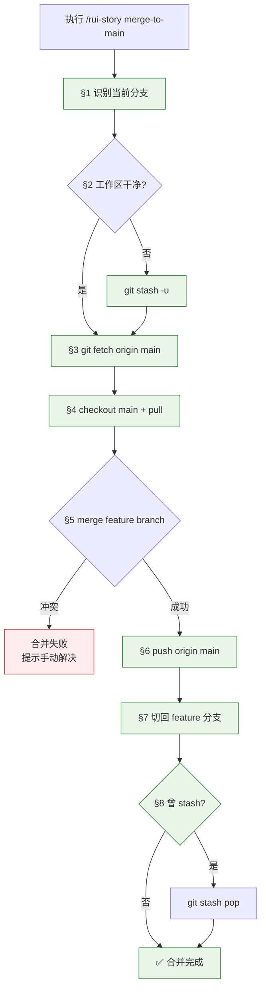
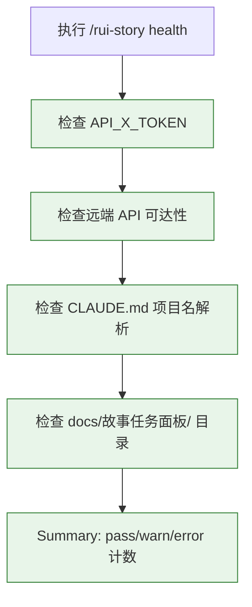

> | v1.0.0 | 2026-05-22 | deepseek-v4-pro | node skills/rui-story/rui-story.mjs | 🌿 feat/rui-story-rui-story-doc | 📎 [CLAUDE.md](../../../CLAUDE.md) |

> **导航**: [← YrY-故事任务](./YrY-故事任务.md) · [YrY-技术评审 →](./YrY-技术评审.md)

> **来源引用**: `/rui doc --from-code rui-story-rui-story-doc`，基于 `YrY-故事任务.md` §1 Story 1–2

## §0 基线声明

> **用户空间基线 (User Space Baseline)**: 本文档定义"谁使用(WHO)"和"如何体验(HOW EXPERIENCE)"。所有交互设计(技术评审)、测试用例(测试设计)、验收标准(故事任务 §5)均必须覆盖本文档定义的每个场景。

### 主要价值

- 🎯 项目管理者和开发者各自的学习路径不超过三个命令
- 🌐 远端数据源对用户透明，无需关心数据同步细节
- 📊 状态颜色编码直观：灰(任务)→黄(设计)→白(实施)→青(测试)→绿(报告/改进)
- 🔀 merge-to-main 八步自动化但每步有回滚保护
- 🏥 健康检查四维度结果一目了然，准确定位问题根因

---

## §1 场景全景

---

## §2 场景详述

### 场景 1: 查看所有故事进度概览

| 角色 | 触发条件 | 核心目标 |
|------|---------|---------|
| 项目管理者 | 定期检查或随时了解项目全局 | 快速了解全部故事在各阶段的分布和最近活跃情况 |

| # | 步骤 | 输入 | 系统响应 | 异常分支 |
|---|------|------|---------|---------|
| 1 | 用户执行命令 | 无参数 | 检查 API_X_TOKEN 是否存在 | Token 缺失 → 提示配置方法 |
| 2 | 查询远端 | API 请求 | 获取全部 sessions 列表 | 远端不可达 → 提示错误信息 |
| 3 | 按故事分组 | sessions 列表 | 提取故事名称，建立 story→[sessions] 映射 | sessions 为空 → 显示空状态 |
| 4 | 状态推导 | 每个故事的远端文件清单 | 按文档完整性判定六阶段状态 | 解析失败的故事跳过 |
| 5 | 输出概览 | 状态统计 + 时间戳 | 六阶段计数 + 最近 5 个故事 | — |

**空状态**: 远端无故事任务面板数据 → 显示 "无"。

**错误恢复**: Token 缺失 → 显示配置方法后退出；远端不可达 → 显示错误信息后退出。

---

### 场景 2: 查看进度全景表格

| 角色 | 触发条件 | 核心目标 |
|------|---------|---------|
| 项目管理者 | 需要完整的项目进度清单 | 查看每个故事的名称、状态、文件数、最后更新时间、类型、Git 分支 |

| # | 步骤 | 输入 | 系统响应 | 异常分支 |
|---|------|------|---------|---------|
| 1 | 用户执行命令 | `list` 参数 | 查询远端全部 sessions | Token 缺失/远端不可达 → 同场景 1 |
| 2 | 按故事分组 | sessions 列表 | 提取 story→[sessions] 映射 | 无故事数据 → 空状态提示 |
| 3 | 推断类型 | 每个故事的技术评审内容 | 并发 4 worker 读取远端技术评审 → 关键词匹配 | 单个读取失败 → 默认 meta |
| 4 | 检查分支 | 每个故事名称 | `git branch --list feat/<name>` | — |
| 5 | 输出表格 | 全部故事元数据 | 对齐的列（名称/状态/文件/时间/类型/分支） | — |

**空状态**: 远端无数据 → "远端无故事任务面板数据"。

---

### 场景 3: 查看单个故事详情

| 角色 | 触发条件 | 核心目标 |
|------|---------|---------|
| 开发者 | 需要了解某个故事的全貌 | 查看故事状态、远端路径、类型、所有文件的清单和更新时间、阻断信息 |

| # | 步骤 | 输入 | 系统响应 | 异常分支 |
|---|------|------|---------|---------|
| 1 | 用户执行命令 | `show` + story name | 查询远端全部 sessions | Token 缺失/远端不可达 → 同场景 1 |
| 2 | 匹配故事 | story name | 在分组结果中查找目标故事 | 不存在 → 红色提示 + 列出已知故事名 |
| 3 | 推断类型 | 目标故事的技术评审 | 读取远端内容 → 关键词匹配 | 读取失败 → 默认 meta |
| 4 | 读取阻断状态 | 本地 .memory/rui-state.json | 解析 blocked + block_reason | 文件不存在 → null |
| 5 | 输出详情 | 全部元数据 | 状态/路径/类型/文件清单/分支/阻断 | — |

**空状态**: 目标故事不存在于远端 → 红色提示 + 已知故事列表。

**错误恢复**: 故事不存在时列出全部已知故事名，帮助用户发现正确的名称。

---

### 场景 4: 一键合并到 main

| 角色 | 触发条件 | 核心目标 |
|------|---------|---------|
| 开发者 | 故事开发完成需要交付 | 自动完成 stash → fetch → merge → push → restore 全流程 |

| # | 步骤 | 输入 | 系统响应 | 异常分支 |
|---|------|------|---------|---------|
| 1 | 识别当前分支 | `git branch --show-current` | 获取当前分支名 | detached HEAD → 退出 |
| 2 | 检查未提交变更 | `git status --porcelain` | 有变更则 `git stash -u` | stash 失败 → 退出 |
| 3 | 拉取远端 | `git fetch origin main` | 更新远端引用 | fetch 失败 → 恢复 stash 后退出 |
| 4 | 切换到 main | `git checkout main` + `git pull` | 切换到最新 main | checkout/pull 失败 → 切回原分支 + 恢复 stash |
| 5 | 合并功能分支 | `git merge <feature> --no-edit` | 合并当前功能分支 | 合并冲突 → 提示手动解决 |
| 6 | 推送到远端 | `git push origin main` | 推送合并后的 main | push 失败 → 报错退出 |
| 7 | 切回功能分支 | `git checkout <feature>` | 切回原分支 | 非致命，忽略 |
| 8 | 恢复 stash | `git stash pop` (如有) | 恢复之前暂存的变更 | stash pop 失败 → 提示手动操作 |

**错误恢复**: fetch/checkout 失败时自动切回原分支 + 恢复 stash；合并冲突时保留冲突状态供手动解决。

---

### 场景 5: 健康检查

| 角色 | 触发条件 | 核心目标 |
|------|---------|---------|
| 运维者/开发者 | 怀疑远端连接问题或配置缺失 | 四维度诊断项目配置和远端可达性 |

| # | 步骤 | 输入 | 系统响应 | 异常分支 |
|---|------|------|---------|---------|
| 1 | Token 检查 | process.env.API_X_TOKEN | ✅ 已配置 / ⚠️ 缺失 | Token 缺失时跳过远端诊断 |
| 2 | API 可达性 | HTTP POST to effiy.cn | ✅ 可查询到 N 个 sessions / ❌ 不可达 | 不可达时显示错误信息 |
| 3 | 项目名解析 | CLAUDE.md 文件 | ✅ 项目名 = X / ❌ 未找到或无法解析 | — |
| 4 | 目录检查 | docs/故事任务面板/ | ✅ 存在 / ⚠️ 不存在 | — |
| 5 | Summary | 四项结果 | pass/warn/error 三色计数 | — |

---

## §3 场景覆盖矩阵

| 场景 | FP# | AC# | 实现文档(技术评审) | 测试文档(测试设计) | 覆盖状态 |
|------|-----|------|------------------|------------------|:--:|
| 场景 1: 状态概览 | FP1 | AC1 | §1 系统架构 | TC-N1, TC-E1 | 待生成 |
| 场景 2: 进度全景 | FP2 | AC2 | §1 系统架构 | TC-N2, TC-E1 | 待生成 |
| 场景 3: 单故事详情 | FP3 | AC3, AC8 | §1 系统架构 | TC-N3, TC-N4 | 待生成 |
| 场景 4: 合并到 main | FP6 | AC4, AC7 | §1 系统架构 | TC-N5, TC-B1 | 待生成 |
| 场景 5: 健康检查 | FP5 | AC5 | §1 系统架构 | TC-N6, TC-E2 | 待生成 |

---

## §4 评审清单

| # | 检查项 | 状态 |
|---|--------|:--:|
| 1 | 场景数 ≥ 2 | ✅ 5 个 |
| 2 | 每场景有 mermaid 流程图 | ✅ |
| 3 | 覆盖全部 FP# | ✅ |
| 4 | 每场景含异常分支 | ✅ |
| 5 | 无技术术语 | ✅ |
| 6 | 每场景含空状态描述 | ✅ |
| 7 | 每场景含错误恢复路径 | ✅ |
| 8 | 覆盖矩阵下游文档齐全 | ✅ |

---

## §5 体验基线

| 角色 | 核心旅程 | 情感目标 | 痛点解决 | 成功感知 | 关联场景 |
|------|---------|---------|---------|---------|---------|
| 项目管理者 | 无参数直接看概览 → 发现异常 → show 详情 | 感到掌控全局，无需记忆命令 | 不知道各故事进度 → 六阶段一目了然 | 看到状态分布和最近活动 | 场景 1, 3 |
| 开发者 | 开发完成 → merge-to-main → 自动交付 | 感到交付简单可靠，不怕遗漏步骤 | 多步 git 操作容易出错 → 一键八步全自动 | 看到 "✅ 合并完成" + 步骤日志 | 场景 4 |
| 运维者 | 怀疑连接问题 → health → 定位根因 | 感到诊断透明，不靠猜测 | 不知道是 Token/网络/配置问题 → 四维度精准定位 | 看到 pass/warn/error 分类计数 | 场景 5 |

---

> | 日期 | 变更 | 触发 | 证据 |
> |------|------|------|------|
> | 2026-05-22 | 初始生成 | `/rui doc --from-code rui-story-rui-story-doc` | `YrY-故事任务.md` §1 |
