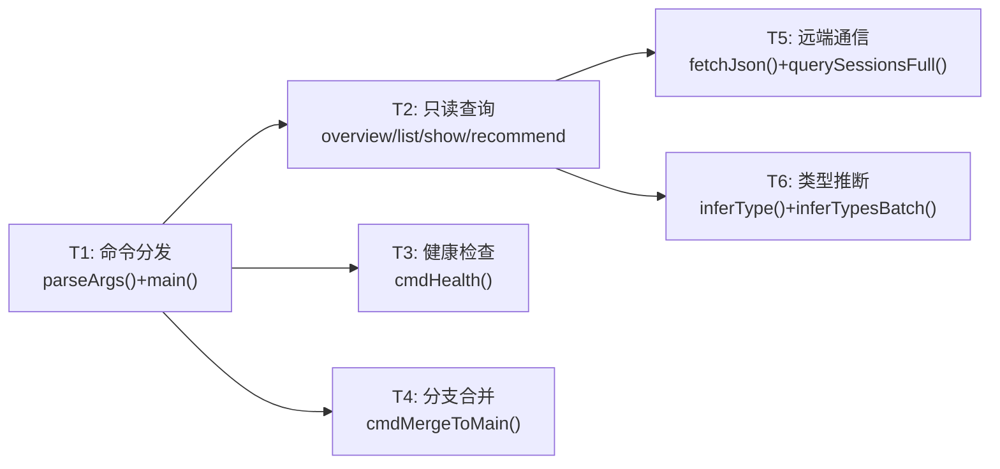
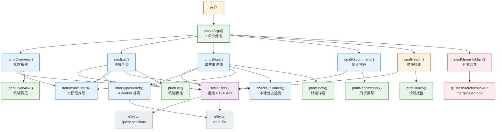
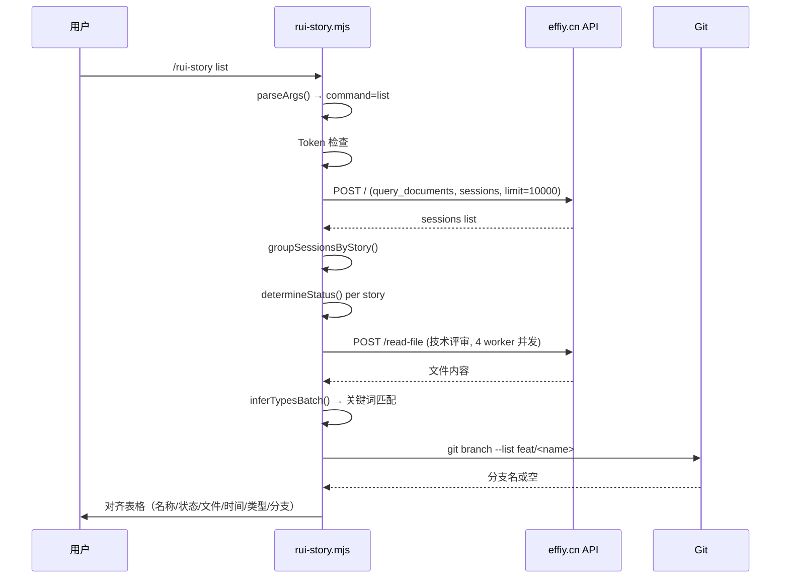

> | v1.0.0 | 2026-05-22 | deepseek-v4-pro | node skills/rui-story/rui-story.mjs | 🌿 feat/rui-story-rui-story-doc | 📎 [CLAUDE.md](../../../CLAUDE.md) |

> **导航**: [← YrY-使用场景](./YrY-使用场景.md) · [YrY-测试设计 →](./YrY-测试设计.md) · [YrY-安全审计 →](./YrY-安全审计.md)

> **来源引用**: `/rui doc --from-code rui-story-rui-story-doc`，源码 `skills/rui-story/rui-story.mjs:1-901`

### 主要价值

- 🎯 七命令统一入口：7 个命令覆盖查询/详情/诊断/交付全生命周期
- 🌐 远端 API 为唯一数据源，本地零状态，网络不可达时优雅降级
- 📊 六阶段状态机自动推导文档进度，四类型关键词推断故事分类
- 🔀 merge-to-main 八步事务性工作流，每步失败有回滚保护
- 🏥 health 四维度诊断：Token/API/项目名/目录，逐项 pass/warn/error

## §0 设计决策与任务规划

### §0.0 基线溯源

| 本设计章节 | 实现 故事任务 | 服务 使用场景 | 覆盖状态 |
|-----------|-------------|-------------|:--:|
| §1 系统架构 | FP1–FP7 全部功能点 | 场景 1–5 全部用户操作 | ✅ |
| §7 安全约束 | R3 Token 优雅降级, R6 HTTP 超时 | 场景 1, 2, 3, 5 | ✅ |
| §8 性能与限制 | FP2 并发类型推断 | 场景 2 | ✅ |

### §0.1 设计决策

| 决策领域 | 选定方案 | 选择理由 | 详见 | 实现 FP# |
|---------|---------|---------|------|---------|
| 数据源 | 远端 API（effiy.cn）为唯一数据源 | 故事文档通过 rui-import 同步到远端，面板直接查询远端获取最新状态 | §1 | FP1–FP5 |
| 状态推导 | 六阶段文档检查链（故事任务→基线→实施报告→测试报告→自改进复盘） | 状态自然反映文档产出进度，无需额外状态字段 | §1 | FP1, FP2 |
| 类型推断 | 并发读取远端技术评审 + 关键词正则匹配 | 4 worker 并发加速，单故事失败默认 meta | §1 | FP2, FP3 |
| 分支检测 | 本地 `git branch --list feat/<name>` | 轻量检测，不依赖远端 API | §1 | FP2, FP3 |
| 项目名解析 | 4 级 fallback（表格→粗体→冒号→目录名） | 兼容多种 CLAUDE.md 格式 | §1 | FP1–FP5 |
| HTTP 容错 | 30s 超时 + 错误截断 500 字符 + try-catch 包裹 | 防止远端阻塞，错误信息可控 | §7 | FP1–FP5 |
| TTY 检测 | `process.stdout.isTTY` 控制 ANSI 颜色 | 管道友好 | §1 | FP1–FP3, FP5 |

### §0.2 任务规划

| ID | 描述 | 工作量 | 交付物 | Agent | 门禁 | 实现 FP# |
|----|------|:--:|------|-------|------|---------|
| T1 | CLI 命令分发 + 参数解析（7 命令 + help） | S | `parseArgs()` + `main()` | coder | 单元测试 | FP1–FP7 |
| T2 | 远端 API 通信层（fetchJson + query + readFile） | M | `fetchJson()/querySessionsFull()/readRemoteFile()` | coder | 集成测试 | FP1–FP5 |
| T3 | 故事状态推导 + 分组逻辑 | M | `determineStatus()/groupSessionsByStory()` | coder | 单元测试 | FP1, FP2 |
| T4 | 类型推断引擎（并发 4 worker） | M | `inferType()/inferTypesBatch()` | coder | 集成测试 | FP2, FP3 |
| T5 | merge-to-main 八步工作流 | L | `cmdMergeToMain()` | coder | Gate A | FP6 |
| T6 | 输出格式化（表格对齐 + ANSI 颜色） | S | `printOverview()/printList()/printShow()/printHealth()` | coder | 视觉验证 | FP1–FP5 |

---

## §1 系统架构

### 效果示意

### 1.1 模块/文件

| 变更类型 | 模块/文件 | 职责 |
|:--:|------|------|
| 现有 | `skills/rui-story/rui-story.mjs` | CLI 入口，7 命令 + 远端 API 通信 + 状态推导 + 类型推断 + 分支合并，901 行 |
| 委托 | `skills/rui-story/help.mjs` | 帮助文本输出（可选 fallback） |

**函数职责**：

| 函数 | 类型 | 职责 |
|------|------|------|
| `parseArgs()` | 参数解析 | 解析命令（overview/list/show/recommend/health/merge-to-main/help） |
| `findProjectRoot()` | 环境感知 | 向上遍历目录树查找项目根目录 |
| `readProjectName()` | 配置读取 | 4 级 fallback 解析 CLAUDE.md 中的项目名 |
| `fetchJson()` | I/O | HTTP 请求封装（30s 超时 + X-Token + JSON 解析 + 错误截断） |
| `querySessionsFull()` | I/O | 查询远端全部 sessions（limit 10000） |
| `readRemoteFile()` | I/O | 读取远端单个文件内容 |
| `extractStoryName()` | 解析 | 从文件路径提取故事名称 |
| `groupSessionsByStory()` | 解析 | 将 sessions 按故事名称分组 |
| `readBlockedState()` | 状态读取 | 读取本地 .memory/rui-state.json 阻断状态 |
| `determineStatus()` | 状态推导 | 六阶段文档检查链 → 故事状态 |
| `inferType()` | 分类 | 读取远端技术评审 + 关键词匹配推断类型 |
| `inferTypesBatch()` | 分类 | 4 worker 并发批量推断 |
| `checkGitBranch()` | 分支 | 检查本地是否存在 feat/<name> 分支 |
| `printOverview()` | 输出 | 状态概览：六阶段计数 + 最近 5 活跃故事 |
| `printList()` | 输出 | 进度全景表格：对齐列 + ANSI 颜色 |
| `printShow()` | 输出 | 单故事详情：状态/路径/类型/文件/分支/阻断 |
| `printRecommend()` | 输出 | 同步推荐：远端故事列表 + 推荐命令 |
| `printHealth()` | 输出 | 健康检查：4 项诊断 + Summary |
| `showHelp()` | 帮助 | 委托 help.mjs 或 fallback 内置帮助 |
| `main()` | 入口 | Token 检查 → 命令分发 |

### 权限模型

**命令权限分级**：

| 命令 | 权限级别 | 需要 Token | 写操作 |
|------|:--:|:--:|:--:|
| overview | 只读 | 是 | 否 |
| list | 只读 | 是 | 否 |
| show | 只读 | 是 | 否 |
| recommend | 只读 | 是 | 否 |
| health | 只读 | 是 | 否 |
| merge-to-main | 写入 | 否 | git 操作 |
| help | 只读 | 否 | 否 |

### 1.2 通信通道

| 通道 | 方向 | 协议 | Payload | 错误处理 |
|------|------|------|---------|---------|
| CLI → effiy.cn | 出站 | HTTPS POST | JSON-RPC（module/method/parameters） | 30s 超时 + 错误截断 500 字符 |
| effiy.cn → CLI | 入站 | HTTPS Response | JSON（data.list[] 或 data.content） | try-catch + 类型推断 fallback meta |
| CLI → Git | 出站 | execSync | shell 命令字符串 | try-catch 返回 null |
| CLI → stdout | 出站 | TTY/pipe | ANSI 颜色文本（TTY）/ 纯文本（pipe） | — |

---

## §7 安全约束

| # | 威胁 | 信任边界 | 缓解措施 | 优先级 |
|---|------|---------|---------|:--:|
| 1 | API_X_TOKEN 泄露导致未授权访问 | 环境变量 → 进程内存 | Token 仅通过 process.env 读取，不写盘不输出 | P0 |
| 2 | 远端 API 响应注入恶意内容（超大响应/非 JSON） | API 响应 → CLI 解析 | HTTP 超时 30s；错误截断 500 字符；JSON.parse 异常被 catch | P1 |
| 3 | git 命令注入（分支名含特殊字符） | 用户输入 → execSync | 分支名由 `git branch --show-current` 返回，非用户直接输入 | P1 |
| 4 | merge-to-main stash pop 失败导致工作区变更丢失 | git stash → 工作区 | stash 前记录状态，pop 失败时提示手动恢复 | P1 |
| 5 | 远端 session 数据量过大导致内存压力 | API 响应 → 内存 | QUERY_LIMIT 10000；单条记录轻量 | P2 |
| 6 | 类型推断读取远端文件暴露内部文档内容 | 远端文件 → 终端输出 | 仅关键词匹配，不输出原文；类型标签为固定枚举 | P2 |

---

## §8 性能与限制

| 维度 | 约束 | 应对 |
|------|------|------|
| 远端查询延迟 | HTTP 往返 ~200-500ms | 单次查询获取全量 sessions；readFile 按需并发 |
| 类型推断并发 | 4 worker 并发读取远端技术评审 | 单故事失败不阻塞其他；总耗时 ≈ max(单次延迟) × ceil(N/4) |
| 内存占用 | 全量 sessions 列表一次性加载 | 每 session 为轻量元数据对象；10000 条约 2-5MB |
| 分支检测 | 本地 `git branch --list` 串行 | 单次 < 10ms；按故事数线性累加 |
| ANSI 输出 | TTY 检测避免管道污染 | `process.stdout.isTTY` 控制颜色开关 |
| HTTP 容错 | 超时 30s + 错误截断 500 字符 | fetchJson try-catch 包裹所有 API 调用 |
| 依赖 | node:path/node:fs/node:child_process/node:os + 全局 fetch | Node.js ≥ 18 原生支持 |

---

## §9 评审清单

| # | 检查项 | 状态 |
|---|--------|:--:|
| 1 | 效果示意 mermaid 图完整 | ✅ |
| 2 | 基线溯源覆盖全部 FP# 和场景 | ✅ |
| 3 | 设计决策有明确理由 | ✅ |
| 4 | 权限模型命令分级清晰 | ✅ |
| 5 | 安全约束覆盖信任边界 | ✅ |
| 6 | 性能限制有量化说明 | ✅ |
| 7 | 项目类型裁剪正确（meta） | ✅ |
| 8 | 七命令职责单一 | ✅ |

---

> | 日期 | 变更 | 触发 | 证据 |
> |------|------|------|------|
> | 2026-05-22 | 初始生成 | `/rui doc --from-code rui-story-rui-story-doc` | `skills/rui-story/rui-story.mjs:1-901` |
