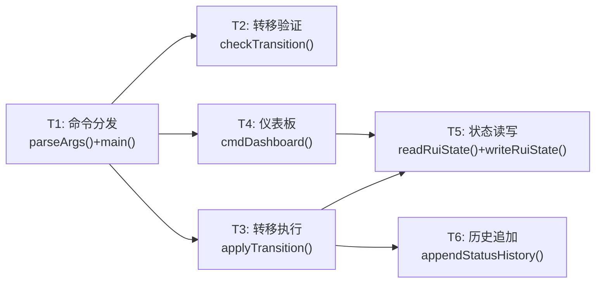
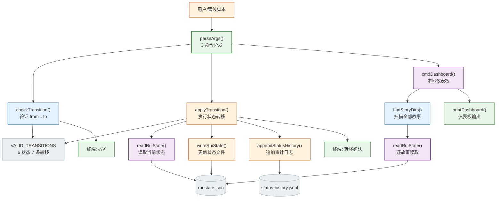

> | v1.0.0 | 2026-05-22 | deepseek-v4-pro | node skills/rui-story/status.mjs | 🌿 feat/rui-story-status-doc | 📎 [CLAUDE.md](../../../CLAUDE.md) |

> **导航**: [← YrY-使用场景](./YrY-使用场景.md) · [YrY-测试设计 →](./YrY-测试设计.md) · [YrY-安全审计 →](./YrY-安全审计.md)

> **来源引用**: `/rui doc --from-code rui-story-status-doc`，源码 `skills/rui-story/status.mjs:1-371`

### 主要价值

- 🎯 六阶段有限状态机：7 条合法转移路径，拒绝所有非法跳跃
- 🔀 三命令闭环：无副作用验证(check) → 有副作用执行(transition) → 全局聚合(dashboard)
- 🛡️ 转移执行原子化：验证通过后同时写入 rui-state.json 和 status-history.jsonl
- 📝 完整审计链：status-history.jsonl 记录每次转移的 from/to/timestamp/reason
- 📊 本地仪表板不依赖远端 API，纯文件系统聚合

## §0 设计决策与任务规划

### §0.0 基线溯源

| 本设计章节 | 实现 故事任务 | 服务 使用场景 | 覆盖状态 |
|-----------|-------------|-------------|:--:|
| §1 系统架构 | FP1–FP4 全部功能点 | 场景 1–3 全部用户操作 | ✅ |
| §7 安全约束 | FP2 文件写入 | 场景 2 | ✅ |
| §8 性能与限制 | FP3 全量扫描 | 场景 3 | ✅ |

### §0.1 设计决策

| 决策领域 | 选定方案 | 选择理由 | 详见 | 实现 FP# |
|---------|---------|---------|------|---------|
| 状态模型 | 有限状态机（6 状态 7 条转移） | 明确约束，防止状态混乱 | §1 | FP1, FP2 |
| 转移记录 | JSONL 追加（status-history.jsonl） | 不可变审计日志，与 execution-memory 一致 | §1 | FP2 |
| 状态存储 | rui-state.json 全量覆盖 | 当前状态只需最新值，覆盖即可 | §1 | FP2 |
| 空状态初始化 | 故事目录不存在 rui-state.json → 自动初始化为"任务" | 健壮的自启动能力 | §1 | FP2 |
| 仪表板数据源 | 本地文件系统（非远端 API） | 离线可用，无网络依赖 | §1 | FP3 |

### §0.2 任务规划

| ID | 描述 | 工作量 | 交付物 | 门禁 |
|----|------|:--:|------|------|
| T1 | CLI 命令分发 + 参数解析 | S | `parseArgs()` + `main()` | 单元测试 |
| T2 | 状态机验证（VALID_TRANSITIONS 表） | S | `isValidTransition()` + `checkTransition()` | 单元测试 |
| T3 | 转移执行 + 状态更新 + 历史追加 | M | `applyTransition()` | Gate A |
| T4 | 本地仪表板聚合 | S | `cmdDashboard()` + `printDashboard()` | 集成测试 |
| T5 | 状态文件 I/O | S | `readRuiState()` / `writeRuiState()` | 单元测试 |
| T6 | 历史记录追加 | S | `appendStatusHistory()` | 单元测试 |

---

## §1 系统架构

### 效果示意

### 1.1 模块/文件

| 变更类型 | 模块/文件 | 职责 |
|:--:|------|------|
| 现有 | `skills/rui-story/status.mjs` | CLI 入口，3 命令 + 状态机 + 文件 I/O，371 行 |

**状态机定义**：

| 当前状态 | 允许转移至 |
|---------|-----------|
| 任务 | 设计 |
| 设计 | 任务, 实施 |
| 实施 | 设计, 测试 |
| 测试 | 实施, 报告 |
| 报告 | 测试, 改进 |
| 改进 | 报告 |

### 1.2 通信通道

| 通道 | 方向 | 协议 | Payload | 错误处理 |
|------|------|------|---------|---------|
| CLI → 文件系统 | 入站 | readFileSync + JSON.parse | rui-state.json | 解析失败 → null / 默认初始化 |
| CLI → 文件系统 | 出站 | writeFileSync | JSON 覆盖 | 文件系统错误 → 异常抛出 |
| CLI → 文件系统 | 出站 | appendFileSync | JSONL 追加 | 文件系统错误 → 异常抛出 |
| CLI → stdout | 出站 | TTY/pipe | ANSI 文本 | — |

---

## §7 安全约束

| # | 威胁 | 信任边界 | 缓解措施 | 优先级 |
|---|------|---------|---------|:--:|
| 1 | --story 参数路径注入 | CLI 参数 → 文件路径 | 路径由 join(projectRoot, STORY_PANEL_DIR, story) 构建，含固定前缀 | P1 |
| 2 | rui-state.json 被外部进程篡改 | 文件系统 → CLI | JSON.parse 异常被 catch；非法 status 被状态机拒绝 | P1 |
| 3 | 并发写入导致 status-history.jsonl 损坏 | 管线并发 → 文件 | 单进程模型 + appendFileSync 原子追加 | P2 |

---

## §8 性能与限制

| 维度 | 约束 | 应对 |
|------|------|------|
| 转移延迟 | writeFileSync + appendFileSync 同步阻塞 | 单次 < 1ms |
| 仪表板扫描 | 全量扫描故事目录 + 逐故事读取 rui-state.json | N 个故事约 N × 1ms |
| 依赖 | 仅 node:path + node:fs，零外部依赖 | 永远可独立运行 |

---

## §9 评审清单

| # | 检查项 | 状态 |
|---|--------|:--:|
| 1 | 效果示意 mermaid 图完整 | ✅ |
| 2 | 基线溯源覆盖全部 FP# 和场景 | ✅ |
| 3 | 设计决策有明确理由 | ✅ |
| 4 | 状态机 7 条转移路径与公式一致 | ✅ |
| 5 | 安全约束覆盖信任边界 | ✅ |
| 6 | 性能限制有量化说明 | ✅ |
| 7 | 项目类型裁剪正确（meta） | ✅ |

---

> | 日期 | 变更 | 触发 | 证据 |
> |------|------|------|------|
> | 2026-05-22 | 初始生成 | `/rui doc --from-code rui-story-status-doc` | `skills/rui-story/status.mjs:1-371` |
