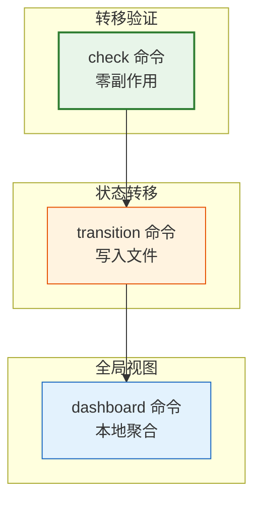
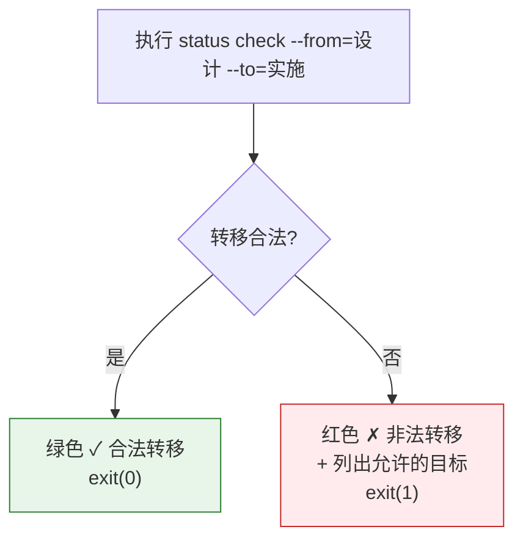

> | v1.0.0 | 2026-05-22 | deepseek-v4-pro | node skills/rui-story/status.mjs | 🌿 feat/rui-story-status-doc | 📎 [CLAUDE.md](../../../CLAUDE.md) |

> **导航**: [← YrY-故事任务](./YrY-故事任务.md) · [YrY-技术评审 →](./YrY-技术评审.md)

> **来源引用**: `/rui doc --from-code rui-story-status-doc`，基于 `YrY-故事任务.md` §1

[§0 基线声明](#sec0-baseline) · [§1 场景全景](#sec1-scenarios) · [§2 场景详述](#sec2-details) · [§3 场景覆盖矩阵](#sec3-matrix) · [§4 评审清单](#sec4-checklist)

## §0 基线声明

> **用户空间基线 (User Space Baseline)**: 本文档定义"谁使用(WHO)"和"如何体验(HOW EXPERIENCE)"。

### 主要价值

- 🎯 管线脚本和开发者两条独立使用路径
- 🔀 check 零副作用验证，放心尝试任意状态组合
- 📊 dashboard 一目了然的项目健康仪表板
- 🛡️ 非法转移友好提示合法目标，不会迷失

---

## §1 场景全景

---

## §2 场景详述

### 场景 1: 验证状态转移

| 角色 | 触发条件 | 核心目标 |
|------|---------|---------|
| 管线脚本 | 阶段变更前预检 | 确认 from→to 转移是否合法 |

| # | 步骤 | 输入 | 系统响应 | 异常分支 |
|---|------|------|---------|---------|
| 1 | 输入状态 | from + to | 查 VALID_TRANSITIONS 表 | 缺少参数 → 提示 |
| 2 | 输出结果 | — | 合法=绿 ✓ / 非法=红 ✗ + 目标列表 | — |

**空状态**: 不适用（非数据查询操作）。

---

### 场景 2: 执行状态转移

| 角色 | 触发条件 | 核心目标 |
|------|---------|---------|
| 管线脚本 | 阶段完成 | 更新故事状态 + 记录审计历史 |

| # | 步骤 | 输入 | 系统响应 | 异常分支 |
|---|------|------|---------|---------|
| 1 | 读取当前状态 | rui-state.json | 解析 JSON → 当前状态 | 文件不存在 → 初始化为"任务" |
| 2 | 验证转移 | from→to | 查 VALID_TRANSITIONS | 非法 → 拒绝 + 提示 |
| 3 | 更新状态 | to status | 写入 rui-state.json | — |
| 4 | 追加历史 | from/to/timestamp/reason | 追加一行 JSON 到 status-history.jsonl | — |
| 5 | 确认输出 | — | "✓ 状态转移完成" + 故事名 + 时间 | — |

**dry-run 模式**: `--dry-run` 预览但不写入任何文件。

---

### 场景 3: 本地仪表板

| 角色 | 触发条件 | 核心目标 |
|------|---------|---------|
| 项目管理者 | 需要了解所有故事当前状态（不需远端 API） | 本地聚合全部故事的 rui-state.json |

| # | 步骤 | 输入 | 系统响应 | 异常分支 |
|---|------|------|---------|---------|
| 1 | 扫描故事目录 | `docs/故事任务面板/` | 枚举所有非隐藏目录 | 无目录 → 空状态 |
| 2 | 读取状态 | 每个 .memory/rui-state.json | 提取 status/last_updated/blocked | 文件缺失 → 默认"任务" |
| 3 | 聚合输出 | 全部状态 | 状态分布 + 故事列表（含阻断标记） | — |

**空状态**: 无故事目录 → "docs/故事任务面板/ 下无故事目录"。

---

## §3 场景覆盖矩阵

| 场景 | FP# | AC# | 覆盖状态 |
|------|-----|------|:--:|
| 场景 1: 验证转移 | FP1 | AC1, AC2 | 待生成 |
| 场景 2: 执行转移 | FP2, FP4 | AC3, AC5 | 待生成 |
| 场景 3: 仪表板 | FP3 | AC4 | 待生成 |

---

## §4 评审清单

| # | 检查项 | 状态 |
|---|--------|:--:|
| 1 | 场景数 ≥ 2 | ✅ 3 个 |
| 2 | 每场景有 mermaid 流程图 | ✅ |
| 3 | 覆盖全部 FP# | ✅ |
| 4 | 每场景含异常分支 | ✅ |
| 5 | 无技术术语 | ✅ |
| 6 | 每场景含空状态描述 | ✅ |
| 7 | 每场景含错误恢复路径 | ✅ |

---

> | 日期 | 变更 | 触发 | 证据 |
> |------|------|------|------|
> | 2026-05-22 | 初始生成 | `/rui doc --from-code rui-story-status-doc` | `YrY-故事任务.md` §1 |
