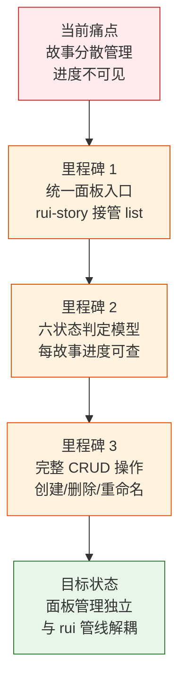
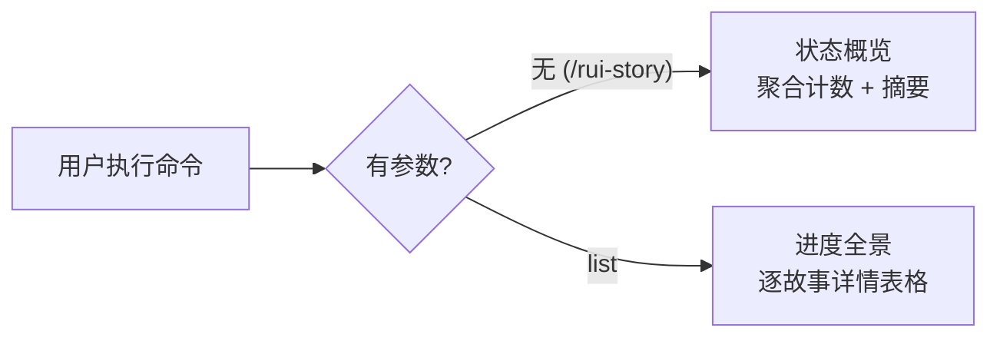
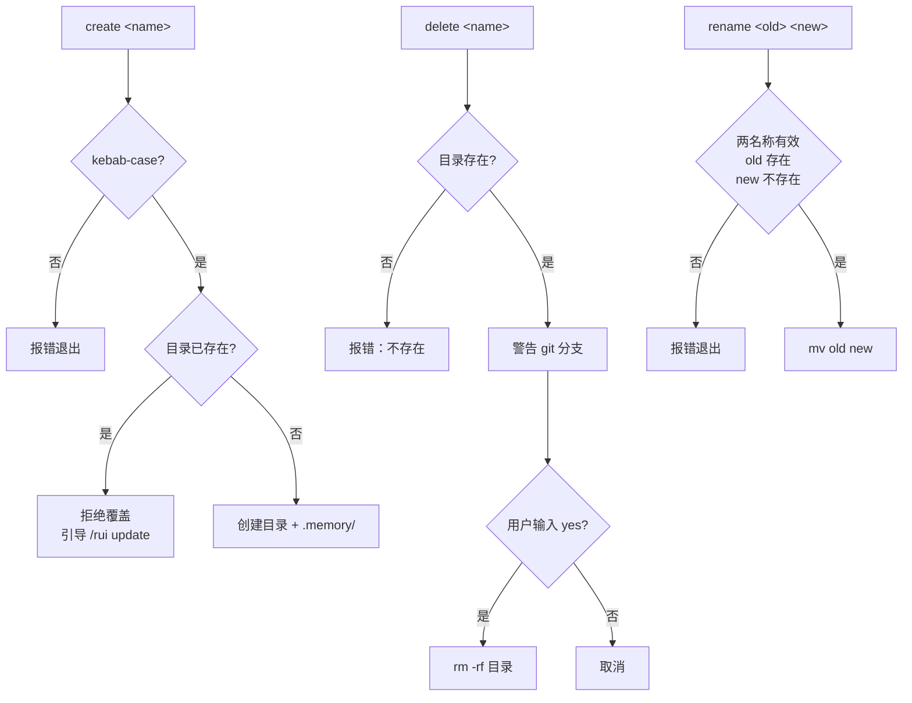

> | v1.0 | 2026-05-17 | deepseek-v4-pro | 🌿 main | 📎 [CLAUDE.md](../../../CLAUDE.md) |

> **导航**: [02-用户使用场景 →](./02-用户使用场景.md)

> **来源引用**: 从源码反推生成，源文件 `skills/rui-story/SKILL.md:1-340`、`skills/rui-story/help.mjs:1-100`。证据等级 B（可推导，附源码路径）。

### 主要价值

- 📋 故事面板统一管理入口 — 从 rui 接管 list，提供故事的增删改查和进度可见性
- 🔍 进度全景透明 — 六状态判定模型覆盖故事全生命周期，一眼看清项目健康度
- 🛡️ 操作边界清晰 — 仅管理目录结构，不触及文档内容和源码，职责单一防交叉污染
- 🔗 与 rui 管线解耦 — 面板管理独立于 SDLC 编排，各司其职不互相阻塞
- 📐 命名硬规范 — kebab-case 强制校验，消除命名风格不一致带来的查找和维护成本
- 🔄 同步委托机制 — 文档同步完全委托 import-docs，单一职责避免重复实现

---

## §0 基线声明

> **问题空间基线 (Problem Space Baseline)**: 本文档定义"做什么(WHAT)"和"为什么(WHY)"。所有后续文档(05)的设计、验证决策均必须可追溯至本文档的具体章节。

| 约束 | 规则 |
|------|------|
| 语言边界 | 仅使用业务语言与用户语言。**禁止**包含：代码文件路径、API 路由、组件名称、数据库表名、技术栈选型、框架名称 |
| 下游可追溯 | 05-测试用例评审必须引用本文档的 §1 Story# 或 §2 FP# 或 §3 SC# 或 §5 AC# |
| 版本优先 | 需求变更时本文档先于所有其他文档更新 |
| 评审门禁 | 文档审查时检查禁止内容：含代码路径/API路由/组件名/技术栈名 = P0 阻断 |

---

### 需求概述

rui-story 是 YrY 的故事任务面板管理技能，提供 `docs/故事任务面板/` 下故事目录的增删改查和进度同步能力。它从 rui 接管了 `list` 命令，成为故事面板的唯一管理入口，同时严格限制操作边界——只管理目录结构，不创建文档内容（那是 `/rui doc`），不修改源码（那是 `/rui code`）。

### 效果示意

---

## §1 Story

### Story 1: 故事进度全景可见

| 字段 | 内容 |
|------|------|
| 作为 | 项目参与者 |
| 我想要 | 一目了然地看到所有故事的状态分布和最近活动 |
| 以便 | 快速判断项目整体进度是否需要干预 |
| 优先级 | P0 |
| 范围边界 | 只读 `docs/故事任务面板/`，不修改任何文件 |
| 依赖 | 故事目录下文件存在性可检测 |
| 子项目 | — |

#### 范围外

- 不包含故事之间的依赖分析
- 不包含进度预测或工时估算
- 不包含自动状态迁移

#### §1.1 User Operations

| # | 操作 | 触发条件 | 操作步骤 | 预期结果 |
|---|------|---------|---------|---------|
| 1 | 查看状态概览 | 用户执行 `/rui-story`（无参数） | 扫描全部故事目录 → 逐目录判定状态 → 按状态聚合计数 → 输出摘要表 + 最近活动 | 显示 6 种状态的计数和最近修改的 5 个故事 |
| 2 | 查看进度全景 | 用户执行 `/rui-story list` | 扫描全部故事目录 → 逐目录收集状态/文件数/最后修改/分支 → 按时间降序排列 → 输出详情表格 | 显示所有故事的完整信息表格 |

---

### Story 2: 故事目录生命周期管理

| 字段 | 内容 |
|------|------|
| 作为 | 项目参与者 |
| 我想要 | 创建、重命名、删除故事目录 |
| 以便 | 管理故事面板的目录结构，保持其与实际工作一致 |
| 优先级 | P0 |
| 范围边界 | 仅操作 `docs/故事任务面板/<name>/` 目录骨架，不创建文档内容 |
| 依赖 | 目录存在性可检测、用户确认机制 |
| 子项目 | — |

#### 范围外

- 不创建故事文档内容（那是 `/rui doc`）
- 不操作 git 分支（那是 `/rui code`）
- 不批量操作多个故事

#### §1.1 User Operations

| # | 操作 | 触发条件 | 操作步骤 | 预期结果 |
|---|------|---------|---------|---------|
| 1 | 创建故事目录 | 用户执行 `/rui-story create <name>` | 校验 kebab-case → 检查目录不存在 → 创建目录 + `.memory/` → 写入 `story-type.json` | 目录骨架创建成功，无文档文件 |
| 2 | 删除故事目录 | 用户执行 `/rui-story delete <name>` | 检查目录存在 → 检查 git 分支并警告 → 请求用户输入 `yes` 确认 → 删除目录 | 目录被删除，git 分支保留 |
| 3 | 重命名故事目录 | 用户执行 `/rui-story rename <old> <new>` | 校验两名称格式 → 检查 old 存在 + new 不存在 → 检查 git 分支并警告 → 执行 `mv` | 新目录存在，旧目录不存在 |

---

### Story 3: 单故事详情查看

| 字段 | 内容 |
|------|------|
| 作为 | 项目参与者 |
| 我想要 | 查看单个故事的完整信息（文件清单、状态、元数据、git 分支） |
| 以便 | 深入了解特定故事的当前状况，决定下一步行动 |
| 优先级 | P1 |
| 范围边界 | 只读单个故事目录 |
| 依赖 | 故事目录存在 |
| 子项目 | — |

#### 范围外

- 不修改故事状态或元数据
- 不提供编辑功能

#### §1.1 User Operations

| # | 操作 | 触发条件 | 操作步骤 | 预期结果 |
|---|------|---------|---------|---------|
| 1 | 查看故事详情 | 用户执行 `/rui-story show <name>` | 解析 name → 定位目录 → 枚举文件（含大小/时间）→ 读取 `.memory/rui-state.json` 和 `story-type.json` → 检查 git 分支 | 输出详述卡：状态徽章、目录路径、类型、文件清单、git 分支、元数据 |

---

### Story 4: 文档同步委托

| 字段 | 内容 |
|------|------|
| 作为 | 项目参与者 |
| 我想要 | 将故事文档同步到远端知识库 |
| 以便 | 团队成员能在外部系统查阅最新的故事文档 |
| 优先级 | P1 |
| 范围边界 | 完全委托 import-docs 执行同步，自身不实现同步逻辑 |
| 依赖 | `node skills/import-docs/sync.mjs` 可用 |
| 子项目 | — |

#### 范围外

- 不自行实现文档上传逻辑
- 不同步故事面板以外的目录

#### §1.1 User Operations

| # | 操作 | 触发条件 | 操作步骤 | 预期结果 |
|---|------|---------|---------|---------|
| 1 | 同步单个故事 | 用户执行 `/rui-story sync <name>` | 委托 `import-docs` 同步 `docs/故事任务面板/<name>/` | 该故事文档同步到远端 |
| 2 | 同步全部故事 | 用户执行 `/rui-story sync`（无 name） | 委托 `import-docs` 同步 `docs/故事任务面板/` | 全部故事文档同步到远端 |

---

## §2 Requirements

### 功能点

| FP# | 描述 | 输入 | 输出 | 错误行为 | 优先级 |
|-----|------|------|------|---------|--------|
| FP1 | 状态概览 — 无参数时按状态聚合所有故事并输出摘要 | 无 | 状态计数表 + 最近 5 个活动故事 | 面板目录不存在时显示"合计 0 个故事" | P0 |
| FP2 | 进度全景 — list 子命令输出所有故事的详情表格 | 无 | Story/Status/Files/Last Modified/Type/Branch 六列表格 | 面板目录不存在时显示空表格 | P0 |
| FP3 | 单故事详情 — show 子命令输出指定故事的全部信息 | `<name>` (kebab-case) | 详述卡：状态/目录/类型/文件清单/git 分支/元数据 | 目录不存在时报错；名称格式非法时报错 | P1 |
| FP4 | 创建故事目录 — create 子命令创建目录骨架 | `<name>` (kebab-case), `--type` (可选) | 目录 + `.memory/story-type.json` | 格式非法报错；目录已存在拒绝覆盖 | P0 |
| FP5 | 删除故事目录 — delete 子命令删除目录（需确认） | `<name>` (kebab-case) | 目录被删除 | 目录不存在报错；用户未确认取消 | P0 |
| FP6 | 重命名故事目录 — rename 子命令重命名目录 | `<old>` `<new>` (均为 kebab-case) | 目录被重命名 | 格式非法报错；old 不存在报错；new 已存在拒绝 | P0 |
| FP7 | 文档同步 — sync 子命令委托 import-docs | `<name>` (可选) | 远端文档已同步 | import-docs 执行失败时透传错误 | P1 |
| FP8 | 状态判定 — 按文件存在性 + `.memory/rui-state.json` 判定故事六状态 | 故事目录路径 | 状态枚举值 | 目录为空时返回 `not_started` | P0 |
| FP9 | 项目类型推断 — 按存在文件推断故事类型 | 故事目录路径 | frontend/backend/fullstack/meta | 无法判定时默认 meta | P0 |
| FP10 | 帮助输出 — `--help`/`-h`/`help` 触发帮助脚本 | 标志参数 | 完整帮助文本 | 脚本不存在时给出错误提示 | P1 |

### 业务规则

| R# | 描述 | 校验方式 | 证据级别 |
|----|------|---------|---------|
| R1 | `<name>` 必须为 kebab-case 格式 | 正则校验：小写字母+连字符 | B — `skills/rui-story/SKILL.md:45` |
| R2 | create 仅创建目录骨架，不创建文档内容 | 检查产物：目录存在且无 `.md` 文件 | B — `skills/rui-story/SKILL.md:209` |
| R3 | delete 必须用户明确输入 `yes` 确认 | 交互确认不可跳过 | B — `skills/rui-story/SKILL.md:235` |
| R4 | delete 不删除 git 分支 | 仅警告分支存在，不执行 `git branch -D` | B — `skills/rui-story/SKILL.md:236` |
| R5 | sync 完全委托 import-docs，不自实现 | 调用 `node skills/import-docs/sync.mjs` | B — `skills/rui-story/SKILL.md:251` |
| R6 | rename 仅重命名目录，不操作 git 分支 | 仅 `mv`，警告分支需手动重命名 | B — `skills/rui-story/SKILL.md:278-279` |
| R7 | 目录冲突时拒绝覆盖，引导 `/rui update` | create/rename 前检测目标路径存在性 | B — `skills/rui-story/SKILL.md:210` |

### 数据约束

| 约束 | 类型 | 范围/格式 | 来源 |
|------|------|----------|------|
| name | string | `^[a-z0-9]+(-[a-z0-9]+)*$` (kebab-case) | SKILL.md:45 |
| type | enum | `frontend` / `backend` / `fullstack` / `meta` | SKILL.md:208 |
| 状态枚举 | enum | `not_started` / `docs_in_progress` / `docs_done` / `code_in_progress` / `code_done` / `blocked` | SKILL.md:92-99 |
| 故事目录路径 | path | `docs/故事任务面板/<name>/` | SKILL.md:10 |

---

## §3 成功标准

| SC# | 描述 | 度量方式 | 目标值 | 优先级 | 关联 FP# |
|-----|------|---------|--------|--------|---------|
| SC1 | 用户可在 3 秒内了解项目全部故事的状态分布 | 执行 `/rui-story` 到输出完成的时间 | ≤ 3 秒 | P0 | FP1, FP8 |
| SC2 | 用户可一眼看到每个故事的完整进度信息 | list 输出表格包含全部六列且每故事占一行 | 100% 覆盖率 | P0 | FP2, FP8, FP9 |
| SC3 | 用户创建新故事目录后立即可用 | create 执行完成到目录可写入的时间 | 即时（< 1 秒） | P0 | FP4 |
| SC4 | 用户不会意外删除故事目录 | delete 必须经过显式确认步骤 | 100% 需确认率 | P0 | FP5, R3 |
| SC5 | 用户能准确了解单个故事的全部状态信息 | show 输出包含文件清单、状态、元数据、git 分支 | 全部字段有值或明确标注"无" | P1 | FP3 |
| SC6 | 用户可通过一行命令同步文档到远端 | sync 执行完成到远端可见的时间 | 取决于 import-docs | P1 | FP7 |

---

## §4 范围边界

### 范围内

| # | 条目 | 关联 FP# | 边界说明 |
|---|------|---------|---------|
| 1 | `docs/故事任务面板/` 下的目录结构管理 | FP4, FP5, FP6 | 创建/删除/重命名目录，含 `.memory/` 元数据 |
| 2 | 故事状态判定与进度展示 | FP1, FP2, FP3, FP8, FP9 | 六状态模型，基于文件存在性推断 |
| 3 | 文档同步委托 | FP7 | 委托 import-docs，不自实现 |
| 4 | 帮助信息输出 | FP10 | 通过 `node skills/rui-story/help.mjs` 输出 |

### 范围外

| # | 条目 | 排除原因 | 替代方案 |
|---|------|---------|---------|
| 1 | 创建故事文档内容（01–10 文档） | 文档生成是 `/rui doc` 的职责 | 使用 `/rui doc <需求>` |
| 2 | 修改源码 | 源码变更是 `/rui code` 的职责 | 使用 `/rui code <name>` |
| 3 | 创建或切换 git 分支 | 分支管理是 `/rui code` 的职责 | 使用 `/rui code <name>` |
| 4 | 批量操作多个故事 | 操作设计为单故事原子操作 | 逐个执行 |
| 5 | 故事间依赖分析 | 超出面板管理范围 | 查看 01-故事任务.md §1 Story 依赖字段 |

### 灰色区域

| # | 条目 | 触发条件 | 决策人 |
|---|------|---------|--------|
| 1 | 是否支持故事归档而非删除 | 用户提出归档需求时 | PM |
| 2 | 是否支持故事状态手动变更 | 管线状态与实际不一致时 | PM |

---

## §5 AC

| AC# | Given | When | Then | 门禁 |
|-----|-------|------|------|------|
| AC1 | 面板目录下存在 3 个故事，分别处于不同状态 | 用户执行 `/rui-story` | 输出按状态聚合的计数表，各状态计数正确 | Gate A |
| AC2 | 面板目录为空 | 用户执行 `/rui-story` | 显示"合计 0 个故事"，不报错 | Gate A |
| AC3 | 面板目录下存在故事 | 用户执行 `/rui-story list` | 输出表格每行含 Story/Status/Files/Last Modified/Type/Branch 六列 | Gate A |
| AC4 | 故事 `user-login` 目录存在且含 01–05 文档 | 用户执行 `/rui-story show user-login` | 输出文件清单含文件名/大小/时间、状态为 `docs_done`、类型正确 | Gate A |
| AC5 | 故事 `user-login` 目录不存在 | 用户执行 `/rui-story show user-login` | 报错提示目录不存在 | Gate A |
| AC6 | 名称 `user-login` 格式合法，目标目录不存在 | 用户执行 `/rui-story create user-login` | 创建 `docs/故事任务面板/user-login/` + `.memory/story-type.json`，无 md 文件 | Gate A |
| AC7 | 名称 `UserLogin` 格式非法（含大写） | 用户执行 `/rui-story create UserLogin` | 报错提示名称必须为 kebab-case | Gate A |
| AC8 | 名称 `user-login` 目标目录已存在 | 用户执行 `/rui-story create user-login` | 拒绝覆盖，提示使用 `/rui update` | Gate A |
| AC9 | 故事 `old-name` 目录存在，`old-name` 有关联 git 分支 | 用户执行 `/rui-story delete old-name`，输入 `yes` | 警告 git 分支仍保留，目录被删除，分支不被删除 | Gate A |
| AC10 | 故事 `not-exist` 目录不存在 | 用户执行 `/rui-story delete not-exist` | 报错提示目录不存在 | Gate A |
| AC11 | 故事 `old-name` 目录存在，用户输入 `no` | 用户执行 `/rui-story delete old-name`，输入 `no` | 取消操作，目录保留 | Gate A |
| AC12 | 名称 `old` 和 `new` 格式均合法，old 存在，new 不存在 | 用户执行 `/rui-story rename old new` | old 目录变为 new 目录，内容不变 | Gate A |
| AC13 | 指定故事存在 | 用户执行 `/rui-story sync my-story` | 委托 import-docs 同步该目录，返回同步结果 | Gate B |
| AC14 | 不指定故事 | 用户执行 `/rui-story sync` | 委托 import-docs 同步整个面板，返回同步结果 | Gate B |
| AC15 | 用户执行 `--help` 标志 | 用户执行 `/rui-story --help` | 输出完整帮助文本，含场景示例 | Gate A |

---

## §6 风险与假设

| # | 风险/假设 | 类型 | 可能性 | 影响 | 缓解/验证策略 | 关联 FP# |
|---|----------|------|--------|------|-------------|---------|
| 1 | import-docs 同步失败导致 sync 命令不可用 | 风险 | M | M | sync 透传 import-docs 错误，不吞没；用户可直接调用 import-docs | FP7 |
| 2 | 面板目录下存在非故事目录导致状态判定异常 | 风险 | L | M | 状态判定基于具体文件存在性，非目录存在性；非标准目录不会被识别为故事 | FP8 |
| 3 | 用户误删故事目录后无法恢复 | 风险 | M | H | delete 必须两步确认（警告分支 + 输入 yes）；未来可加 `.trash/` 软删除 | FP5 |
| 4 | 故事类型推断不准确 | 风险 | L | L | 默认 meta，用户可通过 `--type` 显式指定 | FP9 |
| 5 | kebab-case 校验正则与实际命名习惯冲突 | 假设 | L | L | 当前校验规则 `^[a-z0-9]+(-[a-z0-9]+)*$` 覆盖常见命名；如有例外可扩展 | FP4 |
| 6 | import-docs 始终可用 | 假设 | M | M | 验证：执行 `node skills/import-docs/sync.mjs --help` 检查可用性 | FP7 |

---

## §7 跨文档索引

| 本文档章节 | 基线内容 | 下游文档编号 | 预期覆盖 | 状态 |
|-----------|---------|------------|---------|------|
| §1 Story 1 — 故事进度全景可见 | 状态概览 + 进度全景需求 | 05-测试用例评审 | AC1–AC3 的测试用例 | 待生成 |
| §1 Story 2 — 故事目录生命周期管理 | 创建/删除/重命名需求 | 05-测试用例评审 | AC4–AC12 的测试用例 | 待生成 |
| §1 Story 3 — 单故事详情查看 | show 子命令需求 | 05-测试用例评审 | AC4–AC5 的测试用例 | 待生成 |
| §1 Story 4 — 文档同步委托 | sync 子命令需求 | 05-测试用例评审 | AC13–AC14 的测试用例 | 待生成 |
| §2 FP8 — 状态判定 | 六状态模型 | 05-测试用例评审 | 状态判定覆盖测试 | 待生成 |
| §2 R3 — delete 确认 | 必须用户确认 | 05-测试用例评审 | AC9, AC11 的确认流程测试 | 待生成 |
| §2 R5 — sync 委托 | 委托 import-docs | 05-测试用例评审 | AC13–AC14 的委托验证 | 待生成 |

---

## 变更记录

| 日期 | 变更 | 触发 | 证据 |
|------|------|------|------|
| 2026-05-17 | 初始生成 | `/rui doc --from-code rui-story` | 源码 `skills/rui-story/SKILL.md`、`skills/rui-story/help.mjs` |
