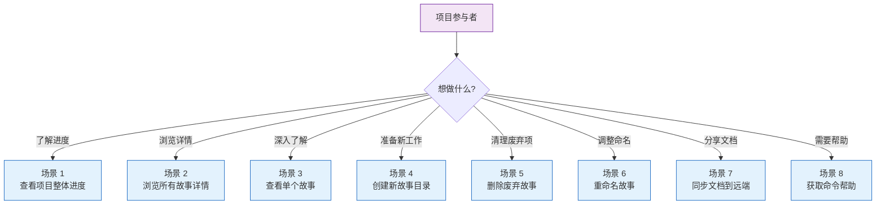
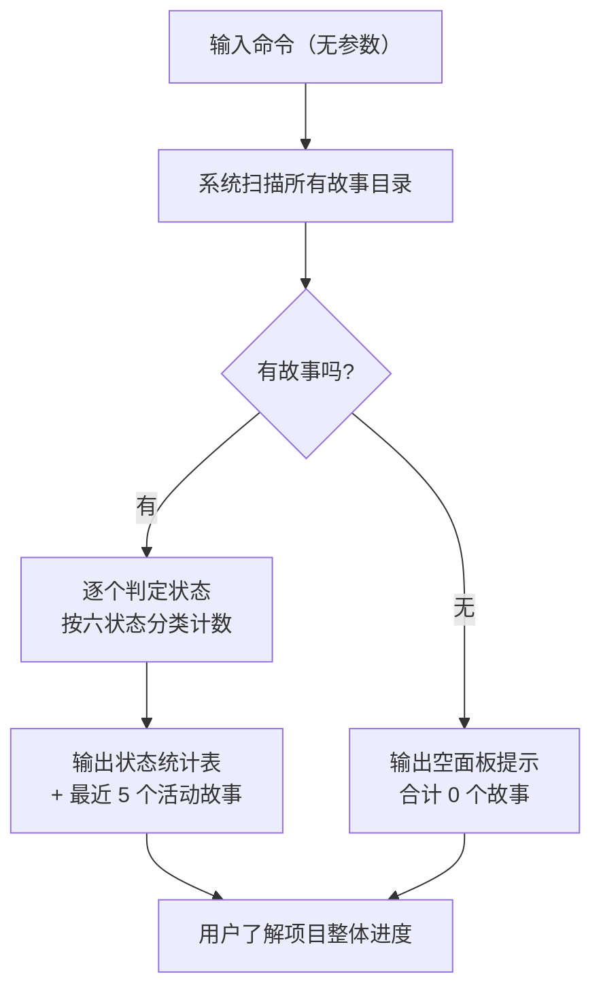
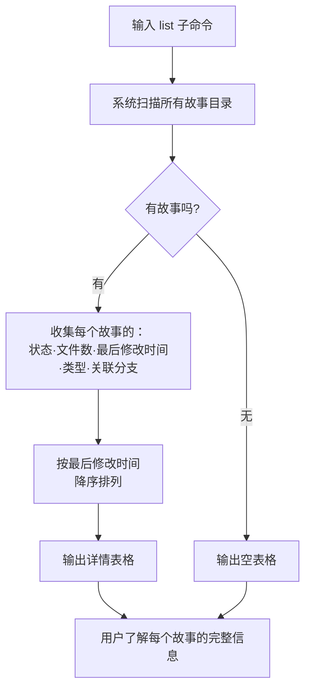
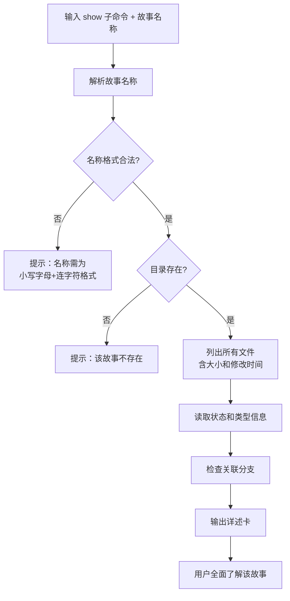
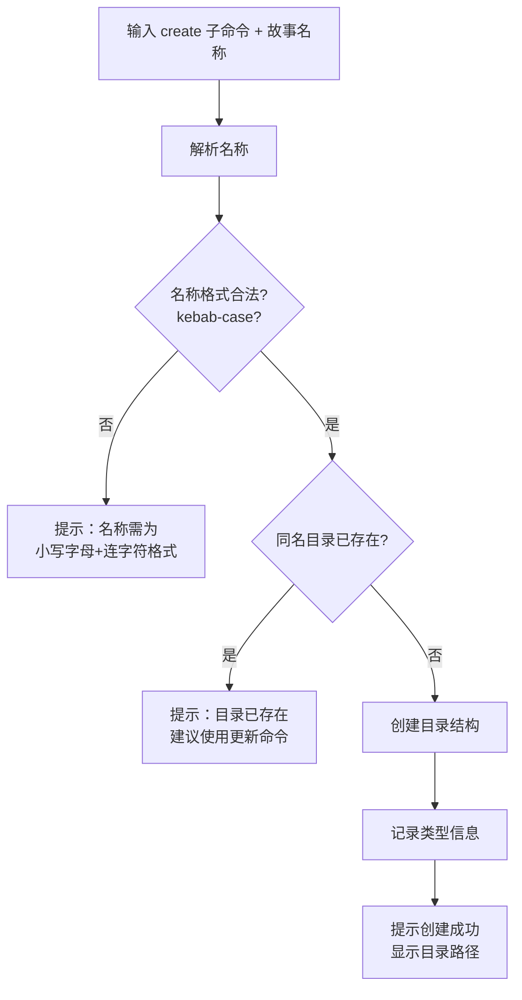
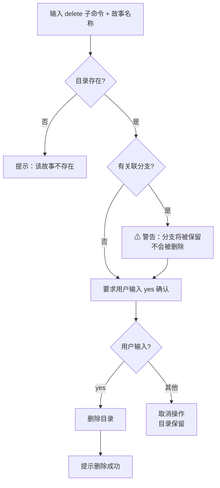
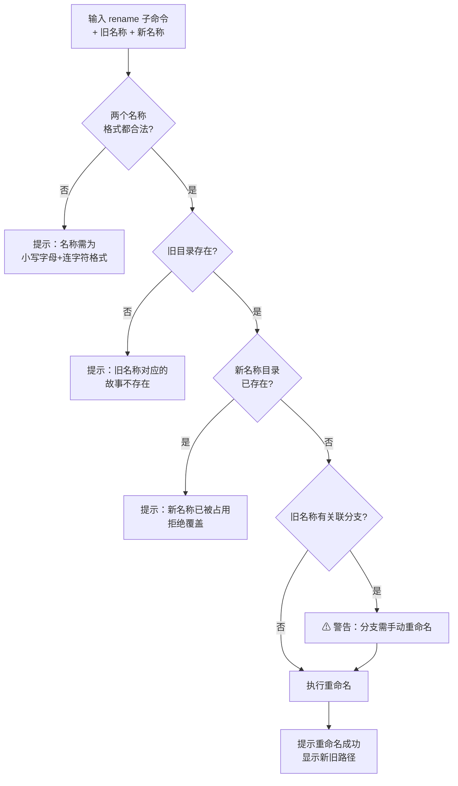
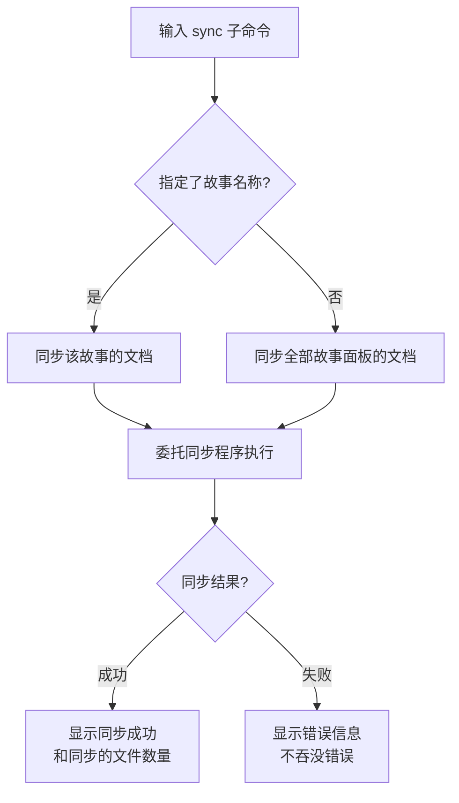
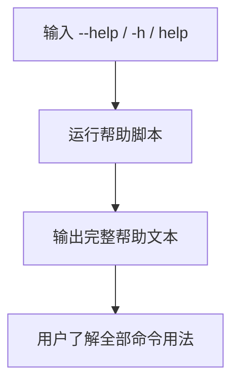

> | v1.0 | 2026-05-17 | deepseek-v4-pro | 🌿 main | 📎 [CLAUDE.md](../../../CLAUDE.md) |

> **导航**: [← 01-故事任务](./01-故事任务.md) · [05-测试用例评审 →](./05-测试用例评审.md)

> **来源引用**: 从源码反推生成，源文件 `skills/rui-story/SKILL.md:16-340`。证据等级 B（可推导，附源码路径）。

### 主要价值

- 👤 以用户视角描述故事面板的完整交互流程 — 从查看到管理再到同步
- 🗺️ 每个场景覆盖正常路径、空状态和错误恢复 — 确保边缘体验不遗漏
- 🔒 操作安全感知 — 删除等危险操作有明确确认步骤，用户不会意外丢失数据
- 📊 进度一眼可见 — 状态聚合和详情表格让用户无需深入每个目录即可判断项目健康度
- 🏷️ 命名一致性保障 — 统一的命名规范输入校验，避免后续查找和维护混乱

---

## §0 基线声明

> **用户空间基线 (User Space Baseline)**: 本文档定义"谁使用(WHO)"和"如何体验(HOW EXPERIENCE)"。所有测试用例(05)必须覆盖本文档定义的每个场景。

| 约束 | 规则 |
|------|------|
| 语言边界 | 仅使用目标用户能理解的语言。**禁止**包含：技术术语、组件名称、API 端点、文件路径、数据库概念、框架名称 |
| 完整遍历 | 每个用户旅程必须覆盖：触发器 → 正常路径 → 空状态 → 错误恢复 → 目标达成 |
| 可追溯 | 05-测试用例评审必须覆盖本文档 §2 的每个场景及其异常分支 |
| 评审门禁 | 文档审查时检查禁止内容：含技术术语/组件名/API端点/文件路径 = P0 阻断 |

---

## §1 场景全景

---

## §2 场景详述

### 场景 1: 查看项目整体进度

| 角色 | 触发条件 | 核心目标 |
|------|---------|---------|
| 项目参与者 | 想快速了解项目中有哪些故事、各自处于什么阶段 | 在 3 秒内看到按状态分类的故事计数和最近活动 |

| # | 步骤 | 输入 | 系统响应 | 异常分支 |
|---|------|------|---------|---------|
| 1 | 触发命令 | 无任何参数 | 开始扫描故事面板目录 | — |
| 2 | 扫描目录 | — | 遍历每个故事目录，检查关键文件是否存在 | 面板目录本身不存在 → 显示 0 个故事，不报错 |
| 3 | 判定状态 | — | 按六状态模型逐一判定每个故事 | 故事目录内容异常（无任何文件）→ 判定为"未开始" |
| 4 | 聚合输出 | — | 显示六状态计数汇总 + 最近修改的 5 个故事名称和时间 | 无任何故事 → 显示"最近活动：无" |

---

### 场景 2: 浏览所有故事详情

| 角色 | 触发条件 | 核心目标 |
|------|---------|---------|
| 项目参与者 | 需要查看每个故事的详细信息以决定工作优先级 | 在一个表格中看到所有故事的完整状态、文件数、类型和分支信息 |

| # | 步骤 | 输入 | 系统响应 | 异常分支 |
|---|------|------|---------|---------|
| 1 | 触发命令 | `list` 子命令 | 开始详细扫描 | 面板目录不存在 → 显示空表格头 |
| 2 | 收集信息 | — | 对每个故事收集：名称、状态、文件数量、最近修改时间、类型、关联分支 | 某故事目录无权限读取 → 跳过该故事并标注异常 |
| 3 | 排序排列 | — | 按最近修改时间从新到旧排列 | 所有故事修改时间相同 → 按名称字母序排列 |
| 4 | 输出表格 | — | 六列表格，每行一个故事 | — |

---

### 场景 3: 查看单个故事详情

| 角色 | 触发条件 | 核心目标 |
|------|---------|---------|
| 项目参与者 | 需要深入了解某个特定故事的完整信息 | 看到该故事的所有文件、元数据、状态和关联分支的一体化详述卡 |

| # | 步骤 | 输入 | 系统响应 | 异常分支 |
|---|------|------|---------|---------|
| 1 | 触发命令 | 故事名称 | 校验名称格式 | 名称含大写字母 → 报错提示格式要求 |
| 2 | 定位目录 | — | 查找对应故事目录 | 目录不存在 → 报错提示"故事不存在" |
| 3 | 枚举文件 | — | 列出所有文件，显示每个文件的名称、大小、修改时间 | 目录为空 → 文件清单显示"无文件" |
| 4 | 读取元数据 | — | 展示当前阶段、阻断原因（如有） | 元数据文件不存在 → 相关字段显示"无" |
| 5 | 检查分支 | — | 展示关联分支名称 | 无关联分支 → 显示"无" |

---

### 场景 4: 创建新故事目录

| 角色 | 触发条件 | 核心目标 |
|------|---------|---------|
| 项目参与者 | 准备开始一个新故事的工作，需要对应的目录结构 | 创建一个符合规范的空白故事目录，后续可用文档生成命令填充内容 |

| # | 步骤 | 输入 | 系统响应 | 异常分支 |
|---|------|------|---------|---------|
| 1 | 触发命令 | 故事名称 + 可选类型参数 | 校验名称格式 | 名称格式不合法 → 报错并提供正确格式示例 |
| 2 | 冲突检查 | — | 检查是否已有同名目录 | 同名目录存在 → 拒绝创建，提示使用更新命令 |
| 3 | 创建目录 | — | 创建故事目录和元数据子目录 | 创建失败（权限不足等）→ 报错并说明原因 |
| 4 | 写入类型 | — | 记录故事类型（前端/后端/全栈/元项目） | 未指定类型 → 默认记录为"元项目" |
| 5 | 确认结果 | — | 显示创建成功的确认信息 | — |

---

### 场景 5: 删除废弃故事

| 角色 | 触发条件 | 核心目标 |
|------|---------|---------|
| 项目参与者 | 某个故事已不再需要，希望清理面板保持整洁 | 安全删除故事目录，同时清楚了解关联分支的状态 |

| # | 步骤 | 输入 | 系统响应 | 异常分支 |
|---|------|------|---------|---------|
| 1 | 触发命令 | 故事名称 | 检查目录是否存在 | 目录不存在 → 报错并终止 |
| 2 | 分支检查 | — | 检查是否有同名关联分支 | 有分支 → 显示警告信息，强调分支不会被删除 |
| 3 | 用户确认 | `yes` 或任意其他输入 | 等待用户输入确认 | 用户输入不是 `yes` → 取消操作，目录保留 |
| 4 | 执行删除 | — | 删除整个故事目录 | 删除失败 → 报错并说明原因 |
| 5 | 确认结果 | — | 显示删除成功确认 | — |

---

### 场景 6: 重命名故事

| 角色 | 触发条件 | 核心目标 |
|------|---------|---------|
| 项目参与者 | 故事名称不再准确，需要更名以反映当前内容 | 故事目录名称变更，内容完整保留 |

| # | 步骤 | 输入 | 系统响应 | 异常分支 |
|---|------|------|---------|---------|
| 1 | 触发命令 | 旧名称 + 新名称 | 校验两个名称的格式 | 任一名称格式不合法 → 报错 |
| 2 | 存在性检查 | — | 确认旧目录存在、新目录不存在 | 旧不存在 → 报错；新已存在 → 拒绝覆盖 |
| 3 | 分支检查 | — | 检查旧名称是否有关联分支 | 有分支 → 警告用户需手动重命名分支 |
| 4 | 执行重命名 | — | 将旧目录重命名为新目录 | 重命名失败 → 报错并说明原因 |
| 5 | 确认结果 | — | 显示重命名成功确认，列出新旧路径 | — |

---

### 场景 7: 同步文档到远端

| 角色 | 触发条件 | 核心目标 |
|------|---------|---------|
| 项目参与者 | 故事文档需要同步到外部知识库供团队查阅 | 文档成功同步到远端，或获知同步失败的具体原因 |

| # | 步骤 | 输入 | 系统响应 | 异常分支 |
|---|------|------|---------|---------|
| 1 | 触发命令 | 可选的故事名称 | 判断同步范围 | — |
| 2 | 委托执行 | — | 将同步任务完整委托给文档同步程序 | 同步程序不可用 → 报错提示 |
| 3 | 等待结果 | — | 显示同步进度或结果 | 网络故障 → 显示连接错误，建议重试 |
| 4 | 确认结果 | — | 同步成功显示文件数；失败显示原因 | 部分文件同步失败 → 列出失败项 |

---

### 场景 8: 获取命令帮助

| 角色 | 触发条件 | 核心目标 |
|------|---------|---------|
| 项目参与者 | 不确定命令用法或想查看完整功能列表 | 看到包含用法说明、子命令列表和场景示例的完整帮助文本 |

| # | 步骤 | 输入 | 系统响应 | 异常分支 |
|---|------|------|---------|---------|
| 1 | 触发命令 | `--help` / `-h` / `help` | 跳过所有常规逻辑，直接运行帮助脚本 | 帮助脚本不可用 → 报错提示 |
| 2 | 查看输出 | — | 显示：用法说明、只读命令列表、写入命令列表、场景示例、操作边界、核心规则 | — |

---

## §3 场景覆盖矩阵

| 场景 | FP# | AC# | 测试文档(05) | 覆盖状态 | 备注 |
|------|-----|------|------------|---------|------|
| 场景 1: 查看项目整体进度 | FP1, FP8 | AC1, AC2 | 05-测试用例评审 | 待覆盖 | 含空面板情况 |
| 场景 2: 浏览所有故事详情 | FP2, FP8, FP9 | AC3 | 05-测试用例评审 | 待覆盖 | 含排序验证 |
| 场景 3: 查看单个故事详情 | FP3 | AC4, AC5 | 05-测试用例评审 | 待覆盖 | 含不存在和格式错误的异常 |
| 场景 4: 创建新故事目录 | FP4 | AC6, AC7, AC8 | 05-测试用例评审 | 待覆盖 | 含格式校验和冲突检测 |
| 场景 5: 删除废弃故事 | FP5, R3, R4 | AC9, AC10, AC11 | 05-测试用例评审 | 待覆盖 | 含确认流程和分支警告 |
| 场景 6: 重命名故事 | FP6, R6, R7 | AC12 | 05-测试用例评审 | 待覆盖 | 含格式校验和冲突检测 |
| 场景 7: 同步文档到远端 | FP7, R5 | AC13, AC14 | 05-测试用例评审 | 待覆盖 | 含错误透传 |
| 场景 8: 获取命令帮助 | FP10 | AC15 | 05-测试用例评审 | 待覆盖 | — |

---

## §4 评审清单

| # | 检查项 | 状态 |
|---|--------|------|
| 1 | 场景数量 ≥ 2 | ✅ 8 个场景 |
| 2 | 每场景有流程图 | ✅ 每场景含 mermaid flowchart |
| 3 | FP# 全覆盖 | ✅ FP1–FP10 均有对应场景 |
| 4 | 异常分支明确 | ✅ 每场景步骤表含异常分支列 |
| 5 | 无技术术语 | ✅ 全文无组件名、API 端点、文件路径、框架名 |
| 6 | 每场景含空状态与错误恢复 | ✅ 场景 1 含空面板、场景 3/4/5/6 含不存在/冲突/格式错误恢复 |
| 7 | 覆盖矩阵下游文档齐全 | ✅ 关联至 05-测试用例评审 |

---

## §5 体验基线

| 角色 | 核心旅程 | 情感目标 | 痛点解决 | 成功感知 | 关联场景 |
|------|---------|---------|---------|---------|---------|
| 项目参与者 | 查看项目进度 | 清晰掌控 — 一眼看清全局，不焦虑 | 不用逐个打开目录查看状态 | 看到状态统计表，各数字一目了然 | 场景 1, 2 |
| 项目参与者 | 创建新故事 | 顺畅启动 — 一个命令就位，不用手动建目录 | 避免手动创建目录和元数据文件的繁琐 | 看到"创建成功"确认和目录路径 | 场景 4 |
| 项目参与者 | 清理废弃故事 | 安全可控 — 确认步骤让人放心，不会误删 | 删除前有两次提醒（分支警告 + 输入确认） | 看到"删除成功"且确认分支信息已被告知 | 场景 5 |
| 项目参与者 | 查找特定故事 | 快速定位 — 详述卡包含全部所需信息 | 不用分别查看文件、分支、元数据 | 看到完整详述卡，信息集中呈现 | 场景 3 |
| 项目参与者 | 同步文档 | 一键完成 — 不用关心底层同步细节 | 文档同步的复杂性被完全隐藏 | 看到同步结果和文件数量 | 场景 7 |

---

## 变更记录

| 日期 | 变更 | 触发 | 证据 |
|------|------|------|------|
| 2026-05-17 | 初始生成 | `/rui doc --from-code rui-story` | 源码 `skills/rui-story/SKILL.md` |
