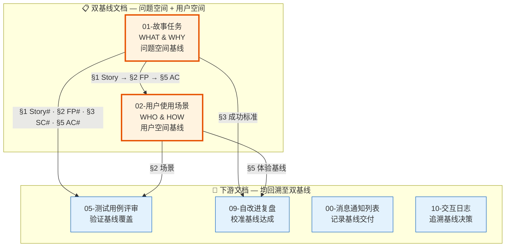
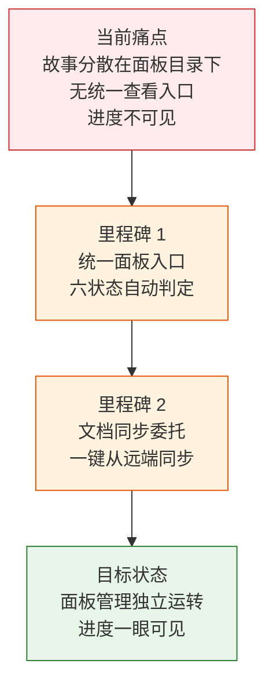
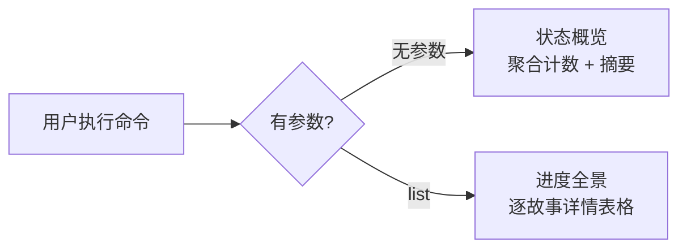

> | v1.4 | 2026-05-18 | deepseek-v4-pro | 🌿 main | 📎 [CLAUDE.md](../../../CLAUDE.md) |

> **导航**: [02-用户使用场景 →](./02-YiAi-用户使用场景.md)

> **来源引用**: 由故事需求 `rui-story` 驱动生成。外部参考吸收自 [README.md 外部参考](../../../README.md#外部参考) — superpowers（故事拆分模式 · 验证门禁）· get-shit-done（上下文边界 · 粒度控制）· karpathy-skills（LLM 编码陷阱规避）· mattpocock-skills（工程纪律）。证据等级 B（可推导，附外部参考路径）。

### 主要价值

- 📋 故事面板统一管理入口 — 从 rui 接管 list，提供故事的查和同步能力
- 🔍 进度全景透明 — 六状态判定模型覆盖故事全生命周期，一眼看清项目健康度
- 🛡️ 操作边界清晰 — 仅查询与同步，不触及文档内容和源码，职责单一防交叉污染
- 🔗 与 rui 管线解耦 — 面板管理独立于 SDLC 编排，各司其职不互相阻塞

---

## §0 基线声明

> **问题空间基线 (Problem Space Baseline)**: 本文档是 `rui-story` 故事目录的**第一基线文档**，与 02-用户使用场景 构成双基线。本文档定义"做什么(WHAT)"和"为什么(WHY)"——所有下游文档（05-测试用例评审，及后续 09-自改进复盘）的设计、验证、改进决策均必须可追溯至本文档的具体章节。

| 约束 | 规则 |
|------|------|
| 语言边界 | 仅使用业务语言与用户语言。**禁止**包含：代码文件路径、API 路由、组件名称、数据库表名、技术栈选型、框架名称 |
| 下游可追溯 | 05-测试用例评审必须引用本文档的 §1 Story# 或 §2 FP# 或 §3 SC# 或 §5 AC# |
| 版本优先 | 需求变更时本文档先于所有其他文档更新；下游文档偏差必须同步回本文档 |
| 评审门禁 | 文档审查时检查禁止内容：含代码路径/API路由/组件名/技术栈名 = P0 阻断 |
| 基线贯穿 | 本文档 §1–§7 是下游文档的单一真相源。§7 跨文档索引明确声明每个下游文档与本文档的映射关系 |

### 双基线协作模型

---

### 需求概述

故事任务面板需要一个独立的管理技能——rui-story。它从 rui 接管故事列表展示，成为 `docs/故事任务面板/` 的唯一管理入口。用户通过它查看项目所有故事的状态分布、浏览每个故事的详细进度，以及从远端知识库同步文档到本地。

核心约束：它只做查询和同步，不创建文档内容、不修改源码、不操作 git 分支。

### 效果示意

---

## §1 Story

### Story 1: 故事进度全景可见

| 字段 | 内容 |
|------|------|
| 作为 | 项目参与者 |
| 我想要 | 一目了然地看到所有故事的状态分布和最近活动 |
| 以便 | 快速判断项目整体进度是否需要干预 |
| 优先级 | P0 |
| 范围边界 | 只读面板目录，不修改任何文件 |
| 依赖 | 面板目录下文件存在性可检测 |

#### 范围外

- 不包含故事之间的依赖分析
- 不包含进度预测或工时估算
- 不包含自动状态迁移

#### §1.1 User Operations

| # | 操作 | 触发条件 | 操作步骤 | 预期结果 |
|---|------|---------|---------|---------|
| 1 | 查看状态概览 | 用户执行无参数命令 | 扫描全部故事目录 → 逐目录判定状态 → 按状态聚合计数 → 输出摘要表 + 最近活动 | 显示 6 种状态的计数和最近修改的故事列表 |
| 2 | 查看进度全景 | 用户执行 list 子命令 | 扫描全部故事目录 → 逐目录收集状态/文件数/最后修改/类型/分支 → 按时间降序排列 → 输出详情表格 | 显示所有故事的完整信息表格 |

---

### Story 2: 单故事详情查看

| 字段 | 内容 |
|------|------|
| 作为 | 项目参与者 |
| 我想要 | 查看单个故事的完整信息（文件清单、状态、元数据、关联分支） |
| 以便 | 深入了解特定故事的当前状况，决定下一步行动 |
| 优先级 | P1 |
| 范围边界 | 只读单个故事目录 |
| 依赖 | 故事目录存在 |

#### §1.1 User Operations

| # | 操作 | 触发条件 | 操作步骤 | 预期结果 |
|---|------|---------|---------|---------|
| 1 | 查看故事详情 | 用户执行 show 子命令 + 故事名称 | 解析名称 → 定位目录 → 枚举文件（含大小/时间）→ 读取状态和类型信息 → 检查关联分支 | 输出详述卡：状态徽章、目录路径、类型、文件清单、关联分支、元数据 |

---

### Story 3: 文档同步委托

| 字段 | 内容 |
|------|------|
| 作为 | 项目参与者 |
| 我想要 | 从远端知识库同步故事文档到本地 |
| 以便 | 团队成员能在外部系统查阅最新的故事文档 |
| 优先级 | P1 |
| 范围边界 | 完全委托文档同步程序执行，自身不实现同步逻辑 |
| 依赖 | 文档同步程序可用 |

#### §1.1 User Operations

| # | 操作 | 触发条件 | 操作步骤 | 预期结果 |
|---|------|---------|---------|---------|
| 1 | 从远端同步单个故事 | 用户执行 sync 子命令 + 故事名称 | 委托同步程序从远端拉取该故事文档 | 该故事文档从远端同步到本地 |
| 2 | 查看同步推荐 | 用户执行 sync 子命令（不指定名称） | 展示可同步故事推荐列表，等待用户选择 | 用户从推荐中选择后执行同步 |

---

## §2 Requirements

### 功能点

| FP# | 描述 | 输入 | 输出 | 错误行为 | 优先级 |
|-----|------|------|------|---------|--------|
| FP1 | 状态概览 — 无参数时按状态聚合所有故事并输出摘要 | 无 | 状态计数表 + 最近活动故事列表 | 面板目录不存在时显示"合计 0 个故事" | P0 |
| FP2 | 进度全景 — list 子命令输出所有故事的详情表格 | 无 | Story/Status/Files/Last Modified/Type/Branch 六列表格 | 面板目录不存在时显示空表格 | P0 |
| FP3 | 单故事详情 — show 子命令输出指定故事的全部信息 | 故事名称（kebab-case） | 详述卡：状态/目录/类型/文件清单/关联分支/元数据 | 目录不存在时报错；名称格式非法时报错 | P1 |
| FP4 | 文档同步 — sync 子命令委托同步程序 | 故事名称（可选） | 文档已从远端同步到本地；未指定时展示推荐 | 名称不存在报错；同步程序执行失败时透传错误 | P1 |
| FP5 | 状态判定 — 按文件存在性判定故事六状态 | 故事目录路径 | 状态枚举值 | 目录为空时返回"未开始" | P0 |
| FP6 | 项目类型推断 — 按存在文件推断故事类型 | 故事目录路径 | 类型枚举值 | 无法判定时默认为"元项目" | P0 |
| FP7 | 帮助输出 — 帮助标志触发帮助信息 | 帮助标志 | 完整帮助文本 | 帮助信息不可用时给出错误提示 | P1 |

### 业务规则

| R# | 描述 | 校验方式 | 证据级别 |
|----|------|---------|---------|
| R1 | 故事名称必须为 kebab-case 格式（小写字母+连字符） | 正则校验 | B |
| R2 | sync 完全委托同步程序，不自实现 | 调用同步程序执行 | B |

### 数据约束

| 约束 | 类型 | 范围/格式 | 来源 |
|------|------|----------|------|
| 故事名称 | string | `^[a-z0-9]+(-[a-z0-9]+)*$` (kebab-case) | 命名规范约定 |
| 故事类型 | enum | `frontend` / `backend` / `fullstack` / `meta` | 项目类型分类 |
| 状态枚举 | enum | `not_started` / `docs_in_progress` / `docs_done` / `code_in_progress` / `code_done` / `blocked` | 管线阶段定义 |

---

## §3 成功标准

| SC# | 描述 | 度量方式 | 目标值 | 优先级 | 关联 FP# |
|-----|------|---------|--------|--------|---------|
| SC1 | 用户可在极短时间内了解项目全部故事的状态分布 | 执行无参数命令到输出完成的时间 | ≤ 3 秒 | P0 | FP1, FP5 |
| SC2 | 用户可一眼看到每个故事的完整进度信息 | list 输出表格包含全部六列且每故事占一行 | 全部覆盖 | P0 | FP2, FP5, FP6 |
| SC3 | 用户能准确了解单个故事的全部状态信息 | show 输出包含文件清单、状态、元数据、关联分支 | 全部字段有值或明确标注"无" | P1 | FP3 |
| SC4 | 用户可通过一行命令从远端同步文档到本地 | sync 执行完成到本地可见 | 取决于同步程序 | P1 | FP4 |

---

## §4 范围边界

### 范围内

| # | 条目 | 关联 FP# | 边界说明 |
|---|------|---------|---------|
| 1 | 故事状态判定与进度展示 | FP1, FP2, FP3, FP5, FP6 | 六状态模型，基于文件存在性推断 |
| 2 | 文档同步委托 | FP4 | 委托同步程序，不自实现 |
| 3 | 帮助信息输出 | FP7 | 通过帮助信息脚本输出 |

### 范围外

| # | 条目 | 排除原因 | 替代方案 |
|---|------|---------|---------|
| 1 | 创建故事文档内容 | 文档生成是文档管线的职责 | 使用文档生成命令 |
| 2 | 修改源码 | 源码变更是代码管线的职责 | 使用代码实现命令 |
| 3 | 创建或切换关联分支 | 分支管理是代码管线的职责 | 使用代码实现命令 |
| 4 | 批量操作多个故事 | 操作设计为单故事原子操作 | 逐个执行 |
| 5 | 故事间依赖分析 | 超出面板管理范围 | 查看本文档 §1 Story 依赖字段 |

---

## §5 AC

| AC# | Given | When | Then | 门禁 |
|-----|-------|------|------|------|
| AC1 | 面板目录下存在 3 个故事，分别处于不同状态 | 用户执行无参数命令 | 输出按状态聚合的计数表，各状态计数正确 | Gate A |
| AC2 | 面板目录为空 | 用户执行无参数命令 | 显示"合计 0 个故事"，不报错 | Gate A |
| AC3 | 面板目录下存在故事 | 用户执行 list 子命令 | 输出表格每行含 Story/Status/Files/Last Modified/Type/Branch 六列 | Gate A |
| AC4 | 某故事目录存在且含基线文档 | 用户执行 show 子命令 + 该故事名称 | 输出文件清单含文件名/大小/时间、状态正确、类型正确 | Gate A |
| AC5 | 某故事目录不存在 | 用户执行 show 子命令 + 不存在的名称 | 报错提示目录不存在 | Gate A |
| AC6 | 指定故事存在 | 用户执行 sync 子命令 + 该名称 | 委托同步程序同步该目录，返回同步结果 | Gate B |
| AC7 | 不指定故事 | 用户执行 sync 子命令 | 展示可同步故事推荐提示，列出可选故事供用户选择 | Gate A |
| AC8 | 用户需要查看帮助 | 用户执行帮助标志 | 输出完整帮助文本，含场景示例 | Gate A |

---

## §6 风险与假设

| # | 风险/假设 | 类型 | 可能性 | 影响 | 缓解/验证策略 | 关联 FP# |
|---|----------|------|--------|------|-------------|---------|
| 1 | 同步程序执行失败导致 sync 命令不可用 | 风险 | M | M | sync 透传同步程序错误，不吞没 | FP4 |
| 2 | 面板目录下存在非故事目录导致状态判定异常 | 风险 | L | M | 状态判定基于具体文件存在性 | FP5 |
| 3 | 故事类型推断不准确 | 风险 | L | L | 默认"元项目" | FP6 |
| 4 | kebab-case 校验规则与实际命名习惯冲突 | 假设 | L | L | 当前校验规则覆盖常见命名 | R1 |
| 5 | 同步程序始终可用 | 假设 | M | M | 执行同步程序帮助命令检查可用性 | FP4 |

---

## §7 跨文档索引

> 本文档作为问题空间基线，下游所有文档的设计、验证、改进决策均映射至本章节。

| 本文档章节 | 基线内容 | 下游文档编号 | 预期覆盖 | 状态 |
|-----------|---------|------------|---------|------|
| §1 Story 1 | 状态概览 + 进度全景需求 | 05-测试用例评审 | AC1–AC3 | 已生成 |
| §1 Story 2 | show 子命令需求 | 05-测试用例评审 | AC4–AC5 | 已生成 |
| §1 Story 3 | sync 子命令需求 | 05-测试用例评审 | AC6–AC7 | 已生成 |
| §2 FP5 | 六状态模型 | 05-测试用例评审 | 状态判定覆盖 | 已生成 |
| §2 R2 | sync 委托 | 05-测试用例评审 | AC6–AC7 | 已生成 |
| §3 SC1–SC4 | 全部成功标准 | 09-自改进复盘 | SC# 目标值 vs 实测值 | 已生成 |
| §5 全部 AC# | 验收标准 | 09-自改进复盘 | AC 最终通过率 | 已生成 |
| §6 风险与假设 | 5 条风险/假设 | 09-自改进复盘 | 风险命中率与假设验证 | 已生成 |

---

## 变更记录

| 日期 | 变更 | 触发 | 证据 |
|------|------|------|------|
| 2026-05-17 | 初始生成 | 文档反推生成 | 故事需求 `rui-story` |
| 2026-05-17 | v1.1 强化基线贯穿力 | 双基线模型升级 | 02-用户使用场景 同步升级 |
| 2026-05-18 | v1.2 去除 create 子命令 | T2 增量更新 | SKILL.md · help.mjs 同步移除 |
| 2026-05-18 | v1.2.1 明确同步方向 | T1 措辞修正 | 全文档 sync 语义翻转 |
| 2026-05-18 | v1.2.2 同步推荐提示 | T2 接口变更 | sync 默认行为改为推荐 |
| 2026-05-18 | v1.3 去除魔法数字 | T3 代码重构 | help.mjs 提取语义常量 |
| 2026-05-18 | v1.4 去除 delete 和 rename | T2 接口变更 | rui-story 精简为查询 + 同步 |
