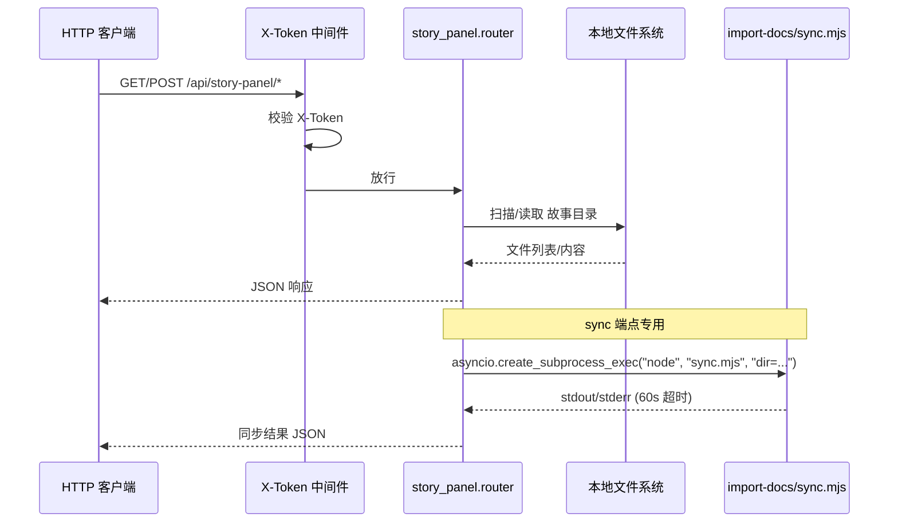
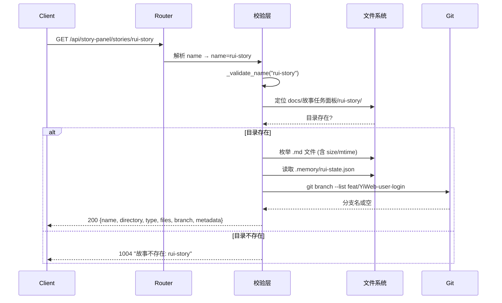
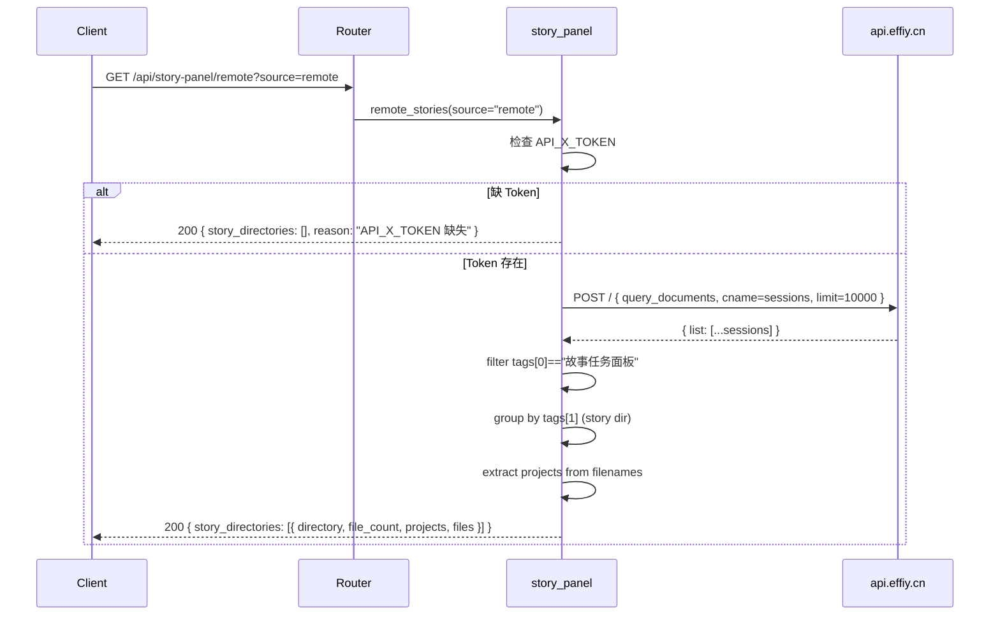
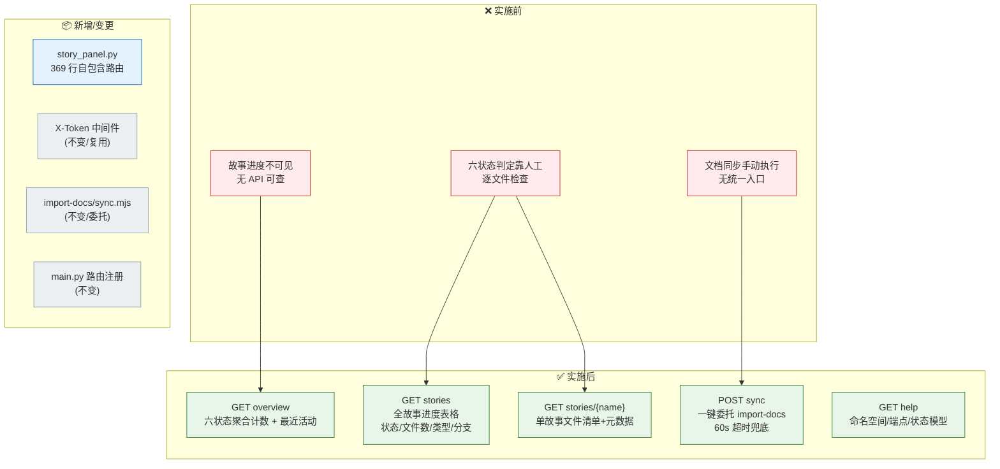

> | v1.0 | 2026-05-18 | deepseek-v4-pro | 🌿 main | 📎 [CLAUDE.md](../../../CLAUDE.md) |

> **导航**: [← 02-用户使用场景](./02-YiAi-用户使用场景.md) · [05-测试用例评审 →](./05-YiAi-测试用例评审.md)

> **来源引用**: 由故事需求 `YiAi` 驱动生成，基于 01-故事任务 和 02-用户使用场景 双基线。证据等级 B（可推导，附源码路径）。

### 主要价值

- 📐 单一服务模块 — `story_panel.py` 内聚全部查询与同步逻辑，零跨模块耦合
- 🔍 六状态判定引擎 — 纯文件系统推断，无外部依赖，状态判定确定且可复现
- 🛡️ 安全纵深 — X-Token 认证中间件层 + 路径遍历校验 + 子进程超时三道防线
- ⚡ 同步委托 — 文档同步完全委托 `import-docs/sync.mjs`，职责单一，错误透传不吞没

---

## §0 设计决策与任务规划

### §0.1 设计决策

| 决策领域 | 选定方案 | 选择理由 | 详见 | 实现 01 FP# |
|---------|---------|---------|------|-----------|
| 路由框架 | FastAPI APIRouter（无 prefix） | 与项目现有路由一致，router 在 `main.py` 注册 | §2 | FP1–FP4, FP7 |
| 数据源 | 本地文件系统 `docs/故事任务面板/` | 故事文档即本地 markdown 文件，无需数据库查询 | §3 | FP1, FP2, FP3, FP5, FP6 |
| 状态判定 | 文件存在性推断六状态 | 确定性规则，无状态机副作用，与 rui 管线阶段对应 | §1.1 | FP5 |
| 类型推断 | 按 03/04/06/07 文档存在性推断 | 最低成本推断，默认 `meta` 兜底 | §1.1 | FP6 |
| 名称校验 | kebab-case 正则 | 命名规范硬约束，路径遍历防护 | §4 | R1 |
| 同步机制 | `asyncio.create_subprocess_exec` 调用 Node.js 脚本 | 完全委托 import-docs，不自实现同步逻辑 | §2.3 | FP4, R2 |
| 认证 | 复用全局 X-Token 中间件 | 不在路由层重复鉴权，与项目统一 | §4 | — |
| 响应格式 | `success()` / `fail()` 统一封装 | 与项目 `core/response.py` 一致，code/message/data 三段式 | §2.1 | — |

### §0.2 任务规划

| ID | 描述 | 工作量 | 依赖 | 交付物 | Agent | 门禁 | 交接下游 | 实现 01 FP# |
|----|------|--------|------|--------|-------|------|---------|-----------|
| T1 | 路由骨架 + 辅助函数（名称校验/状态判定/类型推断/文件枚举/分支检查） | M | — | `story_panel.py` 辅助函数层 | coder | 编译通过 | T2 | FP5, FP6 |
| T2 | overview + list 端点（状态概览 + 进度全景） | M | T1 | `GET /api/story-panel/overview` + `GET /api/story-panel/stories` | coder | 响应 schema 验证 | T3 | FP1, FP2 |
| T3 | show 端点（单故事详情） | M | T1 | `GET /api/story-panel/stories/{name}` | coder | 名称校验 + 404 处理 | T4 | FP3 |
| T4 | sync 端点（文档同步委托 + 推荐列表） | M | T1 | `POST /api/story-panel/stories/sync` | coder | 子进程超时 + 错误透传 | T5 | FP4, R2 |
| T5 | help 端点 | S | — | `GET /api/story-panel/help` | coder | 响应内容完整性 | T6 | FP7 |
| T6 | P0 审查 + 集成验证 | S | T2–T5 | P0 清零确认 + curl 冒烟 | security + tester | P0=0 | 交付 | — |

---

## §1 服务架构

### 1.1 服务/进程

| 变更类型 | 模块/文件 | 职责 |
|---------|----------|------|
| 新增 | `src/api/routes/story_panel.py` | 故事面板 API：查询 + 同步委托 |
| 不变 | `src/main.py:24,118` | 导入并注册 `story_panel.router` |
| 不变 | `skills/import-docs/sync.mjs` | 文档同步脚本（被委托方） |

`story_panel.py` 是自包含模块：零数据库依赖，零跨模块调用。仅导入项目核心模块 `core.response` 和 `core.error_codes`。

### 1.2 通信通道

| 通道 | 方向 | 协议 | Payload | 错误处理 |
|------|------|------|---------|---------|
| HTTP → API | 入站 | HTTP/1.1 | JSON (请求体/查询参数) | X-Token 中间件拦截 → 1009；路由层校验 → 1002/1004 |
| API → 文件系统 | 内部 | 本地 I/O | Path 对象 | 目录不存在 → 返回空列表或 1004 |
| API → sync.mjs | 出站 | 子进程 stdio | CLI 参数 `dir=<path>` | 超时 60s / 异常捕获 → `synced: false` + reason |

---

## §2 API 接口

### 2.1 接口清单

| 接口 | 方法 | 路径 | 请求体 | 响应体 | 错误码 |
|------|------|------|--------|--------|--------|
| 状态概览 | GET | `/api/story-panel/overview` | — | `{summary, recent[]}` | — |
| 进度全景 | GET | `/api/story-panel/stories` | — | `{stories[]}` | — |
| 单故事详情 | GET | `/api/story-panel/stories/{name}` | — | `{name, directory, type, files[], branch, metadata}` | 400 (格式无效), 1004 (不存在) |
| 文档同步 | POST | `/api/story-panel/stories/sync` | `{names?: [kebab-case]}` | 有 names → `{synced, results[], total_written, total_failed}`；无 names → `{recommendations[], total}`（来自远端） | — (错误内聚在响应体) |
| 远端故事查询 | GET | `/api/story-panel/remote` | `?source=local\|remote\|all` | `{source, local[], remote[], remote_api}`；remote 模式 → `{story_directories[{directory, file_count, files[]}]}` | — (API_X_TOKEN 缺失时降级) |
| 帮助信息 | GET | `/api/story-panel/help` | — | `{description, namespace, naming, endpoints, status_model, boundaries}` | — |

### 2.2 请求流程 — 单故事详情

### 2.2.1 请求流程 — 远端故事查询

### 2.3 服务实现

| 服务/模块 | 依赖 | 文件路径 | 核心方法 |
|----------|------|---------|---------|
| story_panel | `core.response`, `core.error_codes`, `httpx` | `src/api/routes/story_panel.py` | `overview()`, `list_stories()`, `show_story(name)`, `sync_stories(body)`, `remote_stories(source)`, `help_info()` |
| 辅助函数 | `pathlib`, `re`, `json`, `subprocess` | `src/api/routes/story_panel.py:25–153` | `_determine_status()`, `_infer_type()`, `_list_story_dirs()`, `_get_branch()`, `_validate_name()` |
| sync 委托 | `asyncio`, `os` | `src/api/routes/story_panel.py:297–337` | `_do_sync(full_name)` → `node skills/import-docs/sync.mjs` |
| remote 查询 | `httpx`, `os` | `src/api/routes/story_panel.py` | `_query_remote_sessions()`, `_extract_project_from_filename()`, `_parse_story_dirs_from_remote()` → `POST api.effiy.cn/` |

---

## §3 数据模型

### 3.1 存储结构

> 本服务不操作数据库，全部数据来源于本地文件系统。

| Key/表/集合 | 类型 | 默认值 | 读频率 | 写频率 | 说明 |
|------------|------|--------|--------|--------|------|
| `docs/故事任务面板/<name>/` | 目录 | — | 每请求 1–N 次 | 0（只读） | 故事文档根目录 |
| `docs/故事任务面板/<name>/*.md` | 文件 | — | 每请求 N 次 | 0（只读） | 故事 markdown 文档 |
| `docs/故事任务面板/<name>/.memory/rui-state.json` | 文件 | — | 每 show 请求 1 次 | 0（只读） | rui 管线状态（blocked/current_stage） |
| `docs/故事任务面板/<name>/.memory/story-type.json` | 文件 | `{"type":"meta"}` | 每状态判定 1 次 | 0（只读） | 故事类型元数据 |

### 3.2 数据迁移

无。本服务不创建或修改任何持久化数据。

---

## §4 安全约束

| # | 威胁 | 信任边界 | 缓解措施 | 优先级 |
|---|------|---------|---------|--------|
| 1 | 路径遍历 — `name` 参数含 `../` 穿越面板目录 | HTTP 入参 → 文件系统 | `_validate_name()` 拒绝含路径分隔符的输入 | P0 |
| 2 | 未授权访问 — 无 Token 请求 | 公网 → API | X-Token 中间件全局拦截，返回 1009 | P0 |
| 3 | 子进程注入 — sync `name` 参数拼接命令 | API → 子进程 | `dir_arg` 仅使用已验证的 `str(sdir)`，不直接拼接用户输入到 shell | P0 |
| 4 | 信息泄露 — 错误消息暴露文件路径 | API → 客户端 | 错误消息仅含 `<name>` 格式，不暴露绝对路径 | P1 |
| 5 | 资源耗尽 — sync 子进程长时间运行 | API → 系统资源 | `asyncio.wait_for(..., timeout=60)` 硬超时 | P1 |
| 6 | 外部 API 调用 — httpx 请求远端 API 被拦截/篡改 | API → 公网 | HTTPS 加密传输；30s httpx 超时；异常静默降级不阻断 | P1 |
| 7 | Token 泄露 — API_X_TOKEN 随 httpx 请求发送至远端 | API → 公网 | Token 仅从环境变量读取，不写入日志/配置/代码；远端仅返回 sessions 数据不泄露 token | P0 |

---

## §5 性能与限制

| 维度 | 约束 | 应对 |
|------|------|------|
| 响应时间 | overview/list 应在 3 秒内完成（SC1） | 纯文件系统扫描，无网络 I/O；故事数量 < 100 时线性扫描可接受 |
| 并发 | 无状态设计，天然支持并发 | 每个请求独立的文件系统操作，无共享状态 |
| 子进程 | sync 最多 1 个并发 Node.js 进程 | 60 秒超时兜底；不限制并发调用但建议客户端串行 |
| 文件系统 | 依赖本地 `docs/` 目录可读 | 目录不存在时返回空结果而非 500，见退化对策 |
---

## §6 效果示意

| 组件 | 变更 | 说明 |
|------|------|------|
| `story_panel.py` | 🆕 新增 | 5 端点 + 6 辅助函数，零数据库依赖 |
| `main.py` | — 不变 | 已有 router 注册代码 |
| X-Token 中间件 | — 不变 | 复用全局认证，不在路由层重复鉴权 |
| `import-docs/sync.mjs` | — 不变 | 子进程委托，60s 超时 |

## §7 评审清单

| # | 检查项 | 状态 |
|---|--------|------|
| 1 | 权限最小化 — 仅 X-Token 认证路由可访问 | ✅ |
| 2 | 通信对齐 — API 响应格式与项目 `success()/fail()` 一致 | ✅ |
| 3 | 存储兼容 — 无数据库依赖，文件系统路径安全校验 | ✅ |
| 4 | API 鉴权 — 复用全局中间件，不在路由内重复鉴权 | ✅ |
| 5 | 无硬编码密钥 — Token 从 `settings.auth_token` 读取 | ✅ |
| 6 | 输入校验完整 — kebab-case 正则 + 路径遍历防护 | ✅ |
| 7 | 基线溯源完备 — 每接口映射至 01 FP# | ✅ |

---

## 变更记录

| 日期 | 变更 | 触发 | 证据 |
|------|------|------|------|
| 2026-05-18 | 初始生成 | 故事需求 `YiAi` — 后端技术评审 | `src/api/routes/story_panel.py` |
| 2026-05-18 | T2 更新 — 新增 GET /api/story-panel/remote | `/rui update rui-story` 远端查询需求 | `src/api/routes/story_panel.py:345-430` |
| 2026-05-18 | 去除 {project} 概念 — 目录结构扁平化 | 用户反馈：项目目录已移除 | `src/api/routes/story_panel.py` 全量 |
