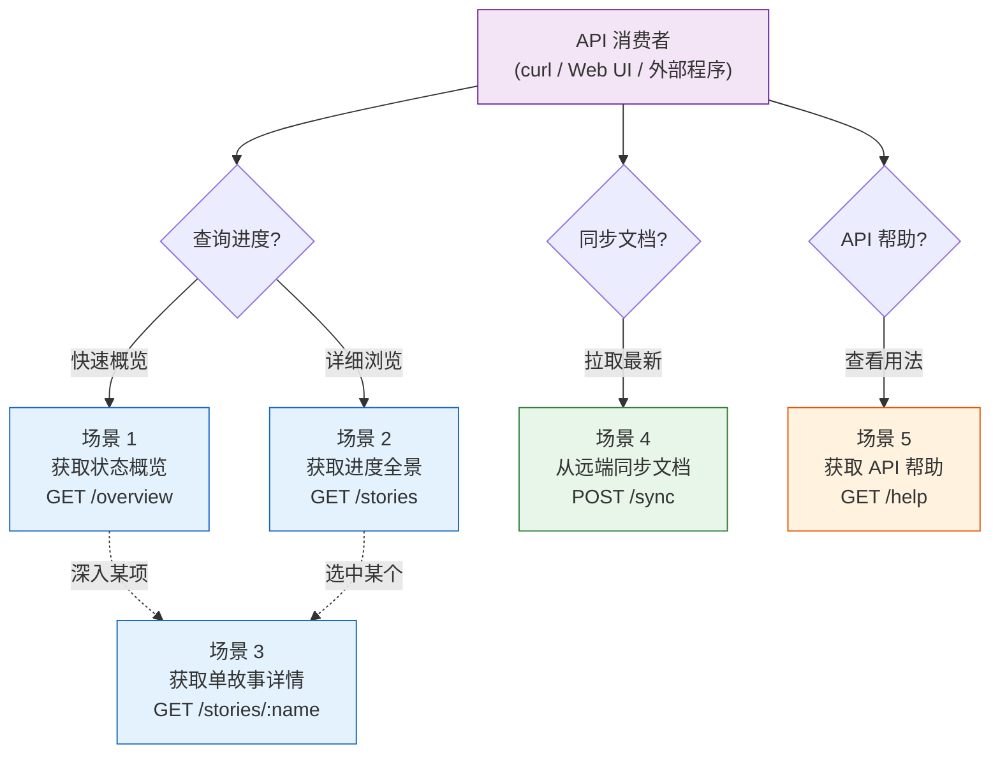
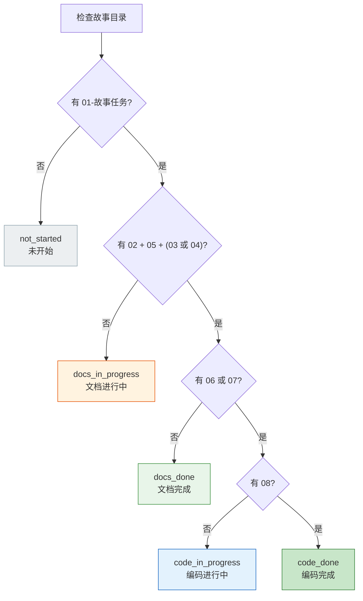
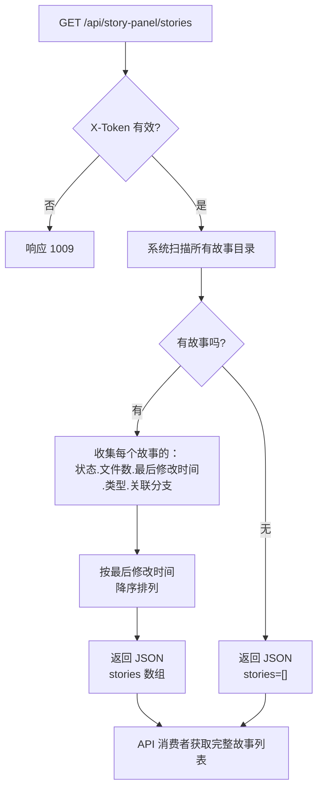
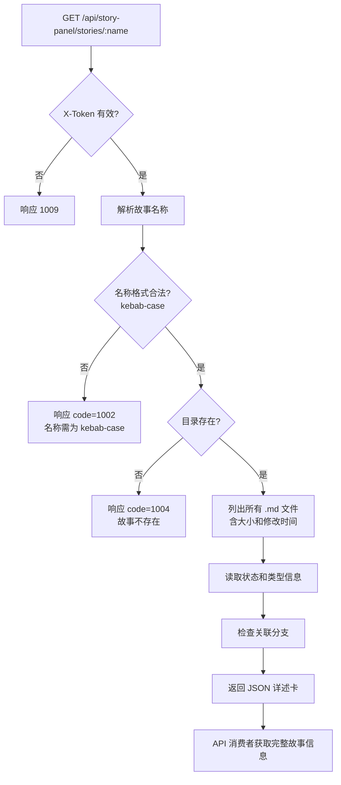
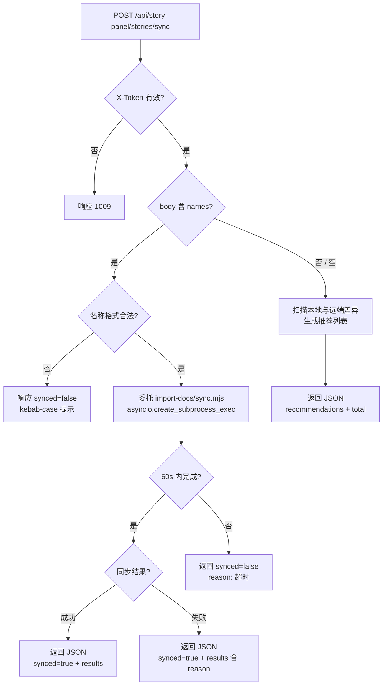
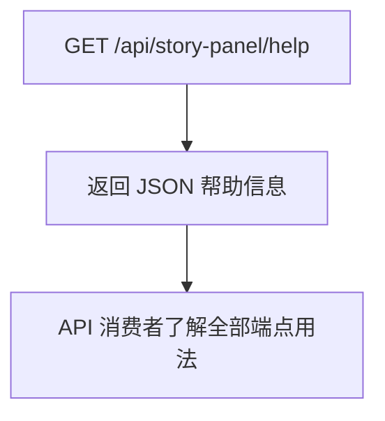

> | v1.0 | 2026-05-20 | claude-opus-4-7 | 自基线用户使用场景提取 YiAi 维度 |

> **导航**: [<- YiAi-故事任务](./YiAi-故事任务.md) . [YiAi-测试设计 ->](./YiAi-测试设计.md)

> **来源引用**: 由 YiAi-故事任务 S1 Story 驱动，从基线 [用户使用场景.md](./用户使用场景.md) 提取 HTTP API 维度内容。证据等级 B。

---

### 主要价值

- 🤖 以 API 消费者视角描述故事面板 HTTP API 的完整交互流程 -- 从查询到同步，5 个场景全覆盖
- 🧪 每个场景覆盖正常路径、空状态和错误恢复 -- 确保 API 边缘情况不遗漏
- 📋 结构化 JSON 响应 -- 状态聚合和详情数据让调用方无需深入文件系统即可获取全部信息
- 🔗 双基线协同 -- 每场景紧密映射 YiAi-故事任务的 Story# 和 FP#

---

## S1 场景全景

故事任务面板提供三种入口（CLI 命令、浏览器 Web UI、HTTP API）。本文档聚焦 HTTP API (YiAi) 维度，API 消费者为 curl、外部程序或 Web UI 前端。



| 入口 | 场景覆盖 | 说明 |
|------|---------|------|
| HTTP API (YiAi) | 场景 1-5 | HTTP JSON 接口，程序化消费，curl / fetch / httpx 均可调用 |

---

## S2 场景详述

### 场景 1: 获取项目整体进度 (GET /overview)

| 角色 | 触发条件 | 核心目标 | 关联产品需求 |
|------|---------|---------|---------|
| API 消费者 | 想快速了解项目中有哪些故事、各自处于什么阶段 | 通过一个 GET 请求获取按状态分类的故事计数和最近活动 | Story 1 . FP1 . FP5 |

```mermaid
flowchart TD
    START["GET /api/story-panel/overview"] --> AUTH{"X-Token 有效?"}
    AUTH -->|"否"| ERR_AUTH["响应 1009 Unauthorized"]
    AUTH -->|"是"| SCAN["系统扫描所有故事目录"]
    SCAN --> CHK{"有故事吗?"}
    CHK -->|"有"| CLASS["逐个判定状态<br/>按六状态分类计数"]
    CLASS --> OUTPUT["返回 JSON<br/>summary + recent"]
    CHK -->|"无"| EMPTY["返回 JSON<br/>summary.total=0, recent=[]"]
    OUTPUT --> DONE["API 消费者获取项目整体进度"]
    EMPTY --> DONE
```



| # | 步骤 | HTTP 请求 | 系统响应 | 异常分支 |
|---|------|---------|---------|---------|
| 1 | 发送请求 | `GET /api/story-panel/overview` (含 X-Token 头) | 开始扫描故事面板目录 | 无 X-Token -> code=1009 Unauthorized |
| 2 | 扫描目录 | -- | 遍历每个故事目录，检查关键文件是否存在 | 面板目录本身不存在 -> code=0, total=0, recent=[] |
| 3 | 判定状态 | -- | 按六状态模型逐一判定每个故事 | 故事目录内容异常（无任何文件）-> 判定为 "not_started" |
| 4 | 返回 JSON | -- | `{code: 0, message: "success", data: {summary: {...}, recent: [...]}}` | 无任何故事 -> recent=[], summary 全 0 |

#### 响应示例

```json
{
  "code": 0,
  "message": "success",
  "data": {
    "summary": {
      "not_started": 0,
      "docs_in_progress": 0,
      "docs_done": 0,
      "code_in_progress": 0,
      "code_done": 0,
      "blocked": 0,
      "total": 0
    },
    "recent": []
  }
}
```

#### 六状态判定模型 (HTTP API 维度)



| 状态 | 判定规则 | 含义 |
|------|---------|------|
| `not_started` | 01-故事任务.md 不存在 | 故事尚未开始文档化 |
| `docs_in_progress` | 01 存在，但 02/05/(03或04) 不完整 | 文档基线正在建立 |
| `docs_done` | 文档基线齐全，06/07 不存在 | 文档阶段完成，待编码 |
| `code_in_progress` | 06 或 07 存在，08 不存在 | 编码进行中 |
| `code_done` | 08 存在，且未被阻断 | 编码完成 |
| `blocked` | .memory/rui-state.json 含 blocked=true | 被阻断 |

---

### 场景 2: 获取所有故事详情 (GET /stories)

| 角色 | 触发条件 | 核心目标 | 关联产品需求 |
|------|---------|---------|---------|
| API 消费者 | 需要获取每个故事的详细信息以渲染列表视图或做数据分析 | 通过一个 GET 请求获取所有故事的完整状态、文件数、类型和分支信息 | Story 1 . FP2 . FP5 . FP6 |



| # | 步骤 | HTTP 请求 | 系统响应 | 异常分支 |
|---|------|---------|---------|---------|
| 1 | 发送请求 | `GET /api/story-panel/stories` (含 X-Token 头) | 开始详细扫描 | 面板目录不存在 -> code=0, stories=[] |
| 2 | 收集信息 | -- | 对每个故事收集：name, status, files, last_modified, type, branch | 某故事目录无权限读取 -> 跳过该故事 |
| 3 | 排序排列 | -- | 按 last_modified 从新到旧排列 | 所有故事修改时间相同 -> 按名称字母序排列 |
| 4 | 返回 JSON | -- | `{code: 0, message: "success", data: {stories: [...]}}` | -- |

---

### 场景 3: 获取单个故事详情 (GET /stories/{name})

| 角色 | 触发条件 | 核心目标 | 关联产品需求 |
|------|---------|---------|---------|
| API 消费者 | 需要获取某个特定故事的完整信息以展示详情面板 | 获取该故事的所有文件、元数据、状态和关联分支的结构化 JSON | Story 2 . FP3 |



| # | 步骤 | HTTP 请求 | 系统响应 | 异常分支 |
|---|------|---------|---------|---------|
| 1 | 发送请求 | `GET /api/story-panel/stories/<name>` (含 X-Token 头) | 校验 name 格式 | name 含大写字母或路径分隔符 -> code=1002 |
| 2 | 定位目录 | -- | 查找 `docs/故事任务面板/<name>/` | 目录不存在 -> code=1004 "故事不存在" |
| 3 | 枚举文件 | -- | 列出所有 .md 文件，含 name/size/mtime | 目录为空 -> files=[] |
| 4 | 读取元数据 | -- | 读取 .memory/rui-state.json 和 .memory/story-type.json | 元数据文件不存在 -> metadata 字段为 null |
| 5 | 检查分支 | -- | 通过 git branch --list 检查关联分支 | 无关联分支 -> branch=null |

#### 响应示例

```json
{
  "code": 0,
  "message": "success",
  "data": {
    "name": "rui-story",
    "directory": "docs/故事任务面板/rui-story",
    "type": "fullstack",
    "files": [
      {"name": "01-故事任务.md", "size": 12345, "mtime": "2026-05-19T10:00:00"}
    ],
    "branch": null,
    "metadata": {"status": "code_done", "blocked": false}
  }
}
```

---

### 场景 4: 从远端同步文档 (POST /sync)

| 角色 | 触发条件 | 核心目标 | 关联产品需求 |
|------|---------|---------|---------|
| API 消费者 | 需要从远端知识库获取最新的故事文档 | 通过一个 POST 请求完成文档同步，获取同步结果 | Story 3 . FP4 . R2 |



| # | 步骤 | HTTP 请求 | 系统响应 | 异常分支 |
|---|------|---------|---------|---------|
| 1 | 发送请求 | `POST /api/story-panel/stories/sync` (含 X-Token 和 Content-Type) | 解析请求体，判断是否有 names 字段 | body 格式错误 -> code=1002 |
| 2a | 指定名称 | body `{"names":["<name>"]}` | 校验名称格式 -> 委托 sync.mjs 执行 | 名称格式非法 -> synced=false + kebab-case 提示 |
| 2b | 不指定名称 | body `{}` | 扫描差异 -> 返回推荐列表 | 无差异 -> recommendations=[], total=0 |
| 3 | 等待结果 | -- | 返回同步进度或结果 | 网络故障 -> results 含连接错误；60s 超时 -> synced=false |
| 4 | 返回 JSON | -- | 成功含 total_written/total_failed；失败含 reason | 部分文件同步失败 -> 列出失败项 |

---

### 场景 5: 获取 API 帮助 (GET /help)

| 角色 | 触发条件 | 核心目标 | 关联产品需求 |
|------|---------|---------|---------|
| API 消费者 | 不确定 API 端点用法或想了解完整功能列表 | 获取包含端点列表、状态模型、命名规范和操作边界的完整帮助 JSON | FP7 |



| # | 步骤 | HTTP 请求 | 系统响应 | 异常分支 |
|---|------|---------|---------|---------|
| 1 | 发送请求 | `GET /api/story-panel/help` (含 X-Token 头) | 返回完整帮助 JSON | 帮助信息不可用 -> 返回错误 JSON |
| 2 | 查看响应 | -- | description, namespace, naming, endpoints[], status_model, boundaries | -- |

#### 响应示例

```json
{
  "code": 0,
  "message": "success",
  "data": {
    "description": "故事任务面板管理 API -- 查询与同步",
    "namespace": "story-panel",
    "naming": "kebab-case: ^[a-z0-9]+(-[a-z0-9]+)*$",
    "endpoints": [
      {"method": "GET", "path": "/api/story-panel/overview", "description": "状态概览"},
      {"method": "GET", "path": "/api/story-panel/stories", "description": "进度全景"},
      {"method": "GET", "path": "/api/story-panel/stories/{name}", "description": "单故事详情"},
      {"method": "POST", "path": "/api/story-panel/stories/sync", "description": "文档同步"},
      {"method": "GET", "path": "/api/story-panel/remote", "description": "远端故事查询"},
      {"method": "GET", "path": "/api/story-panel/help", "description": "帮助信息"}
    ],
    "status_model": {
      "not_started": "01-故事任务.md 不存在",
      "docs_in_progress": "文档基线不完整",
      "docs_done": "文档基线齐全，待编码",
      "code_in_progress": "编码进行中",
      "code_done": "编码完成",
      "blocked": ".memory/rui-state.json blocked=true"
    },
    "boundaries": {
      "allowed": ["查询故事状态", "查询文件清单", "同步文档委托"],
      "forbidden": ["创建文档内容", "修改源码", "操作 git 分支"]
    }
  }
}
```

---

## S3 场景覆盖矩阵

| 场景 | FP# | AC# | 测试文档 | 覆盖状态 | 备注 |
|------|-----|------|------------|---------|------|
| 场景 1: 获取状态概览 | FP1, FP5 | AC1, AC2 | YiAi-测试设计 | 已覆盖 | 含空面板情况 |
| 场景 2: 获取进度全景 | FP2, FP5, FP6 | AC3 | YiAi-测试设计 | 已覆盖 | 含排序验证 |
| 场景 3: 获取单故事详情 | FP3 | AC4, AC5 | YiAi-测试设计 | 已覆盖 | 含不存在和格式错误的异常 |
| 场景 4: 文档同步委托 | FP4, R2 | AC6, AC7 | YiAi-测试设计 | 已覆盖 | 含超时和错误透传 |
| 场景 5: 获取 API 帮助 | FP7 | AC8 | YiAi-测试设计 | 已覆盖 | -- |

---

## S4 评审清单

| # | 检查项 | 状态 |
|---|--------|------|
| 1 | 场景数量 >= 2 | 5 个场景 |
| 2 | 每场景有流程图 | 每场景含 mermaid flowchart |
| 3 | FP# 全覆盖 | FP1-FP7 均有对应场景 |
| 4 | 异常分支明确 | 每场景步骤表含异常分支列 |
| 5 | 无技术术语（面向 API 消费者可理解） | |
| 6 | 每场景含空状态与错误恢复 | |
| 7 | 覆盖矩阵下游文档齐全 | 关联至 YiAi-测试设计 |
| 8 | 双基线协作 -- 每场景关联产品需求 | |
| 9 | HTTP API 维度独立完整 -- 可脱离 UI/CLI 文档理解 | |

---

## S5 体验基线

| 角色 | 核心旅程 | 情感目标 | 痛点解决 | 成功感知 | 关联场景 |
|------|---------|---------|---------|---------|---------|
| API 消费者 | 获取项目进度 | 清晰掌控 -- 一个 GET 请求获取全局状态分布 | 不用逐个扫描文件系统目录 | 收到 summary JSON，各数字一目了然 | 场景 1, 2 |
| API 消费者 | 获取特定故事 | 快速定位 -- 详述 JSON 包含全部所需字段 | 不用分别请求文件、分支、元数据 | 收到完整详述 JSON，信息集中呈现 | 场景 3 |
| API 消费者 | 从远端同步文档 | 一键完成 -- 一个 POST 请求完成同步 | 同步复杂性完全隐藏在 API 后面 | 收到 synced=true 和文件数量 | 场景 4 |

---

## 变更记录

| 日期 | 变更 | 触发 | 证据 |
|------|------|------|------|
| 2026-05-20 | v1.0 初始创建 -- 自基线用户使用场景提取 YiAi (HTTP API) 维度 | 按角色拆分 . YiAi 独立文档 | 基线 用户使用场景.md S1-S5 HTTP API 部分 |
