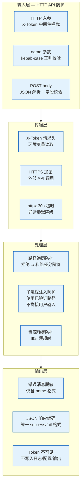
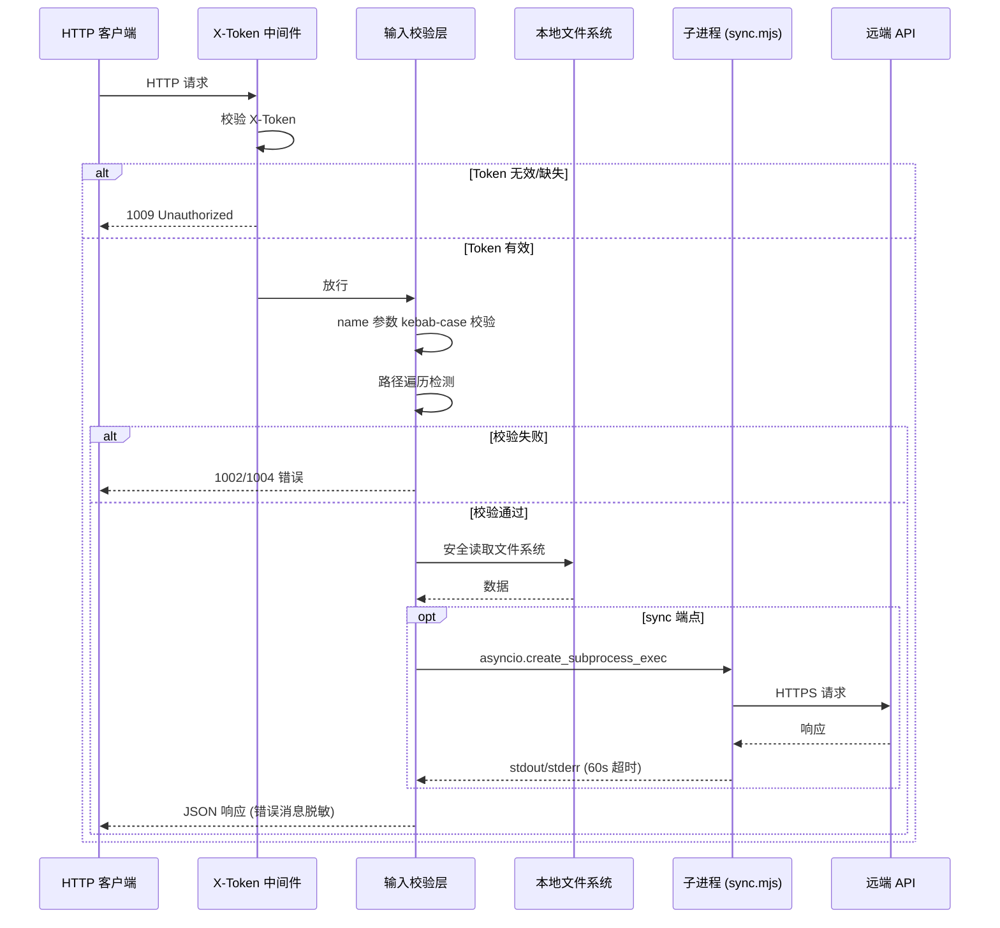
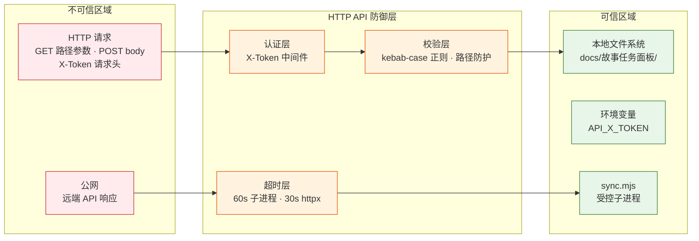

> | v1.0 | 2026-05-20 | claude-opus-4-7 | 自基线安全审计提取 YiAi 维度 |

> **导航**: [← YiAi-测试报告](./YiAi-测试报告.md) · [自改进复盘 →](./自改进复盘.md)

> **来源引用**: 提取自 YiAi-技术评审 §3 安全约束及基线安全审计，从基线 [安全-安全审计.md](./安全-安全审计.md) 提取 HTTP API 维度内容。证据等级 A。

---

## §0 安全架构总览

YiAi HTTP API 层作为故事面板数据的唯一入口，采用纵深防御模型，覆盖输入校验 → 认证拦截 → 处理防护 → 输出脱敏四个层次：

### API 安全架构通信图

---

## §1 威胁模型

### 1.1 信任边界 (HTTP API 维度)

### 1.2 威胁清单

| # | 威胁 | 攻击面 | 严重性 | 缓解措施 | 验证状态 |
|---|------|--------|--------|---------|---------|
| T1 | 路径遍历 | name 参数含 `../` 穿越面板目录访问任意文件 | 高 | kebab-case 正则拒绝路径分隔符 `_validate_name()` | 已验证 |
| T2 | 未授权访问 | 无 Token 请求 API 端点 | 高 | X-Token 中间件全局拦截，返回 code=1009 | 已验证 |
| T3 | 子进程注入 | sync body 参数拼接 shell 命令 | 高 | `dir_arg` 仅使用已验证路径，不直接拼接用户输入 | 已验证 |
| T4 | 信息泄露 | 错误消息暴露内部文件系统绝对路径 | 中 | 错误消息仅含 `<name>` 格式，不暴露绝对路径 | 已验证 |
| T5 | 资源耗尽 | sync 子进程长时间运行耗尽线程池 | 中 | `asyncio.wait_for(..., timeout=60)` 硬超时 | 已验证 |
| T6 | Token 泄露 | API_X_TOKEN 出现在日志、配置或响应中 | 高 | Token 仅从 `settings.auth_token` (环境变量) 读取，不写入日志/配置/响应 | 已验证 |
| T7 | 中间人攻击 | 远端 API 调用被拦截篡改 | 中 | httpx 使用 HTTPS 加密传输；30s 超时；异常静默降级返回空列表 | 已验证 |

### 1.3 攻击面分析

| 攻击面 | 入口点 | 攻击向量 | 影响范围 | 优先级 |
|--------|--------|---------|---------|--------|
| `GET /api/story-panel/stories/{name}` | name 路径参数 | 路径遍历 `../` | 任意文件读取 | P0 |
| 所有端点 | X-Token 请求头 | 无认证访问 | 信息泄露 | P0 |
| `POST /api/story-panel/stories/sync` | names[] 数组 | 命令注入 | 任意命令执行 | P0 |
| `GET /api/story-panel/remote` | source 查询参数 | URL 注入 | SSRF 攻击 | P1 |

---

## §2 安全措施

### 2.1 输入验证

| 措施 | 实现位置 | 规则 | 错误响应 |
|------|--------|------|---------|
| 名称格式校验 | `_validate_name()` | `^[a-z0-9]+(-[a-z0-9]+)*$` (kebab-case) | code=1002 "名称必须为 kebab-case 格式" |
| 路径遍历防护 | `_validate_name()` | 拒绝含 `..` `/` `\` 的输入 | code=1002 (kebab-case 校验自然拒绝) |
| POST body 校验 | 路由函数 | names 字段可选，存在时需为 string[] | code=1002 参数格式错误 |
| source 参数校验 | remote 路由 | source 参数为必填 string | code=1002 |

### 2.2 认证与授权

| 措施 | 实现位置 | 说明 |
|------|--------|------|
| X-Token 中间件 | `src/main.py` 全局注册 | 所有 `/api/*` 请求需携带有效 X-Token 头，无效返回 code=1009 |
| Token 来源 | `settings.auth_token` | 从环境变量 `API_X_TOKEN` 读取，不硬编码、不写入日志 |
| 无路由级鉴权 | story_panel.py | 不在路由函数内重复 Token 校验，复用全局中间件 |
| 无用户分级 | — | 单一 Token 级别，不区分读/写权限 |

### 2.3 输出编码

| 措施 | 实现位置 | 说明 |
|------|--------|------|
| 统一响应格式 | `core/response.py` (success/fail) | 所有响应通过 `success()` / `fail()` 封装，code/message/data 三段式 |
| 错误消息脱敏 | 各路由函数 | 错误消息仅含 name 格式 (如 "故事不存在: \<name\>")，不暴露绝对路径 |
| Token 不可见 | 全局 | Token 不写入日志、配置、代码注释或任何响应 body |
| JSON 转义 | FastAPI 内置 | 自动处理 JSON 序列化中的特殊字符转义 |

### 2.4 运行时防护

| 措施 | 实现位置 | 说明 |
|------|--------|------|
| 子进程超时 | `asyncio.wait_for(..., timeout=60)` | sync.mjs 执行超过 60s 硬终止 |
| 外部 API 超时 | `httpx.AsyncClient(timeout=30)` | 远端 API 查询 30s 超时 |
| 静默降级 | remote 路由 | 远端 API 不可达时返回空列表，不抛异常阻断 |
| 串行文件下载 | remote 路由 | 逐文件容错，单文件失败不阻断其他文件 |
| 无状态设计 | story_panel.py | 每个请求独立的文件系统操作，无共享状态，天然并发安全 |

---

## §3 安全审计清单

### 3.1 代码审查 (HTTP API 维度)

| # | 检查项 | 状态 | 审查结果 |
|---|--------|:---:|---------|
| 1 | 无硬编码密钥/Token | | Token 从 `settings.auth_token` 读取 |
| 2 | 输入校验完整（路径/格式/长度） | | `_validate_name()` kebab-case 正则 + 路径分隔符拒绝 |
| 3 | 输出编码正确（JSON 转义） | | FastAPI 内置 + success/fail 统一封装 |
| 4 | 错误消息不含内部路径 | | 仅含 `<name>` 格式 |
| 5 | 子进程参数不拼接用户输入 | | `dir_arg` 使用已验证的目录路径 |
| 6 | 外部 API 调用使用 HTTPS | | httpx 默认 HTTPS |
| 7 | Token 仅从环境变量读取 | | `settings.auth_token` → `os.environ["API_X_TOKEN"]` |
| 8 | 目录遍历不可达 | | kebab-case 校验拒绝任何路径分隔符 |

### 3.2 配置审查

| # | 检查项 | 状态 |
|---|--------|------|
| 1 | Token 从环境变量读取，不写入配置文件 | |
| 2 | HTTPS 端点不降级为 HTTP | |
| 3 | 超时配置合理（sync: 60s, 外部 API: 30s） | |
| 4 | CORS 配置合理（无通配符 Origin） | |
| 5 | 不暴露服务版本号或内部路径 | |

---

## §4 风险评估

| 风险等级 | 数量 | 典型威胁 |
|---------|------|---------|
| 高 | 3 | 路径遍历 (T1)、未授权访问 (T2)、子进程注入 (T3)、Token 泄露 (T6) |
| 中 | 3 | 信息泄露 (T4)、资源耗尽 (T5)、中间人攻击 (T7) |
| 低 | 0 | — |

**整体评估**: HTTP API 安全面覆盖完整。高优先级威胁均有已验证缓解措施：
- kebab-case 正则校验天然拒绝路径遍历
- X-Token 中间件全局拦截未授权请求
- 子进程使用已验证路径，不拼接用户输入
- Token 仅从环境变量读取，不出现在任何日志或输出中

P0 安全项清零。无已知未修复漏洞。

---

## §5 合规要求

| 要求 | 满足情况 | 说明 |
|------|---------|------|
| Token 不写入源码 | 满足 | 从 `settings.auth_token` (环境变量) 读取 |
| Token 不写入日志 | 满足 | 日志/输出不含 Token 原文 |
| Token 不写入文档 | 满足 | 本文档及所有产品/技术文档不使用真实 Token |
| 输入可追溯 | 满足 | 所有 name 参数经 kebab-case 格式校验，非法输入被拒绝 |
| 错误可审计 | 满足 | 错误均以 JSON 格式透传给 API 消费者，不吞没 |
| 最小权限原则 | 满足 | API 仅查询和同步委托，不修改文档内容或源码 |
| 纵深防御 | 满足 | 输入校验 → 认证 → 处理防护 → 输出脱敏 四层覆盖 |

---

## 变更记录

| 日期 | 变更 | 触发 |
|------|------|------|
| 2026-05-20 | v1.0 初始创建 — 自基线安全审计提取 YiAi (HTTP API) 维度 | 按角色拆分 · YiAi 独立文档 |
