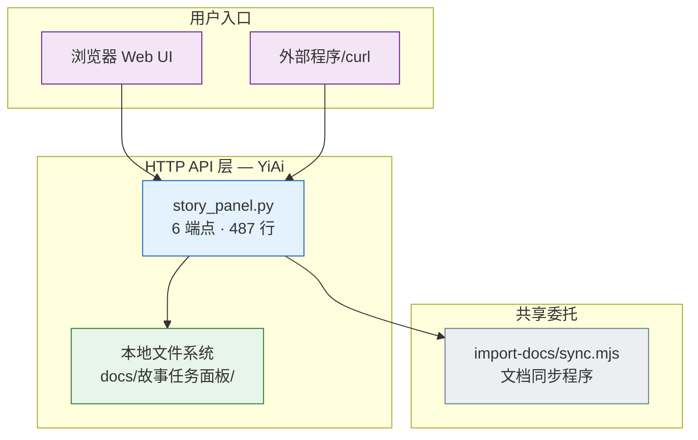
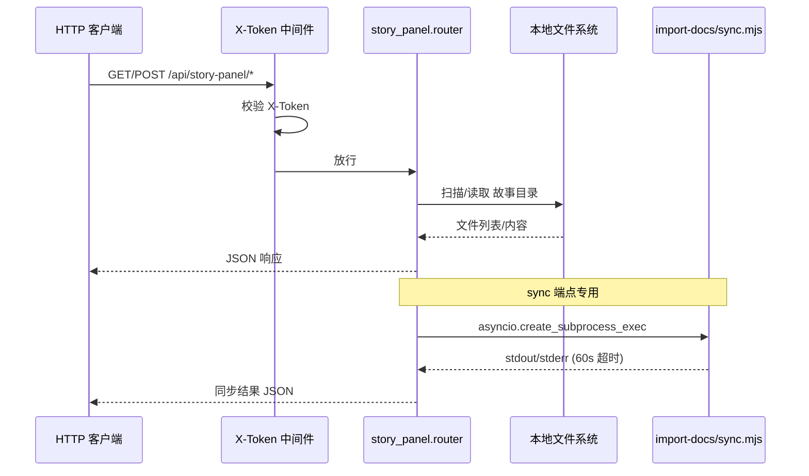
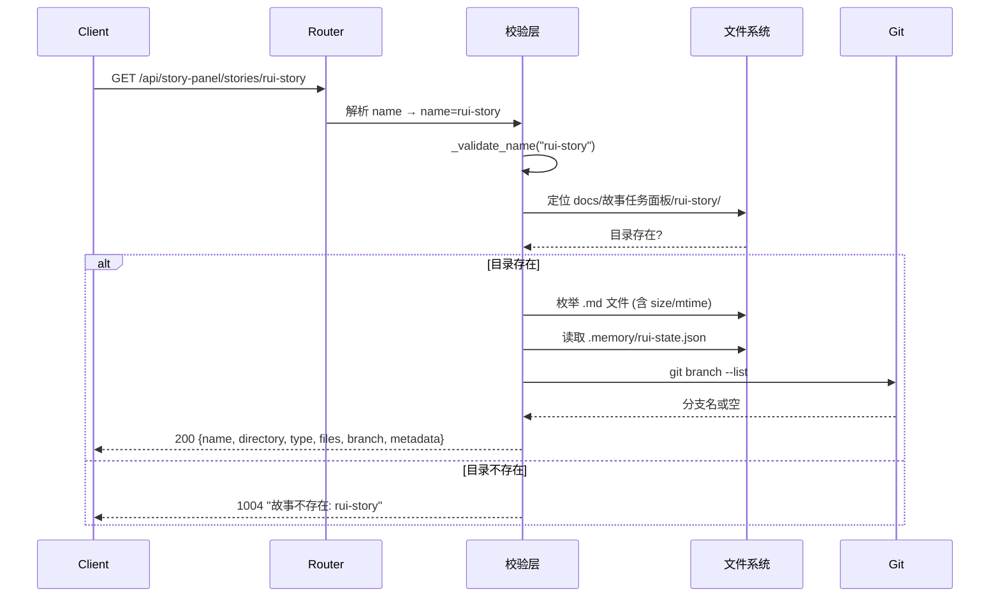
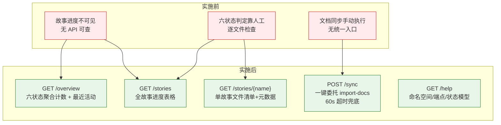

> | v2.1 | 2026-05-19 | deepseek-v4-pro | 自 后端-技术评审 拆分 |

> **导航**: [← 产品-用户使用场景](./用户使用场景.md) · [YiAi-实施报告 →](./YiAi-实施报告.md)

> **来源引用**: 由产品-故事任务 §1 Story 驱动。证据等级 B。

---

## §0 设计决策

故事任务面板 HTTP API（YiAi 项目）为 Web UI 和外部程序提供 JSON 接口。

| 决策领域 | 选定方案 | 选择理由 |
|---------|---------|---------|
| 路由框架 | FastAPI APIRouter（无 prefix） | 与项目现有路由一致，router 在 main.py 注册 |
| 数据源 | 本地文件系统 `docs/故事任务面板/` | 故事文档即本地 markdown 文件，无需数据库查询 |
| 状态判定 | 文件存在性推断六状态 | 确定性规则，无状态机副作用 |
| 类型推断 | 按 03/04/06/07 文档存在性推断 | 最低成本推断，默认 meta 兜底 |
| 名称校验 | kebab-case 正则 | 命名规范硬约束，路径遍历防护 |
| 同步机制 | `asyncio.create_subprocess_exec` 调用 Node.js 脚本 | 完全委托 import-docs，不自实现同步逻辑 |
| 认证 | 复用全局 X-Token 中间件 | 不在路由层重复鉴权，与项目统一 |
| 响应格式 | `success()` / `fail()` 统一封装 | 与项目 `core/response.py` 一致，code/message/data 三段式 |

### 架构全景

---

## §1 服务架构

### 1.1 服务模块

| 变更类型 | 模块/文件 | 职责 |
|---------|----------|------|
| 新增 | `src/api/routes/story_panel.py` | 故事面板 API：查询 + 同步委托 |
| 不变 | `src/main.py` | 导入并注册 router |
| 不变 | `skills/import-docs/sync.mjs` | 文档同步脚本（被委托方） |

`story_panel.py` 是自包含模块：零数据库依赖，零跨模块调用。仅导入项目核心模块 `core.response` 和 `core.error_codes`。

### 1.2 通信通道

| 通道 | 方向 | 协议 | 错误处理 |
|------|------|------|---------|
| HTTP → API | 入站 | HTTP/1.1, JSON | X-Token 中间件拦截 → 1009；路由层校验 → 1002/1004 |
| API → 文件系统 | 内部 | 本地 I/O | 目录不存在 → 返回空列表或 1004 |
| API → sync.mjs | 出站 | 子进程 stdio | 超时 60s / 异常捕获 → `synced: false` + reason |
| API → 远端 | 出站 | HTTPS (httpx) | 30s 超时，异常静默降级 |

### 1.3 接口清单

| 接口 | 方法 | 路径 | 请求体 | 响应体 |
|------|------|------|--------|--------|
| 状态概览 | GET | `/api/story-panel/overview` | — | `{summary, recent[]}` |
| 进度全景 | GET | `/api/story-panel/stories` | — | `{stories[]}` |
| 单故事详情 | GET | `/api/story-panel/stories/{name}` | — | `{name, directory, type, files[], branch, metadata}` |
| 文档同步 | POST | `/api/story-panel/stories/sync` | `{names?: []}` | `{synced, results[], total_written, total_failed}` 或 `{recommendations[], total}` |
| 远端故事查询 | GET | `/api/story-panel/remote?source=` | — | `{source, local[], remote[], story_directories[]}` |
| 帮助信息 | GET | `/api/story-panel/help` | — | `{description, namespace, naming, endpoints, status_model, boundaries}` |

### 1.4 请求流程 — 单故事详情

---

## §2 数据模型

| Key/表/集合 | 类型 | 读频率 | 写频率 | 说明 |
|------------|------|--------|--------|------|
| `docs/故事任务面板/<name>/` | 目录 | 每请求 1–N 次 | 0（只读） | 故事文档根目录 |
| `docs/故事任务面板/<name>/*.md` | 文件 | 每请求 N 次 | 0（只读） | 故事 markdown 文档 |
| `docs/故事任务面板/<name>/.memory/rui-state.json` | 文件 | 每 show 请求 1 次 | 0（只读） | rui 管线状态 |
| `docs/故事任务面板/<name>/.memory/story-type.json` | 文件 | 每状态判定 1 次 | 0（只读） | 故事类型元数据 |

---

## §3 安全约束

| # | 威胁 | 信任边界 | 缓解措施 | 优先级 |
|---|------|---------|---------|--------|
| 1 | 路径遍历 — name 参数含 `../` | HTTP 入参 → 文件系统 | `_validate_name()` 拒绝含路径分隔符的输入 | P0 |
| 2 | 未授权访问 — 无 Token 请求 | 公网 → API | X-Token 中间件全局拦截，返回 1009 | P0 |
| 3 | 子进程注入 — sync 参数拼接命令 | API → 子进程 | `dir_arg` 仅使用已验证的路径，不直接拼接用户输入 | P0 |
| 4 | 信息泄露 — 错误消息暴露文件路径 | API → 客户端 | 错误消息仅含 `<name>` 格式 | P1 |
| 5 | 资源耗尽 — sync 子进程长时间运行 | API → 系统资源 | `asyncio.wait_for(..., timeout=60)` 硬超时 | P1 |
| 6 | Token 泄露 | 环境变量 → 用户可见 | Token 仅从环境变量读取，不写入日志/配置 | P0 |
| 7 | 外部 API 调用被拦截/篡改 | API → 公网 | HTTPS 加密传输；30s httpx 超时；异常静默降级 | P1 |

---

## §4 性能与限制

| 维度 | 约束 | 应对 |
|------|------|------|
| 响应时间 | overview/list 应在 3 秒内完成 | 纯文件系统扫描，无网络 I/O；故事数 < 100 时线性扫描可接受 |
| 并发 | 无状态设计，天然支持并发 | 每个请求独立的文件系统操作，无共享状态 |
| 子进程 | sync 最多 1 个并发 Node.js 进程 | 60 秒超时兜底 |
| 文件系统 | 依赖本地 `docs/` 目录可读 | 目录不存在时返回空结果而非 500 |
| 远端 API | httpx 30s 超时 | 异常静默降级返回空列表，不阻断主流程 |

---

## §5 效果示意

| 组件 | 变更 | 说明 |
|------|------|------|
| `story_panel.py` | 新增 | 6 端点 + 辅助函数，零数据库依赖 |
| `main.py` | 不变 | 已有 router 注册代码 |
| X-Token 中间件 | 不变 | 复用全局认证 |
| `import-docs/sync.mjs` | 不变 | 子进程委托，60s 超时 |

---

## §6 评审清单

| # | 检查项 | 状态 |
|---|--------|------|
| 1 | 权限最小化 — 仅 X-Token 认证路由可访问 | |
| 2 | 通信对齐 — API 响应格式与项目 `success()/fail()` 一致 | |
| 3 | 存储兼容 — 无数据库依赖，文件系统路径安全校验 | |
| 4 | API 鉴权 — 复用全局中间件，不在路由内重复鉴权 | |
| 5 | 无硬编码密钥 — Token 从 `settings.auth_token` 读取 | |
| 6 | 输入校验完整 — kebab-case 正则 + 路径遍历防护 | |
| 7 | 基线溯源完备 — 每接口映射至产品 FP# | |

---

## 变更记录

| 日期 | 变更 | 触发 | 证据 |
|------|------|------|------|
| 2026-05-18 | 初始生成 | 故事需求 | `src/api/routes/story_panel.py` |
| 2026-05-18 | 新增 GET /remote 端点 | 远端查询需求 | story_panel.py:345-430 |
| 2026-05-19 | v2.1 角色化重构 — 独立 YiAi 后端文档 | 前端、后端需保留项目前缀 | 自 后端-技术评审 拆分 |
