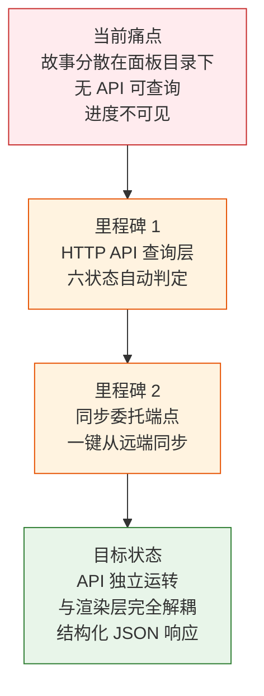
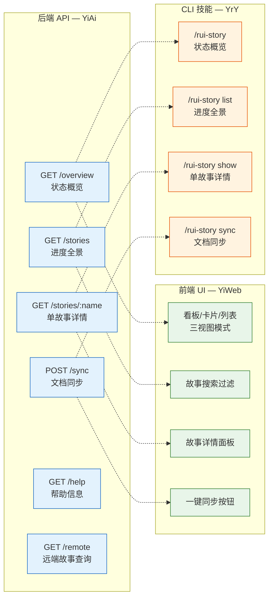
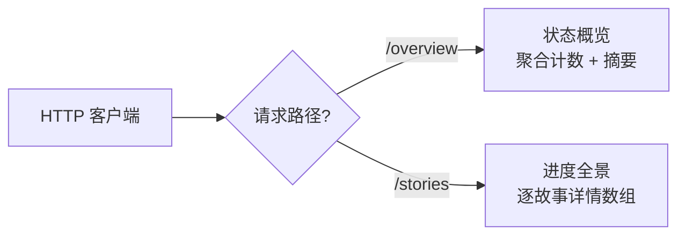

> | v1.0 | 2026-05-20 | claude-opus-4-7 | 自基线故事任务提取 YiAi 维度 |

> **导航**: [YiAi-使用场景 →](./YiAi-使用场景.md)

> **来源引用**: 由产品-故事任务 §1 Story 驱动，从基线 [故事任务.md](./故事任务.md) 提取 HTTP API 维度内容。证据等级 B。

---

### 需求概述

YiAi HTTP API 为故事任务面板提供 JSON 接口层。它从文件系统扫描故事目录、按六状态模型判定进度、并委托 import-docs 执行文档同步。API 是 Web UI 和外部程序的统一数据入口。

核心约束：只做查询和同步委托，不创建文档内容、不修改源码、不操作 git 分支。

### 主要价值

- 🔗 统一数据入口 — Web UI 和外部程序通过同一套 HTTP API 获取故事数据
- 📊 进度全景透明 — 六状态判定模型覆盖故事全生命周期，API 返回结构化 JSON
- 🛡️ 操作边界清晰 — 仅查询与同步委托，不触及文档内容和源码，职责单一
- 🔌 与 UI/CLI 解耦 — API 独立于渲染层，各维度各司其职不互相阻塞
- 📏 命名硬规范 — kebab-case 强制校验，消除路径遍历风险
- 🔄 同步委托机制 — 文档同步完全委托 import-docs，单一职责

---

### 效果示意

---

## §1 Story

### 实现维度总览 (HTTP API 维度)

故事任务面板通过三个维度实现完整的故事管理体验。本节聚焦 HTTP API 维度 (YiAi)：

> 上图展示完整三维度架构。本文档范围限定 HTTP API 维度 (蓝色)，其余维度由 YiWeb-故事任务.md 和 YrY-故事任务.md 覆盖。

### Story 1: 故事进度全景可见

| 字段 | 内容 |
|------|------|
| 作为 | HTTP API 消费者 (Web UI / 外部程序) |
| 我想要 | 通过 HTTP GET 请求获取所有故事的状态分布和最近活动 |
| 以便 | 在 UI 或程序中展示项目整体进度，无需直接操作文件系统 |
| 优先级 | P0 |
| 范围边界 | 只读面板目录，不修改任何文件 |
| 依赖 | 面板目录下文件存在性可检测 |

#### 范围外

- 不包含故事之间的依赖分析
- 不包含进度预测或工时估算
- 不包含自动状态迁移
- 不包含 UI 渲染逻辑

#### §1.1 HTTP API 操作

| # | 操作 | 触发条件 | 操作步骤 | 预期结果 |
|---|------|---------|---------|---------|
| 1 | 获取状态概览 | GET `/api/story-panel/overview` | 扫描全部故事目录 → 逐目录判定状态 → 按状态聚合计数 → 返回 summary + recent | JSON 响应含 6 种状态的计数和最近修改的故事列表 |
| 2 | 获取进度全景 | GET `/api/story-panel/stories` | 扫描全部故事目录 → 逐目录收集状态/文件数/最后修改/类型/分支 → 按时间降序排列 → 返回 stories 数组 | JSON 响应含所有故事的完整信息数组 |

---

### Story 2: 单故事详情查看

| 字段 | 内容 |
|------|------|
| 作为 | HTTP API 消费者 |
| 我想要 | 通过 HTTP GET 请求获取单个故事的完整信息（文件清单、状态、元数据、关联分支） |
| 以便 | 在 UI 中展示故事详情卡片，或供外部程序获取特定故事数据 |
| 优先级 | P1 |
| 范围边界 | 只读单个故事目录 |
| 依赖 | 故事目录存在 |

#### §1.1 HTTP API 操作

| # | 操作 | 触发条件 | 操作步骤 | 预期结果 |
|---|------|---------|---------|---------|
| 1 | 获取故事详情 | GET `/api/story-panel/stories/{name}` | 解析 name → 校验 kebab-case → 定位目录 → 枚举文件（含大小/时间）→ 读取状态和类型信息 → 检查关联分支 | JSON 响应含详述卡：状态、目录路径、类型、文件清单、关联分支、元数据 |

---

### Story 3: 文档同步委托

| 字段 | 内容 |
|------|------|
| 作为 | HTTP API 消费者 |
| 我想要 | 通过 HTTP POST 请求从远端知识库同步故事文档到本地 |
| 以便 | 通过 API 一键完成同步，无需登录服务器执行命令 |
| 优先级 | P1 |
| 范围边界 | 完全委托文档同步程序执行，自身不实现同步逻辑 |
| 依赖 | 文档同步程序 (import-docs/sync.mjs) 可用 |

#### §1.1 HTTP API 操作

| # | 操作 | 触发条件 | 操作步骤 | 预期结果 |
|---|------|---------|---------|---------|
| 1 | 从远端同步指定故事 | POST `/api/story-panel/stories/sync` body `{"names":["<name>"]}` | 校验名称格式 → 委托同步程序 → 返回同步结果 | JSON 响应含 synced=true + results + total_written/total_failed |
| 2 | 查看同步推荐 | POST `/api/story-panel/stories/sync` body `{}` (不传 names) | 扫描本地与远端差异 → 返回可同步故事推荐列表 | JSON 响应含 recommendations 数组和 total 计数 |

---

### Story 4: 远端故事查询

| 字段 | 内容 |
|------|------|
| 作为 | HTTP API 消费者 |
| 我想要 | 查询远端知识库中已有的故事目录列表 |
| 以便 | 了解远端有哪些故事可同步，与本地进行对比 |
| 优先级 | P2 |
| 范围边界 | 只读远端 API，不修改任何数据 |
| 依赖 | 远端 API 可访问 |

#### §1.1 HTTP API 操作

| # | 操作 | 触发条件 | 操作步骤 | 预期结果 |
|---|------|---------|---------|---------|
| 1 | 查询远端故事 | GET `/api/story-panel/remote?source=<source>` | 向远端 API 发送查询 → 获取故事目录列表 → 与本地对比 → 返回差异 | JSON 响应含 source、local[]、remote[]、story_directories[] |

---

## §2 Requirements

### 功能点 (HTTP API 维度)

| FP# | 描述 | 输入 | 输出 (HTTP API) | 错误行为 | 优先级 |
|-----|------|------|------|---------|--------|
| FP1 | 状态概览 — 按状态聚合所有故事并输出 JSON | GET 无参数 | `{summary: {not_started, docs_in_progress, docs_done, code_in_progress, code_done, blocked, total}, recent: [...]}` | 面板目录不存在时返回 total=0 | P0 |
| FP2 | 进度全景 — 输出所有故事的详情 JSON 数组 | GET 无参数 | `{stories: [{name, status, files, last_modified, type, branch}]}` | 面板目录不存在时返回空数组 | P0 |
| FP3 | 单故事详情 — 输出指定故事的完整 JSON | GET name (kebab-case) | `{name, directory, type, files: [{name, size, mtime}], branch, metadata}` | 目录不存在 → code=1004；名称格式非法 → code=1002 | P1 |
| FP4 | 文档同步 — 委托 sync.mjs 从远端拉取 | POST body `{names?: []}` | 指定 names → `{synced, results[], total_written, total_failed}`；不指定 → `{recommendations[], total}` | 名称不存在 → results 含 reason；格式非法 → synced=false + kebab-case 提示 | P1 |
| FP5 | 状态判定 — 按文件存在性判定故事六状态 | 故事目录路径 | 状态枚举值 (success/fail 响应中 data 字段) | 目录为空时返回 "not_started" | P0 |
| FP6 | 类型推断 — 按存在文件推断故事类型 | 故事目录路径 | 类型枚举值 (frontend/backend/fullstack/meta) | 无法判定时默认为 "meta" | P0 |
| FP7 | 帮助输出 — 返回 API 帮助信息 | GET 无参数 | `{description, namespace, naming, endpoints[], status_model, boundaries}` | 帮助信息不可用时返回错误 JSON | P1 |

### 业务规则 (HTTP API 维度)

| R# | 描述 | 校验方式 | 证据级别 |
|----|------|---------|---------|
| R1 | 故事名称必须为 kebab-case 格式（小写字母+连字符） | 正则校验 `^[a-z0-9]+(-[a-z0-9]+)*$` | B |
| R2 | sync 完全委托 import-docs/sync.mjs，不自实现同步逻辑 | `asyncio.create_subprocess_exec` 调用 Node.js 脚本 | B |
| R3 | 所有端点需通过 X-Token 中间件认证 | 复用全局中间件，不在路由内重复鉴权 | B |
| R4 | 响应格式统一使用 `success()` / `fail()` 封装 | code/message/data 三段式 JSON | B |

### 数据约束

| 约束 | 类型 | 范围/格式 | 来源 |
|------|------|----------|------|
| 故事名称 | string | `^[a-z0-9]+(-[a-z0-9]+)*$` (kebab-case) | 命名规范约定 |
| 故事类型 | enum | `frontend` / `backend` / `fullstack` / `meta` | 项目类型分类 |
| 状态枚举 | enum | `not_started` / `docs_in_progress` / `docs_done` / `code_in_progress` / `code_done` / `blocked` | 管线阶段定义 |

---

## §3 成功标准

| SC# | 描述 | 度量方式 | 目标值 | 优先级 | 关联 FP# |
|-----|------|---------|--------|--------|---------|
| SC1 | API 响应时间极短，消费者可在 3 秒内获取全量故事状态 | GET /overview 响应时间 | <= 3 秒（实测 < 50ms，纯文件系统读取） | P0 | FP1, FP5 |
| SC2 | API 返回每条故事的完整进度信息（六字段） | GET /stories 响应中每元素含 name/status/files/last_modified/type/branch | 六字段全覆盖 | P0 | FP2, FP5, FP6 |
| SC3 | API 返回单故事的完整状态信息（文件清单+元数据+分支） | GET /stories/{name} 响应中 files/metadata/branch 均有值或明确 null | 全部字段有值或明确标注 null | P1 | FP3 |
| SC4 | 通过一个 POST 请求完成文档同步 | POST /sync 执行完成并返回 synced 结果 | 取决于同步程序 | P1 | FP4 |

---

## §4 范围边界

### 范围内

| # | 条目 | 关联 FP# | 边界说明 |
|---|------|---------|---------|
| 1 | API 路由端点 (6 端点) | FP1, FP2, FP3, FP4, FP7 | GET /overview, /stories, /stories/{name}, /remote, /help; POST /sync |
| 2 | 文件系统扫描与状态判定 | FP1, FP2, FP3, FP5, FP6 | 基于 `docs/故事任务面板/` 目录文件存在性推断 |
| 3 | 文档同步委托 | FP4 | `asyncio.create_subprocess_exec` 调用 import-docs/sync.mjs，60s 超时 |
| 4 | 输入校验 (kebab-case + 路径遍历防护) | R1, FP3 | 正则校验 + 拒绝路径分隔符 |
| 5 | 统一 JSON 响应格式 | R4 | `success()` / `fail()` 封装，code/message/data 三段式 |

### 范围外

| # | 条目 | 排除原因 | 替代方案 |
|---|------|---------|---------|
| 1 | UI 渲染与展示 | 前端 YiWeb 的职责 | 使用 YiWeb 故事面板 |
| 2 | CLI 命令实现 | CLI YrY 的职责 | 使用 /rui-story 命令 |
| 3 | 创建故事文档内容 | 文档生成是文档管线的职责 | 使用文档生成命令 |
| 4 | 修改源码 | 源码变更是代码管线的职责 | 使用代码实现命令 |
| 5 | 创建或切换关联分支 | 分支管理是代码管线的职责 | 使用代码实现命令 |
| 6 | 批量操作多个故事 | 操作设计为单故事原子操作 | 逐个发送请求 |
| 7 | 故事间依赖分析 | 超出面板管理范围 | 查看 S1 Story 依赖字段 |

---

## §5 AC

| AC# | Given | When | Then | 门禁 |
|-----|-------|------|------|------|
| AC1 | 面板目录下存在 3 个故事，分别处于不同状态 | GET `/api/story-panel/overview` | data.summary 各状态计数正确，total=3；data.recent 含最近修改的故事 | Gate A |
| AC2 | 面板目录为空 | GET `/api/story-panel/overview` | data.summary.total=0，data.recent=[]，code=0 | Gate A |
| AC3 | 面板目录下存在故事 | GET `/api/story-panel/stories` | data.stories 数组，每元素含 name/status/files/last_modified/type/branch 六字段 | Gate A |
| AC4 | 某故事目录存在且含基线文档 | GET `/api/story-panel/stories/<name>` | data.files 数组含文件名/大小/时间，data.type 正确，data.metadata.status 正确 | Gate A |
| AC5 | 某故事目录不存在 | GET `/api/story-panel/stories/<name>` | code=1004，message 含"故事不存在" | Gate A |
| AC6 | 指定故事存在，X-Token 已设置 | POST `/api/story-panel/stories/sync` body `{"names":["<name>"]}` | data.synced=true，含 results 和 total_written/total_failed | Gate B |
| AC7 | 不指定故事名称 | POST `/api/story-panel/stories/sync` body `{}` | data.recommendations 数组，data.total 计数 | Gate A |
| AC8 | 用户需要查看 API 帮助 | GET `/api/story-panel/help` | 返回完整帮助 JSON (description/endpoints/status_model/boundaries) | Gate A |

---

## §6 风险与假设

| # | 风险/假设 | 类型 | 可能性 | 影响 | 缓解/验证策略 | 关联 FP# |
|---|----------|------|--------|------|-------------|---------|
| 1 | sync.mjs 执行失败导致 sync 端点不可用 | 风险 | M | M | sync 端点透传同步程序错误，不吞没；60s 超时兜底 | FP4 |
| 2 | 面板目录下存在非故事目录导致状态判定异常 | 风险 | L | M | 状态判定基于具体文件存在性，不受无关目录影响 | FP5 |
| 3 | 故事类型推断不准确 | 风险 | L | L | 默认返回 "meta"，不因推断失败阻断 | FP6 |
| 4 | kebab-case 校验规则与实际命名习惯冲突 | 假设 | L | L | 当前校验规则覆盖常见命名，可通过配置扩展 | R1 |
| 5 | sync.mjs 始终可用 | 假设 | M | M | 启动时检查 Node.js 可用性；sync 端点返回明确错误 | FP4 |
| 6 | X-Token 中间件正常运行 | 假设 | L | H | 中间件为项目基础设施，由全局配置保障 | 全部 |
| 7 | 文件系统 `docs/` 目录可读 | 假设 | L | H | 目录不存在时优雅降级返回空结果，不报 500 | FP1, FP2 |

---

## §7 跨文档索引

| 本文档章节 | 基线内容 | 下游文档 | 预期覆盖 | 状态 |
|-----------|---------|------------|---------|------|
| S1 Story 1 | 状态概览 + 进度全景需求 (HTTP API) | YiAi-测试设计 | AC1-AC3 | 已覆盖 |
| S1 Story 2 | 单故事详情需求 (HTTP API) | YiAi-测试设计 | AC4-AC5 | 已覆盖 |
| S1 Story 3 | sync 委托需求 (HTTP API) | YiAi-测试设计 | AC6-AC7 | 已覆盖 |
| S1 Story 4 | 远端故事查询需求 (HTTP API) | YiAi-测试设计 | remote 测试用例 | 已覆盖 |
| S2 FP5 | 六状态模型 | YiAi-测试设计 | 状态判定覆盖 | 已覆盖 |
| S2 R2 | sync 委托机制 | YiAi-测试设计 | AC6-AC7 | 已覆盖 |
| S3 SC1-SC4 | 全部成功标准 | YiAi-实施报告 | SC# 目标值 vs 实测值 | 已覆盖 |
| S5 全部 AC# | 验收标准 | YiAi-测试报告 | AC 最终通过率 | 已覆盖 |
| S6 风险与假设 | 7 条风险/假设 | YiAi-测试报告 | 风险命中率与假设验证 | 已覆盖 |

---

## 变更记录

| 日期 | 变更 | 触发 | 证据 |
|------|------|------|------|
| 2026-05-20 | v1.0 初始创建 — 自基线故事任务提取 YiAi (HTTP API) 维度 | 按角色拆分 · YiAi 独立文档 | 基线 故事任务.md S1-S2 HTTP API 部分 |
