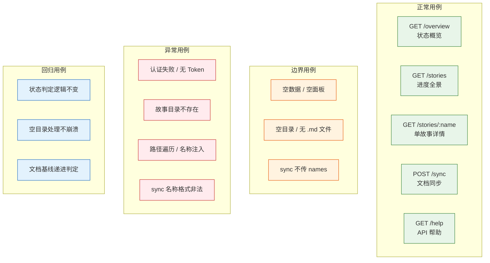

> | v1.0 | 2026-05-20 | claude-opus-4-7 | 自基线测试设计提取 YiAi 维度 |

> **导航**: [← YiAi-使用场景](./YiAi-使用场景.md) · [YiAi-测试报告 →](./YiAi-测试报告.md)

> **来源引用**: 由 YiAi-故事任务 §5 AC 和 YiAi-使用场景 §2 场景驱动，从基线 [测试-测试设计.md](./测试-测试设计.md) 提取 HTTP API 维度内容。证据等级 B。

---

## §0 测试策略

### 覆盖维度总览 (HTTP API 维度)

### 基线溯源

| TC 系列 | 覆盖 AC# (YiAi-故事任务 §5) | 覆盖场景 (YiAi-使用场景 §2) | 实现维度 |
|-----|----------------|----------------|------|
| TC-API-N* | AC1–AC8 | 场景 1–5 | HTTP API |
| TC-API-B* | AC2, AC7 | 场景 1, 4 | HTTP API |
| TC-API-E* | AC5, AC6, AC8 | 场景 3, 4, 5 | HTTP API |
| TC-API-R* | AC1, AC3 | 场景 1, 2 | HTTP API |
| TC-X* | AC5 | 场景 3 | HTTP API (安全专项) |

---

## §1 覆盖矩阵

| FP# | 功能点 | HTTP API | 覆盖率 |
|-----|--------|:---:|:---:|
| FP1 | 状态概览 | TC-API-N1, TC-API-B1 | 100% |
| FP2 | 进度全景 | TC-API-N2 | 100% |
| FP3 | 单故事详情 | TC-API-N3, TC-API-E1 | 100% |
| FP4 | 文档同步 | TC-API-N4, TC-API-B3, TC-API-E2, TC-API-E3 | 100% |
| FP5 | 状态判定 | TC-API-N1, TC-API-B1, TC-API-R1, TC-API-R3 | 100% |
| FP6 | 类型推断 | TC-API-N2 | 100% |
| FP7 | 帮助输出 | TC-API-N5 | 100% |

### Gate 映射

| Gate | 用例范围 | 通过标准 | 交接下游 |
|------|---------|---------|---------|
| Gate A | 全部正常 + 边界 + 异常 | P0 全部通过 | 实现阶段 |
| Gate B | 全部回归 + 环境专项 | P0 全部通过 + P1 >= 80% | 交付 |

---

## §2 HTTP API 测试用例

### 2.1 正常用例

| ID | Given | When | Then | 关联 FP | 优先级 |
|----|-------|------|------|---------|--------|
| TC-API-N1 | 面板目录下存在 3 个故事，分别处于不同状态 | GET `/api/story-panel/overview` | summary 各状态计数正确，total=3；recent 含最近修改的故事 | FP1, FP5 | P0 |
| TC-API-N2 | 面板目录下存在故事 | GET `/api/story-panel/stories` | stories 数组，每元素含 name/status/files/last_modified/type/branch | FP2, FP6 | P0 |
| TC-API-N3 | 某故事目录存在且含基线文档 | GET `/api/story-panel/stories/<name>` | files 数组含文件名/大小/时间，type 正确，metadata.status 正确 | FP3 | P0 |
| TC-API-N4 | 指定故事存在，API_X_TOKEN 已设置 | POST `/api/story-panel/stories/sync` body `{"names":["<name>"]}` | synced=true，含 results 和 total_written/total_failed | FP4 | P1 |
| TC-API-N5 | API_X_TOKEN 已设置 | GET `/api/story-panel/help` | 返回完整帮助 JSON（endpoints/status_model/boundaries） | FP7 | P1 |

### 2.2 边界用例

| ID | Given | When | Then | 关联 FP | 优先级 |
|----|-------|------|------|---------|--------|
| TC-API-B1 | 面板目录为空 | GET `/api/story-panel/overview` | summary total=0，recent=[]，不报错 | FP1, FP5 | P0 |
| TC-API-B2 | 某故事目录存在但无 .md 文件 | GET `/api/story-panel/stories/<name>` | files=[]，status="not_started" | FP3 | P1 |
| TC-API-B3 | 用户 POST sync 不传 names | POST `/api/story-panel/stories/sync` body `{}` | 返回 recommendations 数组和 total 计数 | FP4 | P0 |

### 2.3 异常用例

| ID | Given | When | Then | 关联 FP | 优先级 |
|----|-------|------|------|---------|--------|
| TC-API-E1 | 指定故事目录不存在 | GET `/api/story-panel/stories/<name>` | code=1004，message 含"故事不存在" | FP3 | P0 |
| TC-API-E2 | sync 指定的故事在远端不存在 | POST sync body `{"names":["nonexist"]}` | synced=true，results 含 reason="远端无此故事" | FP4 | P1 |
| TC-API-E3 | sync 指定无效名称格式（含大写字母） | POST sync body `{"names":["Invalid"]}` | synced=false，reason 含"必须为 kebab-case" | FP4 | P1 |

---

## §3 环境规格

| 维度 | HTTP API |
|------|---------|
| 运行环境 | Python 3.10, FastAPI + uvicorn |
| 部署方式 | `python3 main.py` |
| 测试目标 | `localhost:10086` |
| 认证方式 | X-Token 请求头 |
| 数据准备 | 临时 `docs/故事任务面板/test-story/` 目录 + 基线 .md 文件 |
| 依赖服务 | import-docs/sync.mjs (Node.js 可用) |
| 环境清理 | 测试后删除临时故事目录 |

---

## §4 回归用例

| ID | Given | When | Then | 关联 FP | 优先级 |
|----|-------|------|------|---------|--------|
| TC-API-R1 | overview 已通过 | 修改 `_determine_status` 逻辑后重跑 | 六状态枚举值返回正确 | FP1, FP5 | P1 |
| TC-API-R2 | list 已通过 | 修改 `_list_story_dirs` 逻辑后重跑 | stories 数组字段和排序仍正确 | FP2 | P1 |
| TC-API-R3 | 目录下添加文档基线（01 → 02 → 05 → 06 → 08） | 每次添加后 GET /stories/<name> 查询 | 状态从未开始 → 文档进行中 → 文档完成 → 编码进行中 → 编码完成正确流转 | FP1, FP5 | P0 |

---

## §5 环境专项

| ID | Given | When | Then | 优先级 |
|----|-------|------|------|--------|
| TC-X1 | name 参数含 `../` 路径遍历 | GET `/api/story-panel/stories/../etc%2Fpasswd` | 返回 code=1002 (kebab-case 校验失败，拒绝路径分隔符) | P0 |
| TC-X2 | 无 X-Token 请求头 | GET `/api/story-panel/overview` 不带 X-Token | code=1009 Unauthorized | P0 |
| TC-X3 | sync 子进程运行超过 60s | POST `/api/story-panel/stories/sync` body `{"names":["test-story"]}` | synced=false，reason 含超时信息 | P1 |
| TC-X4 | 故事目录包含非标准文件 (如 .DS_Store, Thumbs.db) | GET 查询操作 | 状态判定不受干扰，文件清单仅列出 .md 文件 | P2 |
| TC-X5 | 并发 10 个 GET /overview 请求 | 同时发送 10 个请求 | 每个请求独立返回正确结果，无状态交叉污染 | P1 |

---

## §6 测试环境

| 维度 | HTTP API |
|------|---------|
| 运行环境 | Python 3.10, FastAPI + uvicorn |
| 部署方式 | `python3 main.py` |
| 测试目标 | `localhost:10086` |
| 数据准备 | 临时 `docs/故事任务面板/test-story/` 目录，含梯度文件以覆盖各状态 |
| 工具 | curl / pytest / httpx |

---

## §7 评审清单

| # | 检查项 | 状态 |
|---|--------|------|
| 1 | 每功能点多类覆盖（正常+边界+异常） | |
| 2 | Gate A 覆盖 — 全部 AC# 有对应用例 | |
| 3 | 回归与影响链一致 | |
| 4 | 异常含恢复行为 | |
| 5 | TC-X 安全专项覆盖路径遍历 + 认证 | |
| 6 | 基线溯源闭合 — 全部 AC# 和场景有对应用例 | |

---

## §8 Gate A 交接

| 信号 | 内容 |
|------|------|
| 通过状态 | 待执行 |
| P0 用例 | TC-API-N1, TC-API-N2, TC-API-N3, TC-API-B1, TC-API-B3, TC-API-E1, TC-X1, TC-X2 |
| P1 用例 | TC-API-N4, TC-API-N5, TC-API-B2, TC-API-E2, TC-API-E3, TC-API-R1, TC-API-R2, TC-X3, TC-X5 |
| 实现约束 | 仅查询和同步委托，禁止创建文档内容；命名强制 kebab-case；复用 X-Token 中间件 |
| 基线溯源 | 所有用例可追溯至 YiAi-故事任务 §5 AC 和 YiAi-使用场景 §2 场景 |

---

## 变更记录

| 日期 | 变更 | 触发 | 证据 |
|------|------|------|------|
| 2026-05-20 | v1.0 初始创建 — 自基线测试设计提取 YiAi (HTTP API) 维度 | 按角色拆分 · YiAi 独立文档 | 基线 测试-测试设计.md §2 HTTP API 测试用例 |
