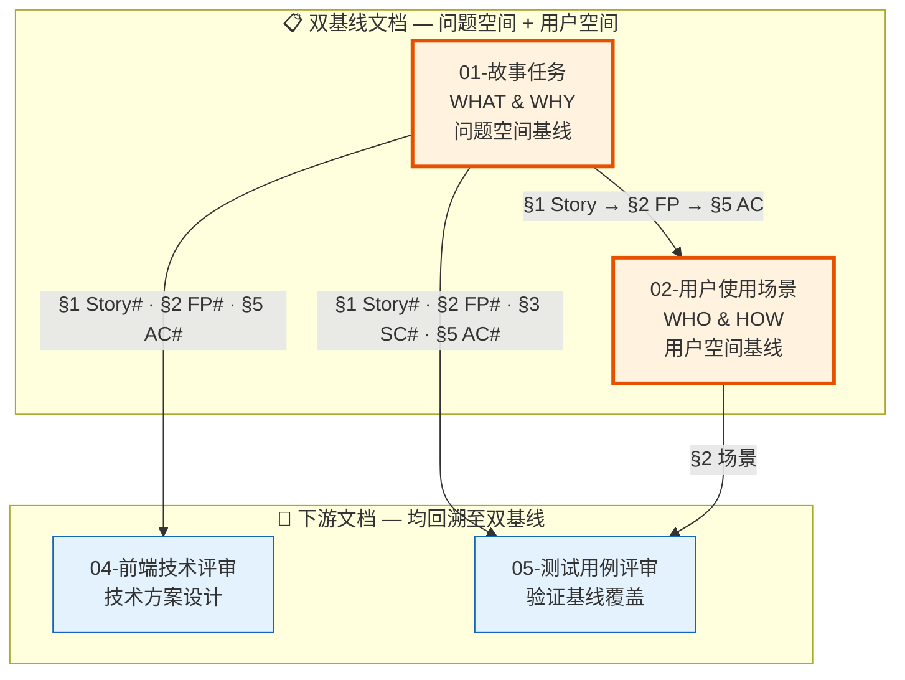
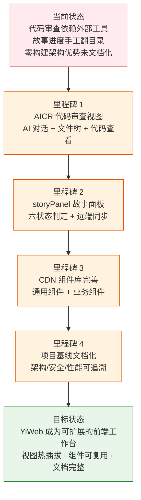

> | v1.0 | 2026-05-18 | deepseek-v4-pro | 🌿 main | 📎 [CLAUDE.md](../../../CLAUDE.md) |

> **导航**: [02-用户使用场景 →](./YiWeb-02-用户使用场景.md) | [04-前端技术评审 →](./YiWeb-04-前端技术评审.md)

> **来源引用**: 由故事需求 `rui-story` 驱动生成。外部参考吸收自 [README.md 外部参考](../../../README.md#外部参考) — ui-ux-pro-max（UI 设计系统 · 可访问性检查表）· get-shit-done（上下文边界）· karpathy-skills（LLM 编码陷阱规避）。证据等级 B（可推导，附外部参考路径）。

### 主要价值

- 🏗️ 零构建前端架构 — 浏览器原生 ESM，无编译/打包/构建工具链，降低运维复杂度
- 🧩 视图隔离系统 — 每个视图自包含（模板 + 逻辑 + 样式），视图间零耦合
- 📦 CDN 组件库 — 通用组件 CDN 托管，业务组件视图内聚，复用与隔离兼得
- 📝 Markdown 渲染管道 — 插件化架构支持 Mermaid 图表、目录、代码高亮、安全净化
- 🔒 API 安全层 — Token 认证、401 自动处理、输入净化、凭据隔离
- 📋 故事任务面板 — 浏览器内管理故事进度，六状态自动判定，一键远端同步

---

## §0 基线声明

> **问题空间基线 (Problem Space Baseline)**: 本文档是 `YiWeb` 项目的**第一基线文档**，与 02-用户使用场景 构成双基线。本文档定义 YiWeb 前端应用的"做什么(WHAT)"和"为什么(WHY)"——所有下游文档（04-前端技术评审、05-测试用例评审）的设计、验证、改进决策均必须可追溯至本文档的具体章节。

| 约束 | 规则 |
|------|------|
| 语言边界 | 仅使用业务语言与用户语言。**禁止**包含：代码文件路径、API 路由、组件名称、数据库表名、技术栈选型、框架名称 |
| 下游可追溯 | 04 和 05 必须引用本文档的 §1 Story# 或 §2 FP# 或 §3 SC# 或 §5 AC# |
| 版本优先 | 需求变更时本文档先于所有其他文档更新；下游文档偏差必须同步回本文档 |
| 评审门禁 | 文档审查时检查禁止内容：含代码路径/API路由/组件名/技术栈名 = P0 阻断 |
| 基线贯穿 | 本文档 §1–§7 是下游文档的单一真相源 |

### 双基线协作模型

| 角色 | 文档 | 核心问题 | 本文档提供 | 下游使用方式 |
|------|------|---------|-----------|------------|
| **问题空间** | 本文档 (01) | WHAT + WHY | Story · FP · SC · AC · 范围边界 · 风险 | —（基线自身） |
| **用户空间** | 02 | WHO + HOW | 场景映射至 Story# FP# AC# | 02 的每场景关联本文档 §1 Story |
| **方案空间** | 04 | HOW | 架构方案设计 | 04 的每方案关联本文档 §1 Story |
| **验证空间** | 05 | 验证基线覆盖 | AC# 门禁定义 | 每用例关联 AC# 和 02 场景 |

---

### 需求概述

YiWeb 是一个浏览器端单页应用，提供 AI 辅助代码审查与故事任务管理两大核心能力。它采用零构建架构——所有代码为浏览器原生 ESM，无需编译、打包或开发服务器。

核心设计原则：**视图隔离**（每个视图独立目录、独立生命周期）、**零依赖**（不引入 npm 包，第三方功能通过 CDN 或自研实现）、**安全优先**（Token 认证、凭据隔离、输入净化）。

### 效果示意

---

## §1 Story

### Story 1: 零构建前端架构

| 字段 | 内容 |
|------|------|
| 作为 | 前端开发者 |
| 我想要 | 浏览器原生加载 ESM 模块，无需编译/打包/构建工具链 |
| 以便 | 降低项目启动成本，消除构建配置维护负担 |
| 优先级 | P0 |
| 范围边界 | 所有源码为浏览器可直接执行的 ESM；不引入需要预处理的语言特性 |
| 依赖 | 浏览器 ESM 支持（Chrome 61+, Firefox 60+, Safari 11+） |

#### 范围外

- 不引入 TypeScript、JSX 等需要编译的语法
- 不引入 Webpack、Vite、Rollup 等构建工具
- 不引入 npm 包管理器

#### §1.1 User Operations

| # | 操作 | 触发条件 | 操作步骤 | 预期结果 |
|---|------|---------|---------|---------|
| 1 | 打开视图 | 用户在浏览器访问视图 URL | 浏览器加载 HTML → 解析 ESM 模块 → 初始化视图应用 | 视图正常渲染，无构建错误 |
| 2 | 模块热替换 | 开发者修改源码后刷新浏览器 | 浏览器重新加载修改的 ESM 模块 | 修改即时生效，无需重编译 |

---

### Story 2: 视图隔离系统

| 字段 | 内容 |
|------|------|
| 作为 | 前端开发者 |
| 我想要 | 每个视图在独立目录中自包含（模板 + 逻辑 + 样式），共享视图框架 |
| 以便 | 视图间零耦合，新增视图不破坏现有功能 |
| 优先级 | P0 |
| 范围边界 | 视图通过统一框架注册，隔离各自的组件、状态、生命周期 |
| 依赖 | 视图框架的组件注册与挂载能力 |

#### 范围外

- 不提供视图间路由导航（当前无路由库）
- 不提供视图间状态共享

#### §1.1 User Operations

| # | 操作 | 触发条件 | 操作步骤 | 预期结果 |
|---|------|---------|---------|---------|
| 1 | 新增视图 | 开发者按约定创建视图三件套 | 创建 index.html + index.js + index.css → 调用视图框架注册 | 视图可被浏览器独立访问 |
| 2 | 视图挂载 | 浏览器加载视图页面 | 视图框架加载组件 → 初始化状态 → 挂载 DOM | 视图正常渲染 |

---

### Story 3: CDN 组件库

| 字段 | 内容 |
|------|------|
| 作为 | 前端开发者 |
| 我想要 | 通用 UI 组件（按钮、模态框、标签、加载器等）通过 CDN 托管并可复用 |
| 以便 | 不依赖 npm，跨视图统一交互体验 |
| 优先级 | P0 |
| 范围边界 | 通用组件放 CDN 目录；业务组件放视图内 components 目录 |
| 依赖 | CDN 服务可用性 |

#### 范围外

- 不提供 npm 包发布渠道
- 不提供组件文档站点
- 不提供视觉回归测试

#### §1.1 User Operations

| # | 操作 | 触发条件 | 操作步骤 | 预期结果 |
|---|------|---------|---------|---------|
| 1 | 使用通用组件 | 视图注册组件列表 | 指定组件名和 CDN 路径 → 视图框架自动加载 | 组件在模板中可用 |
| 2 | 新增通用组件 | 开发者创建组件三件套 | 创建 index.html + index.js + index.css → 注册到全局 | 所有视图可引用该组件 |
| 3 | 新增业务组件 | 视图内需要特定功能 | 在视图 components 目录下创建组件三件套 | 仅当前视图可引用该组件 |

---

### Story 4: Markdown/Mermaid 渲染管道

| 字段 | 内容 |
|------|------|
| 作为 | 内容消费者 |
| 我想要 | 在浏览器中查看富文本 Markdown 内容，含 Mermaid 图表、代码高亮、目录导航 |
| 以便 | AI 对话回复、文档查看等内容以结构化、可交互的方式呈现 |
| 优先级 | P0 |
| 范围边界 | Markdown 渲染通过插件管道扩展；Mermaid 图表独立渲染并支持交互 |
| 依赖 | 第三方 Markdown 解析器（CDN），Mermaid 图表库（CDN） |

#### 范围外

- 不提供 Markdown 编辑器
- 不提供实时协作编辑

#### §1.1 User Operations

| # | 操作 | 触发条件 | 操作步骤 | 预期结果 |
|---|------|---------|---------|---------|
| 1 | 查看渲染内容 | 系统传递 Markdown 文本到渲染器 | 解析器处理文本 → 插件管道增强 → 输出 HTML | 富文本正确呈现（含表格、代码、图表） |
| 2 | 查看 Mermaid 图表 | Markdown 含 mermaid 代码块 | 渲染器识别代码块 → Mermaid 引擎渲染 SVG | 图表可缩放、全屏、下载 |
| 3 | 查看目录导航 | Markdown 文档含标题层级 | 目录插件提取标题 → 生成锚点链接 | 点击目录项跳转到对应章节 |

---

### Story 5: API 安全层

| 字段 | 内容 |
|------|------|
| 作为 | 用户 |
| 我想要 | API 通信安全可靠，Token 不被泄露，401 自动处理 |
| 以便 | 数据安全，不会因 Token 过期而丢失工作内容 |
| 优先级 | P0 |
| 范围边界 | 所有 HTTP 请求经统一封装，Token 仅存 localStorage，不随 Cookie 发送 |
| 依赖 | 后端 API 端点可用 |

#### 范围外

- 不提供 OAuth/SAML 等联邦认证
- 不提供多因素认证
- 不提供 IP 白名单

#### §1.1 User Operations

| # | 操作 | 触发条件 | 操作步骤 | 预期结果 |
|---|------|---------|---------|---------|
| 1 | 首次登录 | 用户首次访问需要认证的功能 | 系统弹出 Token 输入框 → 用户输入 Token → Token 持久化 | 后续请求自动携带 Token |
| 2 | Token 过期 | 后端返回 401 | 系统清除旧 Token → 弹出重新输入框 → 用户输入新 Token → 自动重试原请求 | 请求成功，用户无感知 |
| 3 | 查看渲染内容 | Markdown 内容含恶意脚本 | 净化插件过滤危险标签和属性 | 恶意脚本不被执行 |

---

### Story 6: 故事任务面板

| 字段 | 内容 |
|------|------|
| 作为 | 项目参与者 |
| 我想要 | 在浏览器中查看所有故事的状态、搜索故事、查看详情、从远端同步文档 |
| 以便 | 不依赖命令行即可了解项目进度 |
| 优先级 | P1 |
| 范围边界 | 仅查询和同步，不创建/修改文档内容，不操作 git 分支 |
| 依赖 | 远端知识库 API 可用 |

#### 范围外

- 不提供故事创建/编辑/删除功能
- 不提供文档内容编辑功能
- 不操作 git 分支

#### §1.1 User Operations

| # | 操作 | 触发条件 | 操作步骤 | 预期结果 |
|---|------|---------|---------|---------|
| 1 | 查看状态概览 | 用户打开故事面板视图 | 查询远端会话 → 按故事聚合 → 六状态判定 → 展示状态卡片 | 显示各状态故事计数 |
| 2 | 搜索故事 | 用户在搜索框输入关键词 | 本地过滤（名称/状态/类型匹配）→ 实时更新列表 | 仅显示匹配的故事 |
| 3 | 查看故事详情 | 用户点击故事行 | 展示完整信息：状态、类型、文件清单、元数据 | 详情卡片正确渲染 |
| 4 | 同步文档 | 用户点击同步按钮 | 查询远端会话 → 逐个读取文件 → 写入本地 | 文档从远端同步到本地 |

---

## §2 Requirements

### 功能点

| FP# | 描述 | 输入 | 输出 | 错误行为 | 优先级 |
|-----|------|------|------|---------|--------|
| FP1 | 视图初始化 — 加载视图入口并在浏览器中挂载 | 视图 URL | 可交互的单页应用 | 组件加载失败时显示错误状态 | P0 |
| FP2 | 组件注册 — 全局注册通用组件，视图注册业务组件 | 组件名 + 模板/逻辑/样式路径 | 模板中可用该组件 | 路径不存在时提示加载失败 | P0 |
| FP3 | Markdown 渲染 — 将 Markdown 文本转为安全 HTML | Markdown 文本 | 净化后的 HTML（含 Mermaid SVG） | 解析失败时显示原始文本 | P0 |
| FP4 | Token 认证 — 存储并自动附加认证 Token | 用户输入的 Token | 所有请求携带 X-Token 头 | Token 无效时返回 401 | P0 |
| FP5 | 401 处理 — 检测 401 响应并引导用户重新认证 | HTTP 401 响应 | Token 重新输入界面 | 连续失败时给出明确提示 | P1 |
| FP6 | 故事状态判定 — 按文件存在性判定六状态 | 故事目录下的文档列表 | 状态枚举值（not_started/docs_in_progress/docs_done/code_in_progress/code_done/blocked） | 目录为空时返回"未开始" | P1 |
| FP7 | 文档同步 — 从远端知识库同步故事文档 | 故事名称 | 文档写入本地目录 | 远端无此故事时提示错误 | P1 |
| FP8 | 流式 AI 对话 — 通过 SSE 接收 AI 回复 | 用户消息 + 上下文 | 流式渲染的 AI 回复 | 连接中断时显示已接收内容 | P0 |
| FP9 | 文件树管理 — 展示/创建/删除/重命名文件树节点 | 用户操作 | 更新后的文件树 | 操作失败时回滚 UI | P0 |
| FP10 | 环境切换 — 切换本地/生产环境配置 | 环境参数 | 对应环境的 API 端点 | 环境值非法时保持当前环境 | P1 |

### 业务规则

| R# | 描述 | 校验方式 | 证据级别 |
|----|------|---------|---------|
| R1 | 所有 fetch 请求显式设置 credentials: 'omit' | 代码审查 | A — CLAUDE.md 硬约束 |
| R2 | 视图禁止跨组件直接修改状态，必须走 store mutation | 代码审查 | A — CLAUDE.md 硬约束 |
| R3 | 日志必须使用统一日志函数，禁止裸 console.log | 代码审查 | A — CLAUDE.md 硬约束 |
| R4 | 第三方渲染内容必须经过净化插件处理 | 代码审查 + 安全测试 | A — XSS 防护硬约束 |
| R5 | Token 仅存 localStorage，不随 Cookie 发送 | 安全审计 | A — 安全面硬约束 |
| R6 | 新视图必须包含三件套（index.html + index.js + index.css） | 文件检查 | B — 项目执行准则约定 |

### 数据约束

| 约束 | 类型 | 范围/格式 | 来源 |
|------|------|----------|------|
| 视图名 | 字符串 | 小写字母+连字符，如 aicr、story-panel | 执行准则 |
| 组件名 | 字符串 | PascalCase，如 YiButton、StoryPanelPage | 组件注册约定 |
| Token | 字符串 | 由后端签发，存 localStorage | API 认证契约 |
| 环境标识 | 枚举 | local / prod | 配置即环境 |

---

## §3 成功标准

| SC# | 标准 | 度量方式 | 目标值 | 对应 FP# |
|-----|------|---------|--------|---------|
| SC1 | 视图首屏渲染时间 | 从 HTML 请求到 DOM 就绪 | < 3 秒（4G 网络） | FP1 |
| SC2 | Markdown 渲染正确率 | 常见 Markdown 语法测试集 | 100% | FP3 |
| SC3 | Mermaid 图表渲染成功率 | 常见图表类型（flowchart/sequence/class） | ≥ 95% | FP3 |
| SC4 | API 请求成功率 | 监控 1 小时内请求 | ≥ 99%（排除 401） | FP4 |
| SC5 | 401 自动恢复率 | Token 过期后用户重新输入 Token 的成功率 | 100% | FP5 |
| SC6 | 故事状态判定准确率 | 与 rui-story 命令行判定结果对比 | 100% 一致 | FP6 |
| SC7 | 流式对话首字延迟 | 从发送消息到首字符渲染 | < 2 秒 | FP8 |
| SC8 | XSS 净化通过率 | OWASP XSS 测试向量集 | 100% | FP3 |

---

## §4 风险

| 风险 | 可能性 | 影响 | 缓解措施 |
|------|--------|------|---------|
| CDN 服务不可用 | 低 | 高 — 应用完全不可用 | 关键依赖（Vue）可考虑 fallback CDN |
| 浏览器 ESM 兼容性 | 极低 | 中 — 旧浏览器无法运行 | 明确浏览器最低版本要求 |
| Token 泄露（XSS） | 中 | 高 — Token 被盗用 | 输入净化 + CSP 头 |
| localStorage 被清除 | 中 | 低 — 用户需重新输入 Token | 提示用户备份 Token |
| 远端 API 不可达 | 中 | 中 — 面板数据无法加载 | 本地缓存 + 明确错误提示 |
| Mermaid 图表渲染失败 | 中 | 低 — 图表不显示 | 回退显示原始代码文本 |

---

## §5 验收标准

| AC# | 场景 | 触发条件 | 验收点 | 对应 Story# |
|-----|------|---------|--------|------------|
| AC1 | 视图正常加载 | 浏览器访问视图 URL | 视图无 JS 错误，组件正常渲染 | Story 1, 2 |
| AC2 | 空状态展示 | 无数据时访问视图 | 显示空状态占位符，不崩溃 | Story 1, 2 |
| AC3 | Markdown 渲染含表格 | 传入含表格语法的 Markdown | 表格正确渲染，单元格内容完整 | Story 4 |
| AC4 | Mermaid 流程图渲染 | 传入 flowchart 语法 | SVG 图表正确显示，可缩放 | Story 4 |
| AC5 | XSS 防护 | 传入含 `` 的 Markdown | 脚本不被执行 | Story 4, 5 |
| AC6 | Token 认证流 | 首次访问 → 输入 Token → API 调用成功 | Token 持久化，后续请求自动携带 | Story 5 |
| AC7 | 401 自动恢复 | 使用过期 Token 发请求 → 收到 401 → 输入新 Token | 原请求自动重试成功 | Story 5 |
| AC8 | 故事面板加载 | 打开故事面板视图 | 显示状态卡片 + 故事列表 | Story 6 |
| AC9 | 故事搜索过滤 | 在搜索框输入关键词 | 列表实时过滤匹配项 | Story 6 |
| AC10 | 故事详情查看 | 点击故事行 | 显示详情卡片含文件清单 | Story 6 |
| AC11 | 故事文档同步 | 点击同步按钮 | 触发同步，显示结果 | Story 6 |
| AC12 | 流式对话 | 发送 AI 对话消息 | 回复逐字流式渲染 | Story 4 |

---

## §6 非功能需求

| NFR# | 类别 | 要求 |
|------|------|------|
| NFR1 | 性能 | 首屏加载 < 3s（4G），流式对话首字延迟 < 2s |
| NFR2 | 安全 | 所有 fetch 携带 credentials: 'omit'；渲染内容经净化；Token 不存 Cookie |
| NFR3 | 可维护性 | 视图三件套自包含；组件遵循统一模板/逻辑/样式分离 |
| NFR4 | 兼容性 | 支持 Chrome 80+、Firefox 80+、Safari 14+、Edge 80+ |
| NFR5 | 零构建 | 禁止任何需要预编译的语法或工具 |

---

## §7 跨文档索引

| 下游文档 | 依赖本文章节 | 映射关系 |
|---------|------------|---------|
| YiWeb-02-用户使用场景 | §1 Story 1–6 · §2 FP 1–10 · §5 AC 1–12 | 每场景关联 §1 Story#；每体验指标关联 §3 SC# |
| YiWeb-04-前端技术评审 | §1 Story 1–6 · §2 FP 1–10 · §4 风险 | 每技术方案对应 §1 Story#；每架构决策引用 §2 FP# |
| YiWeb-05-测试用例评审 | §1 Story 1–6 · §2 FP 1–10 · §3 SC 1–8 · §5 AC 1–12 | 每用例关联 AC# 和 FP# |

---

> **变更记录**: v1.0 初始基线 — YiWeb 项目故事文档建立，覆盖 6 个 Story、10 个 FP、8 个 SC、12 个 AC
