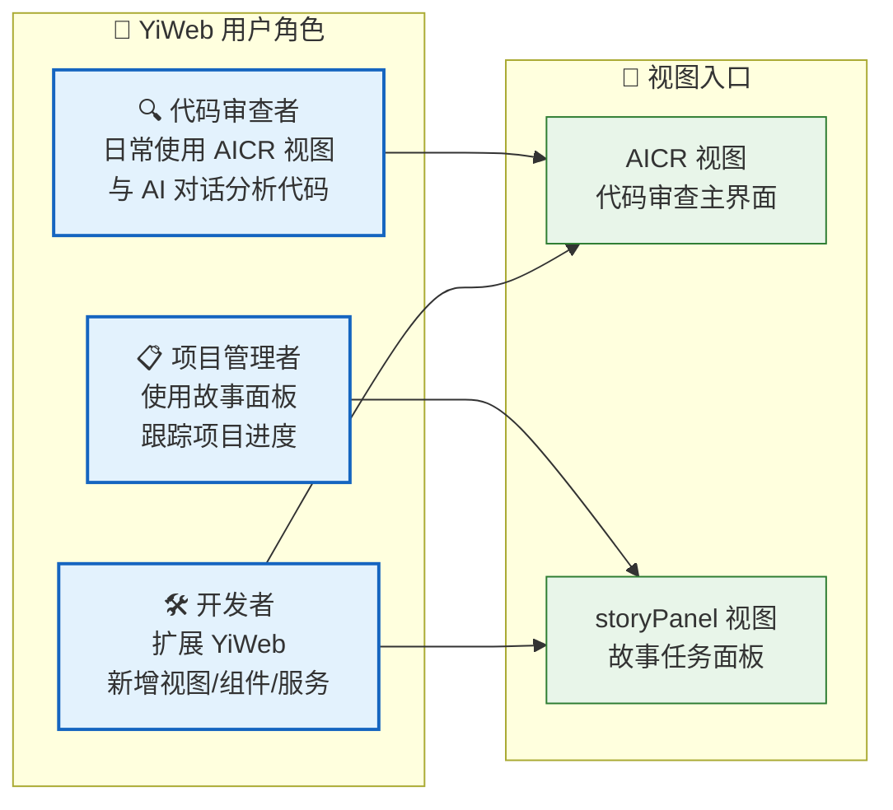
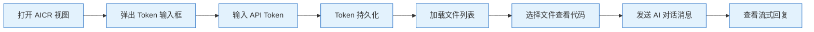
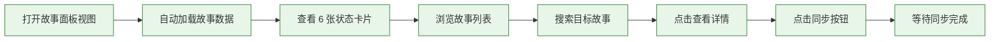
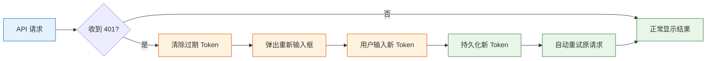

> | v1.0 | 2026-05-18 | deepseek-v4-pro | 🌿 main | 📎 [01-故事任务 ←](./YiWeb-01-故事任务.md) |

> **导航**: [← 01-故事任务](./YiWeb-01-故事任务.md) | [04-前端技术评审 →](./YiWeb-04-前端技术评审.md)

> **来源引用**: 由 [YiWeb-01-故事任务](./YiWeb-01-故事任务.md) §1 Story 驱动。外部参考吸收自 ui-ux-pro-max（交互状态覆盖 ≥3 状态）· karpathy-skills（用户意图理解）。证据等级 B。

---

## §0 用户空间基线

> **用户空间基线 (User Space Baseline)**: 本文档与 YiWeb-01-故事任务 构成双基线。本文档定义 YiWeb 的"谁用(WHO)"和"怎么用(HOW)"——所有体验决策、交互设计、UI 验收均必须可追溯至本文档的具体场景和体验基线。

| 角色 | 文档 | 核心问题 | 本文档提供 | 下游使用方式 |
|------|------|---------|-----------|------------|
| **用户空间** | 本文档 (02) | WHO + HOW | 人物画像 · 场景 · 体验基线 | —（基线自身） |
| **问题空间** | 01 | WHAT + WHY | Story → FP → AC 映射 | 每场景声明关联的 Story# FP# AC# |
| **验证空间** | 05 | 验证基线覆盖 | 用例设计源 | 05 的每用例关联本文档 §2 场景 |

---

### 人物画像总览

| 人物画像 | 角色描述 | 核心目标 | 主要视图 | 频率 |
|---------|---------|---------|---------|------|
| 代码审查者 | 需要 AI 辅助理解、审查、改进代码 | 高效获取 AI 对代码的分析和建议 | AICR | 每日 |
| 项目管理者 | 需要跟踪项目故事任务的整体进度 | 快速了解故事分布和状态变化 | storyPanel | 每周 |
| 开发者 | 需要在 YiWeb 框架上扩展新能力 | 遵循项目约束新增视图或组件 | 两者 | 按需 |

---

## §1 人物画像

### 人物画像 1: 代码审查者

| 维度 | 描述 |
|------|------|
| 身份 | 软件工程师、技术负责人 |
| 场景 | 需要分析代码库、理解复杂逻辑、审查代码质量 |
| 目标 | 通过 AI 对话快速获取代码洞察，减少手动翻阅时间 |
| 痛点 | 代码文件多、上下文切换频繁、人工审查遗漏 |
| 技能水平 | 中等以上，熟悉 IDE 和代码浏览 |
| 使用频率 | 每日，每次 30–120 分钟 |

#### 场景映射

| 场景 | 关联 Story# | 关联 FP# | 关联 AC# |
|------|-----------|---------|---------|
| 打开 AICR 视图浏览项目文件 | Story 1, 2 | FP1, FP9 | AC1, AC2 |
| 选择文件并在代码区查看内容 | Story 2, 4 | FP1, FP3 | AC1 |
| 与 AI 对话，请求代码分析 | Story 4, 5 | FP3, FP4, FP8 | AC4, AC12 |
| AI 回复含 Mermaid 图表或代码块 | Story 4 | FP3 | AC3, AC4 |
| Token 过期后重新认证继续对话 | Story 5 | FP5 | AC7 |
| 搜索文件或会话 | Story 2 | FP1, FP9 | AC1 |

---

### 人物画像 2: 项目管理者

| 维度 | 描述 |
|------|------|
| 身份 | 项目经理、技术负责人 |
| 场景 | 需要跟踪项目故事进度，了解哪些故事已完成、哪些被阻断 |
| 目标 | 一眼看清项目健康度，识别需要干预的故事 |
| 痛点 | 命令行不直观，手工翻目录效率低，进度不透明 |
| 技能水平 | 基础以上，熟悉浏览器操作 |
| 使用频率 | 每周 2–3 次，每次 5–15 分钟 |

#### 场景映射

| 场景 | 关联 Story# | 关联 FP# | 关联 AC# |
|------|-----------|---------|---------|
| 打开故事面板查看状态概览 | Story 6 | FP6 | AC8 |
| 浏览故事列表，按时间排序 | Story 6 | FP1 | AC8 |
| 搜索特定故事 | Story 6 | FP1 | AC9 |
| 点击故事查看详情（文件清单、类型） | Story 6 | FP6 | AC10 |
| 从远端同步故事文档到本地 | Story 6 | FP7 | AC11 |
| 查看空状态（无故事时） | Story 6 | FP1 | AC2 |

---

### 人物画像 3: 开发者

| 维度 | 描述 |
|------|------|
| 身份 | 前端开发者、贡献者 |
| 场景 | 需要在 YiWeb 框架上新增视图或通用组件 |
| 目标 | 遵循项目约束（零构建、ESM、视图隔离）快速交付新功能 |
| 痛点 | 约束多（无 npm、无 build）、需理解自研框架 |
| 技能水平 | 中高级，熟悉 Vue、ESM、浏览器 API |
| 使用频率 | 按需，集中开发数天 |

#### 场景映射

| 场景 | 关联 Story# | 关联 FP# | 关联 AC# |
|------|-----------|---------|---------|
| 新增视图（三件套 + 视图框架注册） | Story 1, 2 | FP1, FP2 | AC1 |
| 新增通用组件（三件套 + 全局注册） | Story 3 | FP2 | AC1 |
| 新增业务组件（视图内 components） | Story 3 | FP2 | AC1 |
| 新增 API 服务模块 | Story 5 | FP4 | AC6 |
| 遵守安全约束（credentials:omit 等） | Story 5 | FP4, FP10 | AC7 |

---

## §2 体验基线

### 2.1 信息透明度

| 指标 | 描述 | 目标 |
|------|------|------|
| 状态可见 | 用户打开面板后 3 秒内看到状态分布 | SC1 |
| 数据新鲜度 | 面板数据与远端同步，差异不超过 24h | SC6 |
| 错误可见 | API 失败时明确显示错误信息和恢复建议 | SC5 |

### 2.2 交互效率

| 指标 | 描述 | 目标 |
|------|------|------|
| 搜索响应 | 输入关键词后实时过滤，延迟 < 100ms | — |
| 页面切换 | 列表 ↔ 详情切换过渡动画 < 200ms | — |
| 同步反馈 | 同步操作显示进度状态（加载中 / 成功 / 失败） | — |

### 2.3 容错与恢复

| 指标 | 描述 | 目标 |
|------|------|------|
| Token 过期恢复 | 弹出重新输入框，输入后重试原请求 | SC5 |
| 网络中断恢复 | 明确显示网络错误，支持重试 | — |
| 空数据容错 | 无数据时显示空状态而非空白页 | AC2 |

### 2.4 可访问性基线

| 指标 | 描述 | 目标 |
|------|------|------|
| 键盘可达 | 所有交互元素可通过键盘访问（Tab/Enter/Escape） | — |
| 语义结构 | 使用正确的 HTML 地标（main/nav/section） | — |
| 屏幕阅读器 | 动态内容变更通过 aria-live 通知 | — |
| 颜色对比度 | 文本与背景对比度 ≥ 4.5:1 | — |
| 跳过链接 | 提供跳到主要内容的链接 | — |

### 2.5 视觉一致性

| 指标 | 描述 | 目标 |
|------|------|------|
| 组件风格 | 所有组件遵循统一设计 Token（颜色/间距/圆角/阴影） | — |
| 加载状态 | 统一使用骨架屏或旋转器，禁止空白等待 | — |
| 过渡动画 | 页面切换使用淡入动画（150–200ms），尊重 prefers-reduced-motion | — |

---

## §3 用户旅程

### 旅程 1: 代码审查者首次使用

### 旅程 2: 项目管理者查看进度

### 旅程 3: Token 过期恢复

---

## §4 跨文档索引

| 方向 | 文档 |
|------|------|
| ↑ 问题空间基线 | [YiWeb-01-故事任务](./YiWeb-01-故事任务.md) — §1 Story, §2 FP, §5 AC |
| ↓ 方案设计 | [YiWeb-04-前端技术评审](./YiWeb-04-前端技术评审.md) — 架构/组件/安全方案 |
| ↓ 验证 | [YiWeb-05-测试用例评审](./YiWeb-05-测试用例评审.md) — 用例关联 §2 场景 |

---

> **变更记录**: v1.0 初始基线 — 3 个人物画像、10+ 场景、5 组体验基线、3 段用户旅程
