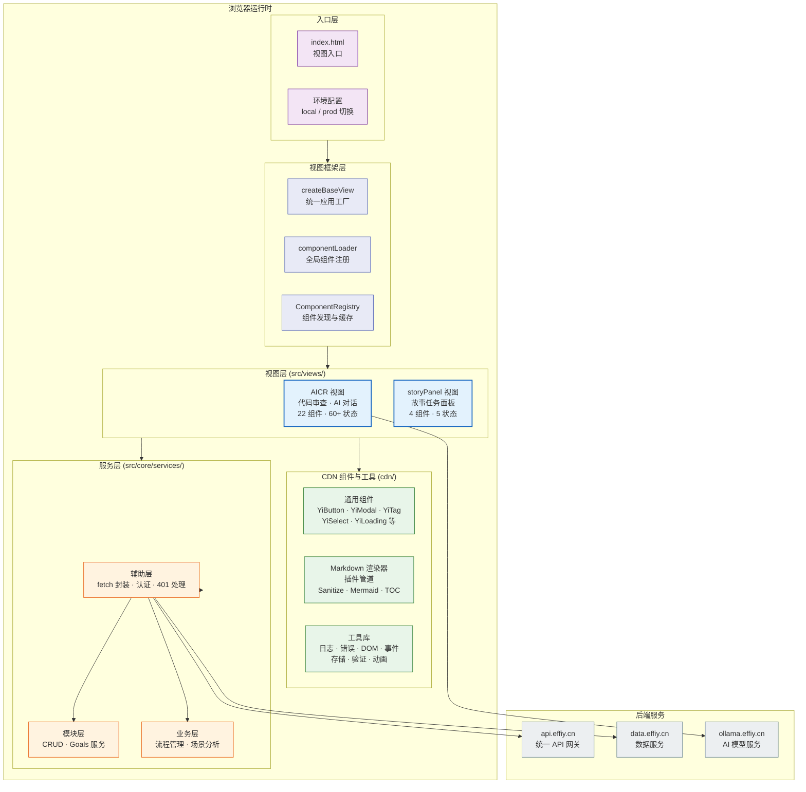
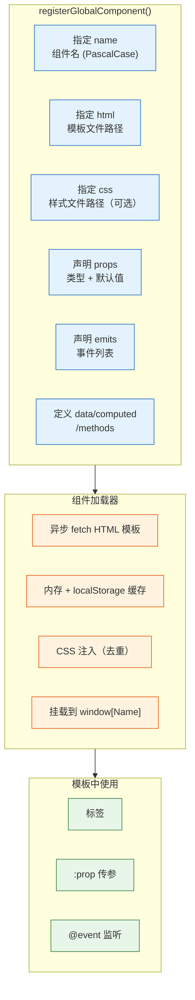
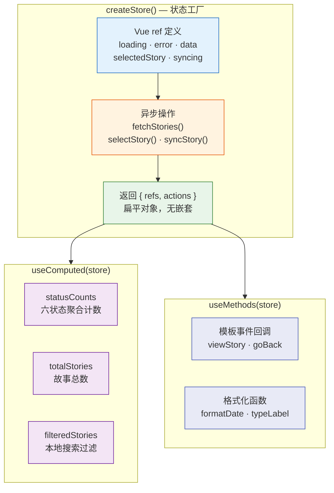
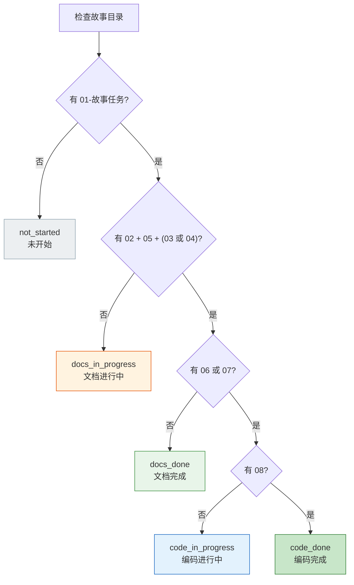
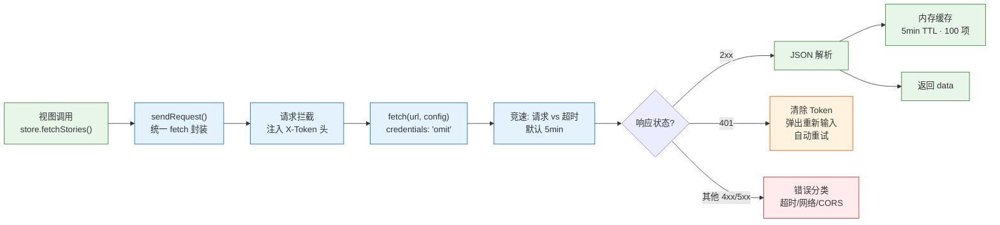
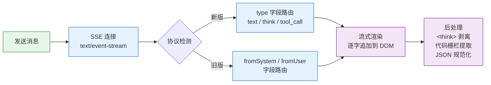
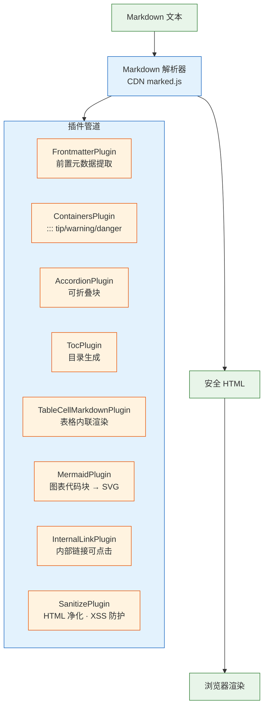
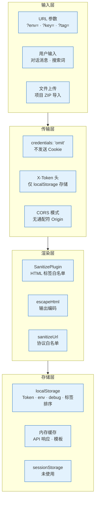

> | v1.0 | 2026-05-18 | deepseek-v4-pro | 🌿 main | 📎 [01-故事任务 ←](./YiWeb-01-故事任务.md) |

> **导航**: [← 01-故事任务](./YiWeb-01-故事任务.md) | [← 02-用户使用场景](./YiWeb-02-用户使用场景.md) | [05-测试用例评审 →](./YiWeb-05-测试用例评审.md)

> **来源引用**: 由 [YiWeb-01-故事任务](./YiWeb-01-故事任务.md) §1 Story 1–6 驱动。外部参考吸收自 ui-ux-pro-max（Soft UI + Swiss 设计系统 · 可访问性预交付检查表）· system-design-primer（深模块设计 · 纵深防御）。证据等级 A（源码可验证，附路径）。

---

## §0 架构全景

---

## §1 视图架构

### 1.1 视图工厂模式

YiWeb 使用自研 `createBaseView` 函数作为统一的视图工厂，语义类似 Vue Options API：

```mermaid
flowchart LR
    subgraph 输入["createBaseView 输入"]
        Store["createStore<br/>响应式状态工厂"]:::in
        Computed["useComputed<br/>计算属性"]:::in
        Methods["useMethods<br/>方法集合"]:::in
        Comps["components<br/>组件名列表"]:::in
        Modules["componentModules<br/>组件 JS 路径"]:::in
        Data["data<br/>模板绑定数据"]:::in
        Mounted["onMounted<br/>挂载回调"]:::in
    end

    subgraph 处理["视图工厂处理"]
        Wait["轮询等待组件注册<br/>超时 60s"]:::proc
        Create["Vue.createApp<br/>创建应用实例"]:::proc
        Mount["mount('#app')<br/>挂载到 DOM"]:::proc
    end

    subgraph 输出["运行时产物"]
        App["window.storyApp<br/>或 window.aicrApp"]:::out
        StoreObj["window.*Store<br/>全局可访问的 store"]:::out
    end

    输入 --> Wait --> Create --> Mount --> 输出

    classDef in fill:#e3f2fd,stroke:#1565c0;
    classDef proc fill:#fff3e0,stroke:#e65100;
    classDef out fill:#e8f5e9,stroke:#2e7d32;
```

| 配置项 | 类型 | 说明 |
|------|------|------|
| `createStore` | `() => store` | 返回包含 ref 和方法的 store 对象 |
| `useComputed` | `(store) => computed` | 返回计算属性集合 |
| `useMethods` | `(store) => methods` | 返回方法集合 |
| `components` | `string[]` | 模板中使用的组件名列表（PascalCase） |
| `componentModules` | `string[]` | 对应组件 JS 文件的 CDN/本地路径 |
| `data` | `object` | 绑定到模板的响应式数据 |
| `onMounted` | `() => void` | 应用挂载后回调 |

**源码路径**: `/cdn/utils/view/baseView.js` — `createBaseView()` (≈200 行)

### 1.2 组件注册系统

**源码路径**: `/cdn/utils/view/componentLoader.js` — `registerGlobalComponent()` + `defineComponent()` (≈150 行)

### 1.3 组件分类

| 类别 | 位置 | 示例 | 注册方式 |
|------|------|------|---------|
| 通用组件 | `cdn/components/common/` | YiButton, YiModal, YiTag, YiSelect | 全局注册（CDN index.js） |
| 业务组件 | `cdn/components/business/` | MarkdownView, SearchHeader, SkeletonLoader | 全局注册（CDN index.js） |
| 视图业务组件 | `src/views/<name>/components/` | StoryPanelPage, AicrPage, FileTree | 视图入口注册 |

---

## §2 状态管理

### 2.1 Store 工厂模式

| 约束 | 规则 |
|------|------|
| 单向数据流 | 组件事件 → methods → store mutation → computed 重算 → DOM 更新 |
| ref 只读 | 组件禁止直接修改 ref，所有变更走 store 方法 |
| computed 无副作用 | 计算属性仅读取状态，不触发 API 调用或 DOM 操作 |
| API 调用隔离 | 网络请求仅在 store actions 中执行 |

**源码路径**: `src/views/story/hooks/store.js` — 故事面板 store (211 行)；`src/views/aicr/hooks/state/storeFactory.js` — AICR store 工厂 (复合 4 子模块)

### 2.2 故事六状态判定模型

**源码路径**: `src/views/story/hooks/store.js:55–76`

---

## §3 API 通信层

### 3.1 请求管道

**源码路径**:
- `src/core/services/helper/requestHelper.js` — `sendRequest()` (≈200 行)
- `src/core/services/helper/authUtils.js` — `getAuthHeaders()` (≈100 行)
- `src/core/services/helper/authErrorHandler.js` — `handle401Error()` (≈80 行)
- `src/core/services/modules/crud.js` — `getData()` / `postData()` / `streamPrompt()` (≈400 行)

### 3.2 API 端点契约

| 端点 | 方法 | 用途 | 认证 |
|------|------|------|:---:|
| `{API_URL}/` | POST | 通用数据操作（query/create/update/delete document） | X-Token |
| `{API_URL}/read-file` | POST | 读取远端文件内容 | X-Token |
| `{API_URL}/write-file` | POST | 写入文件到远端 | X-Token |
| `{API_URL}/upload/upload-image-to-oss` | POST | 上传图片到 OSS | X-Token |
| `{OLLAMA_URL}/api/tags` | GET | 获取可用 AI 模型列表 | — |

### 3.3 流式对话协议

**源码路径**: `src/core/services/modules/crud.js:streamPrompt()` (≈150 行)

---

## §4 Markdown 渲染管道

### 4.1 插件架构

**源码路径**: `/cdn/markdown/core/MarkdownRenderer.js` (≈120 行) + `/cdn/markdown/core/PluginSystem.js` (≈80 行)

### 4.2 Mermaid 图表增强

| 插件 | 功能 | 交互 |
|------|------|------|
| ToolbarPlugin | 缩放控件工具栏 | 点击放大/缩小/重置 |
| FullscreenPlugin | 全屏查看 | 点击全屏图标 |
| DownloadPlugin | SVG/PNG 下载 | 点击下载按钮 |
| ClipboardPlugin | 复制图表代码 | 点击复制按钮 |
| AIFixPlugin | 图表语法自动修复 | 渲染失败时自动重试 |

**源码路径**: `/cdn/mermaid/core/MermaidRenderer.js` (≈200 行) + `/cdn/mermaid/core/MermaidConfig.js` (≈60 行)

---

## §5 安全架构

### 5.1 纵深防御模型

### 5.2 安全措施汇总

| 层面 | 措施 | 实现 |
|------|------|------|
| 输入验证 | URL 参数仅支持已知 key；搜索词无限制但渲染前净化 | `config.js` + `SanitizePlugin` |
| 认证 | Token 经 X-Token 头传递；401 自动清除并重新输入 | `authUtils.js` + `authErrorHandler.js` |
| 传输安全 | credentials: 'omit'；CORS 模式 | `requestHelper.js` |
| 输出编码 | HTML 净化（白名单标签）；URL 协议白名单（http/https/mailto） | `SanitizePlugin` + `sanitizeUrl()` |
| 存储安全 | Token 仅 localStorage；敏感操作前验证 Token 有效性 | `authUtils.js` |

**关键约束**: Token 和 webhook URL 禁止写入源码或文档（P0 安全规则）

---

## §6 性能策略

| 策略 | 实现 | 效果 |
|------|------|------|
| 零构建 | 无编译/打包，浏览器原生加载 ESM | 消除构建时间，首屏加载 = 网络 + 解析 |
| CDN 缓存 | 第三方库（Vue、marked、mermaid）CDN 加载 | 利用浏览器缓存 + CDN 边缘节点 |
| 模板缓存 | HTML 模板内存 + localStorage 缓存 | 组件二次加载瞬间完成 |
| API 缓存 | 内存缓存 5min TTL，100 项限制 | 减少重复请求，降低 API 压力 |
| 防抖节流 | 搜索输入 300ms 防抖；滚动事件节流 | 减少不必要的计算和渲染 |
| 懒加载 | 非首屏组件按需加载 | 减少初始 JS 解析量 |
| GPU 加速 | CSS transform3d + will-change + backface-visibility | 动画 60fps |
| 减少动画 | prefers-reduced-motion 时将动画时长设为 0ms | 无障碍 + 性能双赢 |

---

## §7 项目约束验证

| # | 约束 | 验证方式 | 状态 |
|---|------|---------|:---:|
| 1 | 零构建链 — 无 transpile/bundle/dev server | 检查项目无 package.json、无构建配置 | ✅ |
| 2 | 无外部包管理 — 无 npm 依赖 | 检查无 node_modules、无 package.json | ✅ |
| 3 | 浏览器安全 — credentials: 'omit' | 全局搜索 fetch 调用 | ✅ |
| 4 | 视图隔离 — 每个视图自包含 | 检查 src/views/ 目录结构 | ✅ |
| 5 | 配置即环境 — local/prod 切换 | config.js 仅两环境 | ✅ |
| 6 | 状态变更走 store — 不跨组件改 ref | 代码审查 | ✅ |
| 7 | 统一日志 — logInfo/logWarn/logError | 全局搜索 console.log | ✅ |

---

## §8 跨文档索引

| 方向 | 文档 |
|------|------|
| ↑ 问题空间基线 | [YiWeb-01-故事任务](./YiWeb-01-故事任务.md) — §1 Story 1–6, §2 FP 1–10, §4 风险 |
| ↑ 用户空间基线 | [YiWeb-02-用户使用场景](./YiWeb-02-用户使用场景.md) — §2 体验基线 |
| ↓ 验证 | [YiWeb-05-测试用例评审](./YiWeb-05-测试用例评审.md) — 用例关联架构方案 |

---

> **变更记录**: v1.0 初始基线 — 7 章架构评审：视图框架、状态管理、API 通信、Markdown 管道、安全架构、性能策略、项目约束
