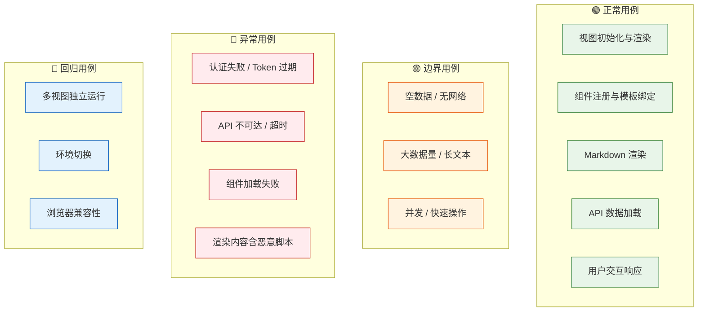

> | v1.0 | 2026-05-18 | deepseek-v4-pro | 🌿 main | 📎 [01-故事任务 ←](./YiWeb-01-故事任务.md) |

> **导航**: [← 04-前端技术评审](./YiWeb-04-前端技术评审.md)

> **来源引用**: 由 [YiWeb-01-故事任务](./YiWeb-01-故事任务.md) §1 Story · §3 SC · §5 AC 驱动。外部参考吸收自 ui-ux-pro-max（交互状态覆盖 ≥3 状态 · 可访问性检查表）。证据等级 B（可推导）。

---

## §0 测试策略

### 覆盖矩阵

---

## §1 正常用例

### TC-N1: 视图初始化

| 字段 | 内容 |
|------|------|
| 关联 AC | AC1 · AC2 |
| 关联 FP | FP1 · FP2 |
| 前置条件 | 浏览器支持 ESM；CDN 可访问 |
| 步骤 | 1. 访问视图 URL 2. 等待页面加载 3. 检查 DOM |
| 预期结果 | Vue 应用挂载到 #app；无 JS 错误；空状态占位符可见（无数据时） |
| 优先级 | P0 |

### TC-N2: 组件注册

| 字段 | 内容 |
|------|------|
| 关联 AC | AC1 |
| 关联 FP | FP2 |
| 前置条件 | 视图入口正确声明组件列表和路径 |
| 步骤 | 1. 视图初始化 2. 检查 window 全局变量 3. 在模板中使用组件 |
| 预期结果 | 所有声明的组件注册到 window；kebab-case 标签正确渲染 |
| 优先级 | P0 |

### TC-N3: Markdown 渲染 — 标准语法

| 字段 | 内容 |
|------|------|
| 关联 AC | AC3 · AC4 |
| 关联 FP | FP3 |
| 前置条件 | Markdown 渲染器已加载 |
| 测试数据 | 含标题/粗体/斜体/列表/表格/代码块/blockquote 的标准 Markdown |
| 步骤 | 1. 传入 Markdown 文本 2. 调用渲染函数 3. 检查输出 HTML |
| 预期结果 | 所有标准语法正确渲染；表格单元格内容完整；代码块正确高亮 |
| 优先级 | P0 |

### TC-N4: Mermaid 图表渲染

| 字段 | 内容 |
|------|------|
| 关联 AC | AC4 |
| 关联 FP | FP3 |
| 前置条件 | Mermaid 图表库已加载 |
| 测试数据 | flowchart TD / sequenceDiagram / classDiagram 各一个 |
| 步骤 | 1. 传入含 mermaid 代码块的 Markdown 2. 渲染 3. 检查 SVG 输出 |
| 预期结果 | 三种图表类型均生成有效 SVG；工具栏插件可用 |
| 优先级 | P0 |

### TC-N5: API 数据加载 — 正常响应

| 字段 | 内容 |
|------|------|
| 关联 AC | AC8 |
| 关联 FP | FP4 · FP6 |
| 前置条件 | 有效 Token；API 可达 |
| 步骤 | 1. 打开故事面板 2. 等待数据加载 3. 检查状态卡片和故事列表 |
| 预期结果 | 状态卡片显示正确计数；故事列表按时间降序；状态徽章颜色正确 |
| 优先级 | P0 |

### TC-N6: 用户交互 — 搜索过滤

| 字段 | 内容 |
|------|------|
| 关联 AC | AC9 |
| 关联 FP | FP1 |
| 前置条件 | 故事列表已加载 |
| 步骤 | 1. 在搜索框输入故事名称关键词 2. 观察列表变化 3. 清空搜索框 |
| 预期结果 | 输入时实时过滤匹配项；清空后恢复全部列表；搜索不区分大小写 |
| 优先级 | P1 |

### TC-N7: 用户交互 — 故事详情查看

| 字段 | 内容 |
|------|------|
| 关联 AC | AC10 |
| 关联 FP | FP6 |
| 前置条件 | 故事列表已加载 |
| 步骤 | 1. 点击某故事行 2. 检查详情卡片 |
| 预期结果 | 显示详情卡片：故事名称、状态徽章、类型、文件清单（文件名+修改时间）、返回按钮 |
| 优先级 | P1 |

### TC-N8: 流式 AI 对话

| 字段 | 内容 |
|------|------|
| 关联 AC | AC12 |
| 关联 FP | FP8 |
| 前置条件 | AICR 视图已加载；已选择文件；有效 Token |
| 步骤 | 1. 在输入框输入消息 2. 点击发送 3. 观察回复渲染 |
| 预期结果 | AI 回复逐字流式渲染；`<think>` 标签内容被剥离；代码块正确高亮 |
| 优先级 | P0 |

---

## §2 边界用例

### TC-B1: 空数据 — 无故事

| 字段 | 内容 |
|------|------|
| 关联 AC | AC2 |
| 关联 FP | FP1 · FP6 |
| 前置条件 | 远端无 storyPanel 相关数据 |
| 步骤 | 1. 打开故事面板 2. 检查页面状态 |
| 预期结果 | 状态卡片全部显示 0；表格区域显示"暂无故事任务"空状态；不崩溃 |
| 优先级 | P0 |

### TC-B2: 空数据 — 无会话

| 字段 | 内容 |
|------|------|
| 关联 AC | AC2 |
| 关联 FP | FP1 |
| 前置条件 | 远端无 sessions 数据 |
| 步骤 | 1. 打开 AICR 视图 2. 检查文件树 |
| 预期结果 | 文件树显示空状态提示；不崩溃；左侧边栏正常渲染 |
| 优先级 | P0 |

### TC-B3: 长文本渲染

| 字段 | 内容 |
|------|------|
| 关联 AC | AC3 |
| 关联 FP | FP3 |
| 测试数据 | 10000+ 行 Markdown；含大表格（50 列 × 200 行）；嵌套 Mermaid 图表 |
| 步骤 | 1. 传入长文本 2. 测量渲染时间 3. 检查输出完整性 |
| 预期结果 | 渲染完成时间 < 5s；内容无截断；浏览器不卡死 |
| 优先级 | P1 |

### TC-B4: 大量故事数据

| 字段 | 内容 |
|------|------|
| 关联 AC | AC8 |
| 关联 FP | FP6 |
| 测试数据 | 100+ 个故事 |
| 步骤 | 1. 加载大量故事 2. 滚动列表 3. 搜索过滤 |
| 预期结果 | 列表可滚动；搜索过滤 < 100ms；无内存泄漏 |
| 优先级 | P1 |

### TC-B5: 快速重复操作

| 字段 | 内容 |
|------|------|
| 关联 AC | AC9 |
| 关联 FP | FP1 |
| 步骤 | 1. 快速连续搜索（10 次/s） 2. 快速切换列表↔详情 3. 连续刷新 |
| 预期结果 | 无竞态条件导致的 UI 错乱；最终状态与操作序列一致 |
| 优先级 | P2 |

---

## §3 异常用例

### TC-E1: Token 缺失 — 首次访问

| 字段 | 内容 |
|------|------|
| 关联 AC | AC6 |
| 关联 FP | FP4 · FP5 |
| 前置条件 | localStorage 无 Token |
| 步骤 | 1. 清除 Token 2. 发起 API 请求 |
| 预期结果 | 弹出 Token 输入框；不静默失败 |
| 优先级 | P0 |

### TC-E2: Token 过期 — 401 处理

| 字段 | 内容 |
|------|------|
| 关联 AC | AC7 |
| 关联 FP | FP5 |
| 前置条件 | localStorage 有过期 Token |
| 步骤 | 1. 用过期 Token 发起请求 2. 收到 401 3. 输入新 Token |
| 预期结果 | 旧 Token 被清除；弹出输入框；输入新 Token 后自动重试原请求成功 |
| 优先级 | P0 |

### TC-E3: API 不可达

| 字段 | 内容 |
|------|------|
| 关联 AC | AC8 |
| 关联 FP | FP1 |
| 前置条件 | API 服务不可用 |
| 步骤 | 1. 断开网络或关闭 API 2. 打开故事面板或发起请求 |
| 预期结果 | 显示错误状态（网络错误提示）；提供重试能力；不白屏 |
| 优先级 | P0 |

### TC-E4: API 超时

| 字段 | 内容 |
|------|------|
| 关联 AC | AC8 |
| 关联 FP | FP1 |
| 前置条件 | API 响应超过超时时间 |
| 步骤 | 1. 模拟 API 延迟 > 5min 2. 观察处理 |
| 预期结果 | 显示超时错误；请求被中止；不阻塞其他操作 |
| 优先级 | P1 |

### TC-E5: 组件 JS 加载失败

| 字段 | 内容 |
|------|------|
| 关联 AC | AC1 |
| 关联 FP | FP2 |
| 前置条件 | 组件 JS 路径不存在或返回 404 |
| 步骤 | 1. 使用错误的组件路径 2. 初始化视图 |
| 预期结果 | 显示错误状态，指明哪个组件加载失败；应用不崩溃 |
| 优先级 | P1 |

### TC-E6: XSS 防护

| 字段 | 内容 |
|------|------|
| 关联 AC | AC5 |
| 关联 FP | FP3 |
| 测试数据 | `` · `` · `<a href="javascript:alert(1)">` |
| 步骤 | 1. 传入含恶意标签的 Markdown 2. 渲染 3. 检查输出 HTML |
| 预期结果 | script/onerror/javascript: 协议均被过滤；仅安全标签和属性保留 |
| 优先级 | P0 |

### TC-E7: URL 净化

| 字段 | 内容 |
|------|------|
| 关联 AC | AC5 |
| 关联 FP | FP3 |
| 测试数据 | `javascript:alert(1)` · `data:text/html,` · `file:///etc/passwd` |
| 步骤 | 1. 传入含恶意 URL 的 Markdown 2. 渲染 |
| 预期结果 | `javascript:` 和 `data:` 协议被移除；仅 `http:` / `https:` / `mailto:` 通过 |
| 优先级 | P0 |

---

## §4 回归用例

### TC-R1: AICR 与 storyPanel 视图独立

| 字段 | 内容 |
|------|------|
| 关联 AC | AC1 |
| 关联 FP | FP1 · FP2 |
| 前置条件 | 两个视图均已部署 |
| 步骤 | 1. 打开 AICR 视图 → 验证功能 → 关闭 2. 打开 storyPanel 视图 → 验证功能 |
| 预期结果 | 两视图互不干扰；组件不冲突；window 全局变量不覆盖 |
| 优先级 | P0 |

### TC-R2: 环境切换

| 字段 | 内容 |
|------|------|
| 关联 AC | — |
| 关联 FP | FP10 |
| 前置条件 | local 和 prod 环境 API 均可访问 |
| 步骤 | 1. 在 prod 环境打开视图 2. 切换到 local 环境（?env=local） 3. 刷新页面 |
| 预期结果 | API 端点切换到 local；数据从 local API 加载 |
| 优先级 | P1 |

### TC-R3: 浏览器兼容性

| 字段 | 内容 |
|------|------|
| 关联 AC | — |
| 关联 FP | FP1 |
| 前置条件 | 目标浏览器已安装 |
| 测试范围 | Chrome 80+ · Firefox 80+ · Safari 14+ · Edge 80+ |
| 步骤 | 1. 在各浏览器打开视图 2. 执行核心操作 |
| 预期结果 | 视图正常渲染；ESM 模块加载无错误；CSS 表现一致 |
| 优先级 | P1 |

### TC-R4: 本地缓存一致性

| 字段 | 内容 |
|------|------|
| 关联 AC | — |
| 关联 FP | FP4 |
| 前置条件 | Token 已存储 |
| 步骤 | 1. 刷新页面 2. 检查 Token 是否仍在 localStorage 3. 检查 API 请求是否携带 Token |
| 预期结果 | Token 持久化；刷新后无需重新输入；API 请求自动携带 |
| 优先级 | P1 |

---

## §5 关联矩阵

| 用例 | AC# | FP# | Story# | 类型 |
|------|-----|-----|--------|------|
| TC-N1 | AC1, AC2 | FP1, FP2 | Story 1, 2 | 正常 |
| TC-N3 | AC3, AC4 | FP3 | Story 4 | 正常 |
| TC-N5 | AC8 | FP4, FP6 | Story 6 | 正常 |
| TC-N6 | AC9 | FP1 | Story 6 | 正常 |
| TC-N8 | AC12 | FP8 | Story 4 | 正常 |
| TC-B1 | AC2 | FP1, FP6 | Story 6 | 边界 |
| TC-B2 | AC2 | FP1 | Story 2 | 边界 |
| TC-E1 | AC6 | FP4, FP5 | Story 5 | 异常 |
| TC-E2 | AC7 | FP5 | Story 5 | 异常 |
| TC-E6 | AC5 | FP3 | Story 4, 5 | 异常 |
| TC-E7 | AC5 | FP3 | Story 4, 5 | 异常 |
| TC-R1 | AC1 | FP1, FP2 | Story 1, 2 | 回归 |

---

> **变更记录**: v1.0 初始基线 — 19 个用例：8 正常 + 5 边界 + 7 异常 + 4 回归，覆盖全部 12 个 AC
