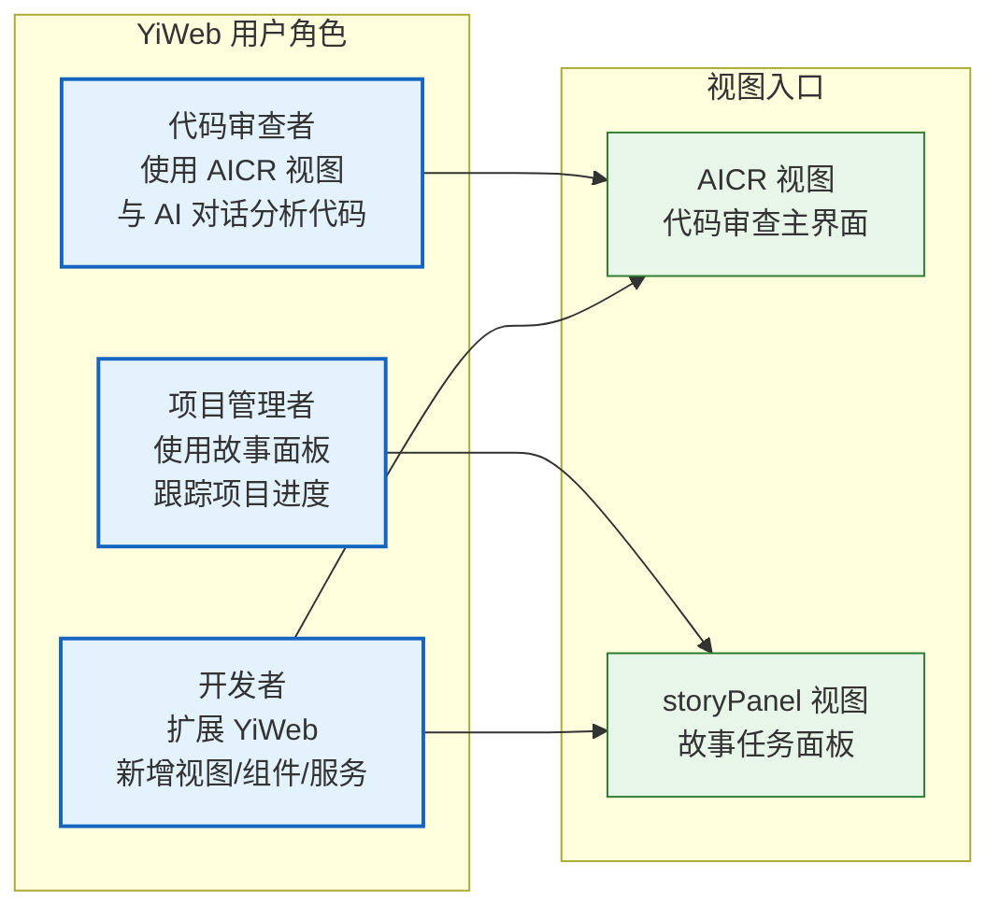

> | v2.0 | 2026-05-19 | deepseek-v4-pro | 重构自 YiWeb-01 + YiWeb-02 |

> **导航**: [YiWeb-技术评审 →](./YiWeb-技术评审.md)

> **来源引用**: 由 YiWeb 项目全景驱动。证据等级 B。

### 主要价值

- ⚡ 零构建前端架构 — 浏览器原生 ESM，无编译/打包/构建工具链
- 🧱 视图隔离系统 — 每个视图自包含（模板 + 逻辑 + 样式），视图间零耦合
- 📦 CDN 组件库 — 通用组件 CDN 托管，业务组件视图内聚，复用与隔离兼得
- 🔐 安全优先 — Token 认证、凭据隔离、输入净化

> **说明**: 本文档描述 YiWeb 前端应用的整体产品定位。故事任务面板（storyPanel）是该应用的核心视图之一，其产品需求详见产品-故事任务。

---

## §0 基线声明

| 约束 | 规则 |
|------|------|
| 语言边界 | 仅使用业务语言与用户语言 |
| 下游可追溯 | 前端技术评审和测试设计必须引用本文档的 Story# 或 FP# |
| 版本优先 | 需求变更时本文档先于其他文档更新 |

---

### 需求概述

YiWeb 是一个浏览器端单页应用，提供 AI 辅助代码审查与故事任务管理两大核心能力。采用零构建架构——所有代码为浏览器原生 ESM，无需编译、打包或开发服务器。

核心设计原则：**视图隔离**、**零依赖**（不引入 npm 包）、**安全优先**。

### 人物画像总览

| 人物画像 | 核心目标 | 主要视图 | 频率 |
|---------|---------|---------|------|
| 代码审查者 | 通过 AI 对话快速获取代码洞察 | AICR | 每日 |
| 项目管理者 | 快速了解故事分布和状态变化 | storyPanel | 每周 |
| 开发者 | 遵循项目约束新增视图或组件 | 两者 | 按需 |

---

## §1 Story

### Story 1: 零构建前端架构

| 字段 | 内容 |
|------|------|
| 作为 | 前端开发者 |
| 我想要 | 浏览器原生加载 ESM 模块，无需编译/打包/构建工具链 |
| 以便 | 降低项目启动成本，消除构建配置维护负担 |
| 优先级 | P0 |
| 范围外 | 不引入 TypeScript、JSX、Webpack、Vite、npm 包管理器 |

### Story 2: 视图隔离系统

| 字段 | 内容 |
|------|------|
| 作为 | 前端开发者 |
| 我想要 | 每个视图在独立目录中自包含（模板 + 逻辑 + 样式） |
| 以便 | 视图间零耦合，新增视图不破坏现有功能 |
| 优先级 | P0 |
| 范围外 | 不提供视图间路由导航、视图间状态共享 |

### Story 3: CDN 组件库

| 字段 | 内容 |
|------|------|
| 作为 | 前端开发者 |
| 我想要 | 通用 UI 组件通过 CDN 托管并可复用 |
| 以便 | 不依赖 npm，跨视图统一交互体验 |
| 优先级 | P0 |

### Story 4: Markdown/Mermaid 渲染管道

| 字段 | 内容 |
|------|------|
| 作为 | 内容消费者 |
| 我想要 | 在浏览器中查看富文本 Markdown 内容，含 Mermaid 图表、代码高亮 |
| 以便 | AI 对话回复、文档查看以结构化方式呈现 |
| 优先级 | P0 |

### Story 5: API 安全层

| 字段 | 内容 |
|------|------|
| 作为 | 用户 |
| 我想要 | API 通信安全可靠，Token 不被泄露，401 自动处理 |
| 以便 | 数据安全，不会因 Token 过期而丢失工作内容 |
| 优先级 | P0 |
| 范围外 | 不提供 OAuth/SAML 等联邦认证 |

### Story 6: 故事任务面板

> 详见 [产品-故事任务](./故事任务.md)，此处仅简述前端视角。

| 字段 | 内容 |
|------|------|
| 作为 | 项目参与者 |
| 我想要 | 在浏览器中查看所有故事的状态、搜索故事、查看详情、从远端同步文档 |
| 以便 | 不依赖命令行即可了解项目进度 |
| 优先级 | P1 |
| 范围边界 | 仅查询和同步，不创建/修改文档内容，不操作 git 分支 |

---

## §2 功能点

| FP# | 描述 | 优先级 |
|-----|------|--------|
| FP1 | 视图初始化 — 加载视图入口并在浏览器中挂载 | P0 |
| FP2 | 组件注册 — 全局注册通用组件，视图注册业务组件 | P0 |
| FP3 | Markdown 渲染 — 将 Markdown 文本转为安全 HTML | P0 |
| FP4 | Token 认证 — 存储并自动附加认证 Token | P0 |
| FP5 | 401 处理 — 检测 401 响应并引导用户重新认证 | P1 |
| FP6 | 故事状态判定 — 按文件存在性判定六状态 | P1 |
| FP7 | 文档同步 — 从远端知识库同步故事文档 | P1 |
| FP8 | 流式 AI 对话 — 通过 SSE 接收 AI 回复 | P0 |
| FP9 | 文件树管理 — 展示/创建/删除/重命名文件树节点 | P0 |
| FP10 | 环境切换 — 切换本地/生产环境配置 | P1 |

---

## §3 业务规则

| R# | 描述 | 证据级别 |
|----|------|---------|
| R1 | 所有 fetch 请求显式设置 credentials: 'omit' | A |
| R2 | 视图禁止跨组件直接修改状态，必须走 store mutation | A |
| R3 | 日志必须使用统一日志函数，禁止裸 console.log | A |
| R4 | 第三方渲染内容必须经过净化插件处理 | A |
| R5 | Token 仅存 localStorage，不随 Cookie 发送 | A |
| R6 | 新视图必须包含三件套（index.html + index.js + index.css） | B |

---

## §4 成功标准

| SC# | 标准 | 目标值 |
|-----|------|--------|
| SC1 | 视图首屏渲染时间 | < 3 秒（4G 网络） |
| SC2 | Markdown 渲染正确率 | 100% |
| SC3 | Mermaid 图表渲染成功率 | ≥ 95% |
| SC4 | API 请求成功率 | ≥ 99%（排除 401） |
| SC5 | 401 自动恢复率 | 100% |
| SC6 | 故事状态判定准确率 | 100% 一致 |
| SC7 | 流式对话首字延迟 | < 2 秒 |
| SC8 | XSS 净化通过率 | 100% |

---

## §5 非功能需求

| NFR# | 类别 | 要求 |
|------|------|------|
| NFR1 | 性能 | 首屏加载 < 3s（4G），流式对话首字延迟 < 2s |
| NFR2 | 安全 | 所有 fetch 携带 credentials: 'omit'；渲染内容经净化；Token 不存 Cookie |
| NFR3 | 可维护性 | 视图三件套自包含；组件遵循统一模板/逻辑/样式分离 |
| NFR4 | 兼容性 | 支持 Chrome 80+、Firefox 80+、Safari 14+、Edge 80+ |
| NFR5 | 零构建 | 禁止任何需要预编译的语法或工具 |

---

## §6 体验基线

### 信息透明度

| 指标 | 目标 |
|------|------|
| 状态可见 | 打开面板后 3 秒内看到状态分布 |
| 数据新鲜度 | 面板数据与远端同步，差异不超过 24h |
| 错误可见 | API 失败时明确显示错误信息和恢复建议 |

### 交互效率

| 指标 | 目标 |
|------|------|
| 搜索响应 | 输入关键词后实时过滤，延迟 < 100ms |
| 视图切换 | 看板/卡片/列表切换过渡动画 < 200ms |
| 同步反馈 | 同步操作显示进度状态（加载中 / 成功 / 失败） |

### 容错与恢复

| 指标 | 目标 |
|------|------|
| Token 过期恢复 | 弹出重新输入框，输入后重试原请求 |
| 网络中断恢复 | 明确显示网络错误，支持重试 |
| 空数据容错 | 无数据时显示空状态而非空白页 |

---

## §7 跨文档索引

| 方向 | 文档 |
|------|------|
| 故事面板产品需求 | 产品-故事任务 |
| 故事面板用户场景 | 产品-用户使用场景 |
| 前端架构设计 | YiWeb-技术评审 |
| 测试验证 | 测试-测试设计 |
| 安全约束 | 安全-安全审计 |

---

> **变更记录**: v2.0 角色化重构 — 自 YiWeb-01 + YiWeb-02 合并，提取故事面板相关内容至产品基线文档
