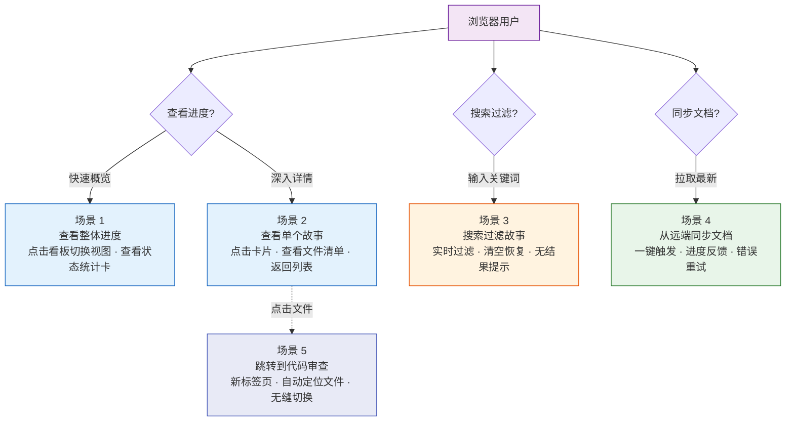
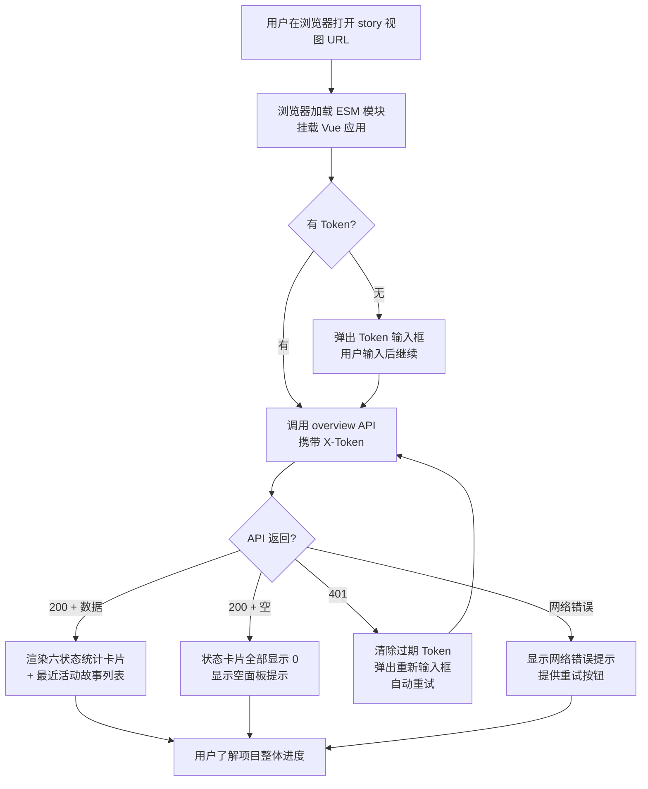
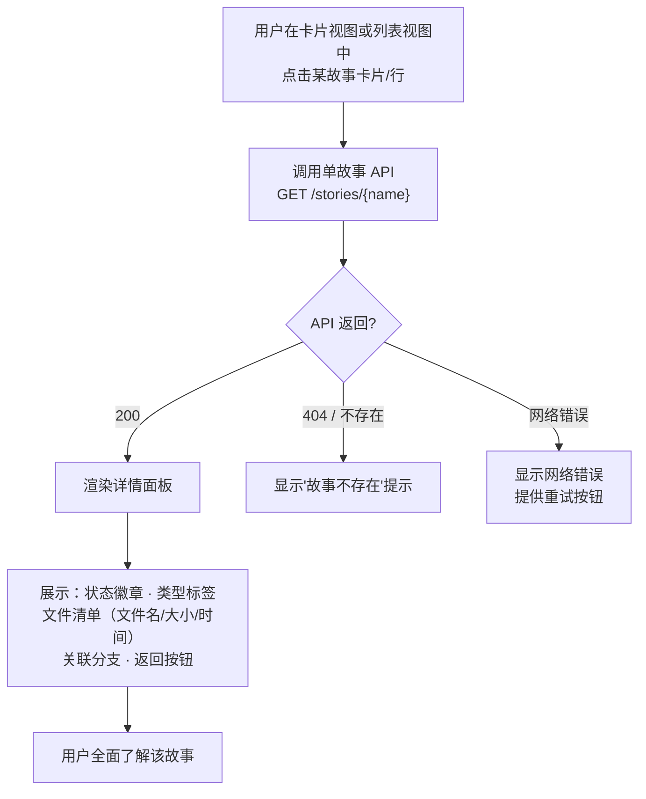
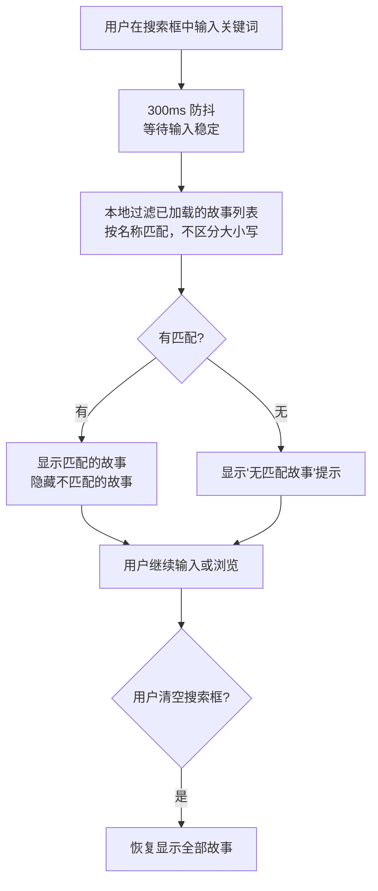
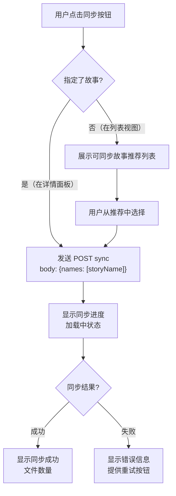
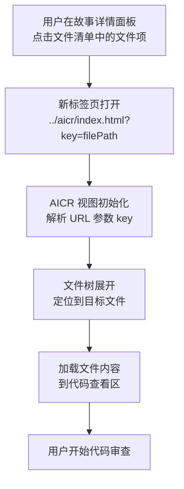

> | v1.0 | 2026-05-20 | claude-opus-4-7 | 自基线用户使用场景提取 YiWeb 维度 |

> **导航**: [← YiWeb-故事任务](./YiWeb-故事任务.md) · [YiWeb-测试设计 →](./YiWeb-测试设计.md)

> **来源引用**: 由基线[用户使用场景](./用户使用场景.md) Web UI 入口场景提取，结合 [YiWeb-产品说明](./YiWeb-产品说明.md) §6 体验基线。证据等级 B。

### 主要价值

- 🌐 以浏览器用户视角描述故事面板的完整交互流程 — 从打开面板到查看详情、搜索过滤、跨视图跳转，4 个场景全覆盖
- 🧪 每个场景覆盖正常路径、空状态和错误恢复 — 确保浏览器端边缘体验不遗漏
- 🎯 三种人物画像驱动场景设计 — 代码审查者、项目管理者、开发者各有核心旅程
- 🔗 双基线协同 — 每场景紧密映射 YiWeb-故事任务的 Story# 和 FP#

---

## §1 场景全景

YiWeb 故事面板提供纯浏览器入口，用户通过 URL 直接访问，无需命令行。

### 人物画像

| 人物画像 | 核心目标 | 主要操作 | 频率 |
|---------|---------|---------|------|
| 代码审查者 | 从故事面板快速跳转到代码审查视图 | 打开故事详情 → 点击文件 → AICR 审查 | 每日 |
| 项目管理者 | 快速了解故事分布和状态变化 | 打开面板 → 查看状态卡片 → 浏览列表 | 每周 |
| 开发者 | 浏览故事进度，按需同步文档 | 打开面板 → 搜索过滤 → 同步文档 | 按需 |

### 入口说明

| 入口 | 场景覆盖 | 说明 |
|------|---------|------|
| Web UI (YiWeb 故事面板) | 场景 1–5 | 浏览器界面，看板/卡片/列表三视图，搜索过滤，跨视图跳转 |

---

## §2 场景详述

### 场景 1: 查看项目整体进度

| 角色 | 触发条件 | 核心目标 | 关联产品需求 |
|------|---------|---------|---------|
| 项目管理者 | 打开浏览器，访问 story 视图 URL | 在极短时间内看到六状态统计卡片和最近活动故事列表 | YiWeb Story 1 · FP1 · FP6 |

| # | 步骤 | 输入 | 系统响应 | 异常分支 |
|---|------|------|---------|---------|
| 1 | 访问页面 | story 视图 URL | 浏览器加载 HTML → 加载入口 JS → 初始化 Vue 应用 → 等待组件注册完成 | CDN 不可达 → 显示组件加载失败提示 |
| 2 | Token 检查 | — | 从 localStorage 读取 Token | 无 Token → 弹出输入框，用户输入后存储并继续 |
| 3 | 获取数据 | — | 调用 overview API，携带 X-Token 头 | API 不可达 → 显示网络错误 + 重试按钮 |
| 4 | 渲染展示 | — | 渲染六状态计数卡片（not_started / docs_in_progress / docs_done / code_in_progress / code_done / blocked）+ 最近活动列表 | API 返回 401 → 清除过期 Token → 弹出重新输入 → 自动重试 |
| 5 | 视图切换 | 用户点击分段滑块（看板/卡片/列表） | 切换到目标视图模式，过渡动画 < 200ms | — |

---

### 场景 2: 查看单个故事详情

| 角色 | 触发条件 | 核心目标 | 关联产品需求 |
|------|---------|---------|---------|
| 代码审查者 / 项目管理者 | 需要深入了解某个特定故事的完整信息 | 看到该故事的所有文件、元数据、状态和关联分支的一体化详情面板 | YiWeb Story 3 · FP7 |

| # | 步骤 | 输入 | 系统响应 | 异常分支 |
|---|------|------|---------|---------|
| 1 | 点击故事 | 用户点击故事卡片或列表行 | 记录选中故事 → 调用单故事 API | — |
| 2 | 获取详情 | — | API 返回故事完整数据 | 故事不存在 → 显示错误提示 |
| 3 | 渲染详情面板 | — | 展示 StoryDetailCard：状态徽章、类型标签、文件清单（文件名 + 大小 + 修改时间）、关联分支、元数据 | 文件清单为空 → 显示"无文件" |
| 4 | 返回列表 | 用户点击返回按钮 | 关闭详情面板 → 恢复之前的视图模式（保持搜索过滤状态） | — |
| 5 | 跳转代码审查（可选） | 用户点击文件清单中的文件项 | 新标签页打开 AICR 视图，自动定位并加载目标文件 | AICR 视图不可达 → 浏览器显示标准错误页 |

---

### 场景 3: 搜索过滤故事

| 角色 | 触发条件 | 核心目标 | 关联产品需求 |
|------|---------|---------|---------|
| 开发者 / 项目管理者 | 在大量故事中快速定位目标故事 | 输入关键词后实时看到过滤结果 | YiWeb Story 5 · FP9 |

| # | 步骤 | 输入 | 系统响应 | 异常分支 |
|---|------|------|---------|---------|
| 1 | 输入关键词 | 用户在搜索框输入故事名称关键词 | 300ms 防抖后触发过滤 | — |
| 2 | 本地过滤 | — | 按故事名称匹配（不区分大小写），匹配项显示，不匹配项隐藏 | 无匹配 → 显示"无匹配故事"空结果提示 |
| 3 | 清空搜索 | 用户清空搜索框或点击清除按钮 | 立即恢复显示全部故事，保持当前视图模式和排序 | — |
| 4 | 持续输入 | 用户继续修改关键词 | 随输入实时更新过滤结果 | — |

---

### 场景 4: 从远端同步文档

| 角色 | 触发条件 | 核心目标 | 关联产品需求 |
|------|---------|---------|---------|
| 开发者 | 需要从远端知识库获取最新的故事文档 | 文档成功从远端同步到本地，或获知同步失败原因 | YiWeb Story 4 · FP8 |

| # | 步骤 | 输入 | 系统响应 | 异常分支 |
|---|------|------|---------|---------|
| 1 | 触发同步 | 用户在详情面板点击同步按钮，或在列表视图触发同步 | 判断是否有指定故事；有则直接发送请求，无则展示推荐列表 | — |
| 2 | 展示推荐 | — | 未指定时展示可同步故事列表，等待用户选择 | 无可同步故事 → 显示提示 |
| 3 | 发送请求 | — | POST sync 请求，显示加载中状态 | 网络故障 → 显示连接错误 + 重试按钮 |
| 4 | 展示结果 | — | 成功：显示同步文件数量；失败：显示具体错误原因 | 部分文件失败 → 列出失败项 |

---

### 场景 5: 跳转到代码审查视图

| 角色 | 触发条件 | 核心目标 | 关联产品需求 |
|------|---------|---------|---------|
| 代码审查者 | 在故事详情中看到需要审查的文件，想立即查看代码 | 无缝从故事面板跳转到 AICR 视图，自动定位目标文件 | YiWeb Story 6 · FP10 |

| # | 步骤 | 输入 | 系统响应 | 异常分支 |
|---|------|------|---------|---------|
| 1 | 点击文件 | 用户在故事详情面板文件清单中点击文件项 | 新标签页打开 `../aicr/index.html?key=filePath` | 浏览器拦截弹窗 → 用户需允许弹窗 |
| 2 | AICR 初始化 | filePath URL 参数 | AICR 视图解析 key 参数 → 文件树展开并定位到目标文件 → 加载文件内容 | 文件路径不存在 → AICR 视图显示文件未找到提示 |
| 3 | 开始审查 | 文件内容已加载 | 用户可在 AICR 视图中查看代码并发起 AI 对话 | AICR 视图不可达 → 浏览器显示标准 404 或网络错误页 |

---

## §3 场景覆盖矩阵

| 场景 | FP# | AC# | Web UI | 覆盖状态 | 备注 |
|------|-----|------|:---:|---------|------|
| 场景 1: 查看整体进度 | FP1, FP6 | AC1, AC2, AC3 | | 已覆盖 | 含空面板和 Token 缺失情况 |
| 场景 2: 查看单个故事详情 | FP7 | AC5, AC11 | | 已覆盖 | 含跨视图文件跳转 |
| 场景 3: 搜索过滤故事 | FP9 | AC4 | | 已覆盖 | 含无匹配结果 |
| 场景 4: 从远端同步文档 | FP8 | AC6 | | 已覆盖 | 含错误重试 |
| 场景 5: 跳转到代码审查 | FP10 | AC11 | | 已覆盖 | 跨视图导航 |

---

## §4 评审清单

| # | 检查项 | 状态 |
|---|--------|------|
| 1 | 场景数量 >= 5 | 5 个场景 |
| 2 | 每场景有流程图 | 每场景含 mermaid flowchart |
| 3 | FP# 全覆盖（FP1-FP10 中 Web UI 范围） | FP1, FP6, FP7, FP8, FP9, FP10 均有对应场景 |
| 4 | 异常分支明确 | 每场景步骤表含异常分支列 |
| 5 | 无技术术语 | |
| 6 | 每场景含空状态与错误恢复 | |
| 7 | 覆盖矩阵下游文档齐全 | 关联至 YiWeb-测试设计 |
| 8 | 双基线协作 — 每场景关联 YiWeb-故事任务 Story# | |

---

## §5 体验基线

参考 [YiWeb-产品说明](./YiWeb-产品说明.md) §6 体验基线，Web UI 场景需满足以下体验要求：

### 信息透明度

| 指标 | 目标 | 关联场景 |
|------|------|---------|
| 状态可见 | 打开面板后 3 秒内看到状态分布 | 场景 1 |
| 数据新鲜度 | 面板数据与远端同步，差异不超过 24h | 场景 1, 2 |
| 错误可见 | API 失败时明确显示错误信息和恢复建议 | 场景 1, 2, 4 |

### 交互效率

| 指标 | 目标 | 关联场景 |
|------|------|---------|
| 搜索响应 | 输入关键词后实时过滤，延迟 < 100ms | 场景 3 |
| 视图切换 | 看板/卡片/列表切换过渡动画 < 200ms | 场景 1 |
| 同步反馈 | 同步操作显示进度状态（加载中 / 成功 / 失败） | 场景 4 |

### 容错与恢复

| 指标 | 目标 | 关联场景 |
|------|------|---------|
| Token 过期恢复 | 弹出重新输入框，输入后重试原请求 | 场景 1, 2, 4 |
| 网络中断恢复 | 明确显示网络错误，支持重试 | 场景 1, 2, 4 |
| 空数据容错 | 无数据时显示空状态而非空白页 | 场景 1, 3 |
| 跨视图容错 | AICR 不可达时不阻塞故事面板 | 场景 5 |

### 人物画像体验基线

| 角色 | 核心旅程 | 情感目标 | 痛点解决 | 成功感知 | 关联场景 |
|------|---------|---------|---------|---------|---------|
| 项目管理者 | 查看项目进度 | 清晰掌控 — 一眼看清全局，不焦虑 | 不用逐个打开目录查看状态 | 看到六状态统计卡片，各数字一目了然 | 场景 1 |
| 代码审查者 | 从故事跳转到代码审查 | 无缝切换 — 不中断工作流 | 不用手动在文件树中查找文件 | 点击文件即在新标签页打开 AICR 并自动定位 | 场景 2, 5 |
| 开发者 | 搜索定位 + 同步文档 | 快速操作 — 一键完成，不用关心细节 | 大量故事中手动翻找效率低 | 输入关键词实时过滤 + 一键同步 | 场景 3, 4 |

---

## 变更记录

| 日期 | 变更 | 触发 | 证据 |
|------|------|------|------|
| 2026-05-20 | v1.0 初始生成 — 自基线用户使用场景提取 YiWeb 维度 | YiWeb 项目文档拆分 | 基线用户使用场景 §1-§5 · YiWeb-产品说明 §6 体验基线 |
