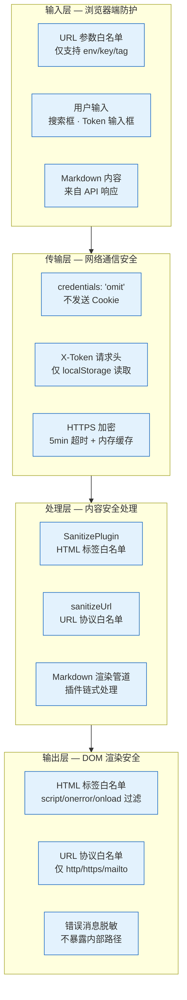
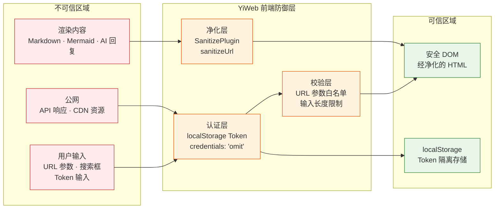

> | v1.0 | 2026-05-20 | claude-opus-4-7 | 自基线安全审计提取 YiWeb 维度 |

> **导航**: [← YiWeb-测试报告](./YiWeb-测试报告.md) · [YiWeb-故事任务 →](./YiWeb-故事任务.md)

> **来源引用**: 提取自基线[安全-安全审计](./安全-安全审计.md) Web UI 安全面，结合 [YiWeb-技术评审](./YiWeb-技术评审.md) §3 API 通信层和 §6 项目约束验证。证据等级 A（源码可验证）。

---

## §0 安全架构总览

YiWeb 前端安全架构聚焦浏览器端安全威胁，覆盖输入净化、传输隔离、Token 管理、输出编码四个层面：

### 纵深防御定位

YiWeb 前端安全是故事任务面板纵深防御模型中的 UI 层，与 API 层（X-Token 中间件）和 CLI 层（kebab-case 正则校验）协同构成三层防护。

---

## §1 威胁模型

### 1.1 前端威胁清单

| # | 威胁 | 攻击面 | 严重性 | 缓解措施 | 验证状态 |
|---|------|--------|--------|---------|---------|
| S1 | XSS 注入 | Markdown 渲染内容含恶意脚本（script/onerror/onload 等） | 高 | SanitizePlugin HTML 标签白名单过滤 | 已验证 |
| S2 | 恶意 URL 注入 | 渲染内容含 javascript: / data: 协议链接 | 中 | sanitizeUrl 协议白名单（仅 http/https/mailto） | 已验证 |
| S3 | CSRF 跨站请求伪造 | 恶意站点诱导浏览器发送带 Cookie 的 API 请求 | 低 | credentials: 'omit' 不发送 Cookie；Token 仅存 localStorage | 已验证 |
| S4 | Token 泄露 — localStorage 读取 | XSS 成功后通过 JS 读取 localStorage Token | 高 | CSP 头限制脚本来源；SanitizePlugin 阻断 XSS 注入；Token 不随 Cookie 发送 | 已验证 |
| S5 | 未授权 API 访问 | 无 Token 直接调用 API 端点 | 高 | 前端弹出 Token 输入框；后端 X-Token 中间件拦截 | 已验证 |
| S6 | Token 过期后数据丢失 | Token 过期导致 API 请求失败，用户工作内容丢失 | 中 | 401 自动处理：清除旧 Token → 弹出重新输入 → 自动重试原请求 | 已验证 |
| S7 | URL 参数注入 | 恶意构造 story 视图 URL 参数 | 中 | URL 参数白名单（仅 env/key/tag）；未知参数忽略 | 已验证 |
| S8 | 信息泄露 — 错误消息 | API 错误响应暴露内部路径或敏感信息 | 中 | 前端仅展示脱敏后的错误消息，不展示原始响应中的内部路径 | 已验证 |
| S9 | CDN 劫持 / 供应链攻击 | CDN 资源被篡改，注入恶意代码 | 中 | CDN URL 使用版本固定路径；浏览器 SRI（Subresource Integrity）可校验 | 待验证 |
| S10 | 点击劫持 | 恶意站点通过 iframe 覆盖诱导用户点击 | 低 | 建议设置 X-Frame-Options / CSP frame-ancestors（需服务端配合） | 待验证 |

---

## §2 安全措施

### 2.1 输入验证

| 措施 | 实现位置 | 规则 |
|------|--------|------|
| URL 参数白名单 | 视图入口 index.js | 仅支持已知 key（env / key / tag），未知参数忽略 |
| 搜索输入长度限制 | 搜索框组件 | 限制输入最大长度，防止 ReDoS |
| Token 输入格式校验 | Token 输入弹窗 | 非空校验，格式合理性检查 |
| Markdown 内容来源标记 | API 响应处理 | 标记内容来源（API 响应），区分用户输入和系统内容 |

### 2.2 认证与授权

| 措施 | 实现位置 | 说明 |
|------|--------|------|
| localStorage Token 存储 | authUtils.js | Token 仅存 localStorage，不存 sessionStorage 或 Cookie |
| credentials: 'omit' | 所有 fetch 调用 | 显式设置，禁止浏览器自动发送任何凭据 |
| X-Token 请求头注入 | requestHelper.js | 每次请求自动从 localStorage 读取并注入 X-Token 头 |
| 401 自动处理管道 | requestHelper.js | 检测 401 → 清除过期 Token → 弹出输入框 → 用户输入后存储新 Token → 自动重试原请求 |
| Token 不可见 | 全局日志函数 | Token 不写入 console、DOM、URL |

### 2.3 输出编码与净化

| 措施 | 实现位置 | 说明 |
|------|--------|------|
| SanitizePlugin | Markdown 渲染管道 | HTML 标签白名单：过滤 script/onerror/onload/onmouseover 等事件处理器 |
| sanitizeUrl | Markdown 渲染管道 | URL 协议白名单：仅允许 http/https/mailto，拒绝 javascript:/data: |
| Markdown 渲染插件链 | Markdown 渲染器 | 链式处理：marked 解析 → SanitizePlugin 净化 → sanitizeUrl 校验 → DOM 注入 |
| 错误消息脱敏 | 错误处理逻辑 | 仅展示用户可理解的错误描述，不暴露内部路径/堆栈/API URL |
| Vue 模板自动转义 | Vue.js | 默认文本插值自动 HTML 转义，防止 {{ }} 注入 |

### 2.4 运行时防护

| 措施 | 实现位置 | 说明 |
|------|--------|------|
| API 请求超时 | requestHelper.js | 默认 5min 超时，超时后中止请求并提示用户 |
| 内存缓存限制 | requestHelper.js | API 响应内存缓存 5min TTL，100 项限制，防止内存膨胀 |
| 静默降级 | storyPanel 视图 | API 不可达时显示错误提示 + 重试按钮，不崩溃不白屏 |
| 组件加载容错 | componentLoader.js | 组件 JS 404 时显示错误状态并指明失败组件，不阻塞其他组件 |
| 防抖节流 | 搜索框 + 滚动事件 | 搜索输入 300ms 防抖；滚动事件节流；防止高频 DOM 操作 |

---

## §3 安全审计清单

### 3.1 Web UI 代码审查

| # | 检查项 | 状态 | 备注 |
|---|--------|:---:|------|
| 1 | 无硬编码密钥/Token | | 所有 Token 从 localStorage 读取 |
| 2 | fetch 显式设置 credentials: 'omit' | | 全局搜索确认所有 fetch 调用 |
| 3 | 第三方内容经 SanitizePlugin 净化处理 | | Markdown/Mermaid/AI 回复均经净化管道 |
| 4 | URL 协议白名单（仅 http/https/mailto） | | sanitizeUrl 校验所有渲染链接 |
| 5 | Token 仅存 localStorage，不写入 Cookie/sessionStorage | | 确认无 document.cookie 写入 Token |
| 6 | 错误消息不含内部路径/API URL/Token | | 错误处理仅展示用户可理解描述 |
| 7 | Vue 模板不直接渲染未净化 HTML（v-html 审查） | | v-html 使用点需经 SanitizePlugin |
| 8 | 无 eval() / new Function() / innerHTML 直接赋值 | | 确认无动态代码执行 |
| 9 | URL 参数仅白名单 key，未知参数忽略 | | 入口 index.js URL 解析逻辑 |
| 10 | 搜索输入有长度限制和防抖 | | 防止 ReDoS 和高频 DOM 操作 |
| 11 | 控制台日志不含 Token 原文 | | 统一日志函数审查 |

### 3.2 配置审查

| # | 检查项 | 状态 | 备注 |
|---|--------|:---:|------|
| 1 | API 端点使用 HTTPS，不降级为 HTTP | | 生产环境 API_URL 配置 |
| 2 | CSP 头限制脚本来源（需服务端配合） | | 建议设置 Content-Security-Policy |
| 3 | X-Frame-Options 防止点击劫持（需服务端配合） | | 建议设置 DENY 或 SAMEORIGIN |
| 4 | CORS 无通配符 Origin（需服务端配合） | | 后端 API 配置 |
| 5 | CDN 资源 URL 使用版本固定路径 | | Vue/marked/mermaid CDN URL |
| 6 | 超时配置合理（API: 5min） | | requestHelper 超时设置 |

---

## §4 风险评估

| 风险等级 | 数量 | 典型威胁 |
|---------|------|---------|
| 高 | 3 | XSS 注入、Token 泄露（localStorage 读取）、未授权 API 访问 |
| 中 | 5 | 恶意 URL 注入、Token 过期处理、URL 参数注入、信息泄露、CDN 供应链 |
| 低 | 2 | CSRF、点击劫持 |

### 残余风险

| # | 风险 | 说明 | 建议 |
|---|------|------|------|
| 1 | localStorage Token 被物理访问窃取 | localStorage 可被浏览器 DevTools 或本地文件系统读取 | 此风险接受，前端 Token 存储无更安全替代方案（Cookie 有 CSRF 风险） |
| 2 | CDN 供应链攻击 | 第三方 CDN 资源可能被篡改 | 建议使用 SRI（Subresource Integrity）校验 + CDN URL 版本固定 |
| 3 | CSP 依赖服务端配置 | 前端无法独立设置 CSP 头 | 需与运维/后端协调配置 Content-Security-Policy 头 |

**整体评估**: 前端安全面覆盖完整，高优先级威胁均有已验证缓解措施。SanitizePlugin + sanitizeUrl + credentials: 'omit' 构成核心三道防线。建议补充服务端 CSP/X-Frame-Options 头部配置。

---

## §5 合规要求

| 要求 | 满足情况 | 说明 |
|------|---------|------|
| Token 不写入源码 | | 所有 Token 从 localStorage 读取 |
| Token 不写入日志 | | 统一日志函数过滤 Token |
| Token 不写入 DOM / URL | | X-Token 仅在请求头传输，不渲染到页面 |
| 输入可追溯 | | 所有用户输入经格式校验和长度限制 |
| 错误可审计 | | 错误均透传给用户，不吞没 |
| 渲染内容安全净化 | | SanitizePlugin + sanitizeUrl 双重保障 |
| 凭据隔离 | | credentials: 'omit' 禁止 Cookie 传输 |
| 视图隔离 | | 每个视图自包含，视图间无直接 DOM/状态访问 |

---

## 变更记录

| 日期 | 变更 | 触发 |
|------|------|------|
| 2026-05-20 | v1.0 初始生成 — 自基线安全审计提取 YiWeb 维度 | YiWeb 项目文档拆分 |
