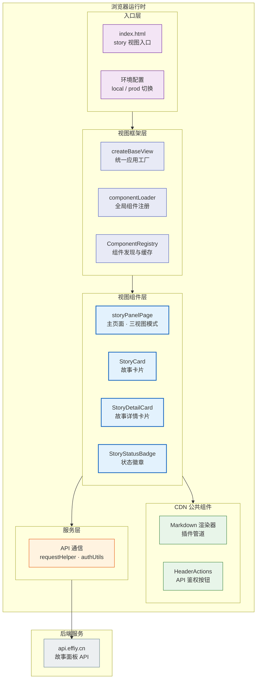
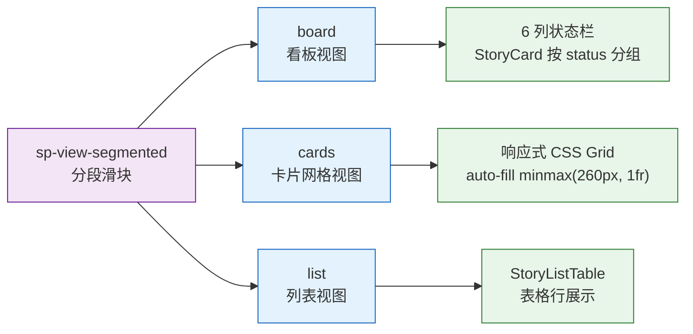
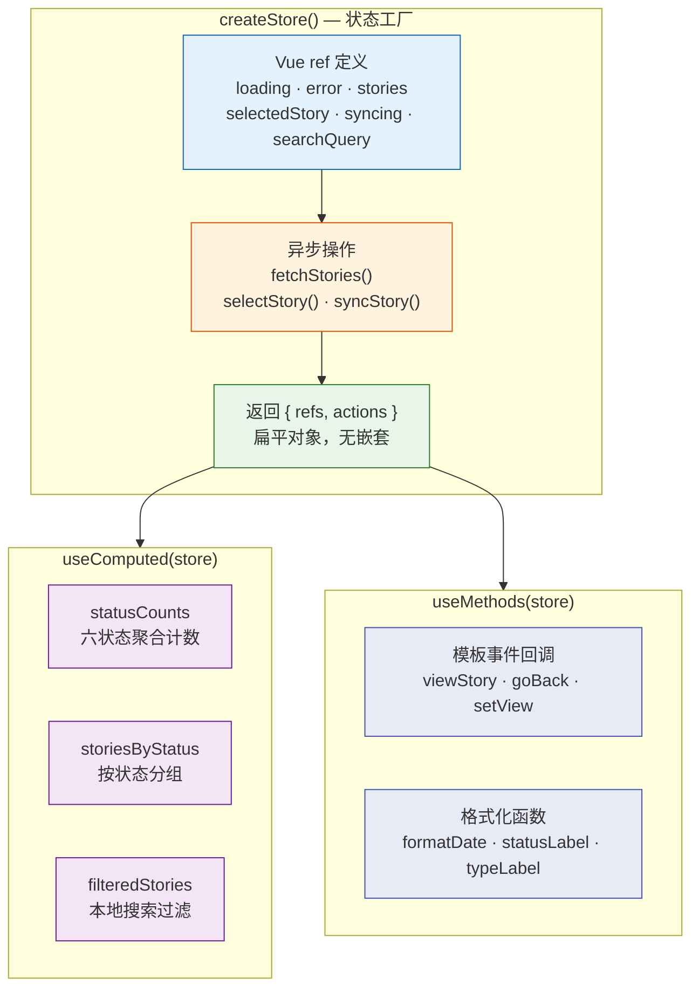
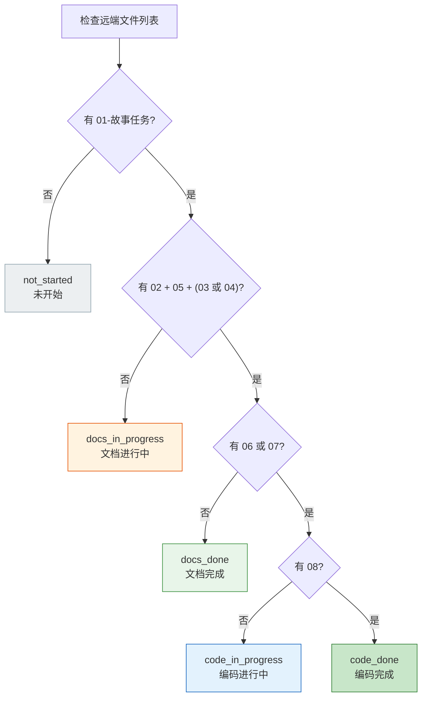
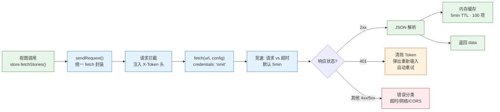
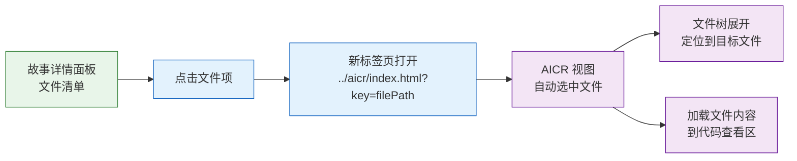

> | v2.0 | 2026-05-19 | deepseek-v4-pro | 重构自 YiWeb-04 |

> **导航**: [← YiWeb-产品说明](./YiWeb-产品说明.md) · [测试-测试设计 →](./测试-测试设计.md)

> **来源引用**: 由产品-故事任务 §1 Story 驱动。证据等级 A（源码可验证）。

---

## §0 架构全景

故事任务面板前端（YiWeb storyPanel 视图）是 YiWeb 应用中的独立视图，提供浏览器端的故事管理体验，通过远端 API 查询和同步故事任务。

---

## §1 视图架构

### 1.1 视图工厂模式

story 视图使用自研 `createBaseView` 函数作为统一的视图工厂，语义类似 Vue Options API：

```mermaid
flowchart LR
    subgraph 输入["createBaseView 配置"]
        Store["createStore<br/>响应式状态工厂"]:::in
        Computed["useComputed<br/>计算属性"]:::in
        Methods["useMethods<br/>方法集合"]:::in
        Comps["components<br/>组件名列表"]:::in
        Modules["componentModules<br/>组件 JS 路径"]:::in
        Mounted["onMounted<br/>挂载回调"]:::in
    end

    subgraph 处理["视图工厂处理"]
        Wait["轮询等待组件注册<br/>超时 60s"]:::proc
        Create["Vue.createApp<br/>创建应用实例"]:::proc
        Mount["mount('#app')<br/>挂载到 DOM"]:::proc
    end

    subgraph 输出["运行时产物"]
        App["window.storyApp"]:::out
        StoreObj["window.storyStore<br/>全局可访问的 store"]:::out
    end

    输入 --> Wait --> Create --> Mount --> 输出

    classDef in fill:#e3f2fd,stroke:#1565c0;
    classDef proc fill:#fff3e0,stroke:#e65100;
    classDef out fill:#e8f5e9,stroke:#2e7d32;
```

| 配置项 | 类型 | 说明 |
|------|------|------|
| `createStore` | `() => store` | 返回包含 ref 和方法的 store 对象 |
| `useComputed` | `(store) => computed` | 返回计算属性集合 |
| `useMethods` | `(store) => methods` | 返回方法集合 |
| `components` | `string[]` | 模板中使用的组件名列表（PascalCase） |
| `componentModules` | `string[]` | 对应组件 JS 文件的 CDN/本地路径 |
| `onMounted` | `() => void` | 应用挂载后回调，触发初始数据加载 |

### 1.2 故事面板三视图模式

使用分段滑块控件平铺展示三种视图模式，点击即切：

| 视图模式 | viewMode 值 | 布局方式 | 适用场景 |
|---------|------------|---------|---------|
| 看板 | `board` | 6 列 CSS Grid（按 status 分组） | 关注流程进度 |
| 卡片网格 | `cards` | 响应式 auto-fill grid（260px 最小列宽） | 快速浏览、空间紧凑 |
| 列表 | `list` | 单列表格 | 按列排序、批量对比 |

**响应式断点**：6 列 → 3 列（<1400px）→ 2 列（<800px）

### 1.3 组件清单

| 组件 | 类别 | 职责 |
|------|------|------|
| StoryPanelPage | 视图业务组件 | 主页面容器：三视图切换、搜索过滤、数据加载状态 |
| StoryCard | 视图业务组件 | 故事卡片：名称、状态徽章、类型标签、文件数、修改时间 |
| StoryDetailCard | 视图业务组件 | 故事详情面板：文件清单、元数据、跨视图文件导航 |
| StoryStatusBadge | 视图业务组件 | 状态徽章：六状态色彩编码 |
| StoryListTable | 视图业务组件 | 列表视图：六列表格 |

---

## §2 状态管理

### 2.1 Store 工厂模式

| 约束 | 规则 |
|------|------|
| 单向数据流 | 组件事件 → methods → store mutation → computed 重算 → DOM 更新 |
| ref 只读 | 组件禁止直接修改 ref，所有变更走 store 方法 |
| computed 无副作用 | 计算属性仅读取状态，不触发 API 调用或 DOM 操作 |
| API 调用隔离 | 网络请求仅在 store actions 中执行 |

### 2.2 六状态判定（前端独立实现）

前端的六状态判定逻辑与后端/CLI 保持一致，基于远端 API 返回的文件列表推断：

---

## §3 API 通信层

### 3.1 请求管道

### 3.2 API 端点契约

| 端点 | 方法 | 用途 | 认证 |
|------|------|------|:---:|
| `{API_URL}/api/story-panel/overview` | GET | 状态概览 | X-Token |
| `{API_URL}/api/story-panel/stories` | GET | 进度全景列表 | X-Token |
| `{API_URL}/api/story-panel/stories/{name}` | GET | 单故事详情 | X-Token |
| `{API_URL}/api/story-panel/stories/sync` | POST | 文档同步 | X-Token |
| `{API_URL}/api/story-panel/remote` | GET | 远端故事查询 | X-Token |
| `{API_URL}/api/story-panel/help` | GET | 帮助信息 | X-Token |

---

## §4 跨视图导航

故事详情面板中的文件清单支持点击跳转到代码审查视图：

---

## §5 性能策略

| 策略 | 实现 | 效果 |
|------|------|------|
| 零构建 | 无编译/打包，浏览器原生加载 ESM | 消除构建时间 |
| CDN 缓存 | Vue、marked、mermaid 等 CDN 加载 | 利用浏览器缓存 + CDN 边缘节点 |
| 模板缓存 | HTML 模板内存 + localStorage 缓存 | 组件二次加载瞬间完成 |
| API 缓存 | 内存缓存 5min TTL，100 项限制 | 减少重复请求 |
| 防抖节流 | 搜索输入 300ms 防抖；滚动事件节流 | 减少不必要的计算和渲染 |
| 懒加载 | 非首屏组件按需加载 | 减少初始 JS 解析量 |
| GPU 加速 | CSS transform3d + will-change | 动画 60fps |
| 减少动画 | prefers-reduced-motion 时将动画时长设为 0ms | 无障碍 + 性能双赢 |

---

## §6 项目约束验证

| # | 约束 | 验证方式 | 状态 |
|---|------|---------|:---:|
| 1 | 零构建链 — 无 transpile/bundle/dev server | 检查项目无 package.json | |
| 2 | 无外部包管理 — 无 npm 依赖 | 检查无 node_modules | |
| 3 | 浏览器安全 — credentials: 'omit' | 全局搜索 fetch 调用 | |
| 4 | 视图隔离 — 每个视图自包含 | 检查 src/views/story/ 目录结构 | |
| 5 | 配置即环境 — local/prod 切换 | config.js 仅两环境 | |
| 6 | 状态变更走 store — 不跨组件改 ref | 代码审查 | |
| 7 | 统一日志 — 使用统一的日志函数 | 全局搜索 console.log | |

---

## §7 跨文档索引

| 方向 | 文档 |
|------|------|
| 产品需求基线 | 产品-故事任务 — §1 Story |
| 用户场景基线 | 产品-用户使用场景 — §2 场景 |
| 测试验证 | 测试-测试设计 — 前端用例 |
| 安全约束 | 安全-安全审计 — 前端安全面 |

---

> **变更记录**: v2.0 角色化重构 — 自 YiWeb-04 提取故事面板前端架构，去除项目前缀
