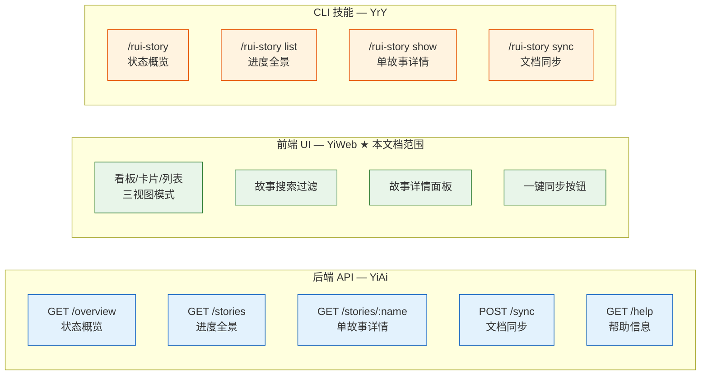
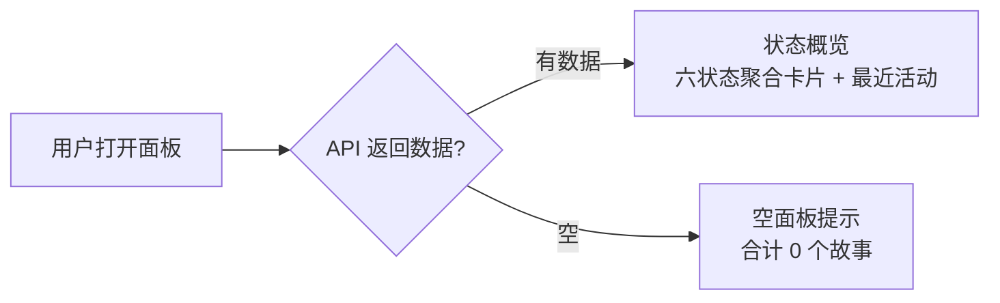
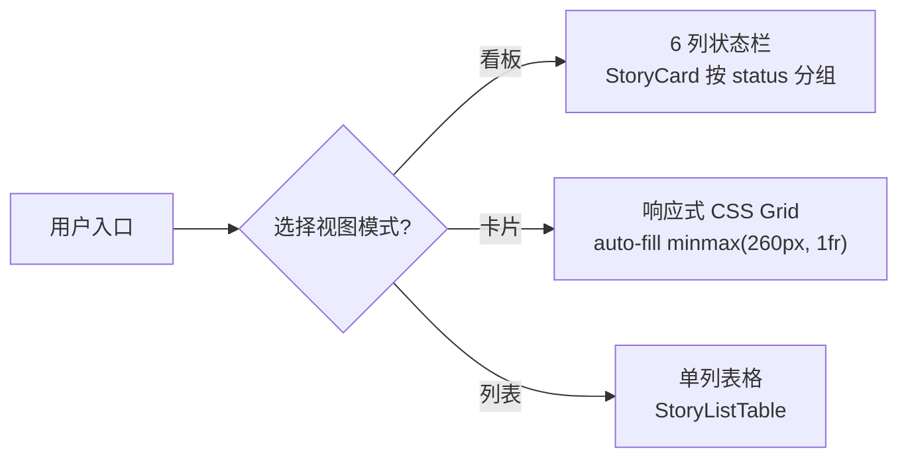
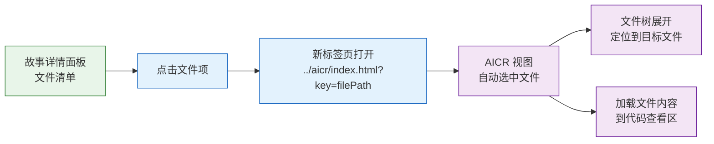

> | v1.0 | 2026-05-20 | claude-opus-4-7 | 自基线故事任务提取 YiWeb 维度 |

> **导航**: [YiWeb-使用场景 →](./YiWeb-使用场景.md)

> **来源引用**: 由基线[故事任务](./故事任务.md) Story 1-3 前端 UI 维度驱动，结合 [YiWeb-产品说明](./YiWeb-产品说明.md) §1 Story 1-6。证据等级 B。

### 需求概述

YiWeb 前端 storyPanel 视图提供浏览器端的故事管理体验。采用零构建架构（浏览器原生 ESM），支持看板/卡片/列表三种视图模式，通过远端 API 查询故事状态、搜索过滤故事、查看故事详情，以及从远端知识库同步文档。

核心约束：只做查询和同步，不创建文档内容、不修改源码、不操作 git 分支。

### 主要价值

- ⚡ 零构建前端架构 — 浏览器原生 ESM，无编译/打包/构建工具链
- 🎨 三视图模式 — 看板（6 列状态栏）、卡片（响应式网格）、列表（表格），一键切换
- 🔗 跨视图导航 — 故事详情文件清单可跳转到 AICR 代码审查视图并自动定位文件
- 🔐 API 安全层 — Token 认证、凭据隔离、输入净化、401 自动处理
- 🧱 视图隔离 — storyPanel 视图自包含（模板 + 逻辑 + 样式），零耦合

---

## §1 Story

### 实现维度定位

故事任务面板通过三个维度实现完整的故事管理体验，YiWeb 负责前端 UI 维度：

### Story 1: 状态概览 UI

| 字段 | 内容 |
|------|------|
| 作为 | 项目参与者（浏览器用户） |
| 我想要 | 在浏览器中打开故事面板后，一眼看到所有故事按六状态分类的统计卡片和最近活动 |
| 以便 | 无需命令行即可快速判断项目整体进度 |
| 优先级 | P0 |
| 范围边界 | 前端渲染与交互，数据来源于远端 API `/api/story-panel/overview` |
| 依赖 | 远端 API 可达，有效 Token |

#### §1.1 User Operations

| # | 操作 | 触发条件 | 操作步骤 | 预期结果 |
|---|------|---------|---------|---------|
| 1 | 查看状态概览 | 用户打开 story 视图 URL | 浏览器加载 ESM 模块 → 挂载 Vue 应用 → 调用 overview API → 渲染六状态统计卡片 + 最近活动列表 | 显示六状态计数卡片和最近修改的故事列表 |
| 2 | 空面板查看 | 远端无故事数据 | 同上流程 → API 返回 total=0 | 状态卡片全部显示 0，显示空状态提示，不崩溃 |

---

### Story 2: 进度全景列表

| 字段 | 内容 |
|------|------|
| 作为 | 项目参与者（浏览器用户） |
| 我想要 | 在一个视图中浏览所有故事的完整信息表格，支持按时间排序 |
| 以便 | 快速对比各故事进度，决定工作优先级 |
| 优先级 | P0 |
| 范围边界 | 前端表格渲染，支持卡片网格和列表两种展示模式 |
| 依赖 | 远端 API `/api/story-panel/stories` 可达 |

#### §1.1 User Operations

| # | 操作 | 触发条件 | 操作步骤 | 预期结果 |
|---|------|---------|---------|---------|
| 1 | 浏览进度全景 | 用户打开面板或切换到卡片/列表视图 | 调用 stories API → 获取全量故事数据 → 按时间降序排列 → 渲染卡片网格或列表表格 | 所有故事以卡片或表格形式展示，含 Story/Status/Files/Last Modified/Type/Branch 信息 |
| 2 | 切换视图模式 | 用户点击分段滑块切换看板/卡片/列表 | 更新 viewMode 状态 → 重新布局渲染 | 视图平滑切换到目标模式，过渡动画 < 200ms |

---

### Story 3: 单故事详情面板

| 字段 | 内容 |
|------|------|
| 作为 | 项目参与者（浏览器用户） |
| 我想要 | 点击故事卡片后查看该故事的完整信息（文件清单、状态、元数据、关联分支） |
| 以便 | 深入了解特定故事的当前状况，决定下一步行动 |
| 优先级 | P1 |
| 范围边界 | 前端详情卡片渲染，数据来源于远端 API `/api/story-panel/stories/{name}` |
| 依赖 | 故事在远端存在 |

#### §1.1 User Operations

| # | 操作 | 触发条件 | 操作步骤 | 预期结果 |
|---|------|---------|---------|---------|
| 1 | 查看故事详情 | 用户点击故事卡片或列表行 | 调用单故事 API → 渲染详情卡片：状态徽章、类型标签、文件清单（含文件名/大小/时间）、关联分支、返回按钮 | 详情卡片展示故事全部信息 |
| 2 | 返回列表 | 用户点击返回按钮 | 关闭详情面板 → 恢复列表/卡片视图 | 返回之前的视图模式，保持搜索过滤状态 |
| 3 | 故事不存在 | 用户操作触发不存在的故事查询 | API 返回 1004 | 显示"故事不存在"错误提示 |

---

### Story 4: 文档同步 UI

| 字段 | 内容 |
|------|------|
| 作为 | 项目参与者（浏览器用户） |
| 我想要 | 在浏览器中一键触发从远端知识库同步故事文档 |
| 以便 | 不依赖命令行即可保持本地文档与远端同步 |
| 优先级 | P1 |
| 范围边界 | 前端触发同步请求并展示结果，实际同步逻辑委托后端/同步程序 |
| 依赖 | 远端 API `/api/story-panel/stories/sync` 可达，同步程序可用 |

#### §1.1 User Operations

| # | 操作 | 触发条件 | 操作步骤 | 预期结果 |
|---|------|---------|---------|---------|
| 1 | 同步指定故事 | 用户在详情面板点击同步按钮 | 发送 POST sync 请求 → 显示同步进度（加载中）→ 显示同步结果（成功/失败） | 显示同步成功及文件数量，或失败原因 |
| 2 | 查看同步推荐 | 用户从未指定故事的入口触发同步 | 展示可同步故事推荐列表 → 用户选择后执行同步 | 用户从推荐中选择后执行同步 |
| 3 | 同步失败处理 | 网络故障或同步程序异常 | 显示错误信息 → 提供重试按钮 | 错误透传，不吞没 |

---

### Story 5: 搜索过滤

| 字段 | 内容 |
|------|------|
| 作为 | 项目参与者（浏览器用户） |
| 我想要 | 在搜索框中输入关键词实时过滤故事列表 |
| 以便 | 在大量故事中快速定位目标 |
| 优先级 | P1 |
| 范围边界 | 纯前端本地过滤，基于已加载的故事数据 |
| 依赖 | 故事列表数据已加载 |

#### §1.1 User Operations

| # | 操作 | 触发条件 | 操作步骤 | 预期结果 |
|---|------|---------|---------|---------|
| 1 | 搜索过滤 | 用户在搜索框输入故事名称关键词 | 实时过滤故事列表（300ms 防抖），不区分大小写 | 匹配项显示，不匹配项隐藏 |
| 2 | 清空搜索 | 用户清空搜索框 | 恢复显示全部故事 | 列表恢复完整状态 |
| 3 | 无匹配结果 | 关键词无匹配 | 显示空结果提示 | 显示"无匹配故事"提示 |

---

### Story 6: 跨视图导航

| 字段 | 内容 |
|------|------|
| 作为 | 项目参与者（浏览器用户） |
| 我想要 | 从故事详情面板的文件清单中点击文件，直接跳转到代码审查视图并自动定位该文件 |
| 以便 | 无缝切换从"了解故事"到"审查代码"，不中断工作流 |
| 优先级 | P1 |
| 范围边界 | 前端跨视图 URL 参数传递，AICR 视图接收 key 参数并自动定位 |
| 依赖 | AICR 视图已部署，文件树支持 URL 参数定位 |

#### §1.1 User Operations

| # | 操作 | 触发条件 | 操作步骤 | 预期结果 |
|---|------|---------|---------|---------|
| 1 | 从故事详情跳转到代码审查 | 用户点击详情面板文件清单中的文件项 | 新标签页打开 `../aicr/index.html?key=filePath` → AICR 视图解析 key 参数 → 文件树展开定位 → 加载文件内容到代码查看区 | AICR 视图自动选中并加载目标文件 |

---

## §2 Requirements

### 功能点

| FP# | 描述 | 输入 | 输出 | 错误行为 | 优先级 |
|-----|------|------|------|---------|--------|
| FP1 | 视图初始化 — 加载视图入口并在浏览器中挂载 Vue 应用 | 视图 URL | Vue 应用挂载到 #app，无 JS 错误 | 组件加载失败时显示错误状态 | P0 |
| FP2 | 组件注册 — 全局注册通用组件（CDN），视图注册业务组件 | 组件名列表 + JS 路径 | 组件就绪可渲染 | 组件 JS 404 时显示错误并指明失败组件 | P0 |
| FP3 | Markdown 渲染 — 将 Markdown 文本转为安全 HTML（经 SanitizePlugin 净化） | Markdown 文本 | 安全 HTML，script/onerror/javascript: 协议均过滤 | 渲染异常时显示原始文本 | P0 |
| FP4 | Token 认证 — 从 localStorage 读取 Token 并自动附加到请求头 | 无 | X-Token 请求头自动注入 | Token 不存在时弹出输入框 | P0 |
| FP5 | 401 处理 — 检测 401 响应并引导用户重新认证 | 401 响应 | 清除旧 Token → 弹出输入框 → 输入后自动重试 | Token 仍无效时给出明确提示 | P1 |
| FP6 | 状态概览渲染 — 调用 overview API 并渲染六状态统计卡片 | API 数据 | 六状态计数卡片 + 最近活动列表 | API 失败时显示网络错误 + 重试按钮 | P1 |
| FP7 | 故事列表渲染 — 调用 stories API 并渲染卡片/列表视图 | API 数据 | 故事卡片网格或列表表格，按时间降序 | API 失败时显示错误提示 | P1 |
| FP8 | 文档同步触发 — 发送同步请求并展示进度与结果 | 故事名称（可选） | 同步进度状态 + 成功/失败结果 | 同步失败时显示错误信息 + 重试按钮 | P1 |
| FP9 | 搜索过滤 — 本地实时过滤已加载的故事列表 | 搜索关键词 | 过滤后的故事列表，300ms 防抖 | 无匹配时显示空结果提示 | P1 |
| FP10 | 跨视图跳转 — 从故事详情跳转到 AICR 视图并自动定位文件 | 文件路径 | 新标签页打开 AICR 视图并定位文件 | AICR 视图不可达时浏览器显示标准错误页 | P1 |

---

## §3 成功标准

| SC# | 描述 | 度量方式 | 目标值 | 优先级 | 关联 FP# |
|-----|------|---------|--------|--------|---------|
| SC1 | 用户可在浏览器中快速看到项目全部故事的状态分布 | 从打开页面到状态卡片渲染完成的时间 | ≤ 3 秒（4G 网络） | P0 | FP1, FP6 |
| SC2 | 用户可在一屏内浏览所有故事的完整进度信息 | 卡片网格或列表表格包含全部字段且每故事占一个展示单元 | 全部覆盖 | P0 | FP7 |
| SC3 | 用户能准确查看单个故事的完整信息和文件清单 | 详情面板包含文件清单、状态徽章、类型、关联分支 | 全部字段有值或明确标注"无" | P1 | FP7 |
| SC4 | 用户可通过一键操作从远端同步文档 | 点击同步按钮到结果展示 | ≤ 30 秒（取决于同步程序） | P1 | FP8 |
| SC5 | 用户在搜索框输入关键词后可实时看到过滤结果 | 输入到过滤结果显示的延迟 | < 100ms | P1 | FP9 |
| SC6 | 用户点击文件项可跳转到代码审查视图并自动定位 | 新标签页打开 → 文件定位成功 | 定位准确率 100% | P1 | FP10 |
| SC7 | XSS 净化通过率 — 所有渲染内容经过安全净化 | SanitizePlugin 覆盖全部渲染路径 | 100% | P0 | FP3 |
| SC8 | Token 过期后用户可无缝重新认证并自动重试 | 401 → 重新输入 → 重试成功 | 100% 恢复率 | P0 | FP4, FP5 |

---

## §4 范围边界

### 范围内

| # | 条目 | 关联 FP# | 边界说明 |
|---|------|---------|---------|
| 1 | 故事面板视图渲染（看板/卡片/列表） | FP1, FP6, FP7 | 三视图模式切换，响应式布局 |
| 2 | 故事搜索与过滤 | FP9 | 纯前端本地过滤，实时防抖 |
| 3 | 故事详情面板 | FP7 | 状态徽章、文件清单、元数据、关联分支 |
| 4 | 文档同步 UI | FP8 | 触发同步请求 + 展示进度与结果 |
| 5 | API 通信与 Token 管理 | FP4, FP5 | localStorage Token，401 自动处理 |
| 6 | Markdown 安全渲染 | FP3 | SanitizePlugin 净化管道 |
| 7 | 跨视图文件导航 | FP10 | URL 参数传递 + AICR 视图文件定位 |
| 8 | 组件注册与加载 | FP2 | CDN 组件 + 视图业务组件 |

### 范围外

| # | 条目 | 排除原因 | 替代方案 |
|---|------|---------|---------|
| 1 | 故事文档内容创建/修改 | 文档生成是后端管线的职责 | 使用 CLI 命令或后端 API |
| 2 | 源码修改 | 源码变更是代码管线的职责 | 使用代码实现命令 |
| 3 | 创建或切换 git 分支 | 分支管理是代码管线的职责 | 使用 git 命令 |
| 4 | 批量操作多个故事 | 操作设计为单故事原子操作 | 逐个执行 |
| 5 | 故事间依赖分析 | 超出面板管理范围 | 查看文档 §1 Story 依赖字段 |
| 6 | 状态判定后端逻辑 | 前端仅消费 API 返回的状态值 | 后端 API 负责状态判定 |
| 7 | 文档同步底层实现 | 前端仅触发和展示结果 | 后端/同步程序负责实际同步 |
| 8 | 编译/打包/构建工具链 | 零构建架构约束 | 浏览器原生 ESM |

---

## §5 AC

| AC# | Given | When | Then | 门禁 |
|-----|-------|------|------|------|
| AC1 | 浏览器支持 ESM；CDN 可访问 | 用户访问 story 视图 URL | Vue 应用挂载到 #app；无 JS 错误；状态卡片和故事列表正常渲染 | Gate A |
| AC2 | 有效 Token；API 可达 | 用户打开故事面板 | 六状态统计卡片显示正确计数；故事列表按时间降序排列 | Gate A |
| AC3 | 远端无 storyPanel 相关数据 | 用户打开故事面板 | 状态卡片全部显示 0；空状态提示显示；页面不崩溃 | Gate A |
| AC4 | 故事列表已加载 | 用户在搜索框输入故事名称关键词 | 实时过滤匹配项；清空后恢复全部；不区分大小写 | Gate A |
| AC5 | 故事列表已加载 | 用户点击某故事卡片 | 详情面板：状态徽章、类型标签、文件清单（文件名+修改时间）、返回按钮 | Gate A |
| AC6 | 指定故事存在于远端 | 用户点击同步按钮 | 显示同步进度（加载中）→ 同步完成后显示成功结果及文件数量 | Gate B |
| AC7 | 远端 API 不可达 | 用户打开故事面板 | 显示网络错误提示；提供重试按钮；页面不白屏 | Gate A |
| AC8 | localStorage 无 Token | 用户发起 API 请求 | 弹出 Token 输入框；不静默失败 | Gate A |
| AC9 | localStorage 有过期 Token | 请求收到 401 → 用户输入新 Token | 旧 Token 清除；弹出输入框；输入后自动重试成功 | Gate A |
| AC10 | Markdown 含 XSS 注入内容 | 渲染该内容 | script/onerror/javascript: 协议均被过滤 | Gate A |
| AC11 | 用户在故事详情面板 | 用户点击文件清单中的文件项 | 新标签页打开 AICR 视图并自动定位到目标文件 | Gate B |

---

## §6 风险与假设

| # | 风险/假设 | 类型 | 可能性 | 影响 | 缓解/验证策略 | 关联 FP# |
|---|----------|------|--------|------|-------------|---------|
| 1 | CDN 不可达导致 Vue/marked/mermaid 等核心库加载失败 | 风险 | M | H | 组件加载失败时显示明确错误状态，指明失败组件名 | FP1, FP2 |
| 2 | 远端 API 不可达导致面板无数据 | 风险 | M | H | 显示错误提示 + 重试按钮，不白屏；静默降级 | FP6, FP7 |
| 3 | Token 存储在 localStorage 可能被 XSS 窃取 | 风险 | L | H | CSP 头限制脚本来源；SanitizePlugin 净化所有渲染内容；credentials: 'omit' | FP4 |
| 4 | 浏览器兼容性差异导致 ESM 加载或 CSS 布局异常 | 风险 | L | M | 明确浏览器支持范围（Chrome 80+ / Firefox 80+ / Safari 14+ / Edge 80+） | FP1 |
| 5 | 大量故事（100+）导致列表渲染性能下降 | 风险 | L | M | 搜索防抖 300ms；虚拟滚动（如需要）；分页加载 | FP7, FP9 |
| 6 | 远端 API 数据格式变更导致前端渲染异常 | 假设 | L | H | API 契约版本化；前端对缺失字段做防御性处理 | FP6, FP7 |
| 7 | 用户浏览器支持 ESM import | 假设 | L | H | 前置检查浏览器 ESM 支持；明确文档中列出版本要求 | FP1 |
| 8 | CDN 缓存策略保证库版本稳定 | 假设 | M | M | CDN URL 包含版本号；定期验证库可用性 | FP2 |

---

## §7 跨文档索引

| 本文档章节 | 基线内容 | 下游文档 | 预期覆盖 | 状态 |
|-----------|---------|------------|---------|------|
| §1 Story 1 | 基线故事任务 Story 1 — 状态概览 UI | YiWeb-测试设计 | AC1–AC3 | 已覆盖 |
| §1 Story 2 | 基线故事任务 Story 1 — 进度全景列表 | YiWeb-测试设计 | AC2 | 已覆盖 |
| §1 Story 3 | 基线故事任务 Story 2 — 单故事详情面板 | YiWeb-测试设计 | AC4–AC5 | 已覆盖 |
| §1 Story 4 | 基线故事任务 Story 3 — 文档同步 UI | YiWeb-测试设计 | AC6 | 已覆盖 |
| §1 Story 5 | YiWeb 前端搜索过滤 | YiWeb-测试设计 | AC4 | 已覆盖 |
| §1 Story 6 | YiWeb 跨视图导航 | YiWeb-测试设计 | AC11 | 已覆盖 |
| §2 FP1-FP10 | 功能点 YiWeb 前端范围 | YiWeb-测试设计 | 覆盖矩阵 | 已覆盖 |
| §3 SC1-SC8 | 全部成功标准 | YiWeb-测试报告 | SC# 目标值 vs 实测值 | 已覆盖 |
| §5 全部 AC# | 验收标准 | YiWeb-测试报告 | AC 最终通过率 | 已覆盖 |
| §6 风险与假设 | 8 条风险/假设 | YiWeb-测试报告 | 风险命中率与假设验证 | 已覆盖 |

---

## 变更记录

| 日期 | 变更 | 触发 | 证据 |
|------|------|------|------|
| 2026-05-20 | v1.0 初始生成 — 自基线故事任务提取 YiWeb 维度 | YiWeb 项目文档拆分 | 基线故事任务 §1 Story 1-3 · YiWeb-产品说明 §1 Story 1-6 |
