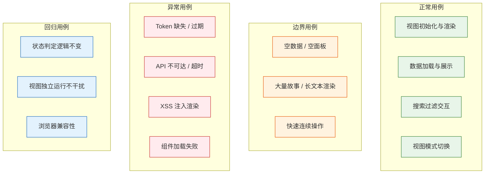

> | v1.0 | 2026-05-20 | claude-opus-4-7 | 自基线测试设计提取 YiWeb 维度 |

> **导航**: [← YiWeb-使用场景](./YiWeb-使用场景.md) · [YiWeb-测试报告 →](./YiWeb-测试报告.md)

> **来源引用**: 由基线[测试-测试设计](./测试-测试设计.md) §4 Web UI 测试用例驱动，结合 [YiWeb-故事任务](./YiWeb-故事任务.md) §5 AC。证据等级 B。

---

## §0 测试策略

### Web UI 测试聚焦

本文档聚焦 YiWeb 前端 storyPanel 视图的 Web UI 测试，覆盖浏览器端渲染、交互、安全净化、API 通信和错误恢复等前端专属测试面。

### 基线溯源

| TC 系列 | 覆盖 AC# (YiWeb-故事任务 §5) | 覆盖场景 (YiWeb-使用场景 §2) | 实现维度 |
|-----|----------------|----------------|------|
| TC-UI-N* | AC1–AC6, AC11 | 场景 1–5 | Web UI |
| TC-UI-B* | AC3, AC4 | 场景 1, 3 | Web UI |
| TC-UI-E* | AC7–AC10 | 场景 1, 2, 4 | Web UI |
| TC-UI-R* | AC1–AC3 | 场景 1, 2 | Web UI |

---

## §1 覆盖矩阵

| FP# | 功能点 | Web UI | 覆盖率 |
|-----|--------|:---:|:---:|
| FP1 | 视图初始化 | | 100% |
| FP2 | 组件注册 | | 100% |
| FP3 | Markdown 渲染 | | 100% |
| FP4 | Token 认证 | | 100% |
| FP5 | 401 处理 | | 100% |
| FP6 | 状态概览渲染 | | 100% |
| FP7 | 故事列表渲染 | | 100% |
| FP8 | 文档同步触发 | | 100% |
| FP9 | 搜索过滤 | | 100% |
| FP10 | 跨视图跳转 | | 100% |

### Gate 映射

| Gate | 用例范围 | 通过标准 | 交接下游 |
|------|---------|---------|---------|
| Gate A | 全部正常 + 边界 + 异常 | P0 全部通过 | 实现阶段 |
| Gate B | 全部回归 + 浏览器兼容性专项 | P0 全部通过 + P1 >= 80% | 交付 |

---

## §2 Web UI 测试用例

### 2.1 正常用例

| ID | Given | When | Then | 关联 FP | 优先级 |
|----|-------|------|------|---------|--------|
| TC-UI-N1 | 浏览器支持 ESM；CDN 可访问 | 访问 story 视图 URL | Vue 应用挂载到 #app；无 JS 错误 | FP1, FP2 | P0 |
| TC-UI-N2 | 有效 Token；API 可达 | 打开故事面板 | 状态卡片显示正确计数；故事列表按时间降序 | FP4, FP6 | P0 |
| TC-UI-N3 | 故事列表已加载 | 在搜索框输入故事名称关键词 | 实时过滤匹配项；清空后恢复全部；不区分大小写 | FP1 | P1 |
| TC-UI-N4 | 故事列表已加载 | 点击某故事行 | 详情卡片：状态徽章、类型、文件清单（文件名+修改时间）、返回按钮 | FP6 | P1 |
| TC-UI-N5 | 已选择文件；有效 Token | 在 AICR 视图发送对话消息 | AI 回复逐字流式渲染；think 标签内容被剥离 | FP8 | P0 |
| TC-UI-N6 | 故事列表已加载 | 用户点击分段滑块切换看板/卡片/列表 | 视图模式切换成功；布局正确变化；过渡动画 < 200ms | FP7 | P1 |
| TC-UI-N7 | 用户在故事详情面板 | 用户点击同步按钮 | 显示同步进度（加载中）；完成后展示同步结果 | FP8 | P1 |
| TC-UI-N8 | 用户在故事详情面板 | 用户点击文件清单中的文件项 | 新标签页打开 AICR 视图；文件树自动定位到目标文件 | FP10 | P1 |

### 2.2 边界用例

| ID | Given | When | Then | 关联 FP | 优先级 |
|----|-------|------|------|---------|--------|
| TC-UI-B1 | 远端无 storyPanel 相关数据 | 打开故事面板 | 状态卡片全部显示 0；空状态提示；不崩溃 | FP1, FP6 | P0 |
| TC-UI-B2 | Markdown 含大型表格和嵌套图表 | 渲染长文本 | 渲染 < 5s；内容无截断；浏览器不卡死 | FP3 | P1 |
| TC-UI-B3 | 100+ 个故事 | 加载、滚动、搜索 | 列表可滚动；搜索 < 100ms | FP6 | P1 |
| TC-UI-B4 | 用户在搜索框快速连续输入 | 多次快速输入不同关键词 | 300ms 防抖生效；最终过滤结果为最后一次输入匹配 | FP9 | P1 |

### 2.3 异常用例

| ID | Given | When | Then | 关联 FP | 优先级 |
|----|-------|------|------|---------|--------|
| TC-UI-E1 | localStorage 无 Token | 发起 API 请求 | 弹出 Token 输入框；不静默失败 | FP4, FP5 | P0 |
| TC-UI-E2 | localStorage 有过期 Token | 发起请求 -> 收到 401 -> 输入新 Token | 旧 Token 清除；弹出输入框；自动重试成功 | FP5 | P0 |
| TC-UI-E3 | API 服务不可用 | 打开故事面板 | 显示网络错误提示；提供重试能力；不白屏 | FP1 | P0 |
| TC-UI-E4 | Markdown 含 `` | 渲染 | script/onerror/javascript: 协议均被过滤 | FP3 | P0 |
| TC-UI-E5 | 组件 JS 路径不存在或返回 404 | 初始化视图 | 显示错误状态，指明加载失败的组件；不崩溃 | FP2 | P1 |
| TC-UI-E6 | 远端 API 延迟 > 5min | Web UI 发请求 | 显示超时错误；请求被中止；不阻塞其他操作 | FP1 | P1 |

---

## §3 测试环境

| 维度 | Web UI |
|------|--------|
| 运行环境 | 浏览器 ESM (Chrome 80+/Firefox 80+/Safari 14+/Edge 80+) |
| 部署方式 | CDN 静态托管 |
| 测试目标 | story 视图 URL（`src/views/story/index.html`） |
| 数据准备 | 远端 API 数据（`api.effiy.cn/api/story-panel/`） |
| 前置条件 | 浏览器支持 ESM import；CDN 可访问；远端 API 可达 |
| 无需工具链 | 无 package.json / node_modules / 开发服务器 |

---

## §4 回归用例

| ID | Given | When | Then | 关联 FP | 优先级 |
|----|-------|------|------|---------|--------|
| TC-UI-R1 | overview 已通过 | 修改状态渲染逻辑后重新验证 | 六状态卡片计数仍正确 | FP6 | P1 |
| TC-UI-R2 | 组件列表已通过 | 修改组件注册逻辑后重新验证 | 全部组件正常注册和渲染 | FP2 | P1 |
| TC-UI-R3 | AICR 和 storyPanel 视图均已部署 | 分别打开两视图 | 互不干扰；组件不冲突 | FP1, FP7 | P0 |
| TC-UI-R4 | Token 已存储 | 刷新页面 -> 检查 API 请求 | Token 持久化；请求自动携带 X-Token | FP4 | P1 |
| TC-UI-R5 | 目录下添加文档基线（01->02->05） | 每次添加后刷新面板 | 状态从未开始 -> 文档进行中 -> 文档完成正确流转 | FP6 | P0 |
| TC-UI-R6 | 各浏览器（Chrome/Firefox/Safari/Edge） | 打开 story 视图 URL | 视图正常渲染；功能一致；布局无异常 | FP1 | P1 |

---

## §5 评审清单

| # | 检查项 | 状态 |
|---|--------|------|
| 1 | 每功能点多类覆盖（正常+边界+异常） | |
| 2 | Gate A 覆盖 — 全部 AC# 有对应用例 | |
| 3 | 回归与影响链一致 | |
| 4 | 异常含恢复行为 | |
| 5 | Web UI 维度有浏览器兼容性专项 | |
| 6 | 基线溯源闭合 — 全部 AC# 和场景有对应用例 | |

---

## §6 Gate A 交接

| 信号 | 内容 |
|------|------|
| 通过状态 | 待执行 |
| P0 用例 | TC-UI-N1–N2, TC-UI-B1, TC-UI-E1–E4, TC-UI-R3, TC-UI-R5 |
| 实现约束 | 仅查询和同步，禁止创建文档内容；零构建架构；credentials: 'omit'；视图隔离 |
| 基线溯源 | 所有用例可追溯至 YiWeb-故事任务 §5 AC 和 YiWeb-使用场景 §2 场景 |

---

## 变更记录

| 日期 | 变更 | 触发 | 证据 |
|------|------|------|------|
| 2026-05-20 | v1.0 初始生成 — 自基线测试设计提取 YiWeb 维度 | YiWeb 项目文档拆分 | 基线测试-测试设计 §4 Web UI 测试用例 · YiWeb-故事任务 §5 AC |
