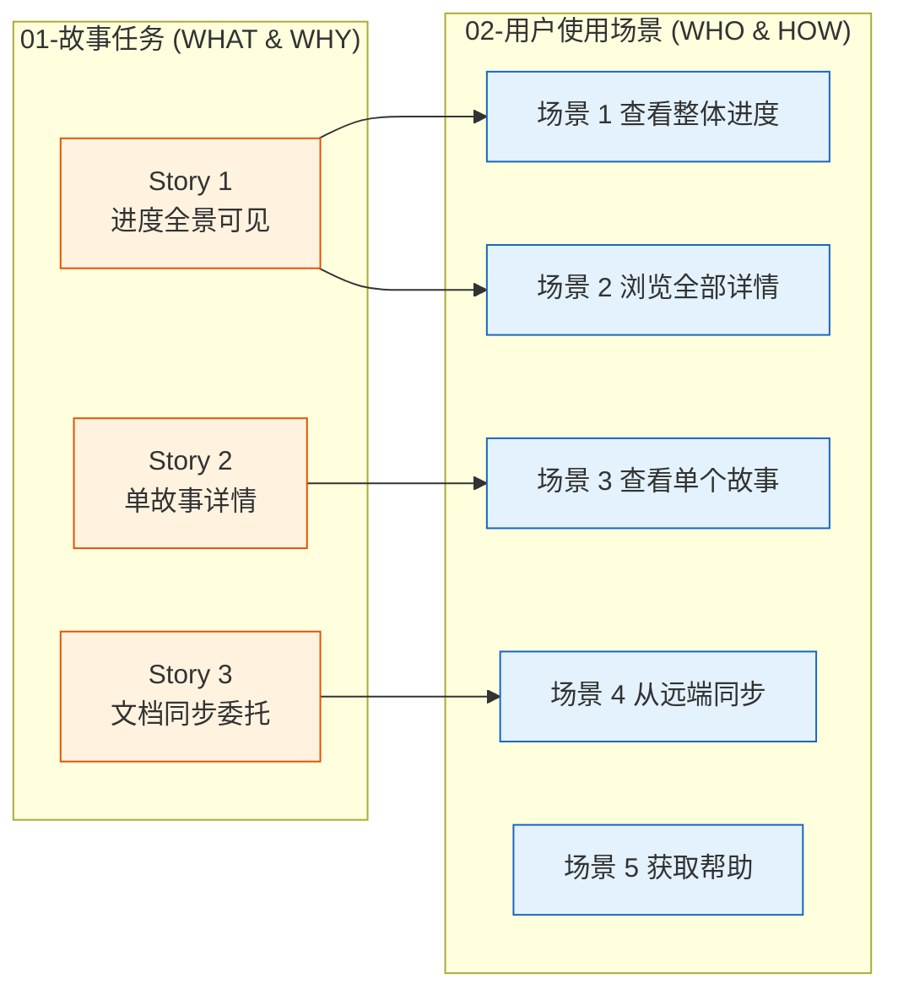
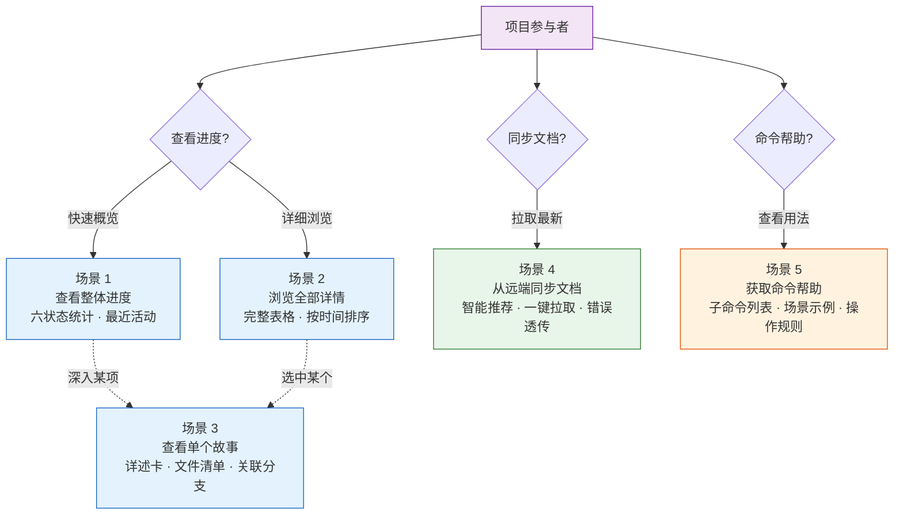
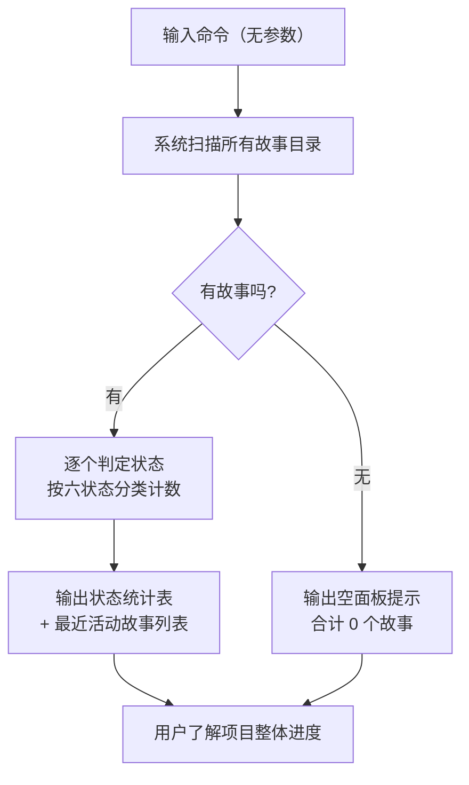
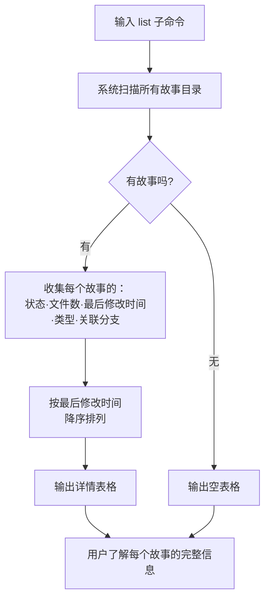
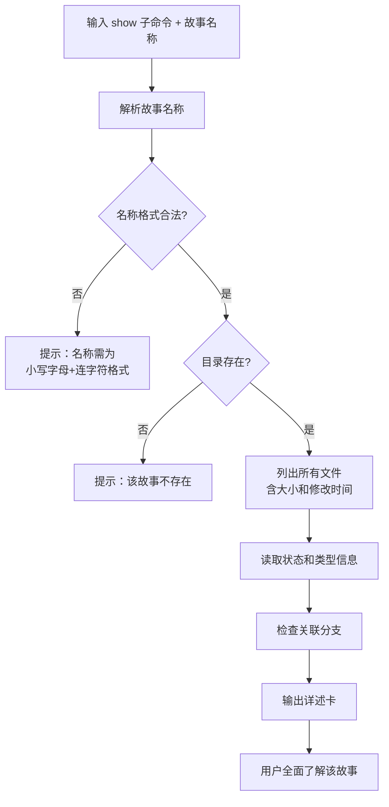
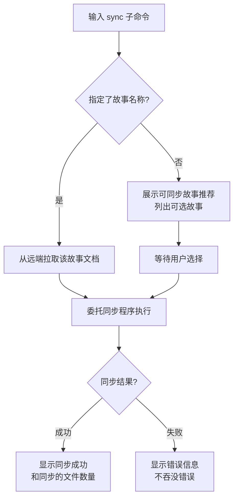
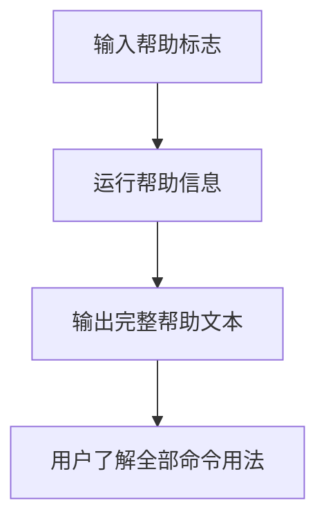
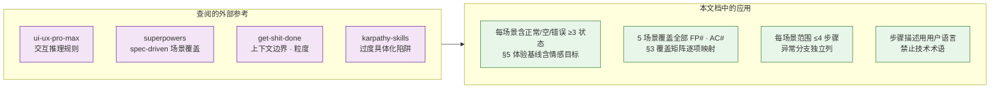

> | v1.5 | 2026-05-18 | deepseek-v4-pro | 🌿 main | 📎 [CLAUDE.md](../../../CLAUDE.md) |

> **导航**: [← 01-故事任务](./YrY-01-故事任务.md) · [05-测试用例评审 →](./YrY-05-测试用例评审.md)

> **来源引用**: 由故事需求 `rui-story` 驱动生成。外部参考吸收自 [README.md 外部参考](../../../README.md#外部参考) — ui-ux-pro-max（交互推理规则 · 视图状态矩阵）· superpowers（spec-driven 场景覆盖）· get-shit-done（上下文边界 · 粒度控制）· karpathy-skills（过度具体化陷阱规避）。证据等级 B（可推导，附外部参考路径）。

### 主要价值

- 👤 以用户视角描述故事面板的完整交互流程 — 从查看到同步，5 个场景全覆盖
- 🗺️ 每个场景覆盖正常路径、空状态和错误恢复 — 确保边缘体验不遗漏
- 📊 进度一眼可见 — 状态聚合和详情表格让用户无需深入每个目录即可判断项目健康度
- 🧭 双基线协同 — 每场景紧密映射 01-故事任务的 Story# 和 FP#，确保问题空间完全覆盖

---

## §0 基线声明

> **用户空间基线 (User Space Baseline)**: 本文档是 `rui-story` 故事目录的**第二基线文档**，与 01-故事任务 构成双基线。本文档定义"谁使用(WHO)"和"如何体验(HOW EXPERIENCE)"——所有测试用例(05)必须覆盖本文档定义的每个场景，所有后续改进(09)必须回溯至本文档的体验基线。

| 约束 | 规则 |
|------|------|
| 语言边界 | 仅使用目标用户能理解的语言。**禁止**包含：技术术语（如 "emit 事件"、"更新 store"）、组件名称（如 `<UserCard>`）、API 端点（如 `/api/v1/login`）、文件路径（如 `src/pages/login.tsx`）、数据库概念（如 "users 表"）、框架名称（如 "React Router"） |
| 完整遍历 | 每个用户旅程必须覆盖：触发器 → 正常路径 → 空状态 → 错误恢复 → 目标达成 |
| 可追溯 | 05-测试用例评审必须覆盖本文档 §2 的每个场景及其异常分支；09-自改进复盘必须回溯本文档 §5 体验基线 |
| 评审门禁 | 文档审查时检查禁止内容：含技术术语/组件名/API端点/文件路径 = P0 阻断 |
| 双基线协作 | 本文档每场景关联 01-故事任务 §1 Story# 和 §2 FP#，确保用户空间与问题空间一一对应 |

### 双基线场景映射

| 01 Story | 覆盖场景 | 覆盖关系 |
|----------|---------|---------|
| Story 1: 进度全景可见 | 场景 1, 2 | 查看操作——用户通过两种查看模式了解全貌 |
| Story 2: 单故事详情 | 场景 3 | 查看操作——深入单个故事的完整信息 |
| Story 3: 文档同步委托 | 场景 4 | 同步操作——一键从远端拉取，用户不感知底层细节 |
| — | 场景 5 | 辅助操作——帮助信息独立于具体 Story，为全局入口 |

---

## §1 场景全景

---

## §2 场景详述

### 场景 1: 查看项目整体进度

| 角色 | 触发条件 | 核心目标 | 关联 01 |
|------|---------|---------|---------|
| 项目参与者 | 想快速了解项目中有哪些故事、各自处于什么阶段 | 在极短时间内看到按状态分类的故事计数和最近活动 | Story 1 · FP1 · FP5 |

| # | 步骤 | 输入 | 系统响应 | 异常分支 |
|---|------|------|---------|---------|
| 1 | 触发命令 | 无任何参数 | 开始扫描故事面板目录 | — |
| 2 | 扫描目录 | — | 遍历每个故事目录，检查关键文件是否存在 | 面板目录本身不存在 → 显示 0 个故事，不报错 |
| 3 | 判定状态 | — | 按六状态模型逐一判定每个故事（未开始/文档进行中/文档完成/代码进行中/代码完成/被阻断） | 故事目录内容异常（无任何文件）→ 判定为"未开始" |
| 4 | 聚合输出 | — | 显示六状态计数汇总 + 最近修改的故事名称和时间 | 无任何故事 → 显示"最近活动：无" |

---

### 场景 2: 浏览所有故事详情

| 角色 | 触发条件 | 核心目标 | 关联 01 |
|------|---------|---------|---------|
| 项目参与者 | 需要查看每个故事的详细信息以决定工作优先级 | 在一个表格中看到所有故事的完整状态、文件数、类型和分支信息 | Story 1 · FP2 · FP5 · FP6 |

| # | 步骤 | 输入 | 系统响应 | 异常分支 |
|---|------|------|---------|---------|
| 1 | 触发命令 | `list` 子命令 | 开始详细扫描 | 面板目录不存在 → 显示空表格头 |
| 2 | 收集信息 | — | 对每个故事收集：名称、状态、文件数量、最近修改时间、类型、关联分支 | 某故事目录无权限读取 → 跳过该故事并标注异常 |
| 3 | 排序排列 | — | 按最近修改时间从新到旧排列 | 所有故事修改时间相同 → 按名称字母序排列 |
| 4 | 输出表格 | — | 六列表格，每行一个故事 | — |

---

### 场景 3: 查看单个故事详情

| 角色 | 触发条件 | 核心目标 | 关联 01 |
|------|---------|---------|---------|
| 项目参与者 | 需要深入了解某个特定故事的完整信息 | 看到该故事的所有文件、元数据、状态和关联分支的一体化详述卡 | Story 2 · FP3 |

| # | 步骤 | 输入 | 系统响应 | 异常分支 |
|---|------|------|---------|---------|
| 1 | 触发命令 | 故事名称 | 校验名称格式 | 名称含大写字母 → 报错提示格式要求 |
| 2 | 定位目录 | — | 查找对应故事目录 | 目录不存在 → 报错提示"故事不存在" |
| 3 | 枚举文件 | — | 列出所有文件，显示每个文件的名称、大小、修改时间 | 目录为空 → 文件清单显示"无文件" |
| 4 | 读取元数据 | — | 展示当前阶段、阻断原因（如有） | 元数据文件不存在 → 相关字段显示"无" |
| 5 | 检查分支 | — | 展示关联分支名称 | 无关联分支 → 显示"无" |

### 场景 4: 从远端同步文档

| 角色 | 触发条件 | 核心目标 | 关联 01 |
|------|---------|---------|---------|
| 项目参与者 | 需要从远端知识库获取最新的故事文档 | 文档成功从远端同步到本地，或获知同步失败的具体原因 | Story 3 · FP4 · R2 |

| # | 步骤 | 输入 | 系统响应 | 异常分支 |
|---|------|------|---------|---------|
| 1 | 触发命令 | 可选的故事名称 | 判断是否有名称；有则直接同步，无则展示推荐 | — |
| 2 | 推荐/执行 | — | 未指定名称时展示可同步故事列表并等待选择；指定名称时委托同步程序执行 | 指定名称的故事不存在 → 报错提示 |
| 3 | 等待结果 | — | 显示同步进度或结果 | 网络故障 → 显示连接错误，建议重试 |
| 4 | 确认结果 | — | 同步成功显示文件数；失败显示原因 | 部分文件同步失败 → 列出失败项 |

---

### 场景 5: 获取命令帮助

| 角色 | 触发条件 | 核心目标 | 关联 01 |
|------|---------|---------|---------|
| 项目参与者 | 不确定命令用法或想查看完整功能列表 | 看到包含用法说明、子命令列表和场景示例的完整帮助文本 | FP7 |

| # | 步骤 | 输入 | 系统响应 | 异常分支 |
|---|------|------|---------|---------|
| 1 | 触发命令 | 帮助标志 | 跳过所有常规逻辑，直接运行帮助信息 | 帮助信息不可用 → 报错提示 |
| 2 | 查看输出 | — | 显示：用法说明、只读命令列表、写入命令列表、场景示例、操作边界、核心规则 | — |

---

## §3 场景覆盖矩阵

| 场景 | FP# | AC# | 测试文档(05) | 覆盖状态 | 备注 |
|------|-----|------|------------|---------|------|
| 场景 1: 查看项目整体进度 | FP1, FP5 | AC1, AC2 | 05-测试用例评审 | 已覆盖 | 含空面板情况 |
| 场景 2: 浏览所有故事详情 | FP2, FP5, FP6 | AC3 | 05-测试用例评审 | 已覆盖 | 含排序验证 |
| 场景 3: 查看单个故事详情 | FP3 | AC4, AC5 | 05-测试用例评审 | 已覆盖 | 含不存在和格式错误的异常 |
| 场景 4: 从远端同步文档 | FP4, R2 | AC6, AC7 | 05-测试用例评审 | 已覆盖 | 含错误透传 |
| 场景 5: 获取命令帮助 | FP7 | AC8 | 05-测试用例评审 | 已覆盖 | — |

---

## §4 评审清单

| # | 检查项 | 状态 |
|---|--------|------|
| 1 | 场景数量 ≥ 2 | ✅ 5 个场景 |
| 2 | 每场景有流程图 | ✅ 每场景含 mermaid flowchart |
| 3 | FP# 全覆盖 | ✅ FP1–FP7 均有对应场景 |
| 4 | 异常分支明确 | ✅ 每场景步骤表含异常分支列 |
| 5 | 无技术术语 | ✅ 全文无组件名、API 端点、文件路径、框架名 |
| 6 | 每场景含空状态与错误恢复 | ✅ 场景 1 含空面板、场景 3/4 含不存在/冲突/格式错误恢复 |
| 7 | 覆盖矩阵下游文档齐全 | ✅ 关联至 05-测试用例评审 |
| 8 | 双基线协作 — 每场景关联 01 Story# | ✅ §2 每场景表含"关联 01"列 |

---

## §5 体验基线

| 角色 | 核心旅程 | 情感目标 | 痛点解决 | 成功感知 | 关联场景 |
|------|---------|---------|---------|---------|---------|
| 项目参与者 | 查看项目进度 | 清晰掌控 — 一眼看清全局，不焦虑 | 不用逐个打开目录查看状态 | 看到状态统计表，各数字一目了然 | 场景 1, 2 |
| 项目参与者 | 查找特定故事 | 快速定位 — 详述卡包含全部所需信息 | 不用分别查看文件、分支、元数据 | 看到完整详述卡，信息集中呈现 | 场景 3 |
| 项目参与者 | 从远端同步文档 | 一键完成 — 不用关心底层拉取细节 | 文档同步的复杂性被完全隐藏 | 看到同步结果和文件数量 | 场景 4 |

---

### 外部参考应用记录

> 本文档撰写时查阅了以下外部参考：

| 外部参考 | 汲取要点 | 本文档应用 |
|---------|---------|-----------|
| ui-ux-pro-max | 交互推理规则 — 视图状态矩阵、微交互规范 | 每场景覆盖正常/空/错误 ≥3 种状态；§5 体验基线含情感目标和成功感知 |
| superpowers | spec-driven 场景覆盖 — 缺失路径识别 | 5 场景覆盖全部 FP1–FP7 和 8 条 AC；§3 覆盖矩阵逐项映射 |
| get-shit-done | 上下文边界 — 退化对策、粒度控制 | 每场景步骤表 ≤4 行，异常分支独立列；§0 语言边界明确禁止技术术语 |
| karpathy-skills | 过度具体化陷阱 — 避免与实现细节耦合 | 全文无组件名/API端点/文件路径/框架名；步骤用"提示""显示"等用户语言 |

---

## 变更记录

| 日期 | 变更 | 触发 | 证据 |
|------|------|------|------|
| 2026-05-17 | 初始生成 | 文档反推生成 | 故事需求 `rui-story` |
| 2026-05-17 | v1.1 强化用户空间基线 | 双基线模型升级 — 去代码耦合、加外部参考应用、加双基线场景映射、加体验基线情感目标 | [01-故事任务](./YrY-01-故事任务.md) 同步升级为代码无关问题空间基线 |
| 2026-05-18 | v1.2 去除创建场景 | T2 增量更新 — 移除场景 4 创建新故事目录，场景 5–8 前移为 4–7 | YrY-01-故事任务.md 同步移除 create 功能点 |
| 2026-05-18 | v1.2.1 明确同步方向 | T1 措辞修正 — 场景 4 从「同步到远端」改为「从远端同步」 | YrY-01-故事任务.md 同步修正 sync 语义 |
| 2026-05-18 | v1.2.2 同步推荐提示 | T2 接口变更 — 场景 4 未指定名称时走推荐流程，展示可同步故事列表等待用户选择 | YrY-01-故事任务.md · SKILL.md 同步更新 sync 默认行为 |
| 2026-05-18 | v1.3 去除魔法数字 | T3 代码重构 — 最近活动展示条数从硬编码改为语义描述；help.mjs 提取格式化常量 | 01 · SKILL.md · 05 同步语义化 |
| 2026-05-18 | v1.4 去除 delete 和 rename | T2 接口变更 — 移除场景 4 删除废弃故事和场景 5 重命名故事，场景 6/7 前移为 4/5；场景总数 7→5 | YrY-01-故事任务.md · SKILL.md 同步移除 delete 和 rename |
| 2026-05-18 | v1.5 文档基线补全 | T2 增量更新 — §3 场景覆盖矩阵更新为已覆盖，§5 体验基线表修复断行，参考 YiAi-02 格式对齐 | YiAi-02 用户使用场景 |
