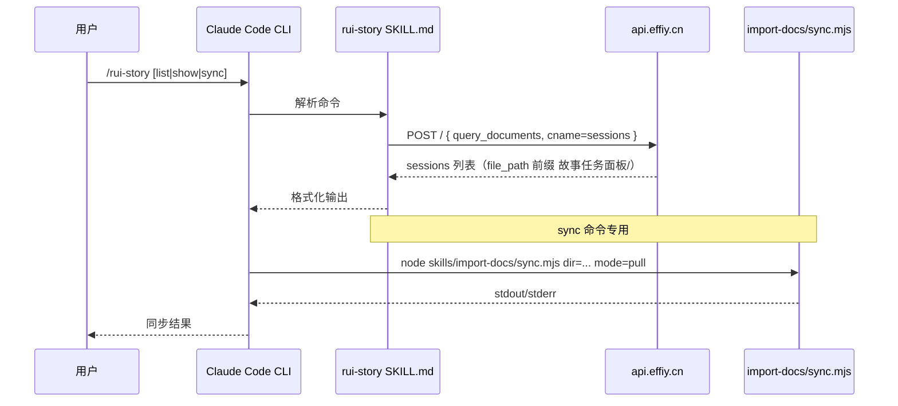
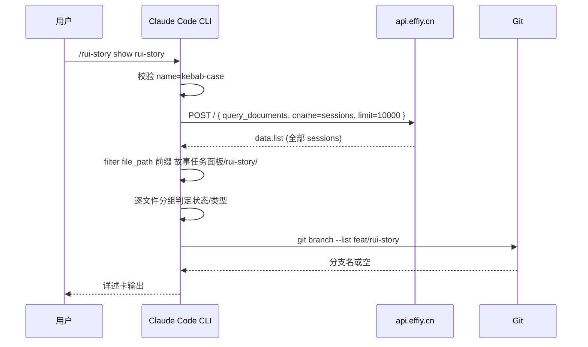
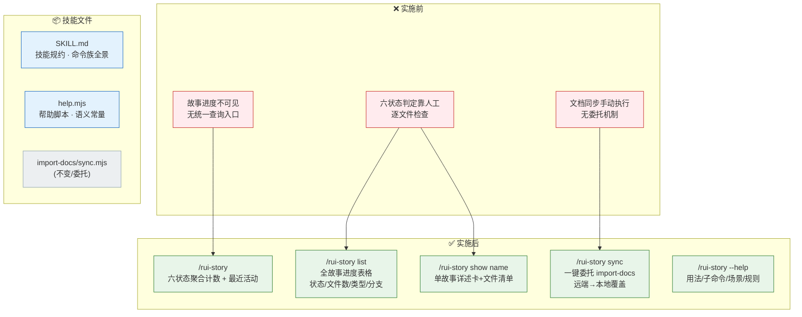

> | v1.0 | 2026-05-18 | deepseek-v4-pro | 🌿 main | 📎 [CLAUDE.md](../../../CLAUDE.md) |

> **导航**: [← 02-用户使用场景](./YrY-02-用户使用场景.md) · [05-测试用例评审 →](./YrY-05-测试用例评审.md)

> **来源引用**: 由故事需求 `rui-story` 驱动生成，基于 01-故事任务 和 02-用户使用场景 双基线。证据等级 B（可推导，附源码路径）。

### 主要价值

- 📐 单一技能模块 — `SKILL.md` + `help.mjs` 内聚全部查询与同步逻辑，零跨技能耦合
- 🔍 六状态判定引擎 — 纯远端 API session 文件存在性推断，无本地文件系统依赖，状态判定确定且可复现
- 🛡️ 安全纵深 — kebab-case 名称校验 + sync 完全委托 + 只读边界硬约束三道防线
- ⚡ 同步委托 — 文档同步完全委托 `import-docs/sync.mjs`，职责单一，错误透传不吞没

---

## §0 设计决策与任务规划

### §0.1 设计决策

| 决策领域 | 选定方案 | 选择理由 | 详见 | 实现 01 FP# |
|---------|---------|---------|------|-----------|
| 技能类型 | Claude Code Skill（SKILL.md + help.mjs） | 与项目 plugin 架构一致，用户通过 `/rui-story` 调用 | §1 | FP1–FP4, FP7 |
| 数据源 | 远端 API `api.effiy.cn` sessions 集合 | 故事文档存储在远端知识库，本地文件系统为同步副本 | §3 | FP1, FP2, FP3, FP5, FP6 |
| 查询模式 | 远端优先 — 所有查询操作直连远端 API | 默认远端模式确保数据一致性，不受本地文件状态影响 | §1.1 | FP1, FP2, FP3 |
| 状态判定 | 远端 session file_path 存在性推断六状态 | 确定性规则，无状态机副作用，与 rui 管线阶段对应 | §1.2 | FP5 |
| 类型推断 | 按远端 03/04/06/07 文档存在性推断 | 最低成本推断，默认 `meta` 兜底 | §1.2 | FP6 |
| 名称校验 | kebab-case 正则 `^[a-z0-9]+(-[a-z0-9]+)*$` | 命名规范硬约束，防止路径遍历 | §4 | R1 |
| 同步机制 | 委托 `node skills/import-docs/sync.mjs` | 完全委托 import-docs，不自实现同步逻辑 | §2.3 | FP4, R2 |
| 帮助输出 | 独立 `help.mjs` Node.js 脚本 | 纯文本输出，语义常量提取，TTY 感知的 ANSI 样式 | §2.4 | FP7 |

### §0.2 任务规划

| ID | 描述 | 工作量 | 依赖 | 交付物 | Agent | 门禁 | 交接下游 | 实现 01 FP# |
|----|------|--------|------|--------|-------|------|---------|-----------|
| T1 | SKILL.md 规约骨架（命令族全景/操作边界/核心规则/数据源） | M | — | `skills/rui-story/SKILL.md` | coder | 铁律合规 | T2 | FP1–FP7 |
| T2 | help.mjs 帮助脚本（用法/子命令/场景示例/核心规则） | M | T1 | `skills/rui-story/help.mjs` | coder | 语义常量提取 | T3 | FP7 |
| T3 | 状态判定逻辑 — 六状态模型 + mermaid 流程图 + 判定表 | S | T1 | SKILL.md §状态判定 | coder | 六状态全覆盖 | T4 | FP5 |
| T4 | 命令处理流程 — overview/list/show 远端查询设计 | M | T1, T3 | SKILL.md 各命令章节 | coder | 数据源正确 | T5 | FP1, FP2, FP3 |
| T5 | sync 委托设计 — import-docs 子进程调用规约 | M | T1 | SKILL.md §sync | coder | 委托完整 | T6 | FP4, R2 |
| T6 | P0 审查 + 集成验证 | S | T2–T5 | P0 清零确认 + 帮助输出验证 | security + tester | P0=0 | 交付 | — |

---

## §1 技能架构

### 1.1 技能/进程

| 变更类型 | 模块/文件 | 职责 |
|---------|----------|------|
| 新增 | `skills/rui-story/SKILL.md` | 故事面板 CLI 技能规约：命令族全景 · 状态判定 · 操作边界 · 核心规则 |
| 新增 | `skills/rui-story/help.mjs` | 帮助信息输出脚本：格式化/语义常量/TTY 感知 |
| 不变 | `skills/import-docs/sync.mjs` | 文档同步脚本（被委托方） |
| 不变 | `skills/rui-story/` | 技能目录 |

`rui-story` 是自包含 CLI 技能：零数据库依赖，零跨技能调用。仅委托 `import-docs/sync.mjs` 执行文档同步。

### 1.2 通信通道

| 通道 | 方向 | 协议 | Payload | 错误处理 |
|------|------|------|---------|---------|
| 用户 → CLI | 入站 | 对话文本 | `/rui-story [子命令] [name]` | 名称格式校验 → kebab-case 提示 |
| CLI → 远端 API | 出站 | HTTPS POST | `{module_name, method_name, parameters}` JSON | API_X_TOKEN 缺失 → 降级提示；网络故障 → 错误透传 |
| CLI → import-docs | 出站 | 子进程 stdio | CLI 参数 `dir=<path> mode=pull` | 子进程异常 → 错误透传不吞没 |

---

## §2 命令接口

### 2.1 命令清单

| 命令 | 类型 | 数据源 | 输入 | 输出 | 错误行为 |
|------|------|--------|------|------|---------|
| `/rui-story` | 只读 | 远端 API | 无 | 六状态聚合计数 + 最近活动故事列表 | API 不可达时显示错误信息 |
| `/rui-story list` | 只读 | 远端 API | 无 | Story/Status/Files/Last Modified/Type/Branch 六列表格 | API 不可达时显示空表格 |
| `/rui-story show <name>` | 只读 | 远端 API | kebab-case 名称 | 详述卡：状态/目录/类型/文件清单/关联分支/元数据 | 名称不存在报错；格式非法报错 |
| `/rui-story sync [<name>]` | 写入 | 远端 API → 本地 | 可选 kebab-case 名称 | 同步结果（synced + written + failed）或推荐列表 | 名称不存在报错；API 不可达报错 |

### 2.2 命令流程 — 单故事详情

### 2.3 同步委托

| 服务/模块 | 依赖 | 调用方式 | 核心参数 |
|----------|------|---------|---------|
| import-docs/sync.mjs | Node.js | 子进程 | `dir=docs/故事任务面板/<name>/ mode=pull` |

- 指定名称：直接委托 import-docs 从远端下载覆盖本地
- 未指定：展示可同步故事推荐提示，等待用户选择

### 2.4 帮助输出

`help.mjs` 独立脚本，TTY 感知：
- 用法说明：`/rui-story --help` / `-h` / `help`
- 只读命令：overview / list / show
- 写入命令：sync
- 场景示例：5 个常用场景
- 数据源说明：远端 API 为默认
- 操作边界：允许/禁止项
- 核心规则：5 条硬约束

语义常量：`LEFT_COLUMN_WIDTH=28`, `COLUMN_MIN_PADDING=2`，TTY 检测自动降级为纯文本。

---

## §3 数据模型

### 3.1 存储结构

> 本技能不操作本地文件系统（sync 除外），全部数据来源于远端 API。

| Key/表/集合 | 类型 | 默认值 | 读频率 | 写频率 | 说明 |
|------------|------|--------|--------|--------|------|
| 远端 `sessions` 集合 | API | — | 每命令 1 次 | 0（只读） | 故事文档远端存储 |
| `sessions[].file_path` | string | — | 每命令 N 次筛选 | 0 | 以 `故事任务面板/` 为前缀 |
| `sessions[].tags` | string[] | — | 每命令 1 次分组 | 0 | tags[0]=故事任务面板, tags[1]=故事目录名 |
| 本地 `.memory/rui-state.json` | 文件 | — | 每 show 1 次 | 0（只读） | blocked 状态标记（唯一本地读例外） |
| 本地 `docs/故事任务面板/<name>/` | 目录 | — | 0（查询不读） | sync 时写入 | 同步目标目录 |

### 3.2 数据流

---

## §4 安全约束

| # | 威胁 | 信任边界 | 缓解措施 | 优先级 |
|---|------|---------|---------|--------|
| 1 | 名称注入 — `name` 参数含路径分隔符或特殊字符 | 用户输入 → 文件系统 | kebab-case 正则校验拒绝含 `..` / `/` 的输入 | P0 |
| 2 | 远端 API 未授权访问 — 无 Token 请求 | CLI → 远端 API | API_X_TOKEN 环境变量传入；缺失时降级提示不阻断 | P0 |
| 3 | 子进程注入 — sync 参数拼接命令 | CLI → 子进程 | `dir` 参数使用已验证的绝对路径，不拼接用户输入到 shell | P0 |
| 4 | 信息泄露 — 错误消息暴露内部路径 | CLI → 用户 | 错误消息仅含 `<name>` 格式，不暴露绝对路径或 API 内部结构 | P1 |
| 5 | Token 泄露 — API_X_TOKEN 出现在日志或输出 | 环境变量 → 用户可见 | Token 仅从环境变量读取，不写入日志/配置/输出 | P0 |
| 6 | 远端 API 不可达 — 网络故障导致命令不可用 | CLI → 公网 | 优雅降级：API 超时/失败时显示明确错误信息，不崩溃 | P1 |

---

## §5 性能与限制

| 维度 | 约束 | 应对 |
|------|------|------|
| 响应时间 | overview/list 应在 3 秒内完成（SC1） | 单次远端 API 查询，本地分组/判定为纯内存操作 |
| 并发 | 无状态设计，天然支持并发 | 每次命令独立的 API 查询，无共享状态 |
| 远端 API | 单次查询 sessions 集合（limit=10000） | 筛选在 CLI 侧内存完成；故事数量 < 100 时线性扫描可接受 |
| 文件系统 | 查询操作零本地文件系统访问 | 不存在目录权限或磁盘 I/O 瓶颈 |
| sync | 委托 import-docs 子进程 | Node.js 子进程，与 CLI 进程隔离 |

---

## §6 效果示意

| 组件 | 变更 | 说明 |
|------|------|------|
| `SKILL.md` | 🆕 新增 | 命令族全景 · 状态判定 · 操作边界 · 核心规则 · 数据源设计 |
| `help.mjs` | 🆕 新增 | 帮助输出脚本，语义常量，TTY 感知 |
| `import-docs/sync.mjs` | — 不变 | 子进程委托，完全复用 |

## §7 评审清单

| # | 检查项 | 状态 |
|---|--------|------|
| 1 | 权限最小化 — 查询不读本地文件系统 | ✅ |
| 2 | 通信对齐 — 远端 API 为默认数据源 | ✅ |
| 3 | 存储兼容 — 零本地文件系统依赖（sync 除外） | ✅ |
| 4 | 认证 — API_X_TOKEN 环境变量传入 | ✅ |
| 5 | 无硬编码密钥 — Token 从环境变量读取 | ✅ |
| 6 | 输入校验完整 — kebab-case 正则 + 路径遍历防护 | ✅ |
| 7 | 基线溯源完备 — 每命令映射至 01 FP# | ✅ |

---

## 变更记录

| 日期 | 变更 | 触发 | 证据 |
|------|------|------|------|
| 2026-05-18 | 初始生成 | 故事需求 `rui-story` — 后端技术评审 | `skills/rui-story/SKILL.md` · `skills/rui-story/help.mjs` |
