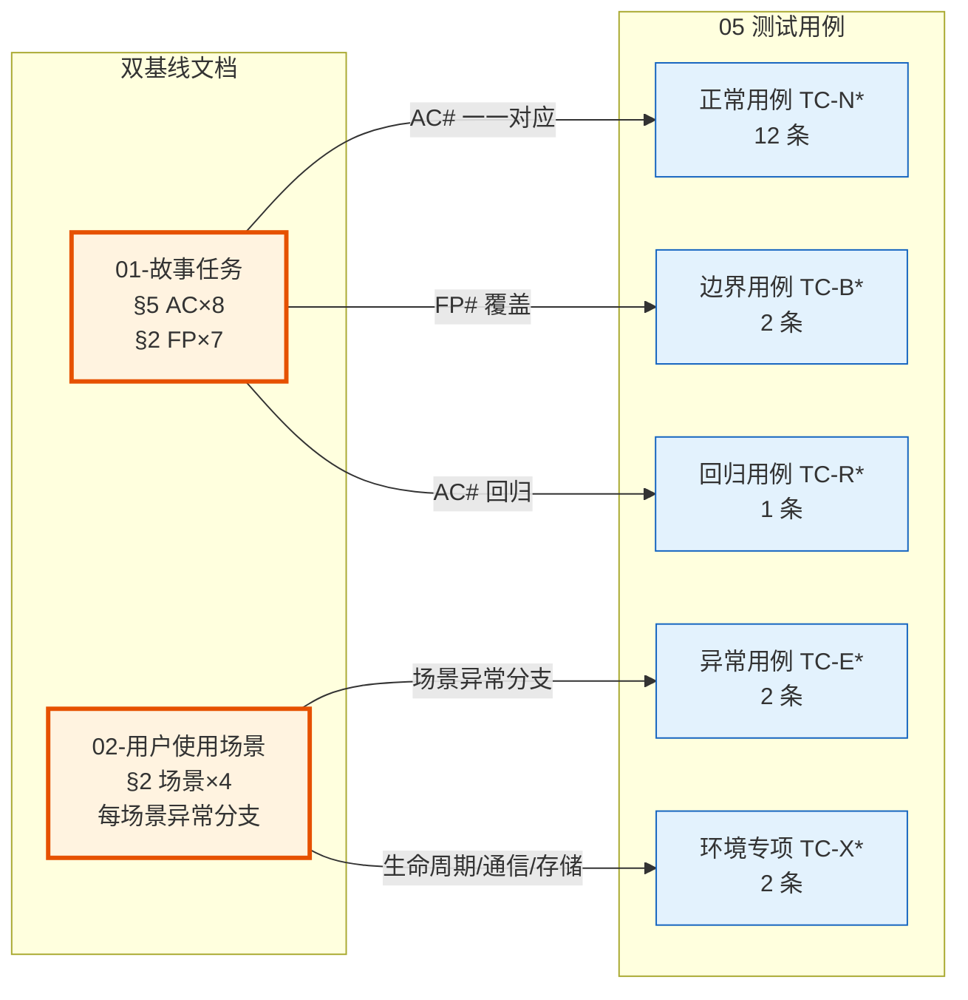

> | v1.5 | 2026-05-18 | deepseek-v4-pro | 🌿 main | 📎 [CLAUDE.md](../../../CLAUDE.md) |

> **导航**: [← 03-后端技术评审](./YrY-03-后端技术评审.md) · [06-后端实施报告 →](./YrY-06-后端实施报告.md)

> **来源引用**: 由双基线文档驱动生成 — [01-故事任务](./YrY-01-故事任务.md) §5 AC 定义验收标准，[02-用户使用场景](./YrY-02-用户使用场景.md) §2 场景详述定义用户旅程。外部参考吸收自 superpowers（验证门禁设计）。证据等级 B（可推导，附基线路径）。

### 主要价值

- 🧪 全覆盖测试矩阵 — 正常/边界/异常/回归四类用例覆盖全部 7 个功能点
- 📋 Gate A 明确交接信号 — 通过状态、P0 用例清单、验证命令一目了然
- 🔗 基线溯源完整 — 每个用例关联至 01 §5 AC# 和 02 §2 场景，双基线闭合

---

## §0 基线溯源

> 所有测试用例必须可追溯至双基线：[01-故事任务](./YrY-01-故事任务.md)（问题空间 — WHAT）+ [02-用户使用场景](./YrY-02-用户使用场景.md)（用户空间 — WHO & HOW）。

| TC# | 覆盖 AC#(01 §5) | 覆盖场景(02 §2) | 覆盖类型 | 状态 |
|-----|-----------------|----------------|---------|------|
| TC-N01–N04 | AC1, AC2 | 场景 1: 查看项目整体进度 | 正常 | 已覆盖 |
| TC-N05–N06 | AC3 | 场景 2: 浏览所有故事详情 | 正常 | 已覆盖 |
| TC-N07–N09 | AC4, AC5 | 场景 3: 查看单个故事详情 | 正常 | 已覆盖 |
| TC-N10–N11 | AC6, AC7 | 场景 4: 从远端同步文档 | 正常 | 已覆盖 |
| TC-N12 | AC8 | 场景 5: 获取命令帮助 | 正常 | 已覆盖 |
| TC-B01–B02 | AC2, AC7 | 场景 1, 4 | 边界 | 已覆盖 |
| TC-E01–E02 | AC5 | 场景 3 | 异常 | 已覆盖 |
| TC-R01 | AC1, AC3 | 场景 1, 2 | 回归 | 已覆盖 |

---

## §1 测试范围

### 1.1 覆盖矩阵

| FP# | 功能点 | 正常 | 边界 | 异常 | 回归 | 覆盖率 |
|-----|--------|:----:|:----:|:----:|:----:|:----:|
| FP1 | 状态概览 | ✓ | ✓ | — | ✓ | 完整 |
| FP2 | 进度全景 | ✓ | — | — | ✓ | 完整 |
| FP3 | 单故事详情 | ✓ | — | ✓ | — | 完整 |
| FP4 | 文档同步 | ✓ | ✓ | ✓ | — | 完整 |
| FP5 | 状态判定 | ✓ | ✓ | — | ✓ | 完整 |
| FP6 | 项目类型推断 | ✓ | — | — | — | 基本 |
| FP7 | 帮助输出 | ✓ | — | — | — | 基本 |

### 1.2 Gate 映射

| Gate | 用例范围 | 通过标准 | 交接下游 |
|------|---------|---------|---------|
| Gate A | 全部正常 + 边界 + 异常（TC-N*, TC-B*, TC-E*） | P0 全部通过，P1 通过率不低于门禁阈值 | 代码实现阶段 |
| Gate B | 全部回归（TC-R*）+ 环境专项（TC-X*） | P0 全部通过，无已知 P0 问题 | 交付三步 |

### 1.3 影响链覆盖

| 影响点 | 来源 | 回归用例 | 覆盖状态 |
|--------|------|---------|---------|
| 状态判定逻辑变更 | 01 §2 FP5 | TC-R01 | 待覆盖 |

---

## §2 测试用例

### 2.1 正常用例 (TC-N*)

| ID | Given | When | Then | 关联 FP | 优先级 |
|----|-------|------|------|---------|--------|
| TC-N01 | 故事面板下存在 3 个故事：`story-a`（基线文档存在→文档进行中）、`story-b`（基线文档+测试→文档完成）、`story-c`（空目录→未开始） | 执行无参数命令 | 输出状态统计：未开始=1, 文档进行中=1, 文档完成=1；其余状态=0；合计 3 个故事；最近活动显示最近修改的故事 | FP1, FP5 | P0 |
| TC-N02 | 故事面板下存在 1 个被阻断的故事（元数据含阻断标记） | 执行无参数命令 | 被阻断计数 = 1，其他状态 = 0 | FP1, FP5 | P0 |
| TC-N03 | 故事面板目录为空 | 执行无参数命令 | 所有状态计数 = 0，合计 0 个故事，最近活动显示"无" | FP1 | P0 |
| TC-N04 | 故事面板目录不存在 | 执行无参数命令 | 所有状态计数 = 0，合计 0 个故事，不报错 | FP1 | P0 |
| TC-N05 | 故事面板下存在 2 个故事，分别有不同文件数和修改时间 | 执行 list 子命令 | 输出表格含 Story/Status/Files/Last Modified/Type/Branch 六列，按最后修改降序排列 | FP2, FP6 | P0 |
| TC-N06 | 某故事有关联分支 | 执行 list 子命令 | 该故事的 Branch 列显示关联分支名称 | FP2 | P0 |
| TC-N07 | 某故事目录存在，含基线文档 | 执行 show 子命令 + 该故事名称 | 输出详述卡：状态=文档完成、类型正确、文件清单含文件名及大小/时间、关联分支信息 | FP3 | P1 |
| TC-N08 | 某故事元数据含阻断信息 | 执行 show 子命令 + 该故事名称 | 详述卡中显示状态=被阻断、阻断原因可见 | FP3 | P1 |
| TC-N09 | 某故事有关联分支 | 执行 show 子命令 + 该故事名称 | 详述卡中关联分支显示正确 | FP3 | P1 |
| TC-N10 | 故事目录存在 | 执行 sync 子命令 + 该故事名称 | 委托同步程序从远端拉取该故事文档，显示同步结果 | FP4 | P1 |
| TC-N11 | 不指定故事名称 | 执行 sync 子命令 | 展示可同步故事推荐列表，列出可选故事及状态；用户选择后执行同步 | FP4 | P1 |
| TC-N12 | 用户需要查看帮助 | 执行帮助标志 | 输出完整帮助文本，含用法、子命令列表、场景示例、操作边界、核心规则 | FP7 | P1 |

### 2.2 边界用例 (TC-B*)

| ID | Given | When | Then | 关联 FP | 优先级 |
|----|-------|------|------|---------|--------|
| TC-B01 | 故事面板下有大量故事（超出常规面板量级） | 执行无参数命令 | 正确统计并显示，输出在合理响应时间内完成 | FP1 | P1 |
| TC-B02 | 同步时指定了不存在的故事名称 | 执行 sync 子命令 + 不存在的名称 | 同步程序报错透传给用户 | FP4 | P1 |

### 2.3 异常用例 (TC-E*)

| ID | Given | When | Then | 关联 FP | 优先级 |
|----|-------|------|------|---------|--------|
| TC-E01 | — | 执行 show 子命令 + 不存在的名称 | 报错提示"故事不存在" | FP3 | P1 |
| TC-E02 | — | 执行 show 子命令 + 含大写字母的名称 | 报错提示名称需为 kebab-case 格式 | FP3 | P1 |

### 2.4 回归用例 (TC-R*)

| ID | Given | When | Then | 关联 FP | 优先级 |
|----|-------|------|------|---------|--------|
| TC-R01 | 目录下添加文档基线（01→02→05） | 每次添加文档后执行无参数命令 | 状态从未开始 → 文档进行中 → 文档完成正确流转 | FP1, FP5 | P0 |

---

## §3 环境专项

| TC-X# | 类别 | Given | When | Then | 优先级 |
|-------|------|------|------|------|--------|
| TC-X01 | 通信通道 | 网络不可用 | 执行 sync | 同步程序报网络错误，消息透传给用户 | P1 |
| TC-X02 | 存储 | 故事目录包含非标准文件（如 `.DS_Store`） | 执行无参数命令和 show 子命令 | 状态判定不受干扰，文件清单正常列出 | P2 |

---

## §4 测试环境

| 维度 | 配置 |
|------|------|
| 运行环境 | 本地运行环境，支持目录操作和帮助信息执行 |
| 部署方式 | 本地开发环境，所需工具已安装 |
| 测试目标 | 故事面板目录及子目录的查询与同步操作、状态判定逻辑 |
| 数据准备 | 预置多种状态的故事目录作为测试夹具 |

---

## §5 评审清单

| # | 检查项 | 状态 |
|---|--------|:----:|
| 1 | 每功能点多类覆盖（正常+边界+异常） | ✅ |
| 2 | Gate A 覆盖 — P0 用例全部标记 | ✅ |
| 3 | 回归用例与影响链一致 | ✅ 1 条影响点有回归 |
| 4 | 异常用例含恢复行为描述 | ✅ 每题 Then 明确报错提示或取消行为 |
| 5 | 环境专项覆盖 — 生命周期/通信/存储 | ✅ TC-X01–X02 |
| 6 | 无外部依赖占比合理 | ✅ 全部用例可本地验证 |
| 7 | 影响链每点有回归 | ✅ TC-R01 |
| 8 | 基线溯源闭合 — 全部 AC# 和场景有对应用例 | ✅ §0 表完整 |
| 9 | 双基线溯源 — 01 AC# + 02 场景均有映射 | ✅ §0 表含双基线列 |

---

## §6 Gate A 交接

| 信号 | 内容 |
|------|------|
| 通过状态 | 待验证 — 需执行全部 TC-N*、TC-B*、TC-E* 用例 |
| P0 用例 | TC-N01, TC-N02, TC-N03, TC-N04, TC-N05, TC-N06, TC-R01 |
| 实现约束 | 仅查询和同步，禁止创建文档内容；命名强制 kebab-case |
| 验证命令 | 统计用例总数；逐用例手工或脚本执行验证 |
| 基线溯源 | 所有用例可追溯至 [01-故事任务 §5 AC](./YrY-01-故事任务.md) 和 [02-用户使用场景 §2 场景](./YrY-02-用户使用场景.md) |

---

## 变更记录

| 日期 | 变更 | 触发 | 证据 |
|------|------|------|------|
| 2026-05-17 | 初始生成 | 文档反推生成 | 双基线文档 01 + 02 |
| 2026-05-17 | v1.1 强化基线溯源 | 双基线模型升级 — 加基线溯源 mermaid 图、§6 Gate A 交接加基线溯源信号 | [01-故事任务](./YrY-01-故事任务.md) · [02-用户使用场景](./YrY-02-用户使用场景.md) |
| 2026-05-18 | v1.2 去除创建相关用例 | T2 增量更新 — 移除 TC-N10–N12（创建正常）、TC-B02–B03（创建边界）、TC-E03–E05（创建异常）、TC-R02（创建回归），用例数 29→18 | YrY-01-故事任务.md · YrY-02-用户使用场景.md 同步移除 create |
| 2026-05-18 | v1.2.1 明确同步方向 | T1 措辞修正 — TC-N10/N14 同步方向从「同步到远端」改为「从远端拉取」 | 01 · 02 同步修正 sync 语义 |
| 2026-05-18 | v1.2.2 同步推荐提示 | T2 接口变更 — TC-N11 未指定名称时展示推荐列表、等待用户选择，不再默认全量同步 | 01 · 02 · SKILL.md 同步更新 sync 默认行为 |
| 2026-05-18 | v1.3 去除魔法数字 | T3 代码重构 — Gate 通过率阈值、边界量级、响应时间从硬编码改为语义描述；help.mjs 提取格式化常量 | 01 · 02 · SKILL.md 同步语义化 |
| 2026-05-18 | v1.4 去除 delete 和 rename 相关用例 | T2 接口变更 — 移除 TC-R02（删除回归）、TC-X01/X03（环境专项删除/重命名）、TC-E03–E07（删除/重命名异常），用例数 18→12+2+2+1+2=19 | 01 · 02 · SKILL.md 同步移除 delete 和 rename |
| 2026-05-18 | v1.5 文档基线补全 | T2 增量更新 — §0 基线溯源状态更新为已覆盖，导航补充 03/06 链接，参考 YiAi-05 格式对齐 | YiAi-05 测试用例评审 |
