> | v1.4.8 | 2026-05-20 | deepseek-v4-pro | 🌿 feat/rui-story | ⏱️ — | 📎 [CLAUDE.md](../../../CLAUDE.md) |

> **导航**: [← YrY-故事任务](./YrY-故事任务.md) · [YrY-技术评审 →](./YrY-技术评审.md)

> **来源引用**: 从 `skills/rui-story/SKILL.md` 命令族全景 + `rui-story.mjs` 命令处理器反推。证据 Level B + 源码路径。

[§1 场景全景](#sec1-scenarios) · [§2 场景详述](#sec2-details) · [§3 场景覆盖矩阵](#sec3-matrix) · [§4 评审清单](#sec4-checklist) · [§5 体验基线](#sec5-experience) · [§6 API 参考](#sec6-api)

---

### §0 基线声明

> **用户空间基线 (User Space Baseline)**: 本文档定义"谁使用(WHO)"和"如何体验(HOW EXPERIENCE)"。所有交互设计(技术评审)、测试用例(测试设计)、验收标准(故事任务 §5)均必须覆盖本文档定义的每个场景。

---

### 主要价值

- 🎯 覆盖全部 8 条命令的用户操作路径，含正常/空/错误三种状态
- 🔒 明确数据边界：查询不读本地、写入有确认、破坏性操作先展示后执行
- ⚡ 远端优先体验 — 用户无需关心本地文件系统即可了解全局进度
- 📊 从概览到详情的渐进式信息披露 — 概览 → 列表 → 单故事详情

---

<a id="sec1-scenarios"></a>

## §1 场景全景

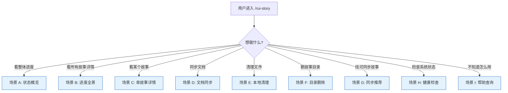

---

<a id="sec2-details"></a>

## §2 场景详述

### 场景 A: 状态概览

| 角色 | 触发条件 | 核心目标 |
|------|---------|---------|
| 项目参与者 | 执行 `/rui-story` 无参数 | 快速了解所有故事的整体进度分布 |

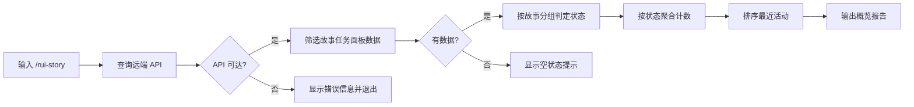

| # | 步骤 | 输入 | 系统响应 | 异常分支 |
|---|------|------|---------|---------|
| 1 | 执行命令 | `/rui-story` | 开始查询远端 API | Token 缺失 → 显示配置指引 |
| 2 | 查询远端 | API 请求 | 获取 sessions 列表 | 网络错误 → 显示"远端不可达" |
| 3 | 筛选数据 | file_path 前缀过滤 | 仅保留故事任务面板数据 | 无匹配 → 显示"无故事任务面板数据" |
| 4 | 状态判定 | 文件清单 + 项目前缀 | 每故事判定为 6 种状态之一 | 无法判定 → 标记 not_started |
| 5 | 聚合输出 | 状态计数 | 显示状态统计表 | — |
| 6 | 最近活动 | 更新时间排序 | 显示最近 5 个活跃故事 | 无活动 → 显示"无" |

#### 接口数据请求流

**API 调用**: `POST /` — `query_documents`

| 项目 | 值 |
|------|-----|
| 方法 | POST |
| 路径 | `/` |
| 认证 | Header `X-Token: ${API_X_TOKEN}` |
| Content-Type | application/json |

请求体：

```json
{
  "module_name": "services.database.data_service",
  "method_name": "query_documents",
  "parameters": {
    "cname": "sessions",
    "limit": 10000
  }
}
```

响应关键字段：

| 字段路径 | 类型 | 说明 |
|---------|------|------|
| `data.list` | array | 全部 sessions 记录 |
| `data.list[].file_path` | string | 文件远端路径，如 `故事任务面板/<name>/...` |
| `data.list[].updated_at` | number | 文件更新时间戳 |

数据处理流程：`query_documents` → 筛选 `file_path` 以 `故事任务面板/` 开头的记录 → `extractStoryName()` 提取故事名分组 → `determineStatus()` 逐故事判定 6 种状态 → 按状态聚合计数 + 按 `updated_at` 排序最近 5 个活跃故事。

---

### 场景 B: 进度全景

| 角色 | 触发条件 | 核心目标 |
|------|---------|---------|
| 项目管理者 | 执行 `/rui-story list` | 查看所有故事的完整进度信息用于决策 |

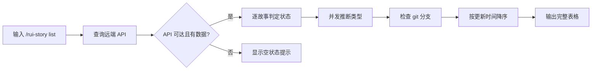

| # | 步骤 | 输入 | 系统响应 | 异常分支 |
|---|------|------|---------|---------|
| 1 | 执行命令 | `/rui-story list` | 查询远端所有 sessions | Token 缺失 → 显示配置指引 |
| 2 | 类型推断 | 远端技术评审内容 | 并发读取判定类型 | 读取失败 → 默认 meta |
| 3 | 分支检查 | `git branch --list` | 匹配 feat/<name> 分支 | 无匹配 → 显示"—" |
| 4 | 表格输出 | 全部故事数据 | 6 列表格按时间降序 | 无故事 → 显示空状态提示 |

#### 接口数据请求流

**API 调用 1**: `POST /` — `query_documents`（同场景 A，获取全部 sessions）

**API 调用 2**: `POST /read-file` — 并发读取各故事的技术评审文档用于类型推断

| 项目 | 值 |
|------|-----|
| 方法 | POST |
| 路径 | `/read-file` |
| 认证 | Header `X-Token: ${API_X_TOKEN}` |
| Content-Type | application/json |

请求体（每故事 1 次，并发数 = 4）：

```json
{
  "target_file": "故事任务面板/<name>/<Project>-技术评审.md"
}
```

响应关键字段：

| 字段路径 | 类型 | 说明 |
|---------|------|------|
| `data.content` | string | 技术评审文档全文，用于关键词分析判定项目类型 |

数据处理流程：`query_documents` 获取全量 → 按故事分组 → 并发 `read-file` 读取每个故事的技术评审（`CONCURRENCY=4`）→ `inferType()` 关键词匹配判定 backend/frontend/fullstack/meta → `checkGitBranch()` 检查本地 `feat/<name>` 分支 → 按更新时间降序输出 6 列表格。

**并发推断机制**：4 个 worker 并发消费 story queue，每个 worker 取一个故事 → 读远端技术评审 → 关键词匹配 → 写入结果 Map。任一失败默认返回 `meta`。

---

### 场景 C: 单故事详情

| 角色 | 触发条件 | 核心目标 |
|------|---------|---------|
| 开发者 | 执行 `/rui-story show <name>` | 深入了解特定故事的所有文件、状态和元数据 |

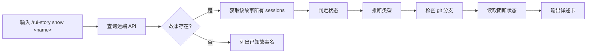

| # | 步骤 | 输入 | 系统响应 | 异常分支 |
|---|------|------|---------|---------|
| 1 | 解析名称 | `<name>` | 验证 kebab-case 格式 | 格式错误 → 提示正确格式 |
| 2 | 查询远端 | 故事名 | 筛选匹配的 sessions | 不存在 → 列出所有已知故事名 |
| 3 | 展示文件清单 | sessions 列表 | 按文件名排序展示 | 无文件 → 显示"0 个文件" |
| 4 | 展示元数据 | 状态/类型/阻断 | 状态标签 + 阻断原因 | 无阻断 → 显示"—" |

#### 接口数据请求流

**API 调用 1**: `POST /` — `query_documents`（同场景 A，获取全量 sessions）

**API 调用 2**: `POST /read-file` — 读取该故事的技术评审用于类型推断

| 项目 | 值 |
|------|-----|
| 方法 | POST |
| 路径 | `/read-file` |
| 认证 | Header `X-Token: ${API_X_TOKEN}` |
| Content-Type | application/json |

请求体：

```json
{
  "target_file": "故事任务面板/<name>/<Project>-技术评审.md"
}
```

数据处理流程：`query_documents` 获取全量 → 筛选目标 `<name>` 的 sessions → 若故事不存在则列出所有已知故事名 → `read-file` 读取技术评审推断类型（1 次）→ `readBlockedState()` 读取本地 `.memory/rui-state.json` → `checkGitBranch()` 检查本地分支 → 输出详述卡（文件清单 + 状态 + 类型 + 阻断原因 + Git 分支）。

---

### 场景 D: 文档同步

| 角色 | 触发条件 | 核心目标 |
|------|---------|---------|
| 开发者 | 执行 `/rui-story sync [<name>]` | 从远端获取最新故事文档到本地 |

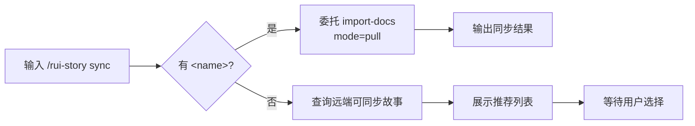

| # | 步骤 | 输入 | 系统响应 | 异常分支 |
|---|------|------|---------|---------|
| 1 | 有名称同步 | `/rui-story sync <name>` | 执行 import-docs mode=pull | 同步失败 → 显示错误 |
| 2 | 无名称推荐 | `/rui-story sync` | 展示远端可同步故事列表 | 无远端数据 → 显示空提示 |
| 3 | 确认同步 | 用户选择故事名 | 执行定向同步 | — |

#### 接口数据请求流

> **注意**: `sync` 命令在 `rui-story.mjs` 中为规约驱动——脚本本身不直接实现同步逻辑，而是委托给 `import-docs` 技能。

**委托调用**: `node skills/import-docs/sync.mjs dir="故事任务面板/<name>" mode=pull`

import-docs 的 API 调用链（详见 [import-docs SKILL.md](../../../skills/import-docs/SKILL.md)）：

| 步骤 | API | 说明 |
|------|-----|------|
| 1 | `POST /` — `query_documents` | 查询远端 `cname: "sessions"`，获取指定目录下的文件列表 |
| 2 | `POST /read-file` | 逐个读取远端文件内容 |
| 3 | 本地写入 | 将远端内容写入 `docs/故事任务面板/<name>/` 对应文件 |

sync 模式说明：

| 模式 | 行为 | 对应命令 |
|------|------|---------|
| `mode=pull` | 远端 → 本地（下载） | `/rui-story sync <name>` |
| `mode=push` | 本地 → 远端（上传） | `/rui doc` / `/rui code` 末端自动触发 |

---

### 场景 E: 本地清理

| 角色 | 触发条件 | 核心目标 |
|------|---------|---------|
| 项目维护者 | 执行 `/rui-story clear [<name>]` | 清理本地混入的非项目前缀文件 |

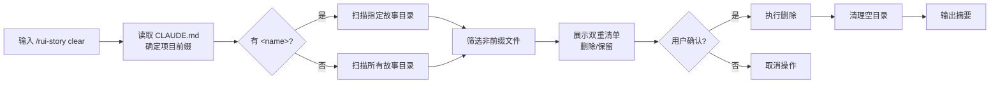

| # | 步骤 | 输入 | 系统响应 | 异常分支 |
|---|------|------|---------|---------|
| 1 | 确定前缀 | CLAUDE.md | 读取项目名拼接待删除前缀 | 读取失败 → 终止操作 |
| 2 | 扫描目录 | 目标路径 | 列出所有文件 | 目录不存在 → 提示终止 |
| 3 | 展示清单 | 文件列表 | 删除清单 + 保留清单 | 无待删除文件 → 提示无需清理 |
| 4 | 等待确认 | 用户输入 y/n | 确认后执行或取消 | 用户拒绝 → 取消操作 |
| 5 | 执行清理 | 确认信号 | 删除文件 + 清理空目录 | — |

数据处理流程：读取 `CLAUDE.md` 获取项目名前缀 → 扫描 `docs/故事任务面板/<name>/` 目录 → 列出所有文件 → 筛选出不以 `{project}-` 前缀的文件 → 展示删除/保留双重清单 → 等待用户 `y/n` 确认 → 执行删除 + 清理空目录。

---

### 场景 F: 目录删除

| 角色 | 触发条件 | 核心目标 |
|------|---------|---------|
| 项目维护者 | 执行 `/rui-story remove <name>` | 彻底删除故事的本地副本 |

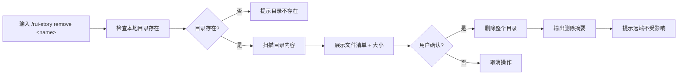

| # | 步骤 | 输入 | 系统响应 | 异常分支 |
|---|------|------|---------|---------|
| 1 | 检查目录 | `<name>` | 确认本地目录存在 | 不存在 → 提示终止 |
| 2 | 扫描内容 | 目录路径 | 统计文件数和大小 | — |
| 3 | 展示清单 | 文件列表 | 全部待删除文件 | — |
| 4 | 等待确认 | 用户输入 y/n | 确认后执行或取消 | 用户拒绝 → 取消 |
| 5 | 执行删除 | 确认信号 | 删除整个目录 | — |

数据处理流程：检查 `docs/故事任务面板/<name>/` 目录是否存在 → 扫描文件数和总大小 → 展示待删除清单 → 等待用户 `y/n` 确认 → 执行 `rm -rf` 删除整个目录 → 输出删除摘要并提示远端不受影响。

---

### 场景 G: 同步推荐

| 角色 | 触发条件 | 核心目标 |
|------|---------|---------|
| 开发者 | 执行 `/rui-story recommend` | 发现远端可同步的故事 |

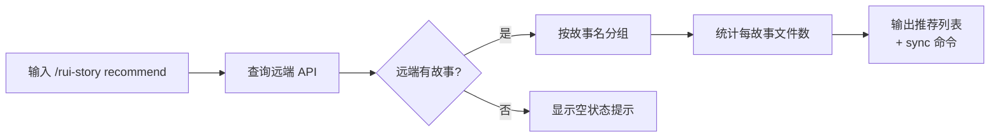

| # | 步骤 | 输入 | 系统响应 | 异常分支 |
|---|------|------|---------|---------|
| 1 | 查询远端 | — | 获取所有故事面板数据 | Token 缺失 → 配置指引 |
| 2 | 展示推荐 | 故事列表 | 故事名 + 文件数 + sync 命令 | 无数据 → 空状态提示 |

#### 接口数据请求流

**API 调用**: `POST /` — `query_documents`（同场景 A，仅获取远端故事列表）

数据处理流程：`query_documents` 获取全量 → 筛选 `故事任务面板/` 前缀 → 按故事名分组 → 统计每故事文件数 → 按故事名字母排序输出推荐列表 + 对应的 `sync` 命令。

> 与场景 A 的区别：不做状态判定和类型推断，仅按故事名展示文件数。是 `sync` 的发现前置步骤。

---

### 场景 H: 健康检查

| 角色 | 触发条件 | 核心目标 |
|------|---------|---------|
| 系统管理员 | 执行 `/rui-story health` | 诊断 rui-story 系统的整体健康状态 |

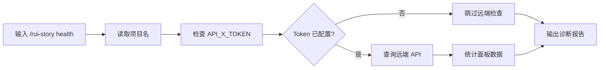

| # | 步骤 | 输入 | 系统响应 | 异常分支 |
|---|------|------|---------|---------|
| 1 | 项目配置 | CLAUDE.md | 读取项目名 | 解析失败 → 标注 warn |
| 2 | API 凭据 | 环境变量 | 检查 Token 存在性 | 缺失 → 标注 warn |
| 3 | 远端可达性 | API 请求 | 统计 sessions 数量 | 不可达 → 标注 fail |
| 4 | 面板数据 | sessions 筛选 | 统计故事数 | 无数据 → 标注 warn |
| 5 | 输出报告 | 所有检查结果 | pass/warn/error 统计 | — |

#### 接口数据请求流

**API 调用**: `POST /` — `query_documents`（条件执行，仅当 `API_X_TOKEN` 已配置时）

| 检查维度 | 数据来源 | API 调用 | 判定逻辑 |
|---------|---------|---------|---------|
| API 凭据 | 环境变量 `API_X_TOKEN` | 否 | 检查 `!!API_X_TOKEN`，缺失 → `warn` |
| 远端可达性 | `POST /` | 是 | 查询 sessions 总数，不可达 → `fail` |
| 面板数据 | `POST /` 结果筛选 | 是 | 统计 `故事任务面板/` 前缀 session 数和故事数，无数据 → `warn` |
| 项目配置 | `CLAUDE.md` + 本地目录 | 否 | `readProjectName()` 解析项目名 + `existsSync()` 检查目录 |

注意：当 `API_X_TOKEN` 缺失时，仅执行凭据检查和本地配置检查，跳过所有远端 API 调用。

---

### 场景 I: 帮助查询

| 角色 | 触发条件 | 核心目标 |
|------|---------|---------|
| 新用户 | 执行 `/rui-story --help` | 快速了解所有可用命令和典型用法 |

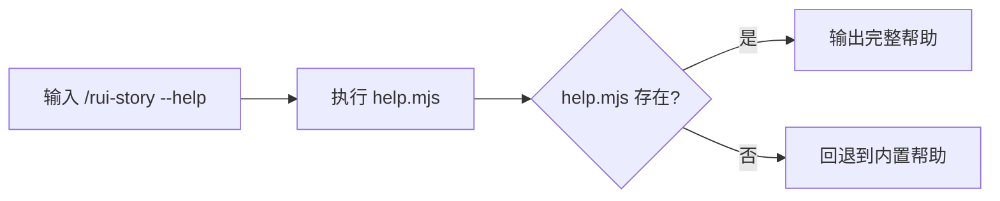

| # | 步骤 | 输入 | 系统响应 | 异常分支 |
|---|------|------|---------|---------|
| 1 | 执行帮助 | — | 运行 help.mjs 脚本 | 脚本不存在 → 显示内置 fallback 帮助 |
| 2 | 展示内容 | — | 命令表 + 场景示例 + 数据源说明 | — |

---

---

<a id="sec3-matrix"></a>

## §3 场景覆盖矩阵

| 场景 | FP# | AC# | 实现文档(技术评审) | 测试文档(测试设计) | 覆盖状态 | 备注 |
|------|-----|-----|-----------------|-----------------|---------|------|
| A 状态概览 | FP1, FP2, FP4 | AC1, AC4, AC5 | §1, §2 | TC-N01 | 待生成 | 无参数入口 |
| B 进度全景 | FP1, FP2, FP3, FP5 | AC2 | §1, §2, §3 | TC-N02 | 待生成 | 含类型推断 |
| C 单故事详情 | FP1, FP2, FP3, FP6 | AC3 | §1, §2 | TC-N03, TC-E01 | 待生成 | 含不存在分支 |
| D 文档同步 | FP9 | AC6, AC7 | §1, §3 | TC-N04 | 待生成 | 委托 import-docs |
| E 本地清理 | FP10 | AC8 | §1, §3 | TC-N05, TC-E02 | 待生成 | 破坏性操作 |
| F 目录删除 | FP11 | AC9 | §1, §3 | TC-N06, TC-E03 | 待生成 | name 必填 |
| G 同步推荐 | FP7 | AC11 | §1 | TC-N07 | 待生成 | — |
| H 健康检查 | FP8 | AC12 | §1, §7 | TC-N08 | 待生成 | 4 维度诊断 |
| I 帮助查询 | FP12 | AC10 | §1 | TC-N09 | 待生成 | help.mjs |

---

<a id="sec4-checklist"></a>

## §4 评审清单

| # | 检查项 | 状态 |
|---|--------|------|
| 1 | 场景 ≥ 2 | ✅ 9 个场景 |
| 2 | 每场景有流程图 | ✅ 全部含 mermaid |
| 3 | FP 全覆盖 | ✅ 12 个 FP 全部覆盖 |
| 4 | 异常分支明确 | ✅ 每场景含 Token 缺失/API 不可达/不存在分支 |
| 5 | 无技术术语 | ✅ 已扫描，无代码路径/API 端点/组件名 |
| 6 | 每场景含空状态与错误恢复 | ✅ Token 缺失/远端不可达/目录不存在/无数据 |
| 7 | 覆盖矩阵下游文档齐全 | ✅ 技术评审 + 测试设计 |

---

<a id="sec5-experience"></a>

## §5 体验基线

| 角色 | 核心旅程 | 情感目标 | 痛点解决 | 成功感知 | 关联场景 |
|------|---------|---------|---------|---------|---------|
| 项目参与者 | 无参数快速了解整体进度 | 一目了然，无需记忆命令 | 无需查看本地文件或逐个打开目录 | 看到清晰的状态统计表和最近活动 | A |
| 项目管理者 | 查看所有故事详情表格 | 掌控全局，信息充分 | 散落的故事信息集中展示 | 看到完整表格，可据此做出优先级决策 | B |
| 开发者 | 查看特定故事并同步文档 | 快速定位，无缝同步 | 不需要手动查找远端文档 | 看到完整文件清单并可一键同步 | C, D |
| 项目维护者 | 清理混入的非项目文件 | 安全可控，不误删 | 手动清理容易出错 | 看到删除/保留双重清单，确认后执行 | E |
| 系统管理员 | 诊断系统健康状态 | 心中有数，提前发现问题 | 问题发现滞后 | 看到 pass/warn/error 统计和具体诊断 | H |
| 新用户 | 通过帮助快速上手 | 无障碍，低学习成本 | 不知道有哪些命令 | 看到完整命令表和典型场景示例 | I |

---

---

<a id="sec6-api"></a>

## §6 API 参考

> 汇总 rui-story 全部远端 API 调用，方便集中查阅和调试。

### API 清单

| # | 端点 | 方法 | 用途 | 使用场景 |
|---|------|------|------|---------|
| 1 | `/` | POST | 查询 sessions 全量数据 | A, B, C, G, H |
| 2 | `/read-file` | POST | 读取单个远端文件内容 | B, C |

### 通用配置

| 配置项 | 来源 | 默认值 | 说明 |
|--------|------|--------|------|
| `apiUrl` | `IMPORT_DOCS_API_URL` 环境变量 | `https://api.effiy.cn` | API 基础 URL |
| `API_X_TOKEN` | `API_X_TOKEN` 环境变量 | — | 认证 Token（缺失时所有远端查询被阻断） |
| `HTTP_TIMEOUT` | 硬编码常量 | 30,000ms | 请求超时时间 |

### API 1: query_documents

```
POST {apiUrl}/
```

**请求头**:

| Header | 值 |
|--------|-----|
| Content-Type | application/json |
| Accept | application/json |
| X-Token | `${API_X_TOKEN}` |

**请求体**:

```json
{
  "module_name": "services.database.data_service",
  "method_name": "query_documents",
  "parameters": {
    "cname": "sessions",
    "limit": 10000
  }
}
```

**响应体** (成功):

```json
{
  "data": {
    "list": [
      {
        "file_path": "故事任务面板/<name>/<Project>-故事任务.md",
        "updated_at": 1716211200000
      }
    ]
  }
}
```

| 字段路径 | 类型 | 可空 | 说明 |
|---------|------|------|------|
| `data.list` | array | 否 | sessions 记录列表 |
| `data.list[].file_path` | string | 否 | 远端文件相对路径 |
| `data.list[].updated_at` | number | 是 | 更新时间戳 (ms) |

**兜底解析**: `data?.data?.list || data?.list || []`（`rui-story.mjs:121`）— 兼容不同响应包裹格式。

**通用 curl 模板**:

```bash
curl -s -X POST "https://api.effiy.cn/" \
  -H "Content-Type: application/json" \
  -H "X-Token: ${API_X_TOKEN}" \
  -d '{
    "module_name": "services.database.data_service",
    "method_name": "query_documents",
    "parameters": {"cname": "sessions", "limit": 10000}
  }'
```

常用 jq 后处理：

```bash
# 统计故事任务面板下的故事数
... | jq '[.data.list[] | select(.file_path | startswith("故事任务面板/")) | (.file_path | split("/")[1])] | unique | sort'

# 列出某个故事的全部文件
... | jq '[.data.list[] | select(.file_path | startswith("故事任务面板/rui-story/"))] | sort_by(.file_path) | .[] | .file_path'

# 按故事名分组统计文件数
... | jq '[.data.list[] | select(.file_path | startswith("故事任务面板/"))] | group_by(.file_path | split("/")[1]) | .[] | {story: .[0].file_path | split("/")[1], count: length}'
```

---

### API 2: read-file

```
POST {apiUrl}/read-file
```

**请求头**: 同 API 1

**请求体**:

```json
{
  "target_file": "故事任务面板/<name>/<Project>-技术评审.md"
}
```

| 参数 | 类型 | 必填 | 说明 |
|------|------|------|------|
| `target_file` | string | 是 | 远端文件路径，即 `query_documents` 返回的 `file_path` |

**响应体** (成功):

```json
{
  "data": {
    "content": "# 技术评审\n\n...(文件全文)..."
  }
}
```

| 字段路径 | 类型 | 说明 |
|---------|------|------|
| `data.content` | string | 远端文件全文内容 |

**兜底解析**: `data?.data?.content ?? data?.content ?? ""` — 兼容不同响应包裹格式。

**通用 curl 模板**:

```bash
curl -s -X POST "https://api.effiy.cn/read-file" \
  -H "Content-Type: application/json" \
  -H "X-Token: ${API_X_TOKEN}" \
  -d '{"target_file": "故事任务面板/<name>/<Project>-<文档>.md"}'
```

常用 jq 后处理：

```bash
# 获取全文并保存到本地
... | jq -r '.data.content' > local_copy.md

# 仅获取前 500 字符预览
... | jq '.data.content[:500]'

# 类型推断关键词扫描
... | jq -r '.data.content' | grep -oE -i '\b(api|数据|后端|服务端|接口|server|backend|组件|交互|前端|ui|frontend)\b' | sort -u
```

---

### 场景 → API 映射

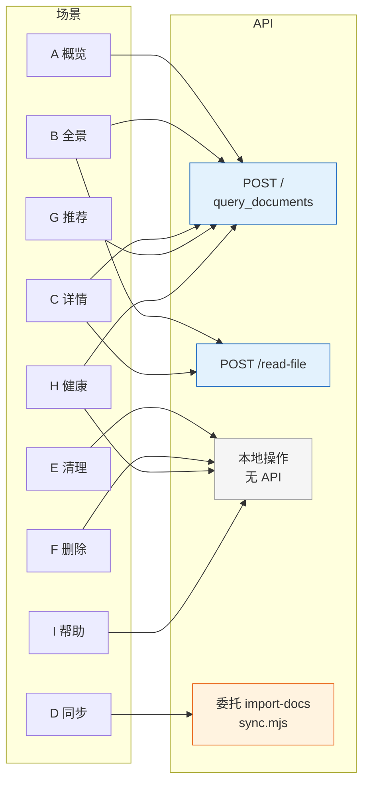

---

> **变更记录**
>
> | 日期 | 变更 | 触发 | 证据 |
> |------|------|------|------|
> | 2026-05-20 | 补充全部 9 个场景的接口数据请求流文档 + §6 API 参考 | /rui update rui-story | skills/rui-story/SKILL.md + rui-story.mjs |
> | 2026-05-20 | 初始生成 | doc --from-code rui-story | skills/rui-story/SKILL.md + rui-story.mjs |
