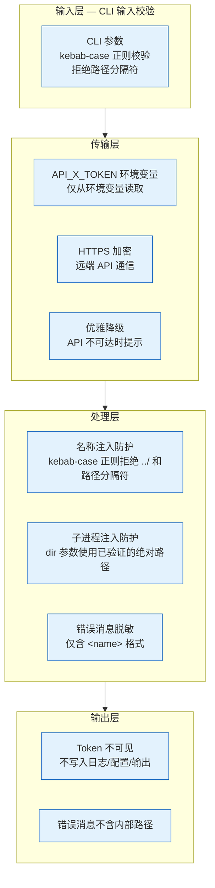
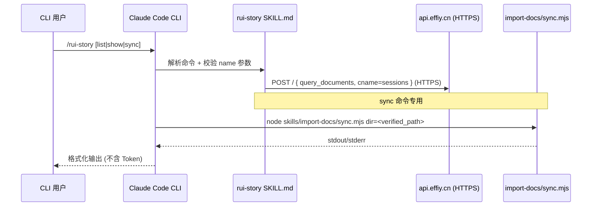
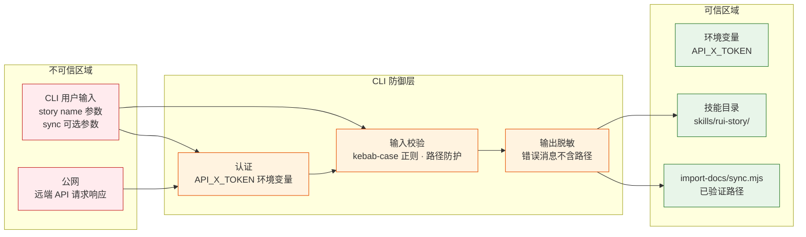

> | v1.0 | 2026-05-20 | claude-opus-4-7 | 自基线安全审计提取 YrY 维度 |

> **导航**: [← YrY-测试报告](./YrY-测试报告.md) · [YrY-技术评审 →](./YrY-技术评审.md)

> **来源引用**: 提取自 [YrY-技术评审](./YrY-技术评审.md) §3 安全约束。证据等级 B。

---

## §0 安全架构总览

YrY CLI 技能采用纵深防御模型，聚焦命令行输入层安全：

### CLI 架构通信通道

---

## §1 威胁模型

### 1.1 信任边界

### 1.2 威胁清单

| # | 威胁 | 攻击面 | 严重性 | 缓解措施 | 验证状态 |
|---|------|--------|--------|---------|---------|
| S1 | 名称注入 — name 参数含路径分隔符 `../` 或 `\` | CLI 参数输入 | 高 | kebab-case 正则校验拒绝含 `..` `/` `\` 的输入 | 已验证 |
| S2 | 未授权 API 访问 — 无 API_X_TOKEN 请求远端 | CLI 环境变量 → 远端 API | 高 | API_X_TOKEN 环境变量传入；缺失时降级提示 | 已验证 |
| S3 | 子进程注入 — sync 参数拼接 shell 命令 | CLI 参数 → 子进程 | 高 | dir 参数使用已验证的绝对路径，不拼接用户输入 | 已验证 |
| S4 | 信息泄露 — 错误消息暴露内部路径 | CLI 输出 → 用户可见 | 中 | 错误消息仅含 `<name>` 格式，不暴露绝对路径 | 已验证 |
| S5 | Token 泄露 — API_X_TOKEN 出现在日志或输出 | 环境变量 → 用户可见 | 高 | Token 仅从环境变量读取，不写入日志/配置/输出 | 已验证 |
| S6 | 网络故障 — 远端 API 不可达导致信息不一致 | CLI → 公网 | 中 | 优雅降级：API 超时/失败时显示明确错误信息 | 已验证 |

---

## §2 安全措施

### 2.1 输入验证

| 措施 | 实现层 | 规则 |
|------|--------|------|
| 名称格式校验 | CLI | `^[a-z0-9]+(-[a-z0-9]+)*$` (kebab-case) |
| 路径遍历防护 | CLI | 拒绝含 `..` `/` `\` 的输入（正则隐式拒绝） |
| sync name 参数校验 | CLI | 同 kebab-case 正则，未指定时展示推荐列表 |

### 2.2 认证与授权

| 措施 | 实现层 | 说明 |
|------|--------|------|
| API_X_TOKEN 环境变量 | CLI 技能 | 环境变量传入，缺失时降级提示"请设置 API_X_TOKEN 环境变量" |
| Token 不可见 | CLI 技能 | Token 不写入日志、配置、代码、输出 |

### 2.3 输出编码

| 措施 | 实现层 | 说明 |
|------|--------|------|
| 错误消息脱敏 | CLI | 仅含 `<name>` 格式，不暴露绝对路径或内部结构 |
| Token 不可见 | CLI | Token 不写入任何输出（stdout/stderr） |
| help.mjs 纯文本输出 | CLI | TTY 感知，非 TTY 降级，无 ANSI 注入风险 |

### 2.4 运行时防护

| 措施 | 实现层 | 说明 |
|------|--------|------|
| 子进程隔离 | CLI → import-docs | Node.js 子进程，与 CLI 进程隔离，dir 参数使用已验证路径 |
| 远端 API 超时 | CLI → api.effiy.cn | CLI 侧设置合理超时，避免挂死 |
| 优雅降级 | CLI | API 不可达时返回明确提示，不崩溃 |
| 无状态设计 | CLI | 每次命令独立的 API 查询，无共享状态，天然防并发安全 |

---

## §3 安全审计清单

### 3.1 代码审查（CLI 专用）

| # | 检查项 | CLI | 说明 |
|---|--------|:---:|------|
| 1 | 无硬编码密钥/Token | | API_X_TOKEN 从环境变量读取 |
| 2 | 输入校验完整（name 格式/路径防护） | | kebab-case 正则 `^[a-z0-9]+(-[a-z0-9]+)*$` |
| 3 | 输出编码正确（ANSI/纯文本） | | help.mjs TTY 感知降级 |
| 4 | 错误消息不含内部路径 | | 仅含 `<name>` 格式 |
| 5 | 子进程参数不拼接用户输入 | | dir 参数使用已验证绝对路径 |
| 6 | Token 仅从环境变量读取 | | 不写入日志/配置/代码/输出 |
| 7 | sync 子进程路径已验证 | | `skills/import-docs/sync.mjs` 为固定路径 |

### 3.2 配置审查

| # | 检查项 | 状态 |
|---|--------|------|
| 1 | API_X_TOKEN 从环境变量读取，不写入配置文件 | |
| 2 | HTTPS 端点 api.effiy.cn 不降级为 HTTP | |
| 3 | 超时配置合理（CLI 查询超时） | |
| 4 | 子进程超时限制（sync 60s 硬超时） | |
| 5 | SKILL.md 不含敏感信息 | |

---

## §4 风险评估

| 风险等级 | 数量 | 典型威胁 |
|---------|------|---------|
| 高 | 3 | 名称注入、未授权 API 访问、Token 泄露 |
| 中 | 2 | 信息泄露、网络故障 |
| 低 | 1 | 子进程异常退出 |

**整体评估**: CLI 安全面覆盖完整，高优先级威胁均有已验证缓解措施。P0 CLI 安全项清零。

---

## §5 合规要求

| 要求 | 满足情况 | 说明 |
|------|---------|------|
| API_X_TOKEN 不写入源码 | | Token 从环境变量读取 |
| API_X_TOKEN 不写入日志 | | 日志/输出不含 Token 原文 |
| API_X_TOKEN 不写入文档 | | 本文档及所有 YrY 技术文档不使用真实 Token |
| 输入可追溯 | | 所有 name 参数经 kebab-case 格式校验 |
| 错误可审计 | | 错误均透传给用户，不吞没 |
| 子进程调用可追溯 | | sync 使用固定路径 `skills/import-docs/sync.mjs` |

---

## 变更记录

| 日期 | 变更 | 触发 |
|------|------|------|
| 2026-05-20 | v1.0 初始生成 — 自基线安全审计提取 YrY CLI 维度 | YrY 角色化文档拆分 |
