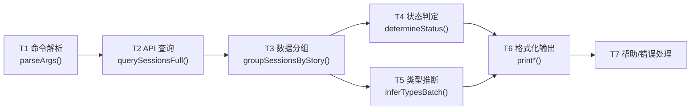
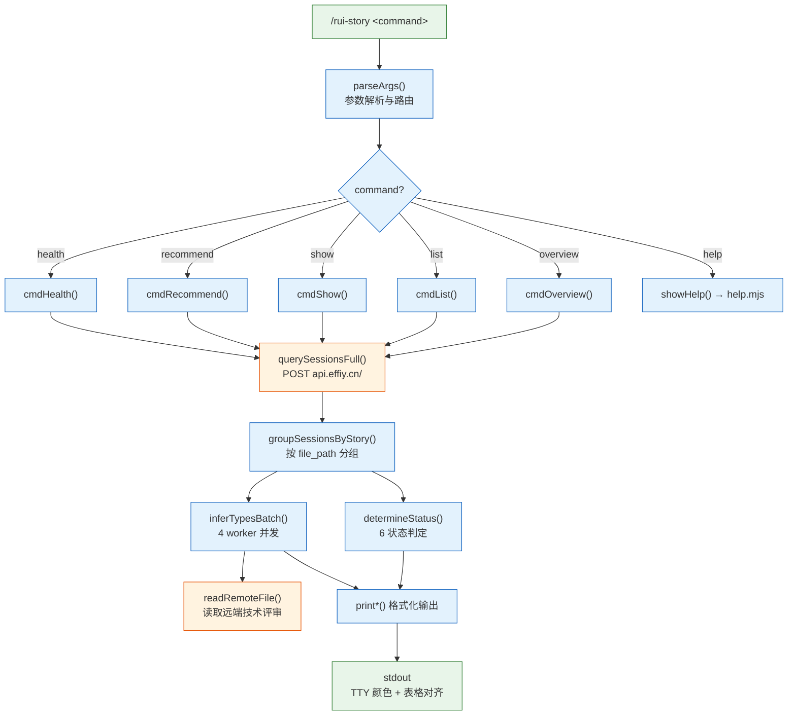
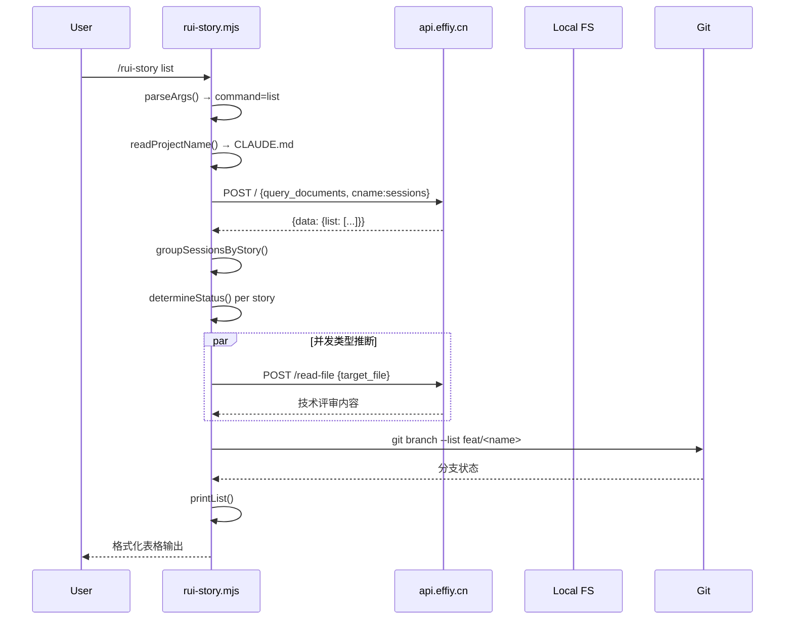
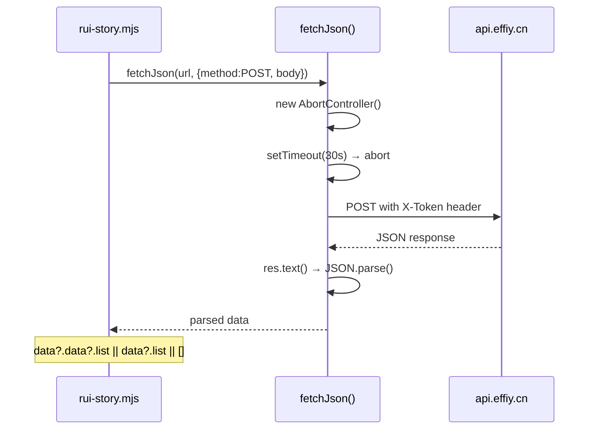
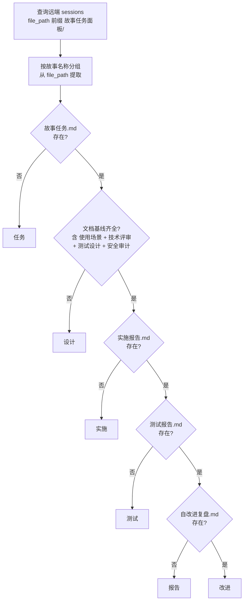
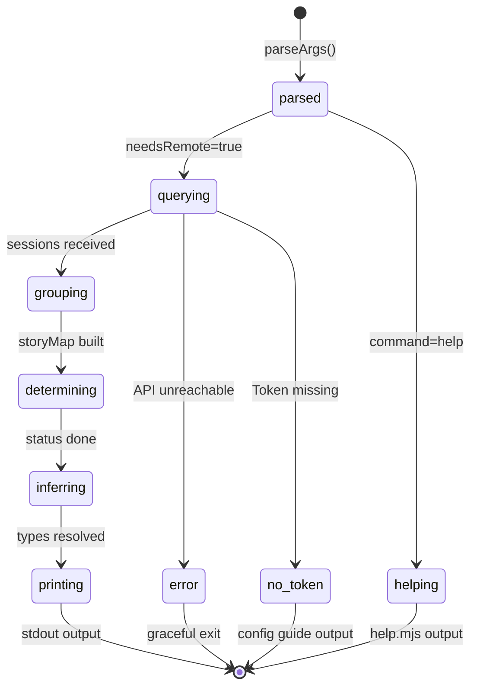
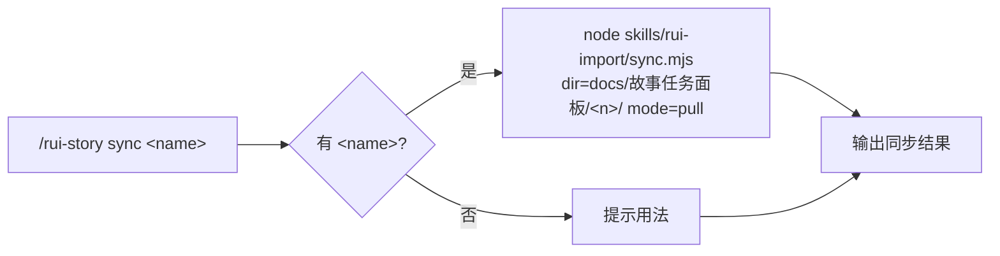
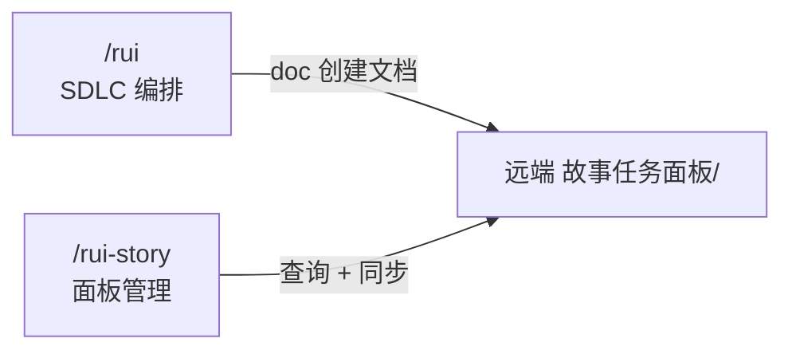

> | v1.0.0 | 2026-05-26 | deepseek-v4-pro | 🌿 feat/rui-story | 📎 [CLAUDE.md](../../../CLAUDE.md) |

> **导航**: [← YrY-使用场景](./YrY-使用场景.md) · [YrY-测试设计 →](./YrY-测试设计.md) · [YrY-安全审计 →](./YrY-安全审计.md)

> **来源引用**: 从 `skills/rui-story/SKILL.md` 操作边界 + 数据源 + 状态判定规约反推。证据 Level B + 规约路径。基线初始文档。

[§0 设计决策与任务规划](#sec0-design) · [§1 系统架构](#sec1-architecture) · [§2 数据源与 API 契约](#sec2-api) · [§3 状态判定引擎](#sec3-status) · [§4 委托机制](#sec4-delegation) · [§5 安全设计](#sec5-security) · [§6 评审清单](#sec6-checklist)

---

### 主要价值

- 🎯 统一远端查询架构 — POST API + sessions 集合 + 文件路径筛选
- 🔒 数据边界清晰 — 查询零本地读取，sync 完全委托 rui-import
- ⚡ 并发类型推断 — 4 worker 并发读取技术评审内容判定项目类型
- 📊 确定性脚本执行 — 命令行参数解析 → 分支路由 → 格式化输出，无 AI 介入

---

## §0 设计决策与任务规划

### §0.0 基线溯源

| 本设计章节 | 实现 YrY-故事任务 | 服务 YrY-使用场景 | 覆盖状态 |
|-----------|-----------------|-----------------|---------|
| §1 系统架构 | Story 1 FP1 | 场景 A/B/C | 已覆盖 |
| §2 API 接口 | Story 1 FP1 | 场景 A/B/C/D/E/F | 已覆盖 |
| §3 状态判定 | Story 1 FP2 FP3 | 场景 A/B/C | 已覆盖 |
| §4 委托机制 | Story 2 FP9 | 场景 D | 已覆盖 |
| §5 安全设计 | Story 1 R1–R6 | 全部场景 | 已覆盖 |

### §0.1 设计决策

| 决策领域 | 选定方案 | 选择理由 | 详见 |
|---------|---------|---------|------|
| 数据源 | 远端 API 为默认源 | 故事文档存储在远端，本地可能过时 | §2 |
| API 认证 | X-Token 请求头 | 简单 Bearer 风格，环境变量注入 | §2, §5 |
| 状态判定 | file_path 前缀匹配 | 远端 sessions 的 file_path 包含故事名 | §3 |
| 类型推断 | 读取远端技术评审内容 | 基于实际内容推断，不依赖元数据标签 | §3 |
| 并发策略 | 4 worker 并发 | 平衡远端负载与响应速度 | §1 |
| sync 委托 | 完全委托 rui-import | 避免重复实现同步逻辑 | §4 |
| 帮助系统 | 独立 help.mjs 脚本 | 可独立运行，不依赖主逻辑 | §1 |
| 项目名解析 | CLAUDE.md 多模式匹配 | 兼容不同项目格式，fallback 目录名 | §3 |

### §0.2 任务规划

| ID | 描述 | 工作量 | 依赖 | 交付物 | 门禁 |
|----|------|--------|------|--------|------|
| T1 | CLI 参数解析与路由 | S | — | parseArgs() + main() switch | 所有命令正确路由 |
| T2 | 远端 API 查询模块 | M | T1 | fetchJson() + querySessionsFull() | Token 注入 + 超时控制 |
| T3 | 故事数据分组与状态判定 | M | T2 | groupSessionsByStory() + determineStatus() | 6 状态正确判定 |
| T4 | 类型推断引擎 | M | T2, T3 | inferType() + inferTypesBatch() + readRemoteFile() | 并发推断 + 失败默认 meta |
| T5 | 格式化输出模块 | M | T3, T4 | printOverview/List/Show/Recommend/Health() | TTY 颜色 + 列对齐 |
| T6 | 帮助系统 | S | — | help.mjs + fallbackHelp() | 场景示例完整 |
| T7 | 错误处理与降级 | S | T1 | Token 缺失提示 + API 不可达处理 | 优雅退出不出错 |

---

## §1 系统架构

### 效果示意

### 1.1 模块清单

| 变更类型 | 模块/文件 | 职责 |
|---------|----------|------|
| 新增 | `skills/rui-story/rui-story.mjs` | 主入口：参数解析、API 查询、状态判定、类型推断、格式化输出 |
| 新增 | `skills/rui-story/SKILL.md` | 规约定义：命令族全景、操作边界、数据源、状态判定、核心规则 |
| 新增 | `skills/rui-story/help.mjs` | 帮助系统：命令表 + 场景示例 + 数据源说明 |
| 依赖 | `skills/rui-import/sync.mjs` | sync 命令委托目标 |
| 数据 | `CLAUDE.md` | 项目名解析源（readProjectName） |

### 1.2 通信通道

| 通道 | 方向 | 协议 | Payload | 错误处理 |
|------|------|------|---------|---------|
| CLI → API (query) | 出站 | HTTPS POST | `{module_name, method_name, parameters: {cname, limit}}` | 超时 30s → 优雅退出 |
| CLI → API (read-file) | 出站 | HTTPS POST | `{target_file}` | 失败 → 默认 meta |
| CLI → Local FS (read) | 本地 | fs.readFileSync | CLAUDE.md | 不存在 → null/fallback |
| CLI → Git (branch) | 本地 | execSync | `git branch --list "feat/<name>"` | 异常 → null |

---

## §2 数据源与 API 契约

### 2.1 远端查询接口

| 接口 | 方法 | 路径 | 请求体 | 响应体 | 错误码 |
|------|------|------|--------|--------|--------|
| 查询 sessions | POST | `/` | `{module_name: "services.database.data_service", method_name: "query_documents", parameters: {cname: "sessions", limit: 10000}}` | `{data: {list: [{file_path, title, tags, createdAt, updatedAt}]}}` | HTTP 4xx/5xx → 优雅退出 |
| 读取文件 | POST | `/read-file` | `{target_file: "故事任务面板/<name>/..."}` | `{data: {content: "..."}}` | HTTP 错误 → 默认 meta |

### 2.2 请求流程

### 2.3 认证

| 维度 | 配置 |
|------|------|
| 方式 | X-Token 请求头 |
| 来源 | 环境变量 `API_X_TOKEN` |
| 注入 | fetchJson() 自动附加到所有请求 |
| 缺失处理 | 查询命令输出配置指引后退出 |

### 2.4 场景 → API 映射速查

| 命令 | API 1 (query_documents) | API 2 (read-file) | 本地操作 |
|------|:---:|:---:|:---:|
| `/rui-story` (概览) | ✓ | — | — |
| `/rui-story list` | ✓ | ✓ (并发推断类型) | git branch |
| `/rui-story show <name>` | ✓ | ✓ (推断类型) | git branch |
| `/rui-story recommend` | ✓ | — | — |
| `/rui-story health` | ✓ (条件) | — | CLAUDE.md + 目录 |
| `/rui-story sync <name>` | 委托 rui-import | 委托 rui-import | 写入本地 |
| `/rui-story --help` | — | — | ✓ (本地 help.mjs) |

---

## §3 状态判定引擎

### 3.1 6 状态判定

| 状态 | 条件 | 含义 |
|------|------|------|
| `任务` | 故事任务.md 不存在于远端 | 目录空或仅有元数据 |
| `设计` | 故事任务存在于远端，文档基线不完整 | 文档生成进行中 |
| `实施` | 远端文档基线齐全，实施报告不存在 | 等待编码 |
| `测试` | 实施报告存在于远端，测试报告不存在 | 实现验证中 |
| `报告` | 测试报告存在于远端，自改进复盘不存在 | 可交付 |
| `改进` | 自改进复盘存在于远端 | 持续改进中 |

### 3.2 类型推断规则

| 技术评审关键词 | 判定 |
|--------------|------|
| 含后端关键词（api/数据/后端/服务端/接口/数据库/server/backend/服务/路由）且含前端关键词 | fullstack |
| 仅含后端关键词 | backend |
| 仅含前端关键词（组件/交互/样式/前端/页面/ui/frontend/界面/布局/渲染/响应式） | frontend |
| 均不含或无法读取 | meta |

项目类型按远端文件推断：技术评审含后端章节(API/数据) = 含后端；技术评审含前端章节(组件/交互/样式) = 含前端；两者均有 = fullstack；均无或无法判定 = meta。

### 3.3 模块接口

| 函数 | 类型 | 签名 | 入参 | 返回 | 副作用 |
|------|------|------|------|------|--------|
| parseArgs | () => opts | 无，读 process.argv | — | `{command, name?}` | 无 |
| findProjectRoot | (startDir) => string | `resolve(startDir)` → 向上查找 `.git`/`.claude` | — | 项目根路径 | 无 |
| readProjectName | (projectRoot) => string\|null | 3 模式正则匹配 + fallback | 项目根路径 | 项目名字符串 | 读 CLAUDE.md |
| fetchJson | async (url, options) => any | fetch + AbortController(30s) + X-Token 注入 | URL + fetch options | JSON 解析结果 | 网络请求 |
| querySessionsFull | async (apiUrl) => [] | POST query_documents | API URL | sessions 数组 | 网络请求 |
| readRemoteFile | async (apiUrl, remotePath) => any | POST /read-file | API URL + 远端路径 | 文件内容对象 | 网络请求 |
| extractStoryName | (filePath) => string\|null | split("/") 定位 故事任务面板 索引+1 | file_path 字符串 | 故事名 | 无 |
| groupSessionsByStory | (sessions) => Map | 筛选 故事任务面板/ 前缀 → 按故事名分组 | sessions 数组 | Map<name, sessions[]> | 无 |
| determineStatus | (fileBasenames, projectPrefix) => string | 6 级链式判定 | 文件名集合 + 前缀 | 状态字符串 | 无 |
| inferType | async (apiUrl, storySessions, projectPrefix) => string | 远端读取技术评审 → 关键词匹配 | API URL + sessions + 前缀 | 类型字符串 | 网络请求 |
| inferTypesBatch | async (apiUrl, storyMap, projectPrefix) => Map | 4 worker 并发 inferType | API URL + storyMap + 前缀 | Map<name, type> | 网络请求 |
| checkGitBranch | (name) => string\|null | `git branch --list "feat/<name>"` | 故事名 | 分支名或 null | execSync |

### 3.4 运行状态机

| 状态/阶段 | 变量 | 范围 |
|----------|------|------|
| 命令解析 | `opts.command`, `opts.name` | overview/list/show/recommend/health/help |
| API 查询 | `sessions[]` | 远端 sessions 集合 |
| 故事分组 | `storyMap: Map<name, sessions[]>` | 故事任务面板/ 前缀筛选 |
| 状态判定 | 每故事 `status` | 6 种状态枚举 |
| 类型推断 | `typeMap: Map<name, type>` | 4 种类型枚举 |
| 输出 | stdout 格式化文本 | TTY 颜色 + 列对齐 |

---

## §4 委托机制

### 4.1 sync 委托 rui-import

| 属性 | 值 |
|------|-----|
| 委托目标 | `skills/rui-import/sync.mjs` |
| 传递参数 | `dir=docs/故事任务面板/<name>/` + `mode=pull` |
| 数据流方向 | 远端 → 本地（下载覆盖） |
| 错误处理 | rui-import 失败 → 错误透传到 stdout |

### 4.2 与 rui 管线的关系

rui-story 从 rui 接管了 `list` 命令。其余所有管线阶段（doc / code / update）仍由 rui 编排。面板管理独立于 SDLC 编排。

---

## §5 安全设计

| # | 威胁 | 信任边界 | 缓解措施 | 优先级 |
|---|------|---------|---------|--------|
| 1 | Token 泄露到日志 | CLI 进程 → stdout/stderr | API_X_TOKEN 不输出到任何日志或错误信息；仅检测存在性 | P0 |
| 2 | 命令注入 via git | CLI → shell | execSync 使用硬编码命令模板 + 参数插值来自受控的故事名（kebab-case 约束） | P0 |
| 3 | 路径遍历 via name | 用户输入 → 文件系统 | name 约束为 kebab-case `^[a-z0-9]+(-[a-z0-9]+)*$`，不包含 `../` | P0 |
| 4 | 未授权远端访问 | CLI → API | X-Token 认证 + HTTPS 传输 | P0 |
| 5 | 信息泄露 via 错误信息 | API 响应 → stdout | 错误信息截断至 500 字符 | P1 |
| 6 | 拒绝服务 — 并发请求 | CLI → API | CONCURRENCY=4 + HTTP_TIMEOUT=30s | P1 |

---

## §6 评审清单

| # | 检查项 | 状态 |
|---|--------|------|
| 1 | 权限最小化 — Token 仅通过环境变量注入 | ✅ 设计 |
| 2 | API 鉴权 — 所有请求带 X-Token | ✅ 设计 |
| 3 | 无硬编码密钥 — 源码中无 Token/密码 | ✅ 设计 |
| 4 | 输入校验完整 — kebab-case 约束 + 路径遍历防护 | ✅ 设计 |
| 5 | 基线溯源完备 — §0.0 全部章节映射 | ✅ 设计 |
| 6 | 效果示意完整 — §1 含 mermaid flowchart | ✅ 设计 |
| 7 | 命令注入防护 — execSync 参数受控 | ✅ 设计 |
| 8 | 错误处理优雅 — Token 缺失/API 不可达 | ✅ 设计 |
| 9 | 委托机制清晰 — sync 完全委托 rui-import | ✅ 设计 |
| 10 | 类型推断有降级 — 失败默认 meta | ✅ 设计 |

---

> **变更记录**
>
> | 日期 | 变更 | 触发 | 证据 |
> |------|------|------|------|
> | 2026-05-26 | 初始基线生成 — 7 任务模块、状态判定引擎、委托机制、安全设计 | doc --from-spec rui-story | skills/rui-story/SKILL.md |
