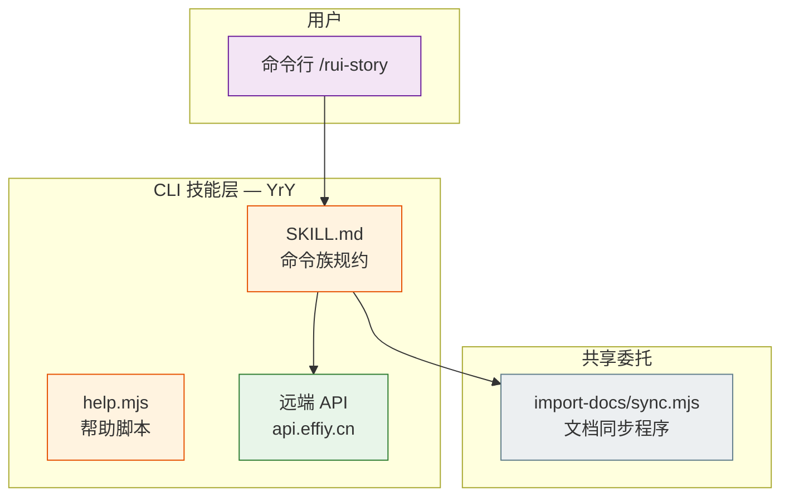
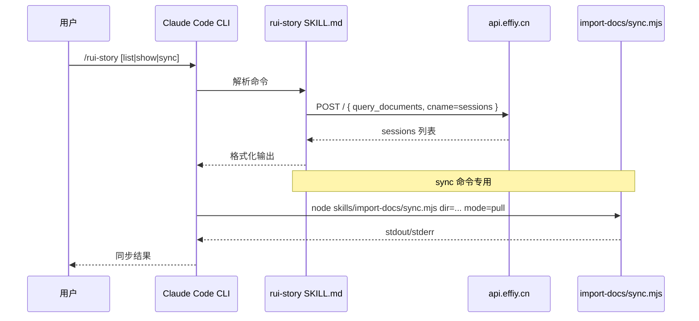
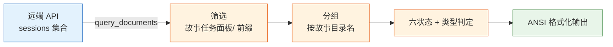
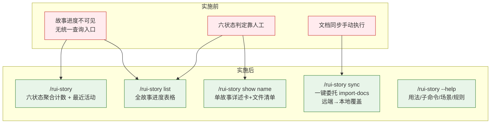

> | v2.1 | 2026-05-19 | deepseek-v4-pro | 自 后端-技术评审 拆分 |

> **导航**: [← YiAi-技术评审](./YiAi-技术评审.md) · [YrY-实施报告 →](./YrY-实施报告.md)

> **来源引用**: 由产品-故事任务 §1 Story 驱动。证据等级 B。

---

## §0 设计决策

故事任务面板 CLI 技能（YrY 项目）为命令行用户提供 `/rui-story` 命令族。

| 决策领域 | 选定方案 | 选择理由 |
|---------|---------|---------|
| 技能类型 | Claude Code Skill（SKILL.md + help.mjs） | 与项目 plugin 架构一致，用户通过 `/rui-story` 调用 |
| 数据源 | 远端 API `api.effiy.cn` sessions 集合 | 故事文档存储在远端知识库，本地为同步副本 |
| 查询模式 | 远端优先 — 所有查询操作直连远端 API | 确保数据一致性，不受本地文件状态影响 |
| 状态判定 | 远端 session file_path 存在性推断六状态 | 确定性规则，无状态机副作用 |
| 类型推断 | 按远端 03/04/06/07 文档存在性推断 | 最低成本推断，默认 meta 兜底 |
| 名称校验 | kebab-case 正则 | 命名规范硬约束，防止路径遍历 |
| 同步机制 | 委托 `node skills/import-docs/sync.mjs` | 完全委托，不自实现同步逻辑 |
| 帮助输出 | 独立 `help.mjs` Node.js 脚本 | 纯文本输出，语义常量提取，TTY 感知 |

### 架构全景

---

## §1 技能架构

### 1.1 技能模块

| 变更类型 | 模块/文件 | 职责 |
|---------|----------|------|
| 新增 | `skills/rui-story/SKILL.md` | 技能规约：命令族全景 · 状态判定 · 操作边界 |
| 新增 | `skills/rui-story/help.mjs` | 帮助输出脚本：格式化/语义常量/TTY 感知 |
| 不变 | `skills/import-docs/sync.mjs` | 文档同步脚本（被委托方） |

`rui-story` 是自包含 CLI 技能：零数据库依赖，零跨技能调用。仅委托 `import-docs/sync.mjs` 执行文档同步。

### 1.2 通信通道

| 通道 | 方向 | 协议 | 错误处理 |
|------|------|------|---------|
| 用户 → CLI | 入站 | 对话文本 | 名称格式校验 → kebab-case 提示 |
| CLI → 远端 API | 出站 | HTTPS POST | API_X_TOKEN 缺失 → 降级提示；网络故障 → 错误透传 |
| CLI → import-docs | 出站 | 子进程 stdio | 子进程异常 → 错误透传不吞没 |

### 1.3 命令清单

| 命令 | 类型 | 数据源 | 输入 | 输出 |
|------|------|--------|------|------|
| `/rui-story` | 只读 | 远端 API | 无 | 六状态聚合计数 + 最近活动列表 |
| `/rui-story list` | 只读 | 远端 API | 无 | 六列表格 |
| `/rui-story show <name>` | 只读 | 远端 API | kebab-case 名称 | 详述卡 |
| `/rui-story sync [<name>]` | 写入 | 远端 → 本地 | 可选名称 | 同步结果或推荐列表 |
| `/rui-story --help` | 只读 | help.mjs | 帮助标志 | 完整帮助文本 |

### 1.4 帮助脚本设计

`help.mjs` 独立脚本，TTY 感知（非 TTY 自动降级为纯文本）：
- 用法说明
- 只读命令：overview / list / show
- 写入命令：sync
- 场景示例：5 个常用场景
- 数据源说明：远端 API 为默认
- 操作边界：允许/禁止项
- 核心规则：硬约束

语义常量提取：`LEFT_COLUMN_WIDTH=28`, `COLUMN_MIN_PADDING=2`

---

## §2 数据模型

| Key/表/集合 | 类型 | 读频率 | 写频率 | 说明 |
|------------|------|--------|--------|------|
| 远端 `sessions` 集合 | API | 每命令 1 次 | 0（只读） | 故事文档远端存储 |
| `sessions[].file_path` | string | 每命令 N 次筛选 | 0 | 以 `故事任务面板/` 为前缀 |
| `sessions[].tags` | string[] | 每命令 1 次分组 | 0 | tags[0]=故事任务面板, tags[1]=故事目录名 |
| 本地 `.memory/rui-state.json` | 文件 | 每 show 1 次 | 0（只读） | blocked 状态标记（唯一本地读例外） |
| 本地 `docs/故事任务面板/<name>/` | 目录 | 0（查询不读） | sync 时写入 | 同步目标目录 |

---

## §3 安全约束

| # | 威胁 | 信任边界 | 缓解措施 | 优先级 |
|---|------|---------|---------|--------|
| 1 | 名称注入 — name 参数含路径分隔符 | 用户输入 → 文件系统 | kebab-case 正则校验拒绝含 `..` `\` 的输入 | P0 |
| 2 | 远端 API 未授权访问 — 无 Token 请求 | CLI → 远端 API | API_X_TOKEN 环境变量传入；缺失时降级提示 | P0 |
| 3 | 子进程注入 — sync 参数拼接命令 | CLI → 子进程 | dir 参数使用已验证的绝对路径 | P0 |
| 4 | 信息泄露 — 错误消息暴露内部路径 | CLI → 用户 | 错误消息仅含 `<name>` 格式 | P1 |
| 5 | Token 泄露 — API_X_TOKEN 出现在日志或输出 | 环境变量 → 用户可见 | Token 仅从环境变量读取，不写入日志/配置/输出 | P0 |
| 6 | 远端 API 不可达 — 网络故障导致命令不可用 | CLI → 公网 | 优雅降级：API 超时/失败时显示明确错误信息 | P1 |

---

## §4 性能与限制

| 维度 | 约束 | 应对 |
|------|------|------|
| 响应时间 | overview/list 应在 3 秒内完成 | 单次远端 API 查询，本地分组/判定为纯内存操作 |
| 并发 | 无状态设计，天然支持并发 | 每次命令独立的 API 查询，无共享状态 |
| 远端 API | 单次查询 sessions 集合（limit=10000） | 筛选在 CLI 侧内存完成 |
| 文件系统 | 查询操作零本地文件系统访问 | 不存在目录权限或磁盘 I/O 瓶颈 |
| sync | 委托 import-docs 子进程 | Node.js 子进程，与 CLI 进程隔离 |

---

## §5 效果示意

| 组件 | 变更 | 说明 |
|------|------|------|
| `SKILL.md` | 新增 | 命令族全景 · 状态判定 · 操作边界 · 核心规则 |
| `help.mjs` | 新增 | 帮助输出脚本，语义常量，TTY 感知 |
| `import-docs/sync.mjs` | 不变 | 子进程委托，完全复用 |

---

## §6 评审清单

| # | 检查项 | 状态 |
|---|--------|------|
| 1 | 权限最小化 — 查询不读本地文件系统 | |
| 2 | 通信对齐 — 远端 API 为默认数据源 | |
| 3 | 存储兼容 — 零本地文件系统依赖（sync 除外） | |
| 4 | 认证 — API_X_TOKEN 环境变量传入 | |
| 5 | 无硬编码密钥 — Token 从环境变量读取 | |
| 6 | 输入校验完整 — kebab-case 正则 + 路径遍历防护 | |
| 7 | 基线溯源完备 — 每命令映射至产品 FP# | |

---

## 变更记录

| 日期 | 变更 | 触发 | 证据 |
|------|------|------|------|
| 2026-05-18 | 初始生成 | 故事需求 | `skills/rui-story/SKILL.md` · `skills/rui-story/help.mjs` |
| 2026-05-19 | v2.1 角色化重构 — 独立 YrY 后端文档 | 前端、后端需保留项目前缀 | 自 后端-技术评审 拆分 |
