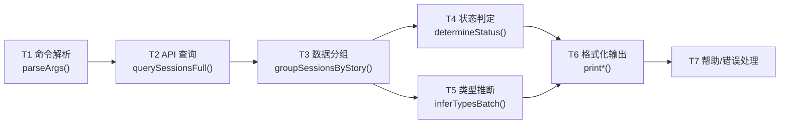
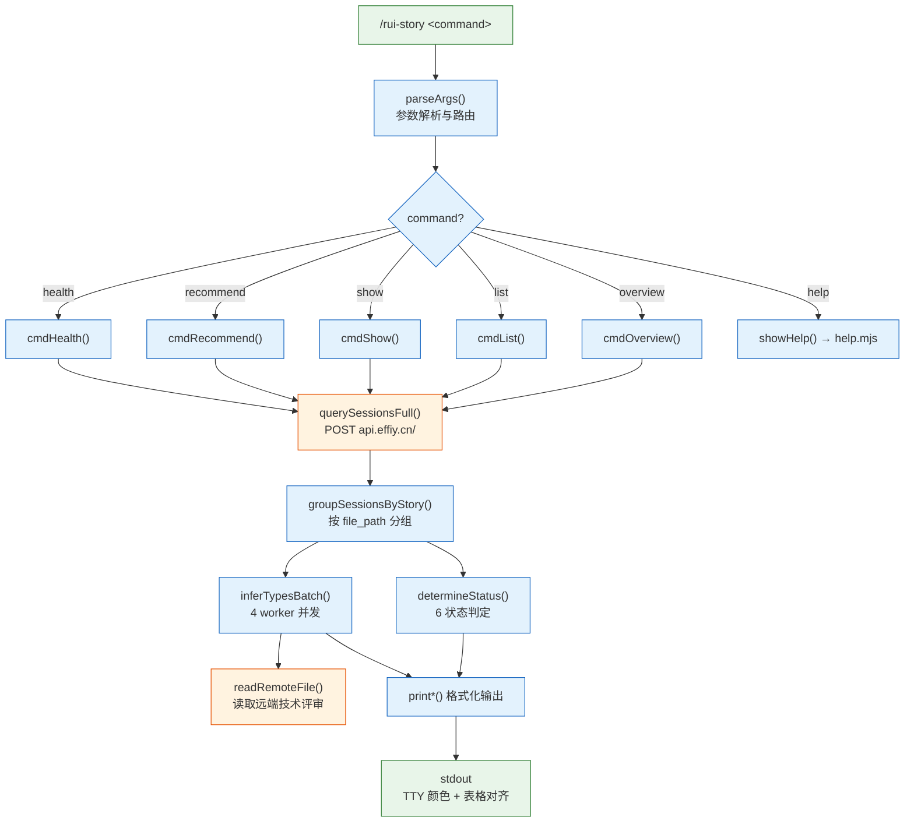
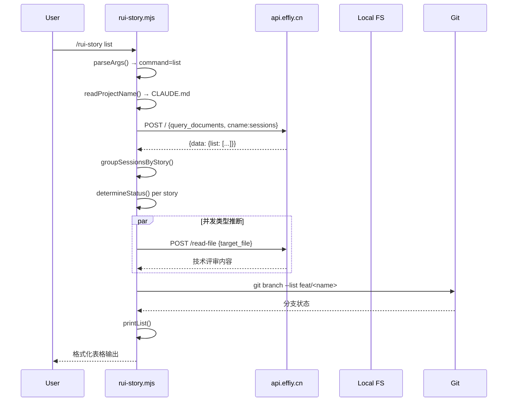
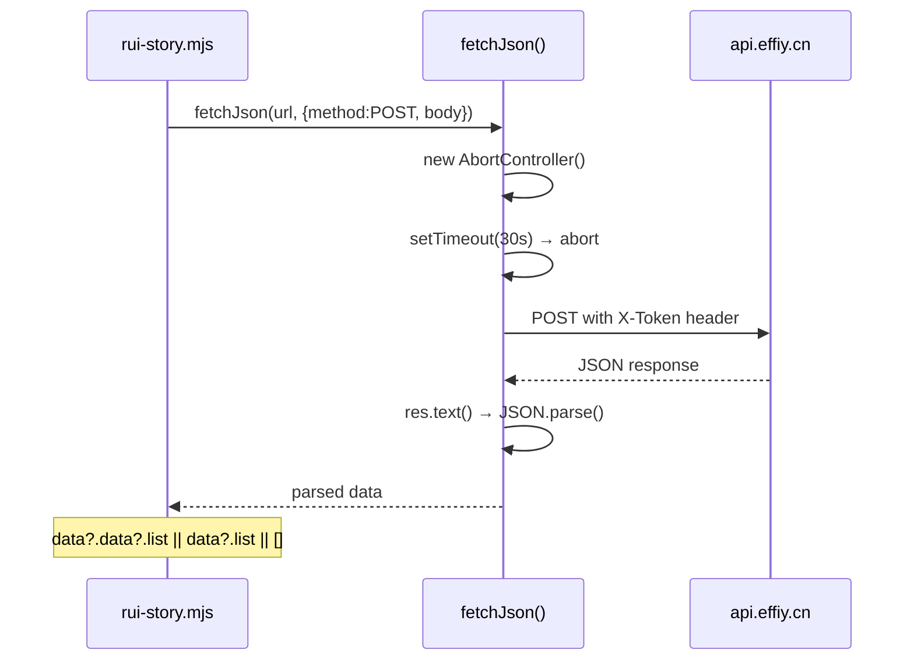
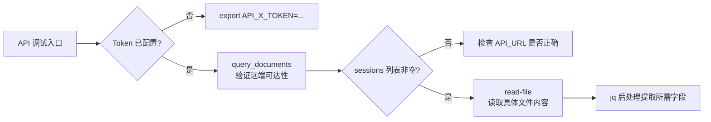
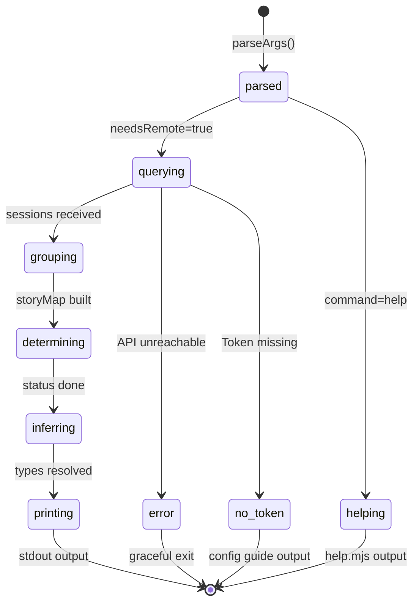

> | v1.4.8 | 2026-05-20 | deepseek-v4-pro | 🌿 feat/rui-story | ⏱️ — | 📎 [CLAUDE.md](../../../CLAUDE.md) |

[§0 设计决策与任务规划](#sec0-design) · [§1 系统架构](#sec1-architecture) · [§2 API 接口](#sec2-api) · [§3 数据模型](#sec3-data) · [§4 模块与状态](#sec4-modules) · [§7 安全约束](#sec7-security) · [§8 性能与限制](#sec8-performance) · [§9 评审清单](#sec9-checklist)

> **导航**: [← YrY-使用场景](./YrY-使用场景.md) · [YrY-测试设计 →](./YrY-测试设计.md) · [YrY-安全审计 →](./YrY-安全审计.md)

> **来源引用**: 从 `skills/rui-story/rui-story.mjs` + `skills/rui-story/SKILL.md` 源码反推。证据 Level B + 源码路径。

---

### 主要价值

- 🎯 统一远端查询架构 — POST API + sessions 集合 + 文件路径筛选
- 🔒 数据边界清晰 — 查询零本地读取，clear/remove 零网络请求
- ⚡ 并发类型推断 — 4 worker 并发读取技术评审内容判定项目类型
- 📊 确定性脚本执行 — 命令行参数解析 → 分支路由 → 格式化输出，无 AI 介入

---

<a id="sec0-design"></a>

## §0 设计决策与任务规划

### §0.0 基线溯源

| 本设计章节 | 实现 YrY-故事任务 | 服务 YrY-使用场景 | 覆盖状态 |
|-----------|-----------------|-----------------|---------|
| §1 系统架构 | Story 1 FP1 | 场景 A/B/C | 已覆盖 |
| §2 API 接口 | Story 1 FP1 | 场景 A/B/C/D/G/H | 已覆盖 |
| §3 数据模型 | Story 2 FP2 FP3 | 场景 A/B/C | 已覆盖 |
| §4 模块与状态 | Story 1 FP2 FP4 FP5 FP6 | 场景 A/B/C | 已覆盖 |
| §7 安全约束 | Story 2 R5 R6 R7 | 场景 E/F | 已覆盖 |
| §8 性能与限制 | FP3 | 场景 B | 已覆盖 |

### §0.1 设计决策

| 决策领域 | 选定方案 | 选择理由 | 详见 | 实现 FP# |
|---------|---------|---------|------|---------|
| 数据源 | 远端 API 为默认源 | 故事文档存储在远端，本地可能过时 | §2 | FP1 |
| API 认证 | X-Token 请求头 | 简单 Bearer 风格，环境变量注入 | §2, §7 | FP1 |
| 状态判定 | file_path 前缀匹配 | 远端 sessions 的 file_path 包含故事名 | §3 | FP2 |
| 类型推断 | 读取远端技术评审内容 | 基于实际内容推断，不依赖元数据标签 | §3 | FP3 |
| 并发策略 | 4 worker 并发 | 平衡远端负载与响应速度 | §8 | FP3 |
| sync 委托 | 完全委托 import-docs | 避免重复实现同步逻辑 | §1 | FP9 |
| clear 实现 | SKILL.md 规约驱动 | 破坏性操作需 agent 执行确认流程 | §1 | FP10 |
| 帮助系统 | 独立 help.mjs 脚本 | 可独立运行，不依赖主逻辑 | §1 | FP12 |
| 项目名解析 | CLAUDE.md 多模式匹配 | 兼容不同项目格式，fallback 目录名 | §3 | FP2 |

### §0.2 任务规划



| ID | 描述 | 工作量 | 依赖 | 交付物 | 门禁 | 实现 FP# |
|----|------|--------|------|--------|------|---------|
| T1 | CLI 参数解析与路由 | S | — | parseArgs() + main() switch | 所有命令正确路由 | FP4–FP8 |
| T2 | 远端 API 查询模块 | M | T1 | fetchJson() + querySessionsFull() | Token 注入 + 超时控制 | FP1 |
| T3 | 故事数据分组与状态判定 | M | T2 | groupSessionsByStory() + determineStatus() + readBlockedState() | 6 状态正确判定 | FP2 |
| T4 | 类型推断引擎 | M | T2, T3 | inferType() + inferTypesBatch() + readRemoteFile() | 并发推断 + 失败默认 meta | FP3 |
| T5 | 格式化输出模块 | M | T3, T4 | printOverview/List/Show/Recommend/Health() | TTY 颜色 + 列对齐 | FP4–FP8 |
| T6 | 帮助系统 | S | — | help.mjs + fallbackHelp() | 场景示例完整 | FP12 |
| T7 | 错误处理与降级 | S | T1 | Token 缺失提示 + API 不可达处理 | 优雅退出不出错 | FP1 |

---

<a id="sec1-architecture"></a>

## §1 系统架构

### 效果示意



### 1.1 模块清单

| 变更类型 | 模块/文件 | 职责 |
|---------|----------|------|
| 现有 | `skills/rui-story/rui-story.mjs` | 主入口：参数解析、API 查询、状态判定、类型推断、格式化输出 |
| 现有 | `skills/rui-story/SKILL.md` | 规约定义：命令族全景、操作边界、数据源、状态判定、核心规则 |
| 现有 | `skills/rui-story/help.mjs` | 帮助系统：命令表 + 场景示例 + 数据源说明 |
| 依赖 | `skills/import-docs/sync.mjs` | sync 命令委托目标 |
| 数据 | `CLAUDE.md` | 项目名解析源（readProjectName） |
| 数据 | `docs/故事任务面板/<name>/.memory/rui-state.json` | blocked 状态源（readBlockedState） |

### 1.2 通信通道



| 通道 | 方向 | 协议 | Payload | 错误处理 |
|------|------|------|---------|---------|
| CLI → API (query) | 出站 | HTTPS POST | `{module_name, method_name, parameters: {cname, limit}}` | 超时 30s → 优雅退出 |
| CLI → API (read-file) | 出站 | HTTPS POST | `{target_file}` | 失败 → 默认 meta |
| CLI → Local FS (read) | 本地 | fs.readFileSync | CLAUDE.md, rui-state.json | 不存在 → null/fallback |
| CLI → Git (branch) | 本地 | execSync | `git branch --list "feat/<name>"` | 异常 → null |

---

<a id="sec2-api"></a>

## §2 API 接口

### 2.1 远端查询接口

| 接口 | 方法 | 路径 | 请求体 | 响应体 | 错误码 |
|------|------|------|--------|--------|--------|
| 查询 sessions | POST | `/` | `{module_name: "services.database.data_service", method_name: "query_documents", parameters: {cname: "sessions", limit: 10000}}` | `{data: {list: [{file_path, title, tags, createdAt, updatedAt}]}}` | HTTP 4xx/5xx → 优雅退出 |
| 读取文件 | POST | `/read-file` | `{target_file: "故事任务面板/<name>/..."}` | `{data: {content: "..."}}` | HTTP 错误 → 默认 meta |

### 2.2 请求流程



### 2.3 认证

| 维度 | 配置 |
|------|------|
| 方式 | X-Token 请求头 |
| 来源 | 环境变量 `API_X_TOKEN` |
| 注入 | fetchJson() 自动附加到所有请求 |
| 缺失处理 | 查询命令输出配置指引后退出 |

### 2.4 curl 调试命令

#### 通用配置

```bash
# 所有 API 请求的公共配置
API_URL="${IMPORT_DOCS_API_URL:-https://api.effiy.cn}"
CONTENT_TYPE="Content-Type: application/json"
AUTH_HEADER="X-Token: ${API_X_TOKEN}"
```

| 变量 | 来源 | 默认值 |
|------|------|--------|
| `API_URL` | `IMPORT_DOCS_API_URL` 环境变量 | `https://api.effiy.cn` |
| `API_X_TOKEN` | 环境变量（必填） | — |

#### API 1: query_documents — 查询 sessions 全量数据

**端点**: `POST ${API_URL}/`

```bash
curl -s -X POST "${API_URL}/" \
  -H "${CONTENT_TYPE}" \
  -H "${AUTH_HEADER}" \
  -d '{
    "module_name": "services.database.data_service",
    "method_name": "query_documents",
    "parameters": {"cname": "sessions", "limit": 10000}
  }'
```

**常用 jq 后处理**:

```bash
# 1) 统计远端 sessions 总数
... | jq '.data.list | length'

# 2) 列出故事任务面板下的所有故事名（去重排序）
... | jq '[.data.list[] | select(.file_path | startswith("故事任务面板/")) | (.file_path | split("/")[1])] | unique | sort | .[]'

# 3) 按故事名分组统计每故事文件数
... | jq '[.data.list[] | select(.file_path | startswith("故事任务面板/"))] | group_by(.file_path | split("/")[1]) | .[] | {story: .[0].file_path | split("/")[1], count: length}'

# 4) 列出指定故事的全部文件（替换 <name>）
... | jq '[.data.list[] | select(.file_path | startswith("故事任务面板/<name>/"))] | sort_by(.file_path) | .[] | {file: .file_path, updated_at}'

# 5) 查看最近修改的 5 个故事任务面板文件
... | jq '[.data.list[] | select(.file_path | startswith("故事任务面板/"))] | sort_by(-.updated_at) | .[0:5] | .[] | {file_path, updated_at}'
```

**响应格式兼容性** — `fetchJson()` 使用兜底解析 `data?.data?.list || data?.list || []`，curl 调试时注意响应可能有两种包裹格式：

| 格式 | 数据路径 |
|------|---------|
| 双层包裹 | `data.data.list` |
| 单层包裹 | `data.list` |

```bash
# 兼容两种格式的 jq 查询
... | jq '.data.data.list // .data.list // []'
```

#### API 2: read-file — 读取远端单个文件

**端点**: `POST ${API_URL}/read-file`

```bash
curl -s -X POST "${API_URL}/read-file" \
  -H "${CONTENT_TYPE}" \
  -H "${AUTH_HEADER}" \
  -d '{"target_file": "故事任务面板/<name>/<Project>-技术评审.md"}'
```

**常用 jq 后处理**:

```bash
# 1) 获取文件全文并保存到本地（替换 STORY 和 FILE）
STORY="rui-story"; FILE="YrY-技术评审.md"
curl -s -X POST "${API_URL}/read-file" \
  -H "${CONTENT_TYPE}" \
  -H "${AUTH_HEADER}" \
  -d "{\"target_file\": \"故事任务面板/${STORY}/${FILE}\"}" | \
  jq -r '(.data.data.content // .data.content // "")' > "docs/故事任务面板/${STORY}/${FILE}"

# 2) 仅获取前 500 字符预览
... | jq '(.data.data.content // .data.content // "")[:500]'

# 3) 类型推断关键词扫描（用于判定项目类型）
... | jq -r '(.data.data.content // .data.content // "")' | \
  grep -oE -i '\b(api|数据|后端|服务端|接口|数据库|server|backend|组件|交互|样式|前端|页面|ui|frontend)\b' | \
  sort -u

# 4) 检查文件是否存在（HTTP 200 = 存在）
curl -s -o /dev/null -w "%{http_code}" -X POST "${API_URL}/read-file" \
  -H "${CONTENT_TYPE}" \
  -H "${AUTH_HEADER}" \
  -d '{"target_file": "故事任务面板/<name>/<Project>-故事任务.md"}'
```

**响应格式兼容性** — 同 API 1，使用兜底解析 `data?.data?.content ?? data?.content ?? ""`。

#### 调试工作流



**快速健康检查一行命令**:

```bash
# 验证远端 API 可达性 + 统计面板数据
API_URL="${IMPORT_DOCS_API_URL:-https://api.effiy.cn}"
curl -s -X POST "${API_URL}/" \
  -H "Content-Type: application/json" \
  -H "X-Token: ${API_X_TOKEN}" \
  -d '{"module_name":"services.database.data_service","method_name":"query_documents","parameters":{"cname":"sessions","limit":10000}}' \
  | jq '{total: (.data.data.list // .data.list // [] | length), panel: [(.data.data.list // .data.list // [])[] | select(.file_path | startswith("故事任务面板/"))] | length}'
```

#### 场景 → API 映射速查

| 命令 | API 1 (query_documents) | API 2 (read-file) | 本地操作 |
|------|:---:|:---:|:---:|
| `/rui-story` (概览) | ✓ | — | blocked 状态读 `.memory/` |
| `/rui-story list` | ✓ | ✓ (并发推断类型) | git branch |
| `/rui-story show <name>` | ✓ | ✓ (推断类型) | blocked + git branch |
| `/rui-story recommend` | ✓ | — | — |
| `/rui-story health` | ✓ (条件) | — | CLAUDE.md + 目录 |
| `/rui-story sync <name>` | 委托 import-docs | 委托 import-docs | 写入本地 |
| `/rui-story clear` | — | — | ✓ (仅本地文件系统) |
| `/rui-story remove <name>` | — | — | ✓ (仅本地文件系统) |
| `/rui-story --help` | — | — | ✓ (本地 help.mjs) |

---

<a id="sec3-data"></a>

## §3 数据模型

### 3.1 远端 Session 结构

| Key/字段 | 类型 | 说明 |
|----------|------|------|
| file_path | string | 如 `故事任务面板/rui-story/YrY-故事任务.md` |
| title | string | 文档标题 |
| tags | string[] | 标签列表 |
| createdAt | number/string | 创建时间戳 |
| updatedAt | number/string | 更新时间戳 |

### 3.2 本地数据结构

| 结构 | 位置 | 字段 | 读频率 | 写频率 |
|------|------|------|--------|--------|
| rui-state.json | `docs/故事任务面板/<name>/.memory/rui-state.json` | `{blocked: boolean, block_reason: string}` | 每次查询 | 管线阶段变更时 |
| CLAUDE.md | 项目根目录 | 项目名（表格行或粗体标签） | 每次命令 | init 时 |

### 3.3 状态判定映射

| 远端条件 | 本地条件 | 状态 |
|---------|---------|------|
| 无 {project}-故事任务.md | — | not_started |
| 有故事任务，基线不完整 | — | docs_in_progress |
| 基线齐全，无实施报告 | — | docs_done |
| 有实施报告，无测试报告 | — | code_in_progress |
| 有测试报告 | blocked=true | blocked |
| 有测试报告 | 非 blocked | code_done |

### 3.4 类型推断规则

| 技术评审关键词 | 判定 |
|--------------|------|
| 含后端关键词（api/数据/后端/服务端/接口/数据库/server/backend/服务/路由）且含前端关键词 | fullstack |
| 仅含后端关键词 | backend |
| 仅含前端关键词（组件/交互/样式/前端/页面/ui/frontend/界面/布局/渲染/响应式） | frontend |
| 均不含或无法读取 | meta |

---

<a id="sec4-modules"></a>

## §4 模块与状态

### 4.1 模块接口

| 函数 | 类型 | 签名 | 入参 | 返回 | 副作用 | 文件路径 |
|------|------|------|------|------|--------|---------|
| parseArgs | () => opts | 无，读 process.argv | — | `{command, name?}` | 无 | skills/rui-story/rui-story.mjs:27 |
| findProjectRoot | (startDir) => string | `resolve(startDir)` → 向上查找 `.git`/`.claude` | — | 项目根路径 | 无 | :53 |
| readProjectName | (projectRoot) => string|null | 3 模式正则匹配 + fallback | 项目根路径 | 项目名字符串 | 读 CLAUDE.md | :65 |
| fetchJson | async (url, options) => any | fetch + AbortController(30s) + X-Token 注入 | URL + fetch options | JSON 解析结果 | 网络请求 | :93 |
| querySessionsFull | async (apiUrl) => [] | POST query_documents | API URL | sessions 数组 | 网络请求 | :114 |
| readRemoteFile | async (apiUrl, remotePath) => any | POST /read-file | API URL + 远端路径 | 文件内容对象 | 网络请求 | :124 |
| extractStoryName | (filePath) => string|null | split("/") 定位 故事任务面板 索引+1 | file_path 字符串 | 故事名 | 无 | :130 |
| groupSessionsByStory | (sessions) => Map | 筛选 故事任务面板/ 前缀 → 按故事名分组 | sessions 数组 | Map<name, sessions[]> | 无 | :137 |
| readBlockedState | (projectRoot, storyName) => object|null | 读取 .memory/rui-state.json | 项目根 + 故事名 | `{blocked, block_reason}` | 读本地文件 | :151 |
| determineStatus | (fileBasenames, projectPrefix, blockedState) => string | 6 级链式判定 | 文件名集合 + 前缀 + blocked | 状态字符串 | 无 | :174 |
| inferType | async (apiUrl, storySessions, projectPrefix) => string | 远端读取技术评审 → 关键词匹配 | API URL + sessions + 前缀 | 类型字符串 | 网络请求 | :204 |
| inferTypesBatch | async (apiUrl, storyMap, projectPrefix) => Map | 4 worker 并发 inferType | API URL + storyMap + 前缀 | Map<name, type> | 网络请求 | :229 |
| checkGitBranch | (name) => string|null | `git branch --list "feat/<name>"` | 故事名 | 分支名或 null | execSync | :247 |

### 4.2 状态定义



| 状态/阶段 | 变量 | 范围 |
|----------|------|------|
| 命令解析 | `opts.command`, `opts.name` | overview/list/show/recommend/health/help |
| API 查询 | `sessions[]` | 远端 sessions 集合 |
| 故事分组 | `storyMap: Map<name, sessions[]>` | 故事任务面板/ 前缀筛选 |
| 状态判定 | 每故事 `status` | 6 种状态枚举 |
| 类型推断 | `typeMap: Map<name, type>` | 4 种类型枚举 |
| 输出 | stdout 格式化文本 | TTY 颜色 + 列对齐 |

---

<a id="sec7-security"></a>

## §7 安全约束

| # | 威胁 | 信任边界 | 缓解措施 | 优先级 |
|---|------|---------|---------|--------|
| 1 | Token 泄露到日志 | CLI 进程 → stdout/stderr | API_X_TOKEN 不输出到任何日志或错误信息；仅检测存在性 | P0 |
| 2 | 命令注入 via git | CLI → shell | execSync 使用硬编码命令模板 + 参数插值来自受控的故事名（kebab-case 约束） | P0 |
| 3 | 路径遍历 via name | 用户输入 → 文件系统 | name 约束为 kebab-case `^[a-z0-9]+(-[a-z0-9]+)*$`，不包含 `../` | P0 |
| 4 | 未授权远端访问 | CLI → API | X-Token 认证 + HTTPS 传输 | P0 |
| 5 | clear/remove 误操作 | 用户 → 本地文件系统 | 双重清单展示 + 用户确认机制，不可跳过 | P0 |
| 6 | 信息泄露 via 错误信息 | API 响应 → stdout | 错误信息截断至 500 字符 `text.slice(0, 500)` | P1 |

---

<a id="sec8-performance"></a>

## §8 性能与限制

| 维度 | 约束 | 应对 |
|------|------|------|
| HTTP 超时 | 30 秒 (HTTP_TIMEOUT) | AbortController 自动取消 |
| 并发查询 | 4 worker (CONCURRENCY) | inferTypesBatch 限制并发数 |
| 单次查询量 | 10,000 sessions (limit) | querySessionsFull 固定 limit |
| 类型推断延迟 | 每故事 1 次 readRemoteFile 调用 | 并发 + 失败默认 meta |
| git 命令超时 | 依赖系统 git 性能 | try-catch 包裹 execSync |
| TTY 检测 | process.stdout.isTTY | 非 TTY 环境输出纯文本 |

---

<a id="sec9-checklist"></a>

## §9 评审清单

| # | 检查项 | 状态 |
|---|--------|------|
| 1 | 权限最小化 — Token 仅通过环境变量注入 | ✅ |
| 2 | API 鉴权 — 所有请求带 X-Token | ✅ |
| 3 | 无硬编码密钥 — 源码中无 Token/密码 | ✅ |
| 4 | 输入校验完整 — kebab-case 约束 + 路径遍历防护 | ✅ |
| 5 | 基线溯源完备 — §0.0 全部章节映射 | ✅ |
| 6 | 效果示意完整 — §1 含 mermaid flowchart | ✅ |
| 7 | 命令注入防护 — execSync 参数受控 | ✅ |
| 8 | 错误处理优雅 — Token 缺失/API 不可达/目录不存在 | ✅ |

---

> **变更记录**
>
> | 日期 | 变更 | 触发 | 证据 |
> |------|------|------|------|
> | 2026-05-20 | §2.4 补充 curl 调试命令（query_documents + read-file 完整示例、jq 后处理、调试工作流、场景→API 速查表） | /rui update rui-story | skills/rui-story/rui-story.mjs:93-127 |
> | 2026-05-20 | 初始生成 | doc --from-code rui-story | skills/rui-story/rui-story.mjs + SKILL.md |
