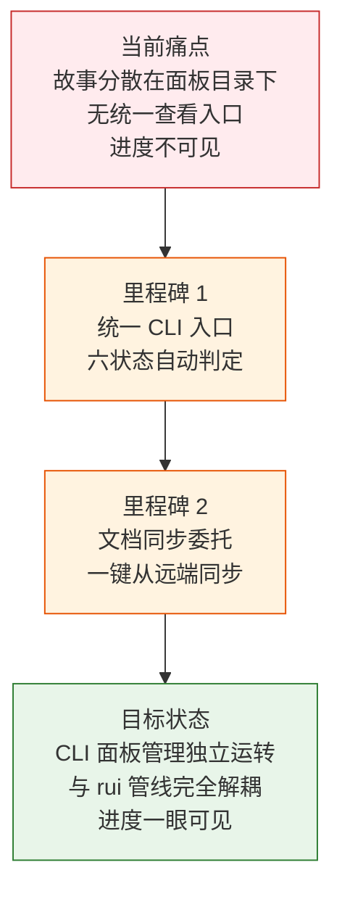
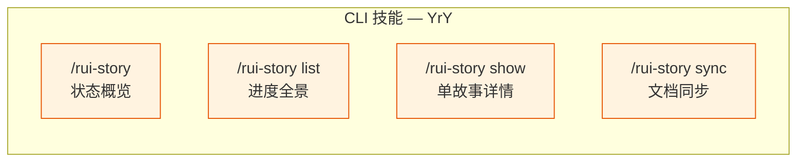
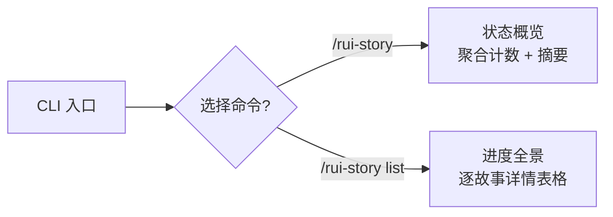

> | v1.0 | 2026-05-20 | claude-opus-4-7 | 自基线故事任务提取 YrY 维度 |

> **导航**: [YrY-使用场景 →](./YrY-使用场景.md)

### 需求概述

CLI 技能 `/rui-story` 命令族为命令行用户提供故事管理体验。通过实现 `/rui-story`、`/rui-story list`、`/rui-story show <name>`、`/rui-story sync [<name>]`、`/rui-story --help` 五个命令，覆盖从状态概览到文档同步的完整故事面板管理流程。

核心约束：只做远端查询和同步委托，不创建文档内容、不修改源码、不操作 git 分支。

### 主要价值

- ☁️ 远端优先数据源 — 所有查询操作直连远端 API，确保数据一致性，不受本地文件状态影响
- 💨 零本地文件系统依赖 — 查询操作不读取本地文件系统，仅 sync 委托写入
- 🖥️ TTY 感知帮助 — help.mjs 独立脚本，语义常量提取，非 TTY 自动降级纯文本
- 🔄 sync 委托 — 文档同步完全委托 import-docs/sync.mjs，不自实现同步逻辑

---

### 效果示意

---

## §1 Story

### 实现维度

CLI 技能通过 `/rui-story` 命令族实现命令行端的故事管理体验：

### Story 1: CLI 状态概览

| 字段 | 内容 |
|------|------|
| 作为 | 命令行用户 |
| 我想要 | 在终端一目了然地看到所有故事的状态分布和最近活动 |
| 以便 | 快速判断项目整体进度是否需要干预 |
| 优先级 | P0 |
| 范围边界 | 只读远端 API，不修改任何文件 |
| 依赖 | API_X_TOKEN 可用，远端 API 可达 |

#### 范围外

- 不包含故事之间的依赖分析
- 不包含进度预测或工时估算
- 不包含自动状态迁移

#### §1.1 User Operations

| # | 操作 | 触发条件 | 操作步骤 | 预期结果 |
|---|------|---------|---------|---------|
| 1 | 查看状态概览 | 用户执行 `/rui-story` 无参数 | 查询远端 API sessions 集合 → 筛选故事任务面板目录 → 逐目录判定状态 → 按状态聚合计数 → 输出摘要表 + 最近活动 | 显示 6 种状态的计数和最近修改的故事列表 |
| 2 | 查看进度全景 | 用户执行 `/rui-story list` | 查询远端 API sessions 集合 → 逐目录收集状态/文件数/最后修改/类型/分支 → 按时间降序排列 → 输出详情表格 | 显示所有故事的完整信息表格 |

---

### Story 2: CLI 单故事详情

| 字段 | 内容 |
|------|------|
| 作为 | 命令行用户 |
| 我想要 | 查看单个故事的完整信息（文件清单、状态、元数据、关联分支） |
| 以便 | 深入了解特定故事的当前状况，决定下一步行动 |
| 优先级 | P1 |
| 范围边界 | 只读远端 API 单故事数据 |
| 依赖 | 故事名称必须为 kebab-case |

#### §1.1 User Operations

| # | 操作 | 触发条件 | 操作步骤 | 预期结果 |
|---|------|---------|---------|---------|
| 1 | 查看故事详情 | 用户执行 `/rui-story show <name>` | 校验名称格式 → 查询远端 API → 枚举文件（含大小/时间）→ 读取状态和类型信息 → 检查关联分支 | 输出详述卡：状态徽章、远端路径、类型、文件清单、关联分支、元数据 |

---

### Story 3: CLI 文档同步

| 字段 | 内容 |
|------|------|
| 作为 | 命令行用户 |
| 我想要 | 从远端知识库同步故事文档到本地 |
| 以便 | 本地文档与远端保持一致 |
| 优先级 | P1 |
| 范围边界 | 完全委托 import-docs/sync.mjs 执行，自身不实现同步逻辑 |
| 依赖 | import-docs/sync.mjs 可用，API_X_TOKEN 已设置 |

#### §1.1 User Operations

| # | 操作 | 触发条件 | 操作步骤 | 预期结果 |
|---|------|---------|---------|---------|
| 1 | 从远端同步单个故事 | 用户执行 `/rui-story sync <name>` | 委托 import-docs mode=pull 从远端拉取 | 该故事文档从远端同步到本地 |
| 2 | 查看同步推荐 | 用户执行 `/rui-story sync`（不指定名称） | 展示可同步故事推荐列表 | 用户从推荐中选择后执行同步 |

---

## §2 Requirements

### 功能点

| FP# | 描述 | 输入 | 输出 | 错误行为 | 优先级 |
|-----|------|------|------|---------|--------|
| FP1 | 状态概览 — 查询远端 API 按状态聚合所有故事并输出摘要 | 无 | 状态计数表 + 最近活动故事列表 | 远端 API 不可达时降级提示"API 不可用" | P0 |
| FP2 | 进度全景 — 查询远端 API 输出所有故事的详情表格 | 无 | Story/Status/Files/Last Modified/Type/Branch 六列表格 | 远端 API 不可达时显示降级提示 | P0 |
| FP3 | 单故事详情 — 查询远端 API 输出指定故事的全部信息 | 故事名称（kebab-case） | 详述卡：状态/远端路径/类型/文件清单/关联分支/元数据 | 名称不存在报错；格式非法时报错 | P1 |
| FP4 | 文档同步 — 委托 import-docs 从远端拉取 | 故事名称（可选） | 文档已从远端同步到本地；未指定时展示推荐 | 名称不存在报错；同步程序执行失败透传错误 | P1 |
| FP5 | 状态判定 — 按远端 session file_path 存在性推断六状态 | 故事目录 file_path 列表 | 状态枚举值（六状态之一） | 无任何文件时返回 not_started | P0 |
| FP6 | 项目类型推断 — 按远端 03/04/06/07 文档存在性推断 | 故事目录 file_path 列表 | 类型枚举值 | 无法判定时默认为 meta | P0 |
| FP7 | 帮助输出 — help.mjs 脚本输出帮助信息 | 帮助标志 | 完整帮助文本（TTY 感知） | 帮助信息不可用时给出错误提示 | P1 |

### 业务规则

| R# | 描述 | 校验方式 | 证据级别 |
|----|------|---------|---------|
| R1 | 故事名称必须为 kebab-case 格式（小写字母+连字符） | 正则校验 `^[a-z0-9]+(-[a-z0-9]+)*$` | B |
| R2 | sync 完全委托 import-docs/sync.mjs，不自实现 | 子进程调用 `node skills/import-docs/sync.mjs` | B |

### 数据约束

| 约束 | 类型 | 范围/格式 | 来源 |
|------|------|----------|------|
| 故事名称 | string | `^[a-z0-9]+(-[a-z0-9]+)*$` (kebab-case) | 命名规范约定 |
| 故事类型 | enum | `frontend` / `backend` / `fullstack` / `meta` | 项目类型分类 |
| 状态枚举 | enum | `not_started` / `docs_in_progress` / `docs_done` / `code_in_progress` / `code_done` / `blocked` | 管线阶段定义 |

---

## §3 成功标准

| SC# | 描述 | 度量方式 | 目标值 | 优先级 | 关联 FP# |
|-----|------|---------|--------|--------|---------|
| SC1 | 用户可在极短时间内了解项目全部故事的状态分布 | CLI 命令执行到输出完成的时间 | ≤ 3 秒（单次远端 API 查询 + 内存分组） | P0 | FP1, FP5 |
| SC2 | 用户可一眼看到每个故事的完整进度信息 | CLI 表格包含全部六列且每故事占一行 | 全部覆盖 | P0 | FP2, FP5, FP6 |
| SC3 | 用户能准确了解单个故事的全部状态信息 | CLI 详述卡包含文件清单、状态、元数据、关联分支 | 全部字段有值或明确标注"—" | P1 | FP3 |
| SC4 | 用户可通过一行命令从远端同步文档到本地 | sync 执行完成到本地可见 | 取决于 import-docs 同步程序 | P1 | FP4 |

---

## §4 范围边界

### 范围内

| # | 条目 | 关联 FP# | 边界说明 |
|---|------|---------|---------|
| 1 | SKILL.md — 命令族规约、状态判定、操作边界、核心规则 | FP1–FP7 | CLI 技能的核心规约文件 |
| 2 | help.mjs — 帮助输出脚本，语义常量，TTY 感知 | FP7 | 独立 Node.js 脚本 |
| 3 | sync 委托 — 子进程调用 import-docs/sync.mjs | FP4 | 完全委托，不自实现同步逻辑 |
| 4 | 远端 API 查询 — 所有读操作直连 api.effiy.cn | FP1–FP3, FP5, FP6 | 远端优先，确保数据一致性 |

### 范围外

| # | 条目 | 排除原因 | 替代方案 |
|---|------|---------|---------|
| 1 | Web UI 看板/卡片/列表三视图 | 属于 YiWeb 项目范围 | 使用浏览器访问 YiWeb 面板 |
| 2 | HTTP API 路由（GET /overview, GET /stories 等） | 属于 YiAi 项目范围 | 使用 curl 或 HTTP 客户端 |
| 3 | 创建故事文档内容 | 文档生成是文档管线的职责 | 使用 rui 文档生成命令 |
| 4 | 修改源码 | 源码变更是代码管线的职责 | 使用 rui 代码实现命令 |
| 5 | 创建或切换关联分支 | 分支管理是代码管线的职责 | 使用 git 命令行 |
| 6 | 批量操作多个故事 | 操作设计为单故事原子操作 | 逐个执行 |
| 7 | 故事间依赖分析 | 超出面板管理范围 | 查看故事任务文档 §1 Story 依赖字段 |

---

## §5 AC

| AC# | Given | When | Then | 门禁 |
|-----|-------|------|------|------|
| AC1 | 远端存在 3 个故事，分别处于不同状态 | 用户执行 `/rui-story` | 输出按状态聚合的计数表，各状态计数正确 | Gate A |
| AC2 | 远端无故事数据 | 用户执行 `/rui-story` | 显示"合计 0 个故事"，不报错 | Gate A |
| AC3 | 远端存在故事 | 用户执行 `/rui-story list` | 输出表格每行含 Story/Status/Files/Last Modified/Type/Branch 六列 | Gate A |
| AC4 | 某故事远端存在且含基线文档 | 用户执行 `/rui-story show <name>` | 输出文件清单含文件名/时间、状态正确、类型正确 | Gate A |
| AC5 | 某故事远端不存在 | 用户执行 `/rui-story show <nonexist>` | 报错提示"故事不存在" | Gate A |
| AC6 | 指定故事存在 | 用户执行 `/rui-story sync <name>` | 委托 import-docs mode=pull 同步该故事，返回同步结果 | Gate B |
| AC7 | 不指定故事 | 用户执行 `/rui-story sync` | 展示可同步故事推荐提示，列出可选故事供用户选择 | Gate A |
| AC8 | 用户需要查看帮助 | 用户执行 `/rui-story --help` | 输出完整帮助文本，含场景示例 | Gate A |

---

## §6 风险与假设

| # | 风险/假设 | 类型 | 可能性 | 影响 | 缓解/验证策略 | 关联 FP# |
|---|----------|------|--------|------|-------------|---------|
| 1 | API_X_TOKEN 未设置导致命令不可用 | 风险 | M | H | 缺失时降级提示"请设置 API_X_TOKEN 环境变量" | FP1–FP4 |
| 2 | 远端 API 不可达导致查询失败 | 风险 | M | H | 优雅降级：超时/失败时显示明确错误信息 | FP1–FP3 |
| 3 | import-docs/sync.mjs 不可用导致 sync 失败 | 风险 | M | M | sync 透传同步程序错误，不吞没 | FP4 |
| 4 | 名称注入 — name 参数含路径分隔符 | 风险 | L | H | kebab-case 正则校验拒绝含 `..` `\` 的输入 | FP3, FP4 |
| 5 | 远端 API 响应超时 | 风险 | L | M | CLI 侧设置合理的 API 调用超时 | FP1–FP4 |
| 6 | kebab-case 校验规则与实际命名习惯冲突 | 假设 | L | L | 当前校验规则覆盖常见命名 | R1 |
| 7 | import-docs/sync.mjs 始终可用 | 假设 | M | M | 执行时检查子进程可用性 | FP4 |
| 8 | 网络连接始终可用 | 假设 | M | M | 远端优先数据源依赖网络；网络不可用时优雅降级 | FP1–FP4 |

---

## §7 跨文档索引

| 本文档章节 | 基线内容 | 下游文档 | 预期覆盖 | 状态 |
|-----------|---------|------------|---------|------|
| §1 Story 1 | CLI 状态概览 + 进度全景需求 | [YrY-测试设计](./YrY-测试设计.md) | AC1–AC3 | 已覆盖 |
| §1 Story 2 | CLI show 子命令需求 | [YrY-测试设计](./YrY-测试设计.md) | AC4–AC5 | 已覆盖 |
| §1 Story 3 | CLI sync 子命令需求 | [YrY-测试设计](./YrY-测试设计.md) | AC6–AC7 | 已覆盖 |
| §2 FP5 | 六状态模型 | [YrY-测试设计](./YrY-测试设计.md) | 状态判定覆盖 | 已覆盖 |
| §2 R2 | sync 委托 | [YrY-测试设计](./YrY-测试设计.md) | AC6–AC7 | 已覆盖 |
| §3 SC1–SC4 | 全部成功标准 | [YrY-实施报告](./YrY-实施报告.md) | SC# 目标值 vs 实测值 | 已覆盖 |
| §5 全部 AC# | 验收标准 | [YrY-测试报告](./YrY-测试报告.md) | AC 最终通过率 | 已覆盖 |
| §6 风险与假设 | 8 条 CLI 风险/假设 | [YrY-安全审计](./YrY-安全审计.md) | 风险命中率与假设验证 | 已覆盖 |

---

## 变更记录

| 日期 | 变更 | 触发 | 证据 |
|------|------|------|------|
| 2026-05-20 | v1.0 初始生成 — 自基线故事任务提取 YrY CLI 维度 | YrY 角色化文档拆分 | 基线 [故事任务.md](./故事任务.md) Story 1–3 CLI 内容 |
