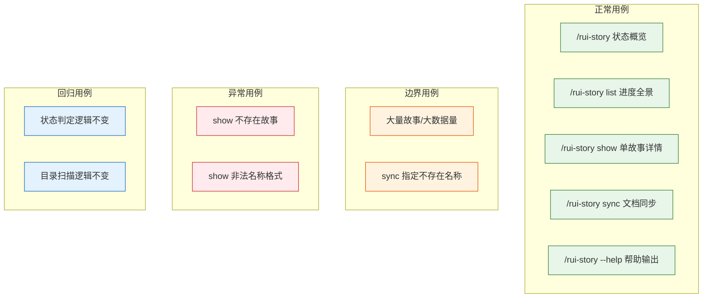

> | v1.0 | 2026-05-20 | claude-opus-4-7 | 自基线测试设计提取 YrY 维度 |

> **导航**: [← YrY-使用场景](./YrY-使用场景.md) · [YrY-测试报告 →](./YrY-测试报告.md)

> **来源引用**: 由 [YrY-故事任务](./YrY-故事任务.md) §5 AC 和 [YrY-使用场景](./YrY-使用场景.md) §2 场景驱动。证据等级 B。

---

## §0 测试策略

CLI 技能测试聚焦命令行执行环境，覆盖远端查询、本地同步委托、输入校验和错误恢复：

### 基线溯源

| TC 系列 | 覆盖 AC# | 覆盖场景 | 实现维度 |
|-----|-----------|---------|------|
| TC-CLI-N* | AC1–AC8 | 场景 1–5 | CLI 技能 |
| TC-CLI-B* | AC2, AC7 | 场景 1, 4 | CLI 技能 |
| TC-CLI-E* | AC5 | 场景 3 | CLI 技能 |

---

## §1 覆盖矩阵

| FP# | 功能点 | CLI | 覆盖率 |
|-----|--------|:---:|:---:|
| FP1 | 状态概览 — 查询远端 API 聚合计数 + 最近活动 | TC-CLI-N1, TC-CLI-B1 | 100% |
| FP2 | 进度全景 — 六列表格按最后修改降序 | TC-CLI-N2 | 100% |
| FP3 | 单故事详情 — 详述卡含文件清单/状态/类型 | TC-CLI-N3, TC-CLI-E1, TC-CLI-E2 | 100% |
| FP4 | 文档同步 — 委托 import-docs | TC-CLI-N4, TC-CLI-N5, TC-CLI-B2 | 100% |
| FP5 | 状态判定 — 远端 file_path 存在性推断六状态 | TC-CLI-N1 | 100% |
| FP6 | 类型推断 — 远端文档存在性推断 | TC-CLI-N2 | 100% |
| FP7 | 帮助输出 — help.mjs TTY 感知 | TC-CLI-N6 | 100% |

### Gate 映射

| Gate | 用例范围 | 通过标准 | 交接下游 |
|------|---------|---------|---------|
| Gate A | 全部正常 + 边界 + 异常 | P0 全部通过 | 实现阶段 |
| Gate B | 全部回归 + 环境专项 | P0 全部通过 + P1 >= 80% | 交付 |

---

## §2 CLI 测试用例

### 2.1 正常用例

| ID | Given | When | Then | 关联 FP | 优先级 |
|----|-------|------|------|---------|--------|
| TC-CLI-N1 | 远端存在 3 个故事，分别处于不同状态 | `/rui-story` | 状态统计各计数正确，合计 3 | FP1, FP5 | P0 |
| TC-CLI-N2 | 远端存在故事 | `/rui-story list` | 六列表格，按最后修改降序 | FP2, FP6 | P0 |
| TC-CLI-N3 | 远端存在某故事 | `/rui-story show <name>` | 详述卡含文件清单/状态/类型/元数据 | FP3 | P1 |
| TC-CLI-N4 | 指定故事存在 | `/rui-story sync <name>` | 委托 import-docs mode=pull 执行同步 | FP4 | P1 |
| TC-CLI-N5 | 不指定名称 | `/rui-story sync` | 展示可同步推荐列表 | FP4 | P1 |
| TC-CLI-N6 | 用户查看帮助 | `/rui-story --help` | 完整帮助文本 | FP7 | P1 |

### 2.2 边界用例

| ID | Given | When | Then | 关联 FP | 优先级 |
|----|-------|------|------|---------|--------|
| TC-CLI-B1 | 大量故事（超出常规量级） | `/rui-story` | 正确统计并显示，响应时间合理 | FP1 | P1 |
| TC-CLI-B2 | 同步指定不存在名称 | `/rui-story sync <nonexist>` | 同步程序报错透传 | FP4 | P1 |

### 2.3 异常用例

| ID | Given | When | Then | 关联 FP | 优先级 |
|----|-------|------|------|---------|--------|
| TC-CLI-E1 | — | `/rui-story show <nonexist>` | 报错提示"故事不存在" | FP3 | P1 |
| TC-CLI-E2 | — | `/rui-story show <InvalidName>` | 报错提示 kebab-case 格式要求 | FP3 | P1 |

---

## §3 环境

| 维度 | CLI 技能 |
|------|---------|
| 运行环境 | Claude Code CLI + Node.js |
| 部署方式 | `/rui-story` slash command（SKILL.md + help.mjs） |
| 测试目标 | rui-story skill 在 Claude Code 中的执行结果 |
| 数据准备 | 远端 API sessions 集合（api.effiy.cn） |
| 前置条件 | API_X_TOKEN 环境变量已设置，网络可达远端 API |

---

## §4 回归用例

| ID | Given | When | Then | 关联 FP | 优先级 |
|----|-------|------|------|---------|--------|
| TC-R1 | overview 已通过 | 修改状态判定逻辑后重跑 `/rui-story` | 状态计数仍正确 | FP1, FP5 | P1 |
| TC-R2 | list 已通过 | 修改目录扫描逻辑后重跑 `/rui-story list` | 表格字段和排序仍正确 | FP2 | P1 |
| TC-R3 | show 已通过 | 修改详述卡输出格式后重跑 `/rui-story show <name>` | 文件清单/状态/类型/元数据仍完整 | FP3 | P1 |
| TC-R4 | sync 已通过 | 修改委托调用逻辑后重跑 `/rui-story sync` | 推荐列表和同步结果仍正确 | FP4 | P1 |

---

## §5 评审清单

| # | 检查项 | 状态 |
|---|--------|------|
| 1 | 每功能点多类覆盖（正常+边界+异常） | |
| 2 | Gate A 覆盖 — 全部 AC# 有对应 CLI 用例 | |
| 3 | 回归与影响链一致 | |
| 4 | 异常含恢复行为（格式校验错误提示、透传错误） | |
| 5 | CLI 环境专项明确（Claude Code + Node.js + 远端 API） | |
| 6 | 基线溯源闭合 — 全部 CLI AC# 和场景有对应用例 | |

---

## §6 Gate A 交接

| 信号 | 内容 |
|------|------|
| 通过状态 | 待执行 |
| P0 用例 | TC-CLI-N1–N2 |
| 实现约束 | 仅查询远端 API 和同步委托，禁止创建文档内容；命名强制 kebab-case |
| 基线溯源 | 所有 CLI 用例可追溯至 [YrY-故事任务](./YrY-故事任务.md) §5 AC 和 [YrY-使用场景](./YrY-使用场景.md) §2 场景 |

---

## 变更记录

| 日期 | 变更 | 触发 | 证据 |
|------|------|------|------|
| 2026-05-20 | v1.0 初始生成 — 自基线测试设计提取 YrY CLI 维度 | YrY 角色化文档拆分 | 基线 [测试-测试设计.md](./测试-测试设计.md) §3 CLI 测试用例 |
