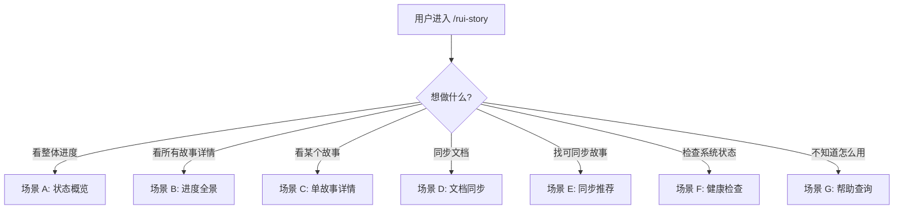
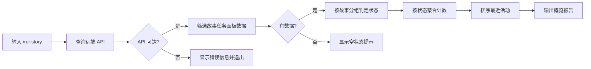
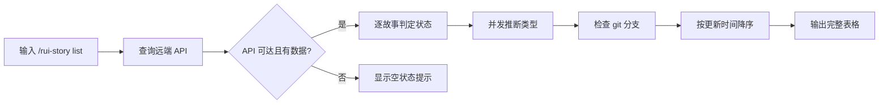
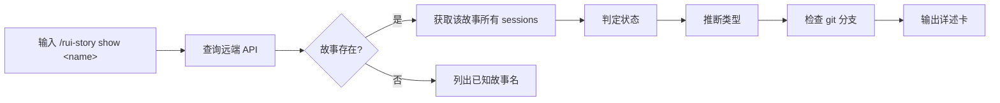
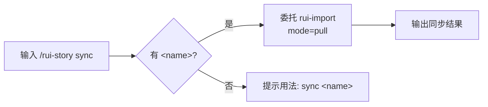
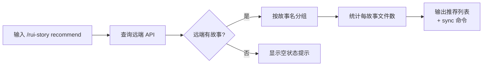
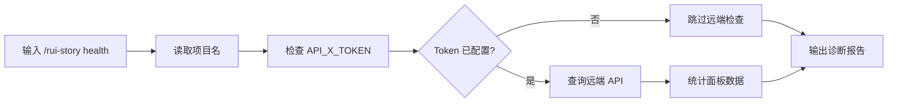
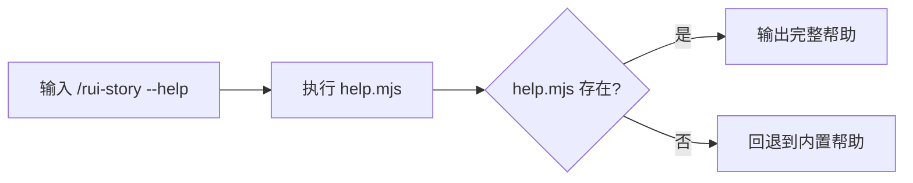

> | v1.0.0 | 2026-05-26 | deepseek-v4-pro | 🌿 feat/rui-story | 📎 [CLAUDE.md](../../../CLAUDE.md) |

> **导航**: [← 故事任务](./故事任务.md) · [技术评审 →](./技术评审.md)

> **来源引用**: 从 `skills/rui-story/SKILL.md` 命令族全景 + 操作规约反推。证据 Level B + 规约路径。基线初始文档。

[§1 场景全景](#sec1-scenarios) · [§2 场景详述](#sec2-details) · [§3 场景覆盖矩阵](#sec3-matrix) · [§4 评审清单](#sec4-checklist)

---

### §0 基线声明

> **用户空间基线 (User Space Baseline)**: 本文档定义"谁使用(WHO)"和"如何体验(HOW EXPERIENCE)"。所有交互设计(技术评审)、测试用例(测试设计)、验收标准(故事任务 §5)均必须覆盖本文档定义的每个场景。

---

### 主要价值

- 🎯 覆盖全部 7 条命令的用户操作路径，含正常/空/错误三种状态
- 🔒 明确数据边界：查询不读本地、sync 委托 rui-import
- ⚡ 远端优先体验 — 用户无需关心本地文件系统即可了解全局进度
- 📊 从概览到详情的渐进式信息披露 — 概览 → 列表 → 单故事详情

---

## §1 场景全景

---

## §2 场景详述

### 场景 A: 状态概览

| 角色 | 触发条件 | 核心目标 |
|------|---------|---------|
| 项目参与者 | 执行 `/rui-story` 无参数 | 快速了解所有故事的整体进度分布 |

| # | 步骤 | 输入 | 系统响应 | 异常分支 |
|---|------|------|---------|---------|
| 1 | 执行命令 | `/rui-story` | 开始查询远端 API | Token 缺失 → 显示配置指引 |
| 2 | 查询远端 | API 请求 | 获取 sessions 列表 | 网络错误 → 显示"远端不可达" |
| 3 | 筛选数据 | file_path 前缀过滤 | 仅保留故事任务面板数据 | 无匹配 → 显示"无故事任务面板数据" |
| 4 | 状态判定 | 文件清单 + 项目前缀 | 每故事判定为 6 种状态之一 | 无法判定 → 标记 任务 |
| 5 | 聚合输出 | 状态计数 | 显示状态统计表 | — |
| 6 | 最近活动 | 更新时间排序 | 显示最近 5 个活跃故事 | 无活动 → 显示"无" |

---

### 场景 B: 进度全景

| 角色 | 触发条件 | 核心目标 |
|------|---------|---------|
| 项目管理者 | 执行 `/rui-story list` | 查看所有故事的完整进度信息用于决策 |

| # | 步骤 | 输入 | 系统响应 | 异常分支 |
|---|------|------|---------|---------|
| 1 | 执行命令 | `/rui-story list` | 查询远端所有 sessions | Token 缺失 → 显示配置指引 |
| 2 | 类型推断 | 远端技术评审内容 | 并发读取判定类型 | 读取失败 → 默认 meta |
| 3 | 分支检查 | `git branch --list` | 匹配 feat/<name> 分支 | 无匹配 → 显示"—" |
| 4 | 表格输出 | 全部故事数据 | 6 列表格按时间降序 | 无故事 → 显示空状态提示 |

---

### 场景 C: 单故事详情

| 角色 | 触发条件 | 核心目标 |
|------|---------|---------|
| 开发者 | 执行 `/rui-story show <name>` | 深入了解特定故事的所有文件、状态和元数据 |

| # | 步骤 | 输入 | 系统响应 | 异常分支 |
|---|------|------|---------|---------|
| 1 | 解析名称 | `<name>` | 验证 kebab-case 格式 | 格式错误 → 提示正确格式 |
| 2 | 查询远端 | 故事名 | 筛选匹配的 sessions | 不存在 → 列出所有已知故事名 |
| 3 | 展示文件清单 | sessions 列表 | 按文件名排序展示 | 无文件 → 显示"0 个文件" |
| 4 | 展示元数据 | 状态/类型 | 状态标签 + 类型标签 | — |

---

### 场景 D: 文档同步

| 角色 | 触发条件 | 核心目标 |
|------|---------|---------|
| 开发者 | 执行 `/rui-story sync <name>` | 从远端获取最新故事文档到本地 |

| # | 步骤 | 输入 | 系统响应 | 异常分支 |
|---|------|------|---------|---------|
| 1 | 有名称同步 | `/rui-story sync <name>` | 执行 rui-import mode=pull | 同步失败 → 显示错误 |
| 2 | 无名称提示 | `/rui-story sync` | 提示用法 `sync <name>` | — |

---

### 场景 E: 同步推荐

| 角色 | 触发条件 | 核心目标 |
|------|---------|---------|
| 开发者 | 执行 `/rui-story recommend` | 发现远端可同步的故事 |

| # | 步骤 | 输入 | 系统响应 | 异常分支 |
|---|------|------|---------|---------|
| 1 | 查询远端 | — | 获取所有故事面板数据 | Token 缺失 → 配置指引 |
| 2 | 展示推荐 | 故事列表 | 故事名 + 文件数 + sync 命令 | 无数据 → 空状态提示 |

---

### 场景 F: 健康检查

| 角色 | 触发条件 | 核心目标 |
|------|---------|---------|
| 系统管理员 | 执行 `/rui-story health` | 诊断 rui-story 系统的整体健康状态 |

| # | 步骤 | 输入 | 系统响应 | 异常分支 |
|---|------|------|---------|---------|
| 1 | 项目配置 | CLAUDE.md | 读取项目名 | 解析失败 → 标注 warn |
| 2 | API 凭据 | 环境变量 | 检查 Token 存在性 | 缺失 → 标注 warn |
| 3 | 远端可达性 | API 请求 | 统计 sessions 数量 | 不可达 → 标注 fail |
| 4 | 面板数据 | sessions 筛选 | 统计故事数 | 无数据 → 标注 warn |
| 5 | 输出报告 | 所有检查结果 | pass/warn/error 统计 | — |

---

### 场景 G: 帮助查询

| 角色 | 触发条件 | 核心目标 |
|------|---------|---------|
| 新用户 | 执行 `/rui-story --help` | 快速了解所有可用命令和典型用法 |

| # | 步骤 | 输入 | 系统响应 | 异常分支 |
|---|------|------|---------|---------|
| 1 | 执行帮助 | — | 运行 help.mjs 脚本 | 脚本不存在 → 显示内置 fallback 帮助 |
| 2 | 展示内容 | — | 命令表 + 场景示例 + 数据源说明 | — |

---

## §3 场景覆盖矩阵

| 场景 | FP# | AC# | 实现文档(技术评审) | 测试文档(测试设计) | 覆盖状态 |
|------|-----|-----|-----------------|-----------------|---------|
| A 状态概览 | FP1, FP2, FP4 | AC1, AC4, AC5 | §1, §2 | TC-N01 | 待生成 |
| B 进度全景 | FP1, FP2, FP3, FP5 | AC2 | §1, §2, §3 | TC-N02 | 待生成 |
| C 单故事详情 | FP1, FP2, FP3, FP6 | AC3 | §1, §2 | TC-N03, TC-E03 | 待生成 |
| D 文档同步 | FP9 | AC6, AC7 | §1, §4 | TC-N04 | 待生成 |
| E 同步推荐 | FP7 | AC8 | §1 | TC-N05 | 待生成 |
| F 健康检查 | FP8 | AC9 | §1, §5 | TC-N06 | 待生成 |
| G 帮助查询 | FP10 | AC10 | §1 | TC-N07 | 待生成 |

---

## §4 评审清单

| # | 检查项 | 状态 |
|---|--------|------|
| 1 | 场景 >= 2 | ✅ 7 个场景 |
| 2 | 每场景有流程图 | ✅ 全部含 mermaid |
| 3 | FP 全覆盖 | ✅ 10 个 FP 全部覆盖 |
| 4 | 异常分支明确 | ✅ 每场景含 Token 缺失/API 不可达/不存在分支 |
| 5 | 无技术术语 | ✅ 已扫描，无代码路径/API 端点/组件名 |
| 6 | 每场景含空状态与错误恢复 | ✅ Token 缺失/远端不可达/无数据 |

---

> **变更记录**
>
> | 日期 | 变更 | 触发 | 证据 |
> |------|------|------|------|
> | 2026-05-26 | 初始基线生成 — 7 个场景（A-G），覆盖 10 个 FP、10 条 AC | doc --from-spec rui-story | skills/rui-story/SKILL.md |
