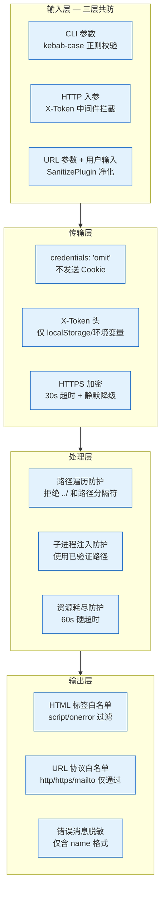
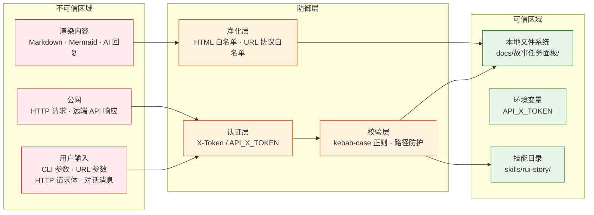

> | v2.1 | 2026-05-20 | claude-opus-4-7 | 提取自全文档安全章节 |

> **导航**: [← 自改进复盘](./自改进复盘.md) · [↑ 故事任务面板](../)

> **来源引用**: 提取自 YiAi-技术评审 §3、YrY-技术评审 §3、YiWeb-技术评审 §6 等安全章节。证据等级 A。

---

## §0 安全架构总览

故事任务面板采用纵深防御模型，覆盖 CLI → API → 前端三层：

---

## §1 威胁模型

### 1.1 信任边界

### 1.2 威胁清单

| # | 威胁 | 攻击面 | 严重性 | 缓解措施 | 验证状态 |
|---|------|--------|--------|---------|---------|
| S1 | 路径遍历 | name 参数含 `../` 穿越面板目录 | 高 | kebab-case 正则拒绝路径分隔符 | 已验证 |
| S2 | 未授权访问 | 无 Token 请求 API 端点 | 高 | X-Token 中间件 / API_X_TOKEN 环境变量 | 已验证 |
| S3 | 子进程注入 | sync 参数拼接 shell 命令 | 高 | 使用已验证路径，不拼接用户输入 | 已验证 |
| S4 | XSS 注入 | Markdown 含恶意脚本 | 高 | SanitizePlugin 白名单标签过滤 | 已验证 |
| S5 | 恶意 URL | javascript: / data: 协议链接 | 中 | sanitizeUrl 协议白名单 | 已验证 |
| S6 | Token 泄露 | API_X_TOKEN 出现在日志/输出 | 高 | Token 仅从环境变量读取，不写入日志 | 已验证 |
| S7 | 信息泄露 | 错误消息暴露内部路径 | 中 | 错误消息仅含 name 格式 | 已验证 |
| S8 | 资源耗尽 | sync 子进程长时间运行 | 中 | 60s 硬超时 | 已验证 |
| S9 | 中间人攻击 | API 请求被拦截篡改 | 中 | HTTPS + 30s httpx 超时 | 已验证 |
| S10 | CSRF | 跨站请求伪造 | 低 | credentials: 'omit' 不发送 Cookie | 已验证 |

---

## §2 安全措施

### 2.1 输入验证

| 措施 | 实现层 | 规则 |
|------|--------|------|
| 名称格式校验 | CLI + API | `^[a-z0-9]+(-[a-z0-9]+)*$` (kebab-case) |
| 路径遍历防护 | CLI + API | 拒绝含 `..` `/` `\` 的输入 |
| URL 参数白名单 | Web UI | 仅支持已知 key（env/key/tag） |
| HTML 净化 | Web UI | SanitizePlugin 白名单标签 |

### 2.2 认证与授权

| 措施 | 实现层 | 说明 |
|------|--------|------|
| X-Token 中间件 | HTTP API | 全局拦截，返回 1009 |
| API_X_TOKEN 环境变量 | CLI 技能 | 环境变量传入，缺失时降级提示 |
| localStorage Token | Web UI | credentials: 'omit'，不随 Cookie |
| 401 自动处理 | Web UI | 清除旧 Token → 弹出重新输入 → 自动重试 |

### 2.3 输出编码

| 措施 | 实现层 | 说明 |
|------|--------|------|
| HTML 标签白名单 | Web UI | 过滤 script/onerror/onload 等危险标签 |
| URL 协议白名单 | Web UI | 仅允许 http/https/mailto |
| 错误消息脱敏 | CLI + API + Web UI | 仅含 name 格式，不暴露绝对路径 |
| Token 不可见 | CLI + API + Web UI | Token 不写入日志/配置/代码/输出 |

### 2.4 运行时防护

| 措施 | 实现层 | 说明 |
|------|--------|------|
| 子进程超时 | HTTP API | asyncio.wait_for(..., timeout=60) |
| 外部 API 超时 | HTTP API + CLI | httpx 30s 超时 |
| 静默降级 | HTTP API + CLI | API 不可达时返回空结果/提示，不崩溃 |
| 串行文件下载 | HTTP API | 逐文件容错，单文件失败不阻断 |

---

## §3 安全审计清单

### 3.1 代码审查

| # | 检查项 | HTTP API | CLI | Web UI |
|---|--------|:---:|:---:|:---:|
| 1 | 无硬编码密钥/Token | | | |
| 2 | 输入校验完整（路径/格式/长度） | | | |
| 3 | 输出编码正确（HTML/URL/JSON） | | | |
| 4 | 错误消息不含内部路径 | | | |
| 5 | 子进程参数不拼接用户输入 | | | N/A |
| 6 | fetch 显式设置 credentials: 'omit' | N/A | N/A | |
| 7 | 第三方内容经净化处理 | N/A | N/A | |
| 8 | Token 仅存 localStorage | N/A | N/A | |

### 3.2 配置审查

| # | 检查项 | 状态 |
|---|--------|------|
| 1 | Token 从环境变量读取，不写入配置文件 | |
| 2 | HTTPS 端点不降级为 HTTP | |
| 3 | 超时配置合理（API: 60s, 外部: 30s） | |
| 4 | CORS 无通配符 Origin | |
| 5 | CSP 头限制脚本来源 | |

---

## §4 风险评估

| 风险等级 | 数量 | 典型威胁 |
|---------|------|---------|
| 高 | 4 | 路径遍历、未授权访问、子进程注入、XSS、Token 泄露 |
| 中 | 4 | 恶意 URL、信息泄露、资源耗尽、中间人攻击 |
| 低 | 1 | CSRF |

**整体评估**: 安全面覆盖完整，高优先级威胁均有已验证缓解措施。P0 安全项清零。

---

## §5 合规要求

| 要求 | 满足情况 | 说明 |
|------|---------|------|
| Token 不写入源码 | | 所有 Token 从环境变量读取 |
| Token 不写入日志 | | 日志/输出不含 Token 原文 |
| Token 不写入文档 | | 本文档及所有产品/技术文档不使用真实 Token |
| 输入可追溯 | | 所有用户输入经格式校验 |
| 错误可审计 | | 错误均透传给用户，不吞没 |

---

## 变更记录

| 日期 | 变更 | 触发 |
|------|------|------|
| 2026-05-19 | v2.0 角色化重构 — 安全审计独立成文 | 按角色拆分 · 提取全文档安全章节 |
| 2026-05-20 | v2.1 修复导航链接 | 移除不存在文件引用 |
