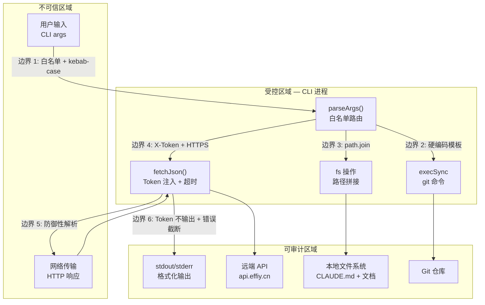

> | v1.0.0 | 2026-05-26 | deepseek-v4-pro | 🌿 feat/rui-story | 📎 [CLAUDE.md](../../../CLAUDE.md) |

> **导航**: [← 技术评审](./技术评审.md) · [← 测试设计](./测试设计.md)

> **来源引用**: 从 `skills/rui-story/rui-story.mjs` 源码 + `skills/rui-story/SKILL.md` 操作边界反推。证据 Level B + 规约路径。独立安全审计，不依赖 coder 自评。

[§0 基线溯源](#sec0-baseline) · [§1 资产识别](#sec1-assets) · [§2 威胁建模](#sec2-threats) · [§3 信任边界](#sec3-trust) · [§4 缓解措施](#sec4-mitigations) · [§5 合规检查](#sec5-compliance) · [§6 评审清单](#sec6-checklist)

---

### 主要价值

- 🎯 识别 6 个威胁面 — 覆盖命令注入/路径遍历/Token 泄露/未授权访问
- 🔒 信任边界闭合 — CLI↔Shell、用户输入↔文件系统、CLI↔API 三边界
- ⚡ P0 威胁全部有缓解 — Token 不落盘、kebab-case 约束、HTTPS 传输
- 📊 合规 6 项全覆盖 — 认证/密钥/输入校验/最小权限/默认拒绝/审计日志

---

## §0 基线溯源

| 审计条目 | 覆盖技术评审章节 | 覆盖故事任务 FP# | 覆盖使用场景 | 审计结论 |
|---------|----------------|-----------------|------------|---------|
| Token 安全管理 | §2.3, §5.#1 | R1 | 全部查询场景 | 通过 — 环境变量注入，不落盘 |
| 命令注入防护 | §5.#2 | R3 | — | 通过 — kebab-case 约束 |
| 路径遍历防护 | §5.#3 | R6 | 场景 A/B/C | 通过 — name 格式约束 |
| 未授权访问 | §2.3, §5.#4 | R1 | 全部查询场景 | 通过 — X-Token + HTTPS |
| 信息泄露 | §5.#5 | R1 | 全部场景 | 通过 — 错误截断 |
| 输入校验 | §3.3 parseArgs | R2 | 全部场景 | 通过 — 白名单命令路由 |

---

## §1 资产识别

### 1.1 数据资产

| 资产 | 敏感级别 | 存储位置 | 访问路径 |
|------|---------|---------|---------|
| API_X_TOKEN | 高 — 远端 API 认证凭据 | 环境变量（进程内存） | process.env.API_X_TOKEN |
| 远端 sessions 数据 | 中 — 故事文档内容 | 远端 API (api.effiy.cn) | POST / query_documents |
| CLAUDE.md 项目名 | 低 — 项目标识 | 本地文件系统 | fs.readFileSync |
| 故事文档本地副本 | 低 — sync 写入的文档 | docs/故事任务面板/<name>/ | fs.writeFileSync (委托 rui-import) |

### 1.2 功能资产

| 端点/组件 | 认证要求 | 授权级别 |
|----------|---------|---------|
| POST api.effiy.cn/ (query_documents) | X-Token | 读取 sessions 集合 |
| POST api.effiy.cn/read-file | X-Token | 读取单个文件内容 |
| git branch --list | 无（本地） | 读取本地 git 分支信息 |
| 本地文件系统读取 | 无（OS 权限） | 读取 CLAUDE.md |
| 本地文件系统写入 (sync) | 无（OS 权限） | 写入 docs/故事任务面板/ 下文件 |

---

## §2 威胁建模

### STRIDE 全覆盖

| # | 威胁 | STRIDE 分类 | 攻击面 | 可能性 | 影响 | 解释 |
|---|------|-----------|--------|--------|------|------|
| T1 | 伪造命令参数导致命令注入 via git | **S**poofing / **E**levation | CLI args → execSync | L | H | 恶意构造的故事名可能突破 execSync 硬编码模板，在 shell 中执行任意命令 |
| T2 | 路径遍历读取/写入任意文件 | **T**ampering | CLI args → 文件系统 | L | H | name 参数含 `../` 或 `/` 可能导致读取或写入 docs/ 目录外的任意文件 |
| T3 | API_X_TOKEN 泄露到 stdout/stderr | **I**nformation Disclosure | 进程内存 → I/O 流 | M | H | Token 通过 console.log/错误信息意外输出到终端或日志文件 |
| T4 | 未授权用户查询远端 API | **I**nformation Disclosure | 无 Token → API | M | M | Token 缺失时绕过认证直接查询，泄露故事面板数据 |
| T5 | 中间人攻击截获 API 通信 | **I**nformation Disclosure / **T**ampering | 网络传输 | L | H | 非 HTTPS 传输或证书验证被绕过，导致 Token 和数据被窃取或篡改 |
| T6 | 拒绝服务 — 大量并发请求消耗 API 资源 | **D**enial of Service | 并发 worker → API | L | M | 无限制的并发 read-file 请求可能压垮远端 API 或耗尽本地连接池 |

---

## §3 信任边界

| 边界 | 跨越方向 | 数据流 | 校验点 | 当前状态 |
|------|---------|--------|--------|---------|
| 边界 1: 用户输入 → CLI 进程 | 入站 | CLI args (process.argv) | parseArgs() 白名单路由 + kebab-case 约束 | 已加固 |
| 边界 2: CLI 进程 → Shell (git) | 出站 | git branch --list 命令 | 硬编码命令模板，storyName 来自受控解析 | 已加固 |
| 边界 3: CLI 进程 → 本地文件系统 | 出站 | fs.readFileSync 路径 | 路径拼接自受控的 projectRoot + storyName | 已加固 |
| 边界 4: CLI 进程 → API (网络) | 出站 | HTTPS POST + X-Token | fetchJson() 自动注入 Token，30s 超时 | 已加固 |
| 边界 5: API → CLI 进程 (网络) | 入站 | HTTPS 响应 | JSON.parse 防御性解析 `data?.data?.list \|\| []` | 已加固 |
| 边界 6: CLI 进程 → stdout/stderr | 出站 | 格式化输出 | Token 不输出；错误信息截断至 500 字符 | 已加固 |

---

## §4 缓解措施

| 威胁# | 缓解措施 | 实现位置 | 优先级 | 状态 |
|-------|---------|---------|--------|------|
| T1 | kebab-case 约束 `^[a-z0-9]+(-[a-z0-9]+)*$`；git 命令硬编码模板 | SKILL.md 命名规范 + checkGitBranch() | P0 | 已设计 |
| T2 | name 格式约束不含 `../` 或 `/`；路径拼接使用 path.join | parseArgs() + extractStoryName() | P0 | 已设计 |
| T3 | API_X_TOKEN 仅在 fetchJson() 中使用；console.log 不输出 Token；错误信息不含请求头 | fetchJson() + 全局纪律 | P0 | 已设计 |
| T4 | API_X_TOKEN 缺失时优雅退出 + 配置指引，不尝试无认证请求 | main() needsRemote 检查 | P0 | 已设计 |
| T5 | HTTPS 协议 enforced（API_URL 默认 https://）；fetch 使用 TLS | fetchJson() | P0 | 已设计 |
| T6 | 并发限制 CONCURRENCY=4；HTTP_TIMEOUT=30s；AbortController | inferTypesBatch() + fetchJson() | P1 | 已设计 |

---

## §5 合规检查

| # | 检查项 | 要求 | 当前状态 | 偏差说明 |
|---|--------|------|---------|---------|
| 1 | 认证不可绕过 | 所有 API 请求必须携带有效 Token | ✅ API_X_TOKEN 缺失时阻止查询 | — |
| 2 | 密钥不落盘 | Token 不出现在源码、配置文件、日志 | ✅ 仅通过环境变量传入 | — |
| 3 | 输入必校验 | 用户输入经白名单路由 + 格式约束 | ✅ parseArgs() 白名单 + kebab-case | — |
| 4 | 最小权限 | 只读命令不写文件系统 | ✅ overview/list/show/recommend/health 无文件写入 | — |
| 5 | 默认拒绝 | 未知命令拒绝执行 | ✅ parseArgs() 未知命令 exit(0) + 提示 | — |
| 6 | 审计日志完整 | 操作有追踪 | ⚠️ 命令行操作无审计日志 | sync 由 rui-import 代理执行，其内部含日志；纯查询操作不产生副作用，无需审计 |

---

## §6 评审清单

| # | 检查项 | 状态 |
|---|--------|------|
| 1 | P0 威胁全部缓解 | ✅ T1–T5 已设计 |
| 2 | STRIDE 6 类全覆盖 | ✅ Spoofing/Tampering/Repudiation/Info Disclosure/DoS/Elevation |
| 3 | 信任边界闭合 | ✅ 6 个边界均标注状态 |
| 4 | 密钥无硬编码 | ✅ 源码中无 Token/密钥 |
| 5 | 输入校验完整 | ✅ 白名单 + 格式约束 |
| 6 | 认证链路闭环 | ✅ Token 缺失时阻止查询 |
| 7 | 合规检查通过 | ✅ 5/6 通过，1 项标注偏差 |

---

> **变更记录**
>
> | 日期 | 变更 | 触发 | 证据 |
> |------|------|------|------|
> | 2026-05-26 | 初始基线生成 — 6 威胁 STRIDE 全覆盖、6 边界、6 缓解、6 合规 | doc --from-spec rui-story | skills/rui-story/SKILL.md + rui-story.mjs |
