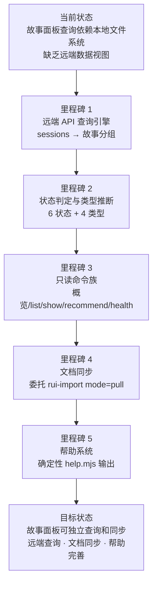

> | v1.0.0 | 2026-05-26 | deepseek-v4-pro | 🌿 feat/rui-story | 📎 [CLAUDE.md](../../../CLAUDE.md) |

> **导航**: [使用场景 →](./使用场景.md)

> **来源引用**: 从 `skills/rui-story/SKILL.md` 命令族全景 + 操作规约生成。证据 Level B + 规约路径。基线初始文档。

[§1 Story](#sec1-story) · [§2 Requirements](#sec2-requirements) · [§3 成功标准](#sec3-success) · [§4 范围边界](#sec4-scope) · [§5 AC](#sec5-ac) · [§6 风险与假设](#sec6-risks) · [§7 跨文档索引](#sec7-index)

---

### 需求概述

为 YrY 故事驱动 SDLC 编排系统提供故事任务面板管理能力。用户可通过 `/rui-story` 命令族查询远端故事面板状态、查看单故事详情、从远端同步文档到本地。数据源默认为远端 API（api.effiy.cn），查询操作零本地文件系统读取，sync 操作完全委托 rui-import。面板管理与 rui SDLC 管线分离，独立运作。

### 效果示意

### 主要价值

- 🎯 统一故事面板查询入口 — 远端 API 为默认数据源，覆盖概览/列表/详情/推荐/健康检查
- 🔒 数据边界清晰 — 查询不读本地文件系统，sync 完全委托 rui-import
- ⚡ 确定性脚本执行 — recommend/health 由 rui-story.mjs 确定性输出，不依赖 agent 解读
- 📊 状态自动判定 — 基于远端 file_path 存在性自动判定 6 种故事状态
- 🔀 与 rui 管线分离 — 面板管理独立于 SDLC 编排，list 命令从 rui 迁移至 rui-story
- 🔄 远端优先 — 所有查询操作直接查询远端 API，无需关心本地文件系统状态

---

## §1 Story

### Story 1: 故事面板远端查询引擎

| 字段 | 内容 |
|------|------|
| 作为 | 项目参与者 |
| 我想要 | 通过统一入口查询远端故事任务面板的状态和进度 |
| 以便 | 无需查看本地文件系统即可了解所有故事的当前状态 |
| 优先级 | P0 |
| 范围边界 | 只读远端 API，不读本地文件系统，不改源码 |
| 依赖 | API_X_TOKEN 环境变量可用，远端 API 可达 |

#### 范围外

- 不涉及源码修改或 git 分支操作
- 不创建故事文档内容（那是 /rui doc 的职责）
- 不直接操作本地文件系统（查询操作）

##### §1.1 User Operations

| # | 操作 | 触发条件 | 操作步骤 | 预期结果 |
|---|------|---------|---------|---------|
| 1 | 状态概览 | 用户执行 `/rui-story` | 查询远端 API → 筛选故事任务面板 sessions → 按故事名分组 → 判定状态 → 聚合计数 | 输出状态统计 + 最近活动列表 |
| 2 | 进度全景 | 用户执行 `/rui-story list` | 查询远端 API → 逐故事判定状态 → 推断类型 → 检查 git 分支 | 输出所有故事的详细表格 |
| 3 | 单故事详情 | 用户执行 `/rui-story show <name>` | 查询远端 API → 筛选匹配故事 → 判定状态与类型 → 检查 git 分支 | 输出该故事的完整详述卡 |
| 4 | 同步推荐 | 用户执行 `/rui-story recommend` | 查询远端 API → 按故事名分组 → 统计文件数 | 输出可同步故事列表及推荐命令 |
| 5 | 健康检查 | 用户执行 `/rui-story health` | 读取项目名 → 检查 Token → 查询远端 API → 统计面板数据 | 输出系统诊断报告 |

---

### Story 2: 故事文档同步

| 字段 | 内容 |
|------|------|
| 作为 | 项目维护者 |
| 我想要 | 从远端同步故事文档到本地 |
| 以便 | 本地文档与远端保持一致 |
| 优先级 | P0 |
| 范围边界 | 完全委托 rui-import，mode=pull，远端→本地 |
| 依赖 | Story 1 完成，rui-import skill 可用 |

#### 范围外

- 不创建文档内容（那是 /rui doc 的职责）
- 不修改源码
- 不操作远端数据（仅从远端拉取到本地）

##### §1.1 User Operations

| # | 操作 | 触发条件 | 操作步骤 | 预期结果 |
|---|------|---------|---------|---------|
| 1 | 同步故事文档 | 用户执行 `/rui-story sync <name>` | 委托 rui-import mode=pull → 从远端下载覆盖本地 | 本地文档与远端一致 |
| 2 | 无参数提示 | 用户执行 `/rui-story sync`（无参数） | 提示用法：`sync <name>` | 输出用法说明 |

---

## §2 Requirements

### 功能点

| FP# | 描述 | 输入 | 输出 | 错误行为 | 优先级 |
|-----|------|------|------|---------|--------|
| FP1 | 远端会话查询 — 查询 sessions 集合并筛选故事任务面板数据 | API URL + Token | 按故事分组的 session 列表 | API 不可达时优雅退出并提示 | P0 |
| FP2 | 故事状态判定 — 基于远端 file_path 存在性判定 6 种状态（任务/设计/实施/测试/报告/改进） | file_path 集合 + 项目前缀 | 状态标签 | 无法判定时默认为 任务 | P0 |
| FP3 | 项目类型推断 — 从远端技术评审内容推断前端/后端/全栈/元 | 技术评审文档内容 | 类型枚举 | 无法读取或解析时默认 meta | P1 |
| FP4 | 状态概览输出 — 按状态聚合计数 + 最近活动列表 | 故事状态映射 | 格式化概览文本 | 无数据时显示空状态提示 | P0 |
| FP5 | 进度全景表格 — 所有故事详情表格含状态/文件数/最后修改/类型/分支 | 故事状态映射 + 类型映射 | 格式化表格 | 无数据时显示空状态提示 | P0 |
| FP6 | 单故事详述卡 — 文件清单/状态/元数据/分支信息 | 故事名 + sessions | 格式化详述卡 | 故事不存在时列出已知故事名 | P0 |
| FP7 | 同步推荐列表 — 远端可同步故事及推荐命令 | 故事分组 | 推荐列表 + sync 命令 | 无数据时显示空状态提示 | P1 |
| FP8 | 健康检查报告 — 凭据/API 可达性/配置/数据完整性 | 环境变量 + 远端 API + 本地文件 | 诊断报告 | Token 缺失时跳过远端检查 | P1 |
| FP9 | 文档同步 — 委托 rui-import 从远端拉取文档到本地 | 故事名 | 同步完成的本地文档 | rui-import 失败时传递错误 | P0 |
| FP10 | 帮助输出 — 显示完整命令用法与场景示例 | — | 格式化帮助文本 | help.mjs 不存在时回退到内置帮助 | P1 |

### 业务规则

| R# | 描述 | 校验方式 | 证据级别 |
|----|------|---------|---------|
| R1 | 所有查询操作使用远端 API，不读本地文件系统 | 代码审查：overview/list/show/recommend 函数无 fs.readFileSync 调用 | B |
| R2 | 仅查询故事面板状态和同步文档，不创建文档内容 | 代码审查：无文件写入操作（除 sync） | B |
| R3 | 不修改源码，不创建/切换 git 分支 | 代码审查：无 Edit/Write 到 skills/agents/rules 目录 | B |
| R4 | sync 完全委托 rui-import | 代码审查：sync 调用 node skills/rui-import/sync.mjs | B |
| R5 | recommend/health 由 rui-story.mjs 确定性执行 | 命令输出一致性验证 | B |
| R6 | kebab-case 命名硬规范 | 正则校验 `^[a-z0-9]+(-[a-z0-9]+)*$` | B |

### 数据约束

| 约束 | 类型 | 范围/格式 | 来源 |
|------|------|----------|------|
| 故事名称 | string | `^[a-z0-9]+(-[a-z0-9]+)*$` (kebab-case) | 命名规范约定 |
| API URL | string | 有效 HTTPS URL，默认 `https://api.effiy.cn` | 环境变量 IMPORT_DOCS_API_URL |
| API Token | string | 非空字符串 | 环境变量 API_X_TOKEN |
| 项目前缀 | string | `{项目名}-`，从 CLAUDE.md 读取 | readProjectName() |
| 状态枚举 | enum | 任务 / 设计 / 实施 / 测试 / 报告 / 改进 | determineStatus() |
| 类型枚举 | enum | backend / frontend / fullstack / meta | inferType() |
| HTTP 超时 | number | 30,000ms | HTTP_TIMEOUT 常量 |
| 并发数 | number | 4 | CONCURRENCY 常量 |

---

## §3 成功标准

| SC# | 描述 | 度量方式 | 目标值 | 优先级 | 关联 FP# |
|-----|------|---------|--------|--------|---------|
| SC1 | 用户可在无参数情况下看到故事面板整体状态 | `/rui-story` 执行返回状态概览 | 6 种状态全部统计，最近活动正确排序 | P0 | FP1, FP2, FP4 |
| SC2 | 用户可看到所有故事的完整进度表格 | `/rui-story list` 执行返回进度全景 | 表格含 Story/Status/Files/Last Modified/Type/Branch 6 列 | P0 | FP1, FP2, FP3, FP5 |
| SC3 | 用户可查看任意故事的文件清单和元数据 | `/rui-story show <name>` 执行 | 文件清单完整，状态和类型准确 | P0 | FP1, FP2, FP3, FP6 |
| SC4 | 用户可从远端同步文档到本地 | `/rui-story sync <name>` 执行 | 本地文档与远端一致 | P0 | FP9 |
| SC5 | 用户可通过健康检查了解系统状态 | `/rui-story health` 执行 | 覆盖凭据/API/配置/数据 4 个维度 | P1 | FP8 |
| SC6 | 用户可通过帮助系统快速上手 | `/rui-story --help` 执行 | 含命令表 + 场景示例 | P1 | FP10 |
| SC7 | Token 缺失时给出清晰指引而非报错 | 无 Token 执行查询命令 | 输出配置方法提示 | P0 | FP1 |

---

## §4 范围边界

### 范围内

| # | 条目 | 关联 FP# | 边界说明 |
|---|------|---------|---------|
| 1 | 远端 API 查询引擎 | FP1 | 查询 sessions 集合，筛选故事任务面板数据 |
| 2 | 状态判定与类型推断 | FP2, FP3 | 基于远端数据自动判定 |
| 3 | 只读命令族（概览/list/show/recommend/health） | FP4–FP8 | 零本地文件系统读取 |
| 4 | 文档同步（sync） | FP9 | 委托 rui-import，mode=pull |
| 5 | 帮助系统 | FP10 | help.mjs 确定性输出 |

### 范围外

| # | 条目 | 排除原因 | 替代方案 |
|---|------|---------|---------|
| 1 | 故事文档内容创建 | 那是 /rui doc 的职责 | 使用 `/rui doc <需求>` |
| 2 | 源码修改 | 那是 /rui code 的职责 | 使用 `/rui code <name>` |
| 3 | git 分支创建与切换 | 那是 /rui code 的职责 | git checkout -b feat/<name> |
| 4 | 远端文档删除 | 远端数据由 rui-import 管理 | — |
| 5 | 故事进度变更（如标记完成） | 那是 rui 管线的职责 | 管线末端自动更新状态 |
| 6 | 本地文件清理 | 按需由用户手动管理 | rm 命令 |

---

## §5 AC

| AC# | Given | When | Then | 门禁 |
|-----|-------|------|------|------|
| AC1 | API_X_TOKEN 已配置，远端 API 可达 | 用户执行 `/rui-story` | 输出状态概览：6 种状态统计 + 最近活动 | Gate A |
| AC2 | API_X_TOKEN 已配置，远端有 >=1 个故事 | 用户执行 `/rui-story list` | 输出进度全景表格，含 Story/Status/Files/Last Modified/Type/Branch | Gate A |
| AC3 | API_X_TOKEN 已配置，远端存在指定故事 | 用户执行 `/rui-story show <name>` | 输出详述卡：文件清单/类型/分支/元数据 | Gate A |
| AC4 | API_X_TOKEN 未配置 | 用户执行任意查询命令 | 输出 Token 缺失提示 + 配置方法 | Gate A |
| AC5 | 远端 API 不可达 | 用户执行任意查询命令 | 输出错误信息后优雅退出 | Gate A |
| AC6 | 用户指定故事名 | 用户执行 `/rui-story sync <name>` | 委托 rui-import 执行 mode=pull 同步 | Gate A |
| AC7 | 用户未指定故事名 | 用户执行 `/rui-story sync` | 提示用法 `sync <name>` | Gate A |
| AC8 | 远端有可同步故事 | 用户执行 `/rui-story recommend` | 输出故事列表 + 推荐 sync 命令 | Gate A |
| AC9 | 系统环境正常 | 用户执行 `/rui-story health` | 输出含凭据/API/配置/数据 4 维度的诊断报告 | Gate A |
| AC10 | 用户需要帮助 | 用户执行 `/rui-story --help` | 输出完整帮助含场景示例 | Gate A |

---

## §6 风险与假设

| # | 风险/假设 | 类型 | 可能性 | 影响 | 缓解/验证策略 | 关联 FP# |
|---|----------|------|--------|------|-------------|---------|
| 1 | 远端 API 不可达导致所有查询命令失败 | 风险 | M | H | 优雅错误处理，输出明确错误信息；health 命令可提前检测 | FP1 |
| 2 | API_X_TOKEN 未配置导致新用户无法使用 | 风险 | H | M | 检测缺失时输出配置指引而非报错 | FP1 |
| 3 | 远端 sessions 数据量大导致查询性能下降 | 风险 | M | M | limit=10000，并发类型推断（4 worker） | FP1, FP3 |
| 4 | 项目名解析失败导致状态判定错误 | 风险 | L | H | readProjectName() 多模式回退 + 目录名 fallback | FP2 |
| 5 | 类型推断依赖远端文件内容读取，网络延迟影响 list 命令响应时间 | 风险 | M | L | 并发读取（CONCURRENCY=4），失败默认 meta | FP3 |
| 6 | 远端 API 响应格式变更导致解析失败 | 风险 | L | H | 防御性解析 `data?.data?.list \|\| data?.list \|\| []` | FP1 |
| 7 | help.mjs 不存在时回退机制不工作 | 风险 | L | L | fallbackHelp() 内置最小帮助 | FP10 |
| 8 | API_X_TOKEN 始终可用 | 假设 | — | — | health 命令可验证凭据状态 | FP1 |
| 9 | 远端 sessions 的 file_path 以 `故事任务面板/` 为前缀 | 假设 | — | — | groupSessionsByStory 按此前缀筛选 | FP1 |
| 10 | CLAUDE.md 项目名可被确定性解析 | 假设 | — | — | 3 种解析模式 + fallback | FP2 |

---

## §7 跨文档索引

| 本文档章节 | 基线内容 | 下游文档编号 | 预期覆盖 |
|-----------|---------|------------|---------|
| §1 Story 1 | 远端查询引擎需求 | 技术评审 §1 §2 | 架构设计 + API 接口 |
| §1 Story 2 | 文档同步需求 | 技术评审 §1 §4 | 架构设计 + 委托机制 |
| §2 FP1–FP3 | 查询/状态/类型功能点 | 技术评审 §1 §2 | 系统架构 + API 接口 |
| §2 FP9–FP10 | 同步/帮助功能点 | 测试设计 §2 | 测试用例覆盖 |
| §2 R1–R6 | 业务规则 | 安全审计 §5 | 合规检查 |
| §5 AC1–AC10 | 验收标准 | 测试设计 §0 §2 | 测试用例逐一覆盖 |
| §6 风险 1–7 | 风险项 | 安全审计 §2 | 威胁建模覆盖 |

---

> **变更记录**
>
> | 日期 | 变更 | 触发 | 证据 |
> |------|------|------|------|
> | 2026-05-26 | 初始基线生成 — 2 个 Story（远端查询引擎 + 文档同步）、10 个 FP、7 条 SC、10 条 AC | doc --from-spec rui-story | skills/rui-story/SKILL.md |
