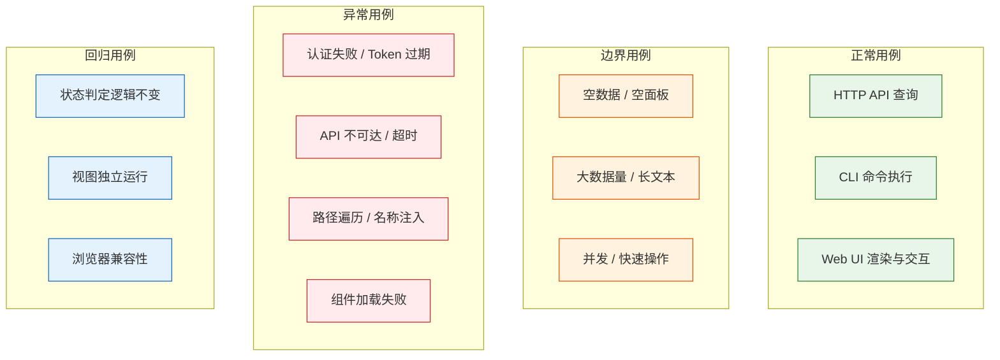

> | v2.0 | 2026-05-19 | deepseek-v4-pro | 重构自 YiAi-05 + YrY-05 + YiWeb-05 |

> **导航**: [← 产品-用户使用场景](./用户使用场景.md) · [测试-测试报告 →](./测试-测试报告.md)

> **来源引用**: 由产品-故事任务 §5 AC 和产品-用户使用场景 §2 场景驱动。证据等级 B。

---

## §0 测试策略

### 覆盖维度总览

### 基线溯源

| TC 系列 | 覆盖 AC#(产品 §5) | 覆盖场景(产品 §2) | 实现维度 |
|-----|----------------|----------------|------|
| TC-API-N* | AC1–AC8 | 场景 1–5 | HTTP API |
| TC-CLI-N* | AC1–AC8 | 场景 1–5 | CLI 技能 |
| TC-UI-N* | AC8–AC11 | 场景 1–4 | Web UI |
| TC-B* | AC2, AC7 | 场景 1, 4 | 全部 |
| TC-E* | AC5, AC6, AC8 | 场景 3, 4, 5 | 全部 |
| TC-R* | AC1, AC3 | 场景 1, 2 | 全部 |

---

## §1 覆盖矩阵

| FP# | 功能点 | HTTP API | CLI | Web UI | 覆盖率 |
|-----|--------|:---:|:---:|:---:|:---:|
| FP1 | 状态概览 | | | | 100% |
| FP2 | 进度全景 | | | | 100% |
| FP3 | 单故事详情 | | | | 100% |
| FP4 | 文档同步 | | | | 100% |
| FP5 | 状态判定 | | | | 100% |
| FP6 | 类型推断 | | | | 100% |
| FP7 | 帮助输出 | | | — | 100% |

### Gate 映射

| Gate | 用例范围 | 通过标准 | 交接下游 |
|------|---------|---------|---------|
| Gate A | 全部正常 + 边界 + 异常 | P0 全部通过 | 实现阶段 |
| Gate B | 全部回归 + 环境专项 | P0 全部通过 + P1 ≥ 80% | 交付 |

---

## §2 HTTP API 测试用例

### 2.1 正常用例

| ID | Given | When | Then | 关联 FP | 优先级 |
|----|-------|------|------|---------|--------|
| TC-API-N1 | 面板目录下存在 3 个故事，分别处于不同状态 | GET `/api/story-panel/overview` | summary 各状态计数正确，total=3；recent 含最近修改的故事 | FP1, FP5 | P0 |
| TC-API-N2 | 面板目录下存在故事 | GET `/api/story-panel/stories` | stories 数组，每元素含 name/status/files/last_modified/type/branch | FP2, FP6 | P0 |
| TC-API-N3 | 某故事目录存在且含基线文档 | GET `/api/story-panel/stories/<name>` | files 数组含文件名/大小/时间，type 正确，metadata.status 正确 | FP3 | P0 |
| TC-API-N4 | 指定故事存在，API_X_TOKEN 已设置 | POST `/api/story-panel/stories/sync` body `{"names":["<name>"]}` | synced=true，含 results 和 total_written/total_failed | FP4 | P1 |
| TC-API-N5 | API_X_TOKEN 已设置 | GET `/api/story-panel/help` | 返回完整帮助 JSON（endpoints/status_model/boundaries） | FP7 | P1 |

### 2.2 边界用例

| ID | Given | When | Then | 关联 FP | 优先级 |
|----|-------|------|------|---------|--------|
| TC-API-B1 | 面板目录为空 | GET `/api/story-panel/overview` | summary total=0，recent=[]，不报错 | FP1, FP5 | P0 |
| TC-API-B2 | 某故事目录存在但无 .md 文件 | GET `/api/story-panel/stories/<name>` | files=[]，status="not_started" | FP3 | P1 |
| TC-API-B3 | 用户 POST sync 不传 names | POST `/api/story-panel/stories/sync` body `{}` | 返回 recommendations 数组和 total 计数 | FP4 | P0 |

### 2.3 异常用例

| ID | Given | When | Then | 关联 FP | 优先级 |
|----|-------|------|------|---------|--------|
| TC-API-E1 | 指定故事目录不存在 | GET `/api/story-panel/stories/<name>` | code=1004，message 含"故事不存在" | FP3 | P0 |
| TC-API-E2 | sync 指定的故事在远端不存在 | POST sync body `{"names":["nonexist"]}` | synced=true，results 含 reason="远端无此故事" | FP4 | P1 |
| TC-API-E3 | sync 指定无效名称格式（含大写字母） | POST sync body `{"names":["Invalid"]}` | synced=false，reason 含"必须为 kebab-case" | FP4 | P1 |

---

## §3 CLI 技能测试用例

### 3.1 正常用例

| ID | Given | When | Then | 关联 FP | 优先级 |
|----|-------|------|------|---------|--------|
| TC-CLI-N1 | 远端存在 3 个故事，分别处于不同状态 | `/rui-story` | 状态统计各计数正确，合计 3 | FP1, FP5 | P0 |
| TC-CLI-N2 | 远端存在故事 | `/rui-story list` | 六列表格，按最后修改降序 | FP2, FP6 | P0 |
| TC-CLI-N3 | 远端存在某故事 | `/rui-story show <name>` | 详述卡含文件清单/状态/类型/元数据 | FP3 | P1 |
| TC-CLI-N4 | 指定故事存在 | `/rui-story sync <name>` | 委托 import-docs mode=pull 执行同步 | FP4 | P1 |
| TC-CLI-N5 | 不指定名称 | `/rui-story sync` | 展示可同步推荐列表 | FP4 | P1 |
| TC-CLI-N6 | 用户查看帮助 | `/rui-story --help` | 完整帮助文本 | FP7 | P1 |

### 3.2 边界用例

| ID | Given | When | Then | 关联 FP | 优先级 |
|----|-------|------|------|---------|--------|
| TC-CLI-B1 | 大量故事（超出常规量级） | `/rui-story` | 正确统计并显示，响应时间合理 | FP1 | P1 |
| TC-CLI-B2 | 同步指定不存在名称 | `/rui-story sync <nonexist>` | 同步程序报错透传 | FP4 | P1 |

### 3.3 异常用例

| ID | Given | When | Then | 关联 FP | 优先级 |
|----|-------|------|------|---------|--------|
| TC-CLI-E1 | — | `/rui-story show <nonexist>` | 报错提示"故事不存在" | FP3 | P1 |
| TC-CLI-E2 | — | `/rui-story show <InvalidName>` | 报错提示 kebab-case 格式要求 | FP3 | P1 |

---

## §4 Web UI 测试用例

### 4.1 正常用例

| ID | Given | When | Then | 关联 FP | 优先级 |
|----|-------|------|------|---------|--------|
| TC-UI-N1 | 浏览器支持 ESM；CDN 可访问 | 访问 story 视图 URL | Vue 应用挂载到 #app；无 JS 错误 | FP1, FP2 | P0 |
| TC-UI-N2 | 有效 Token；API 可达 | 打开故事面板 | 状态卡片显示正确计数；故事列表按时间降序 | FP4, FP6 | P0 |
| TC-UI-N3 | 故事列表已加载 | 在搜索框输入故事名称关键词 | 实时过滤匹配项；清空后恢复全部；不区分大小写 | FP1 | P1 |
| TC-UI-N4 | 故事列表已加载 | 点击某故事行 | 详情卡片：状态徽章、类型、文件清单（文件名+修改时间）、返回按钮 | FP6 | P1 |
| TC-UI-N5 | 已选择文件；有效 Token | 在 AICR 视图发送对话消息 | AI 回复逐字流式渲染；think 标签内容被剥离 | FP8 | P0 |

### 4.2 边界用例

| ID | Given | When | Then | 关联 FP | 优先级 |
|----|-------|------|------|---------|--------|
| TC-UI-B1 | 远端无 storyPanel 相关数据 | 打开故事面板 | 状态卡片全部显示 0；空状态提示；不崩溃 | FP1, FP6 | P0 |
| TC-UI-B2 | Markdown 含大型表格和嵌套图表 | 渲染长文本 | 渲染 < 5s；内容无截断；浏览器不卡死 | FP3 | P1 |
| TC-UI-B3 | 100+ 个故事 | 加载、滚动、搜索 | 列表可滚动；搜索 < 100ms | FP6 | P1 |

### 4.3 异常用例

| ID | Given | When | Then | 关联 FP | 优先级 |
|----|-------|------|------|---------|--------|
| TC-UI-E1 | localStorage 无 Token | 发起 API 请求 | 弹出 Token 输入框；不静默失败 | FP4, FP5 | P0 |
| TC-UI-E2 | localStorage 有过期 Token | 发起请求 → 收到 401 → 输入新 Token | 旧 Token 清除；弹出输入框；自动重试成功 | FP5 | P0 |
| TC-UI-E3 | API 服务不可用 | 打开故事面板 | 显示网络错误提示；提供重试能力；不白屏 | FP1 | P0 |
| TC-UI-E4 | Markdown 含 `` | 渲染 | script/onerror/javascript: 协议均被过滤 | FP3 | P0 |
| TC-UI-E5 | 组件 JS 路径不存在或返回 404 | 初始化视图 | 显示错误状态，指明加载失败的组件；不崩溃 | FP2 | P1 |

---

## §5 回归用例

| ID | Given | When | Then | 关联 FP | 优先级 |
|----|-------|------|------|---------|--------|
| TC-R1 | overview 已通过 | 修改状态判定逻辑后重跑 | 状态计数仍正确 | FP1, FP5 | P1 |
| TC-R2 | list 已通过 | 修改目录扫描逻辑后重跑 | 表格字段和排序仍正确 | FP2 | P1 |
| TC-R3 | AICR 和 storyPanel 视图均已部署 | 分别打开两视图 | 互不干扰；组件不冲突 | FP1, FP2 | P0 |
| TC-R4 | Token 已存储 | 刷新页面 → 检查 API 请求 | Token 持久化；请求自动携带 | FP4 | P1 |
| TC-R5 | 目录下添加文档基线（01→02→05） | 每次添加后查询 | 状态从未开始 → 文档进行中 → 文档完成正确流转 | FP1, FP5 | P0 |

---

## §6 环境专项

| ID | Given | When | Then | 优先级 |
|----|-------|------|------|--------|
| TC-X1 | name 参数含 `../` 路径遍历 | GET `/api/story-panel/stories/../etc%2Fpasswd` | 返回 400 (kebab-case 校验失败) | P0 |
| TC-X2 | 无 X-Token 请求头 | GET `/api/story-panel/overview` 不带 X-Token | code=1009 | P0 |
| TC-X3 | 网络不可用 | `/rui-story sync` | 同步程序报网络错误，消息透传 | P1 |
| TC-X4 | 故事目录包含非标准文件 | 查询操作 | 状态判定不受干扰，文件清单正常列出 | P2 |
| TC-X5 | API 延迟 > 5min | Web UI 发请求 | 显示超时错误；请求被中止；不阻塞其他操作 | P1 |

---

## §7 测试环境

| 维度 | HTTP API | CLI 技能 | Web UI |
|------|---------|---------|--------|
| 运行环境 | Python 3.10, FastAPI + uvicorn | Claude Code CLI + Node.js | 浏览器 ESM (Chrome/Firefox/Safari/Edge) |
| 部署方式 | `python3 main.py` | `/rui-story` slash command | CDN 静态托管 |
| 测试目标 | `localhost:10086` | rui-story skill | 浏览器视图 URL |
| 数据准备 | 临时 `docs/故事任务面板/test-story/` | 远端 API sessions 集合 | 远端 API 数据 |

---

## §8 评审清单

| # | 检查项 | 状态 |
|---|--------|------|
| 1 | 每功能点多类覆盖（正常+边界+异常） | |
| 2 | Gate A 覆盖 — 全部 AC# 有对应用例 | |
| 3 | 回归与影响链一致 | |
| 4 | 异常含恢复行为 | |
| 5 | 三实现维度各有环境专项 | |
| 6 | 基线溯源闭合 — 全部 AC# 和场景有对应用例 | |

---

## §9 Gate A 交接

| 信号 | 内容 |
|------|------|
| 通过状态 | 待执行 |
| P0 用例 | TC-API-N1–N3, TC-API-B1, TC-API-E1, TC-CLI-N1–N2, TC-UI-N1–N2, TC-UI-E1–E4, TC-R3, TC-R5 |
| 实现约束 | 仅查询和同步，禁止创建文档内容；命名强制 kebab-case |
| 基线溯源 | 所有用例可追溯至产品-故事任务 §5 AC 和产品-用户使用场景 §2 场景 |

---

## 变更记录

| 日期 | 变更 | 触发 | 证据 |
|------|------|------|------|
| 2026-05-18 | 初始生成（YiAi-05 + YrY-05 + YiWeb-05） | 双基线文档 | 产品 AC |
| 2026-05-19 | v2.0 角色化重构 · 三项目测试用例合一 | 去除项目前缀 · 按角色拆分 | YiAi-05 + YrY-05 + YiWeb-05 合并 |
