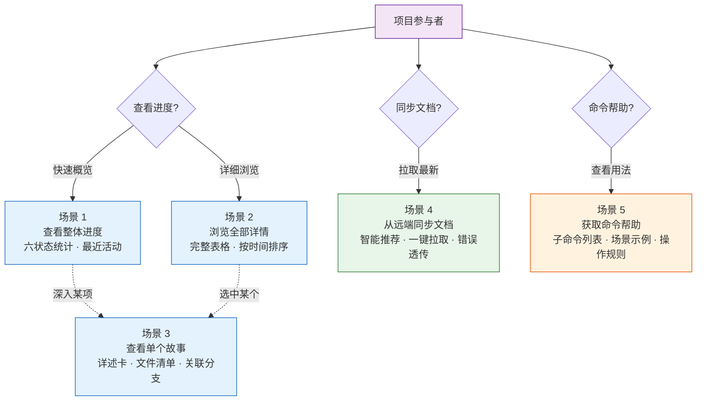
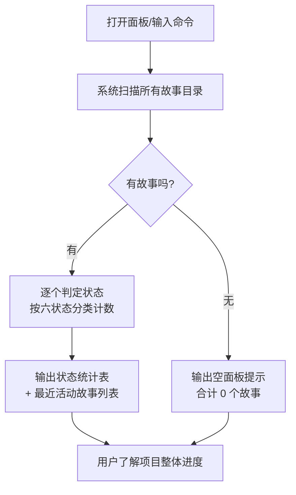
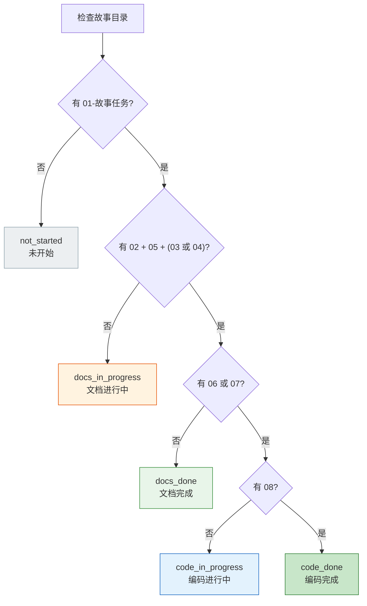
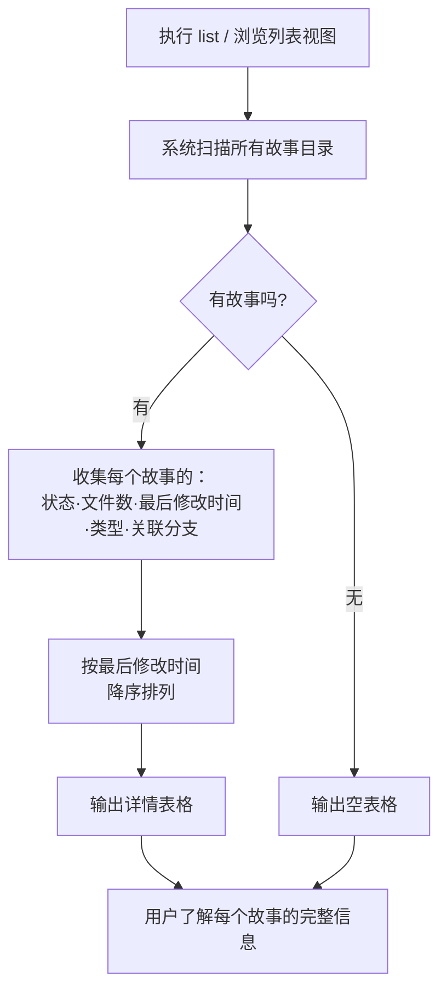
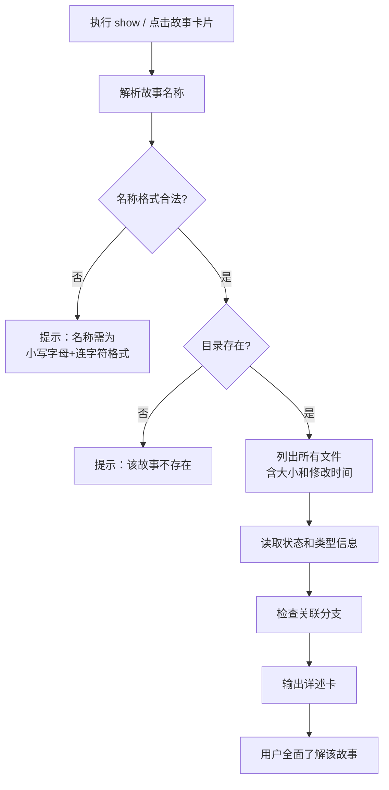
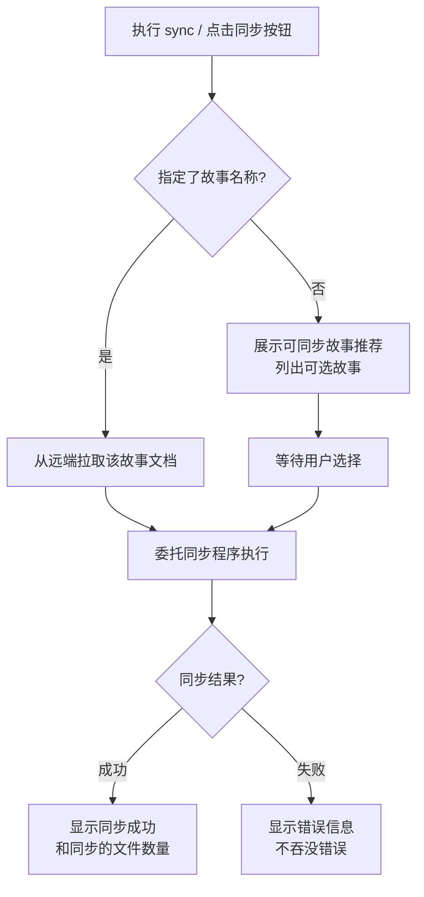
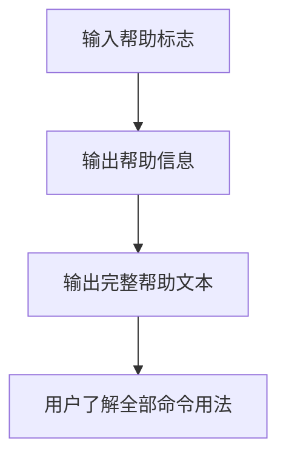

> | v2.0 | 2026-05-19 | deepseek-v4-pro | 重构自 YiAi-02 + YrY-02 |

> **导航**: [← 产品-故事任务](./故事任务.md) · [测试-测试设计 →](./测试-测试设计.md)

### 主要价值

- 👤 以用户视角描述故事面板的完整交互流程 — 从查看到同步，5 个场景全覆盖
- 🧪 每个场景覆盖正常路径、空状态和错误恢复 — 确保边缘体验不遗漏
- 👁️ 进度一眼可见 — 状态聚合和详情表格让用户无需深入每个目录即可判断项目健康度
- 🔗 双基线协同 — 每场景紧密映射产品-故事任务的 Story# 和 FP#

---

## §1 场景全景

故事任务面板提供三种入口（CLI 命令、浏览器 Web UI、API 接口），以下场景以统一用户语言描述，覆盖所有入口的公共交互逻辑。

| 入口 | 场景覆盖 | 说明 |
|------|---------|------|
| CLI (`/rui-story`) | 场景 1–5 | 命令行界面，文本表格输出 |
| Web UI (YiWeb 故事面板) | 场景 1–4 | 浏览器界面，看板/卡片/列表三视图 |
| API (YiAi 后端) | 场景 1–5 | HTTP JSON 接口，程序化消费 |

---

## §2 场景详述

### 场景 1: 查看项目整体进度

| 角色 | 触发条件 | 核心目标 | 关联产品需求 |
|------|---------|---------|---------|
| 项目参与者 | 想快速了解项目中有哪些故事、各自处于什么阶段 | 在极短时间内看到按状态分类的故事计数和最近活动 | Story 1 · FP1 · FP5 |

| # | 步骤 | 输入 | 系统响应 | 异常分支 |
|---|------|------|---------|---------|
| 1 | 触发操作 | 无任何参数 | 开始扫描故事面板目录 | — |
| 2 | 扫描目录 | — | 遍历每个故事目录，检查关键文件是否存在 | 面板目录本身不存在 → 显示 0 个故事，不报错 |
| 3 | 判定状态 | — | 按六状态模型逐一判定每个故事 | 故事目录内容异常（无任何文件）→ 判定为"未开始" |
| 4 | 聚合输出 | — | 显示六状态计数汇总 + 最近修改的故事名称和时间 | 无任何故事 → 显示"最近活动：无" |

#### 六状态判定模型

| 状态 | 判定规则 | 含义 |
|------|---------|------|
| `not_started` | 01-故事任务.md 不存在 | 故事尚未开始文档化 |
| `docs_in_progress` | 01 存在，但 02/05/(03或04) 不完整 | 文档基线正在建立 |
| `docs_done` | 文档基线齐全，06/07 不存在 | 文档阶段完成，待编码 |
| `code_in_progress` | 06 或 07 存在，08 不存在 | 编码进行中 |
| `code_done` | 08 存在，且未被阻断 | 编码完成 |
| `blocked` | .memory/rui-state.json 含 blocked=true | 被阻断 |

---

### 场景 2: 浏览所有故事详情

| 角色 | 触发条件 | 核心目标 | 关联产品需求 |
|------|---------|---------|---------|
| 项目参与者 | 需要查看每个故事的详细信息以决定工作优先级 | 在一个表格中看到所有故事的完整状态、文件数、类型和分支信息 | Story 1 · FP2 · FP5 · FP6 |

| # | 步骤 | 输入 | 系统响应 | 异常分支 |
|---|------|------|---------|---------|
| 1 | 触发操作 | 列表子命令或切换到列表视图 | 开始详细扫描 | 面板目录不存在 → 显示空表格头 |
| 2 | 收集信息 | — | 对每个故事收集：名称、状态、文件数量、最近修改时间、类型、关联分支 | 某故事目录无权限读取 → 跳过该故事并标注异常 |
| 3 | 排序排列 | — | 按最近修改时间从新到旧排列 | 所有故事修改时间相同 → 按名称字母序排列 |
| 4 | 输出表格 | — | 六列表格，每行一个故事 | — |

---

### 场景 3: 查看单个故事详情

| 角色 | 触发条件 | 核心目标 | 关联产品需求 |
|------|---------|---------|---------|
| 项目参与者 | 需要深入了解某个特定故事的完整信息 | 看到该故事的所有文件、元数据、状态和关联分支的一体化详述卡 | Story 2 · FP3 |

| # | 步骤 | 输入 | 系统响应 | 异常分支 |
|---|------|------|---------|---------|
| 1 | 触发操作 | 故事名称 | 校验名称格式 | 名称含大写字母 → 报错提示格式要求 |
| 2 | 定位目录 | — | 查找对应故事目录 | 目录不存在 → 报错提示"故事不存在" |
| 3 | 枚举文件 | — | 列出所有文件，显示每个文件的名称、大小、修改时间 | 目录为空 → 文件清单显示"无文件" |
| 4 | 读取元数据 | — | 展示当前阶段、阻断原因（如有） | 元数据文件不存在 → 相关字段显示"无" |
| 5 | 检查分支 | — | 展示关联分支名称 | 无关联分支 → 显示"无" |

> Web UI 额外支持：点击文件清单中的文件可跳转到代码审查视图并自动定位该文件。

---

### 场景 4: 从远端同步文档

| 角色 | 触发条件 | 核心目标 | 关联产品需求 |
|------|---------|---------|---------|
| 项目参与者 | 需要从远端知识库获取最新的故事文档 | 文档成功从远端同步到本地，或获知同步失败的具体原因 | Story 3 · FP4 · R2 |

| # | 步骤 | 输入 | 系统响应 | 异常分支 |
|---|------|------|---------|---------|
| 1 | 触发操作 | 可选的故事名称 | 判断是否有名称；有则直接同步，无则展示推荐 | — |
| 2 | 推荐/执行 | — | 未指定名称时展示可同步故事列表并等待选择；指定名称时委托同步程序执行 | 指定名称的故事不存在 → 报错提示 |
| 3 | 等待结果 | — | 显示同步进度或结果 | 网络故障 → 显示连接错误，建议重试 |
| 4 | 确认结果 | — | 同步成功显示文件数；失败显示原因 | 部分文件同步失败 → 列出失败项 |

---

### 场景 5: 获取命令帮助

| 角色 | 触发条件 | 核心目标 | 关联产品需求 |
|------|------|---------|---------|
| 项目参与者 | 不确定命令用法或想查看完整功能列表 | 看到包含用法说明、子命令列表和场景示例的完整帮助文本 | FP7 |

| # | 步骤 | 输入 | 系统响应 | 异常分支 |
|---|------|------|---------|---------|
| 1 | 触发操作 | 帮助标志 | 跳过所有常规逻辑，直接输出帮助信息 | 帮助信息不可用 → 报错提示 |
| 2 | 查看输出 | — | 显示：用法说明、命令列表、场景示例、操作边界、核心规则 | — |

---

## §3 场景覆盖矩阵

| 场景 | FP# | AC# | 测试文档 | 覆盖状态 | 备注 |
|------|-----|------|------------|---------|------|
| 场景 1: 查看项目整体进度 | FP1, FP5 | AC1, AC2 | 测试-测试设计 | 已覆盖 | 含空面板情况 |
| 场景 2: 浏览所有故事详情 | FP2, FP5, FP6 | AC3 | 测试-测试设计 | 已覆盖 | 含排序验证 |
| 场景 3: 查看单个故事详情 | FP3 | AC4, AC5 | 测试-测试设计 | 已覆盖 | 含不存在和格式错误的异常 |
| 场景 4: 从远端同步文档 | FP4, R2 | AC6, AC7 | 测试-测试设计 | 已覆盖 | 含错误透传 |
| 场景 5: 获取命令帮助 | FP7 | AC8 | 测试-测试设计 | 已覆盖 | — |

---

## §4 评审清单

| # | 检查项 | 状态 |
|---|--------|------|
| 1 | 场景数量 ≥ 2 | 5 个场景 |
| 2 | 每场景有流程图 | 每场景含 mermaid flowchart |
| 3 | FP# 全覆盖 | FP1–FP7 均有对应场景 |
| 4 | 异常分支明确 | 每场景步骤表含异常分支列 |
| 5 | 无技术术语 | |
| 6 | 每场景含空状态与错误恢复 | |
| 7 | 覆盖矩阵下游文档齐全 | 关联至测试-测试设计 |
| 8 | 双基线协作 — 每场景关联产品需求 | |

---

## §5 体验基线

| 角色 | 核心旅程 | 情感目标 | 痛点解决 | 成功感知 | 关联场景 |
|------|---------|---------|---------|---------|---------|
| 项目参与者 | 查看项目进度 | 清晰掌控 — 一眼看清全局，不焦虑 | 不用逐个打开目录查看状态 | 看到状态统计表，各数字一目了然 | 场景 1, 2 |
| 项目参与者 | 查找特定故事 | 快速定位 — 详述卡包含全部所需信息 | 不用分别查看文件、分支、元数据 | 看到完整详述卡，信息集中呈现 | 场景 3 |
| 项目参与者 | 从远端同步文档 | 一键完成 — 不用关心底层拉取细节 | 文档同步的复杂性被完全隐藏 | 看到同步结果和文件数量 | 场景 4 |

---

## 变更记录

| 日期 | 变更 | 触发 | 证据 |
|------|------|------|------|
| 2026-05-17 | 初始生成（YrY-02） | 文档反推生成 | 故事需求 `rui-story` |
| 2026-05-18 | v1.4 去除 delete 和 rename | T2 接口变更 | 场景总数 7→5 |
| 2026-05-18 | v1.5 文档基线补全 | YiAi-02 格式对齐 | 体验基线表修复 |
| 2026-05-19 | v2.0 角色化重构 | 去除项目前缀 · 按角色拆分 | YiAi-02 + YrY-02 合并 |
