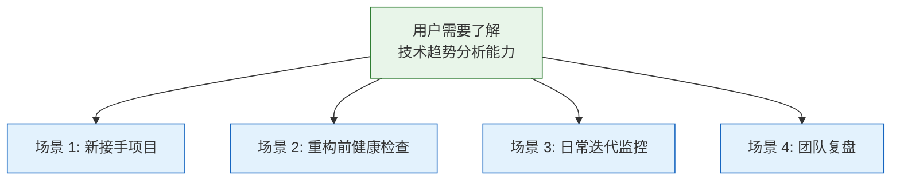
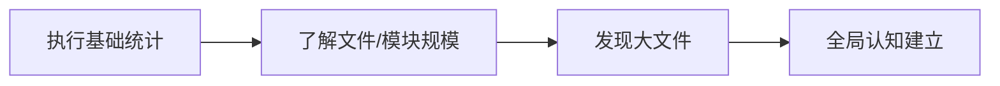
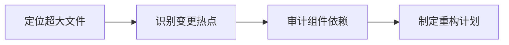
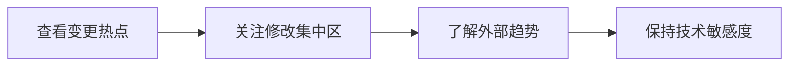

> | v1.0.0 | 2026-05-23 | deepseek-v4-pro | 🌿 feat/rui-trends-help-doc | 📎 [CLAUDE.md](../../../CLAUDE.md) |

> **导航**: [← YrY-故事任务](./YrY-故事任务.md) · [YrY-技术评审 →](./YrY-技术评审.md)

> **来源引用**: 基于 `YrY-故事任务.md` §1 + §1.1 反推。证据 Level A + 文档路径。

### 主要价值

- 👤 定义 rui-trends 帮助的用户空间基线
- 🔄 覆盖新接手项目、重构检查、日常迭代、团队复盘四类旅程
- 🛡 非 TTY 降级路径确保管道兼容
- 📋 场景覆盖矩阵对齐故事任务 FP# 和 AC#

---

## §0 基线声明

> **用户空间基线**: 本文档定义"谁使用(WHO)"和"如何体验(HOW EXPERIENCE)"。

---

## §1 场景全景

---

## §2 场景详述

### 场景 1: 新接手项目

| 角色 | 开发者 |
|------|--------|
| 触发条件 | 首次接触代码库 |
| 核心目标 | 建立全局认知，识别核心模块 |

### 场景 2: 重构前健康检查

| 角色 | 开发者 |
|------|--------|
| 触发条件 | 计划重构或架构调整 |
| 核心目标 | 定位大文件、不稳定模块和组件依赖 |

### 场景 3: 日常迭代监控

| 角色 | 开发者 |
|------|--------|
| 触发条件 | 常规开发周期 |
| 核心目标 | 追踪修改集中区域，了解外部趋势 |

### 场景 4: 团队复盘

TTY 检测降级纯文本，无 ANSI。

---

## §3 场景覆盖矩阵

| 场景 | FP# | AC# | 覆盖状态 |
|------|-----|-----|---------|
| 场景 1: 新接手项目 | FP1, FP2 | AC1 | 待覆盖 |
| 场景 2: 重构前健康检查 | FP2, FP3 | AC1 | 待覆盖 |
| 场景 3: 日常迭代监控 | FP2, FP3 | AC1 | 待覆盖 |
| 场景 4: 团队复盘 | FP1, FP2 | AC1 | 待覆盖 |

---

> **变更记录**
> | 日期 | 变更 | 触发 | 证据 |
> |------|------|------|------|
> | 2026-05-23 | 初始生成 | /rui doc --from-code rui-trends-help-doc | 故事任务 §1 + 源码 |
