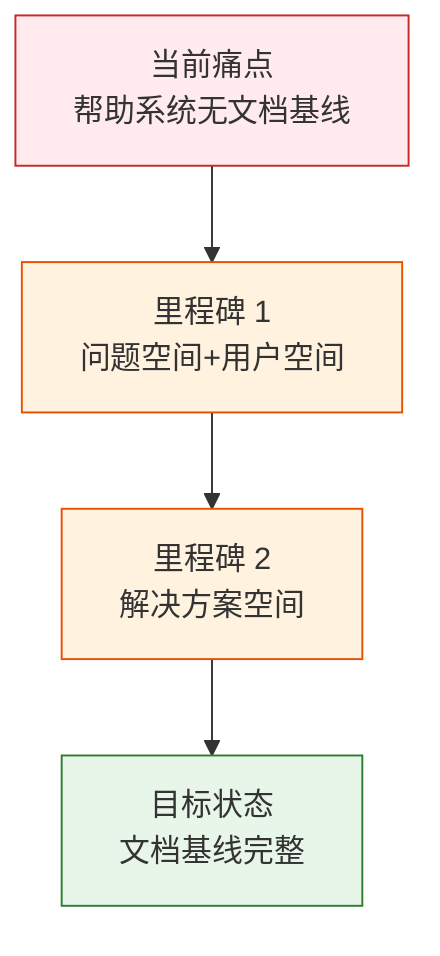

> | v1.0.0 | 2026-05-23 | deepseek-v4-pro | 🌿 feat/rui-trends-help-doc | 📎 [CLAUDE.md](../../../CLAUDE.md) |

> **导航**: [YrY-使用场景 →](./YrY-使用场景.md)

> **来源引用**: 由 `/rui doc --from-code rui-trends-help-doc` 触发，从 `skills/rui-trends/help.mjs` 源码反推。证据 Level B + 源码路径。

### 需求概述

技术趋势发现技能的入口需要帮助系统，让用户了解代码库统计、大文件检测、变更热点、组件审计、历史复盘等操作。帮助覆盖 6 个子命令、4 个可配置参数、4 类使用场景。帮助系统本身缺少文档基线。

### 效果示意

### 主要价值

- 📋 为 rui-trends 帮助系统建立问题空间基线
- 🔗 覆盖 6 个子命令 + 4 个参数的命令分类
- 🎯 使用场景覆盖新接手项目、重构检查、日常迭代、团队复盘
- 🛡 定义 TTY 降级和格式约定

---

## §1 Story

### Story 1: rui-trends 帮助系统 — 问题空间基线

| 字段 | 内容 |
|------|------|
| 作为 | 开发者 |
| 我想要 | 通过命令行查看技术趋势分析的完整帮助 |
| 以便 | 理解代码库统计、大文件检测、变更热点、组件审计等操作 |
| 优先级 | P0 |
| 范围边界 | 仅建立文档基线，不涉及源码修改 |
| 依赖 | 源码文件可读 |

#### §1.1 User Operations

| # | 操作 | 触发条件 | 操作步骤 | 预期结果 |
|---|------|---------|---------|---------|
| 1 | 查看完整帮助 | 执行帮助命令 | 输出格式化帮助 | 快速入门+子命令+参数+使用场景 |
| 2 | 按场景查找分析命令 | 需要特定分析（大文件/热点/组件/复盘） | 定位使用场景段 | 找到对应子命令 |

---

### §2 Requirements

#### 功能点

| FP# | 描述 | 优先级 |
|-----|------|--------|
| FP1 | 帮助文本生成 — 完整格式化帮助 | P0 |
| FP2 | 子命令展示 — 6 个子命令的分类展示 | P0 |
| FP3 | 参数展示 — 4 个可配置参数（threshold/since/top/l） | P1 |
| FP4 | TTY 颜色适配 | P1 |

---

### §3 成功标准

| SC# | 描述 | 目标值 |
|-----|------|--------|
| SC1 | 用户可看到完整子命令列表 | ≥ 6 子命令 |
| SC2 | 管道中无 ANSI 乱码 | `| cat` 0 转义 |

---

### §5 AC

| AC# | Given | When | Then | 门禁 |
|-----|-------|------|------|------|
| AC1 | 帮助脚本存在 | 执行帮助 | 含"快速入门""使用场景"及 6 个子命令段 | Gate A |
| AC2 | 管道到非 TTY | `help | cat` | 纯文本无 ANSI | Gate A |

---

> **变更记录**
> | 日期 | 变更 | 触发 | 证据 |
> |------|------|------|------|
> | 2026-05-23 | 初始生成 | /rui doc --from-code rui-trends-help-doc | skills/rui-trends/help.mjs |
