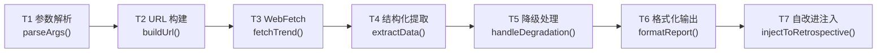
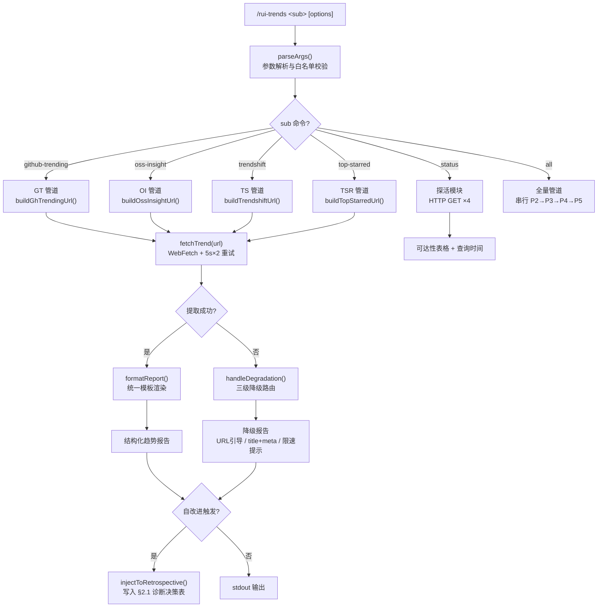
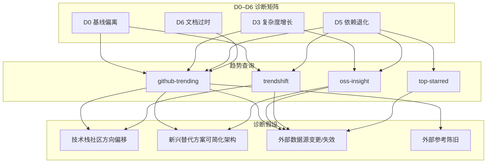
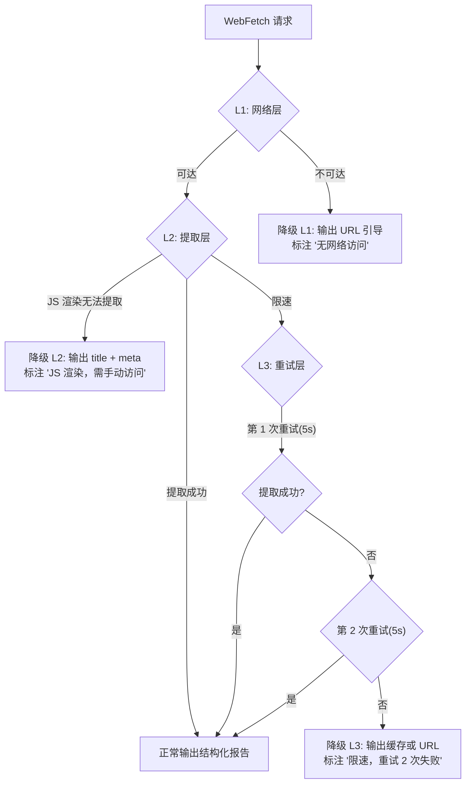
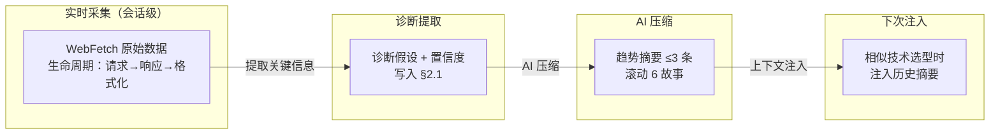

> | v1.0.0 | 2026-05-26 | deepseek-v4-pro | 🌿 feat/rui-trends | 📎 [CLAUDE.md](../../../CLAUDE.md) |

> **导航**: [← YrY-使用场景](./YrY-使用场景.md) · [YrY-测试设计 →](./YrY-测试设计.md) · [YrY-安全审计 →](./YrY-安全审计.md)

> **来源引用**: 从 `skills/rui-trends/SKILL.md` 数据源全景 + 子命令工作流 + 输出格式规约 + 自改进集成 + 降级策略 + 数据新鲜度章节反推。证据 Level B + 源码路径。本技能为规约驱动（specification-only），无代码实现，本文档定义 WebFetch 管道、数据提取策略、降级路径和自改进集成锚点。

[§0 设计决策与任务规划](#sec0-design) · [§1 系统架构](#sec1-architecture) · [§2 数据源契约](#sec2-sources) · [§3 自改进集成](#sec3-self-improve) · [§4 降级策略](#sec4-degradation) · [§5 数据新鲜度](#sec5-freshness) · [§7 安全约束](#sec7-security) · [§8 性能与限制](#sec8-performance) · [§9 评审清单](#sec9-checklist)

---

### 主要价值

- 🎯 四源统一管道 — WebFetch → 结构化提取 → 格式化输出，每个数据源有独立契约和降级路径
- 🔒 零本地缓存架构 — 每次查询实时 WebFetch，不落盘趋势数据，数据新鲜度由查询时刻保证
- ⚡ 自改进深度集成 — D0/D3/D5/D6 四类诊断各有精准的趋势信号映射，支持证据等级分层
- 📊 结构化输出模板 — 统一报告格式含排名表格 + 关键发现 + YrY 关联，可直接写入自改进复盘 §2.1
- 🔄 三级降级体系 — WebFetch 不可用 / JS 渲染 / 限速三种场景，各有独立降级路径

---

## §0 设计决策与任务规划

### §0.0 基线溯源

| 本设计章节 | 实现 故事任务 | 服务 YrY-使用场景 | 覆盖状态 |
|-----------|-------------|-----------------|---------|
| §1 系统架构 | Story 1 FP1-FP6 | 场景 A-F | 已覆盖 |
| §2 数据源契约 | FP2-FP5, R5 | 场景 A-D | 已覆盖 |
| §3 自改进集成 | Story 2 FP7, R3 | 场景 G, H, I | 已覆盖 |
| §4 降级策略 | FP1, R2, R4 | 场景 A-F 的异常分支 | 已覆盖 |
| §5 数据新鲜度 | R1 | — | 已覆盖 |
| §7 安全约束 | R5 | 场景 A-F | 已覆盖 |
| §8 性能与限制 | SC1 | 场景 E | 已覆盖 |

### §0.1 设计决策

| 决策领域 | 选定方案 | 选择理由 | 详见 | 实现 FP# |
|---------|---------|---------|------|---------|
| 技能架构 | 规约驱动（specification-only） | 趋势数据查询为纯 WebFetch + 提取，无需持久化或复杂逻辑；由 implementing agent 在运行时执行 | §1 | FP1-FP6 |
| 数据获取方式 | WebFetch 实时查询 | 趋势数据为动态内容，缓存即过时；WebFetch 为 Agent 标准能力 | §1, §5 | 全部 FP# |
| 输出格式 | 统一模板：标题 + URL + 排名表格 + 关键发现 + YrY 关联 | 确保输出可写入自改进复盘 §2.1 诊断决策表；便于人工和 Agent 消费 | §1 | FP8 |
| 降级体系 | 三级降级：无网络 → URL 引导 / JS 渲染 → title+meta / 限速 → 5s×2 重试 | 每种异常有明确用户引导，不静默失败 | §4 | FP1, R2, R4 |
| 数据源 URL | 固定模板，参数白名单约束 | 防止任意 URL 注入，仅允许声明的枚举值 | §2, §7 | R5 |
| 自改进集成 | 趋势数据 → 诊断假设 → 提案路由 → 连续触发升级 | 不自动生成提案，由 self-improve Agent 综合判定；降低误报率 | §3 | FP7, R3 |
| D5 降级策略 | no-metrics 模式：全部不可达时跳过 D5 诊断 | 不强制趋势数据，避免网络问题误判为依赖退化 | §3, §4 | FP7 |
| 数据持久化 | 趋势原始数据不落盘；诊断结论写入自改进复盘 | 原始数据会话级生命周期，诊断结论跟随故事文档生命周期 | §5 | R1 |

### §0.2 任务规划

| ID | 描述 | 工作量 | 依赖 | 交付物 | 门禁 | 实现 FP# |
|----|------|--------|------|--------|------|---------|
| T1 | CLI 参数解析与校验 | S | — | parseArgs() 白名单校验各子命令参数 | 所有枚举参数正确校验 | FP2-FP6 |
| T2 | 数据源 URL 构建 | S | T1 | buildUrl() 按子命令生成固定模板 URL | URL 符合各源契约 | FP2-FP5, R5 |
| T3 | WebFetch 执行与重试 | M | T2 | fetchTrend() 含 5s×2 重试逻辑 | 限速场景自动重试 | FP1-FP6, R4 |
| T4 | 结构化数据提取 | M | T3 | extractGitHubTrending / extractOssInsight / extractTrendShift / extractTopStarred | 每源提取至少含仓库名+star 数 | FP2-FP5 |
| T5 | 降级处理路由 | S | T3, T4 | handleDegradation() 三级降级路由 | 每种降级有明确输出 | FP1, R2 |
| T6 | 格式化报告输出 | M | T4, T5 | formatReport() 统一模板渲染 | 输出含排名表格+发现+YrY关联 | FP8 |
| T7 | 自改进诊断注入 | M | T6 | injectToRetrospective() 将趋势数据填入 §2.1 模板 | §2.1 表格趋势列完整 | FP7, R3 |

---

## §1 系统架构

### 效果示意

### 1.1 管道组件

| 变更类型 | 模块/文件 | 职责 |
|---------|----------|------|
| 新增 | parseArgs() | CLI 参数解析，白名单校验子命令与选项枚举值 |
| 新增 | buildUrl() | 按子命令类型构造固定模板 URL，参数注入受控 |
| 新增 | fetchTrend() | WebFetch 执行器，含 AbortController + 30s 超时 + 5s×2 重试 |
| 新增 | extractGitHubTrending() | 从 GitHub Trending 页面提取仓库名、描述、语言、star 数、趋势方向 |
| 新增 | extractOssInsight() | 从 OSS Insight 页面提取仓库排名、指标数据；JS 渲染则降级 |
| 新增 | extractTrendShift() | 从 TrendShift 页面提取 star 增长量/率、排名变化 |
| 新增 | extractTopStarred() | 从 GitHub Search 结果提取仓库名、描述、语言、star 数 |
| 新增 | handleDegradation() | 三级降级路由：无网络 / JS 渲染 / 限速 |
| 新增 | formatReport() | 统一模板渲染：标题 + URL + 表格 + 发现 + YrY 关联 |
| 新增 | injectToRetrospective() | 自改进集成注入，写入 §2.1 诊断决策表模板 |

---

## §2 数据源契约

### 2.1 GitHub Trending

| 属性 | 值 |
|------|-----|
| 基础 URL | `https://github.com/trending` |
| 查询参数 | `since` — `daily` \| `weekly`，默认 `daily` |
| 可选参数 | `language` — 编程语言标识符（如 `python`、`rust`） |
| URL 模板 | `https://github.com/trending/{language}?since={since}`（language 为空时省略路径段） |
| 认证要求 | 无（公开页面） |

**提取策略**：

| 字段 | 选择器/提取方式 | Fallback |
|------|----------------|---------|
| 仓库名 | 页面中 `h1` / `h2` 级标题中的 `owner/repo` 链接 | 从 URL 路径提取 |
| 描述 | 仓库卡片中的描述段落 | 标注 N/A |
| 语言 | 语言标签 span | 标注 N/A |
| 今日/本周 star 数 | star 增量文本 | 标注 N/A |
| 总 star 数 | star 计数文本 | 标注 N/A |

### 2.2 OSS Insight

| 属性 | 值 |
|------|-----|
| 基础 URL | `https://ossinsight.io/` |
| 查询参数 | 按集合页面路径访问 |
| 认证要求 | 无（公开页面） |
| 风险 | 页面为 JS 渲染，静态 WebFetch 可能无法提取结构化数据 |

**提取策略**：

| 场景 | 策略 |
|------|------|
| 结构提取成功 | 提取仓库排名、指标数据（stars/forks/contributors） |
| JS 渲染阻止提取 | 降级：输出页面 `<title>` + `<meta name="description">`，标注 `内容为 JS 渲染，需手动访问` |

### 2.3 TrendShift

| 属性 | 值 |
|------|-----|
| 基础 URL | `https://trendshift.io/github-trending-repositories` |
| 查询参数 | `trending-range` — `7` \| `30` \| `90`（天） |
| URL 模板 | `https://trendshift.io/github-trending-repositories?trending-range={range}` |
| 认证要求 | 无（公开页面） |

**提取策略**：

| 字段 | 提取方式 | Fallback |
|------|---------|---------|
| 仓库名 | 页面仓库卡片中的名称链接 | 标注 N/A |
| star 增长量 | 增长量显示文本（如 `+500`） | 标注 N/A |
| 排名变化 | 排名变化指示器 | 标注 N/A |

### 2.4 Top-Starred (GitHub Search)

| 属性 | 值 |
|------|-----|
| 基础 URL | `https://github.com/search` |
| 查询参数 | `q=stars:>{N}`、`type=repositories`、`s=stars`、`o=desc` |
| URL 模板 | `https://github.com/search?q=stars:>{N}&type=repositories&s=stars&o=desc` |
| 认证要求 | 无（公开搜索页面） |

**提取策略**：

| 字段 | 选择器/提取方式 | Fallback |
|------|----------------|---------|
| 仓库名 | 搜索结果中的仓库链接 | 标注 N/A |
| 描述 | 搜索结果的描述片段 | 标注 N/A |
| 语言 | 搜索结果中的语言标签 | 标注 N/A |
| star 数 | star 计数显示 | 标注 N/A |

### 2.5 参数白名单

| 参数 | 允许值 | 校验规则 |
|------|--------|---------|
| `--lang` | 字母数字 + `#` + `-` + `+`（编程语言标识符） | `/^[a-zA-Z0-9#\-+]+$/` |
| `--since` | `daily` \| `weekly` | 精确匹配枚举 |
| `--metric` | `stars` \| `forks` \| `contributors` | 精确匹配枚举 |
| `--range` | `7` \| `30` \| `90` | 精确匹配枚举 |
| `--limit` | 正整数 | `Number.isInteger(N) && N > 0` |
| `--min-stars` | 正整数 | `Number.isInteger(N) && N > 0` |

---

## §3 自改进集成

### 3.1 诊断 × 子命令 × 假设映射

### 3.2 诊断注入模板

| 诊断 | 推荐子命令 | 假设示例 | 基线依据 | 证据等级 | 升级条件 |
|------|----------|---------|---------|---------|---------|
| D0 | `github-trending --lang <L>` + `trendshift --range 90` | "当前技术栈与社区方向背离，可能增加长期维护成本" | CLAUDE.md 技术选型约束 | C（需执行后验证） | 连续 2 故事触发 |
| D3 | `github-trending` + `oss-insight` | "某新兴工具可替代当前 3 个依赖，降低架构复杂度" | agents/AGENT.md 深度模块原则 | C（需执行后验证） | 连续 2 故事触发 |
| D5 | `all`（四源全查） | "外部数据源有 2 个已变更域名" | rules/self-improve.md D5 规则 | C（需执行后验证） | 当前故事即修 |
| D6 | `github-trending --since weekly` | "技术趋势参考连续 3 故事未刷新，可能遗漏关键变更" | CLAUDE.md 退化对策 L2 | C（需执行后验证） | 连续 2 故事触发 |

### 3.3 提案路由

| 趋势发现 | 诊断归属 | 提案类型 | 提案示例 | 升级目标 |
|---------|---------|---------|---------|---------|
| 核心技术栈在社区趋势下降 | D0 | `process` | "建议启动技术选型复审，评估替代方案" | `rules/code-pipeline.md` §技术选型 |
| 新兴工具可简化架构 | D3 | `refactor` | "评估 {tool} 替代 {current} 的可行性与风险" | 趋势参考新增对比条目 |
| 外部参考 URL 失效 | D5 | `refactor` | "更新失效链接，补充替代数据源" | —（当前故事即修） |
| 趋势参考陈旧 | D6 | `process` | "建议每 N 故事自动刷新趋势参考" | `agents/self-improve.md` 数据源表 |

---

## §4 降级策略

### 4.1 三级降级体系

### 4.2 降级行为矩阵

| 情况 | 降级行为 | 对自改进的影响 | 输出示例 |
|------|---------|--------------|---------|
| WebFetch 不可用（网络限制） | 输出 URL 引导用户手动访问，标注 `无网络访问` | 当前子命令无结果 | `> 无网络访问，请手动访问：https://github.com/trending` |
| 页面 JS 渲染无法提取 | 输出页面 title + meta description，标注 `内容为 JS 渲染，需手动访问` | 当前子命令仅基础信息 | `> 内容为 JS 渲染，需手动访问 https://ossinsight.io/` |
| API 限速 — 第 1 次重试成功 | 间隔 5s 重试，成功后输出正常报告 | 无影响（增加 5s 延迟） | 正常结构化报告 + 来源 URL |
| API 限速 — 重试 2 次均失败 | 输出上次缓存，标注 `限速` | 数据可能滞后 | `⚠️ 限速，重试 2 次失败。以下为缓存数据（时间戳）` |
| 数据源完全不可达 | 输出 `数据源不可达，请稍后重试` | 单源降级 | `❌ trendshift.io 不可达，请稍后重试` |
| 所有数据源不可达（自改进） | 输出 `> 待补充：趋势数据不可达`，标注 `no-metrics` | D5 诊断跳过，不计入退化窗口 | `> 待补充：趋势数据不可达 [no-metrics]` |
| 部分数据源不可达（自改进） | 可用源正常输出，不可达源标注 `⚠️ 不可达` | D5 置信度降级，假设标记为 `低置信度` | 正常报告 + `⚠️ oss-insight 不可达` |
| 数据不足（仅 1 源可用） | 输出可用数据，标注 `数据不足，建议手动验证` | 跳过 E3 评估，仅生成观察记录 | 可用源报告 + `⚠️ 数据不足 (1/4 源可用)` |

---

## §5 数据新鲜度

### 5.1 零本地缓存策略

| 约束 | 说明 |
|------|------|
| 趋势原始数据 | **不落盘**，每次查询实时 WebFetch，会话结束后数据消失 |
| 诊断结论 | 通过 self-improve 的记忆压缩管线持久化，写入自改进复盘 §2.1 |
| 趋势摘要 | AI 压缩为 ≤3 条关键发现，滚动保留 6 故事窗口 |
| 趋势新鲜度标记 | 每次 D5 诊断更新"最后验证"时间戳 |

### 5.2 数据生命周期

---

## §7 安全约束

| # | 威胁 | 信任边界 | 缓解措施 | 优先级 |
|---|------|---------|---------|--------|
| 1 | 恶意参数导致 URL 注入 | 用户输入 → URL 构造 | 参数白名单枚举 + 数值型参数严格校验；URL 使用固定模板，仅替换已校验参数 | P0 |
| 2 | WebFetch 响应注入恶意内容到 stdout | 外部页面 → stdout | 提取数据仅作格式化输出，不执行 eval 或 shell 展开 | P0 |
| 3 | SSRF — 通过 URL 参数访问内部网络 | 用户输入 → WebFetch | 固定数据源域名白名单（github.com / ossinsight.io / trendshift.io），禁止用户自定义 URL | P0 |
| 4 | 数据源响应过大导致内存溢出 | 外部页面 → 进程内存 | WebFetch 响应体截断（最大 1MB），超出部分丢弃 | P1 |
| 5 | WebFetch 超时导致进程挂起 | 网络 → 进程 | AbortController + 30s 超时，超时后优雅降级 | P1 |

---

## §8 性能与限制

| 维度 | 约束 | 应对 |
|------|------|------|
| 单源查询延迟 | ≤ 15 秒（含 WebFetch + 提取 + 格式化） | WebFetch 30s 超时兜底；降级输出不阻塞 |
| all 全量查询延迟 | ≤ 60 秒（4 源串行） | 串行执行避免限速冲突；部分不可达继续下一源 |
| 内存占用 | 单次查询 ≤ 2MB（WebFetch 响应 1MB 截断 + 格式化缓冲 1MB） | 数据提取后立即释放原始响应体 |
| 并发查询 | 不支持并发（4 源串行） | 串行执行避免多源同时限速 |
| 数据吞吐 | 无持久化存储，无吞吐指标要求 | — |

---

## §9 评审清单

| # | 检查项 | 状态 |
|---|--------|------|
| 1 | 参数白名单校验完备 — 所有枚举值有精确匹配 | ✅ |
| 2 | 数据源 URL 使用固定模板，不接受原始 URL 输入 | ✅ |
| 3 | 输入校验完整 — 6 类参数均有校验规则 | ✅ |
| 4 | 降级策略三级覆盖 — 网络/JS 渲染/限速 | ✅ |
| 5 | 自改进集成闭环 — D0/D3/D5/D6 均有趋势映射 | ✅ |
| 6 | 数据新鲜度 — 不落盘约束明确 | ✅ |
| 7 | 安全约束 — URL 注入/SSRF/内容注入均有缓解 | ✅ |
| 8 | 基线溯源完备 — 每个设计章节映射至故事任务 FP# 和使用场景 | ✅ |
| 9 | 效果示意完整 — §1 含全链路 mermaid 图 | ✅ |
| 10 | 输出格式规约 — 统一模板含排名表格+关键发现+YrY 关联 | ✅ |

---

### 变更记录

| 日期 | 变更 | 触发 | 证据 |
|------|------|------|------|
| 2026-05-26 | 初始基线文档创建 — 规约驱动趋势技能技术方案 | `/rui doc --from-code rui-trends` | SKILL.md 全量规约 |
