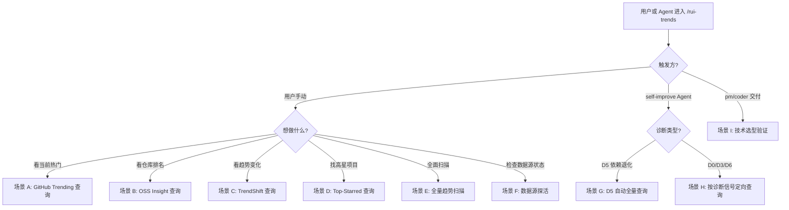
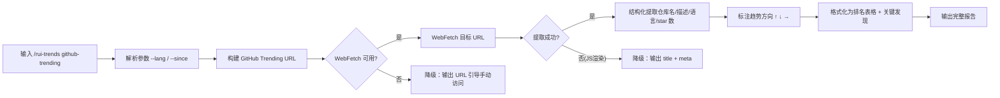
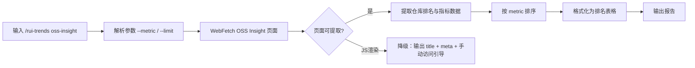
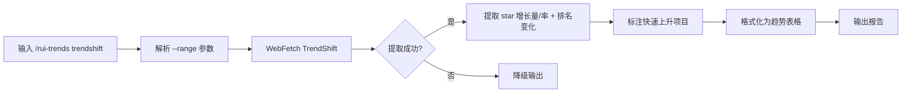
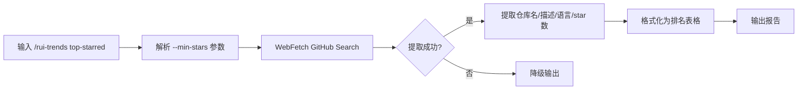
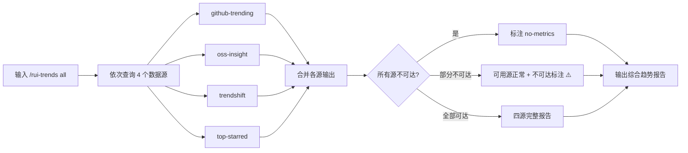
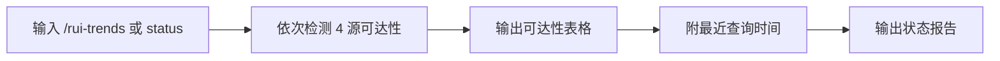
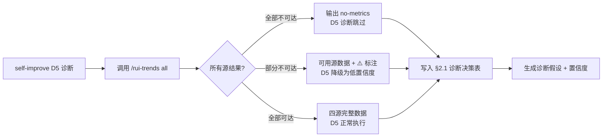
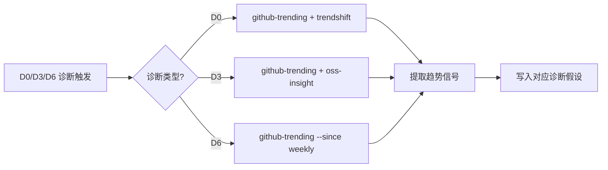
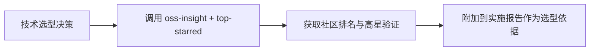

> | v1.0.0 | 2026-05-26 | deepseek-v4-pro | 🌿 feat/rui-trends | 📎 [CLAUDE.md](../../../CLAUDE.md) |

> **导航**: [← 故事任务](./故事任务.md) · [技术评审 →](./技术评审.md)

> **来源引用**: 从 `skills/rui-trends/SKILL.md` 调用形态表 + 子命令工作流 + 自改进集成触发条件全集反推。证据 Level B + 源码路径。

[§0 基线声明](#sec0-baseline) · [§1 场景全景](#sec1-scenarios) · [§2 场景详述](#sec2-details) · [§3 场景覆盖矩阵](#sec3-matrix) · [§4 评审清单](#sec4-checklist) · [§5 体验基线](#sec5-experience)

---

### §0 基线声明

> **用户空间基线 (User Space Baseline)**: 本文档定义"谁使用(WHO)"和"如何体验(HOW EXPERIENCE)"。所有交互设计(技术评审)、测试用例(测试设计)、验收标准(故事任务 §5)均必须覆盖本文档定义的每个场景。

---

### 主要价值

- 🎯 覆盖 6 类用户场景 — 从手动探索趋势到自改进自动触发，从单一源查询到全量扫描
- 🔒 降级体验完整 — 网络不可达、JS 渲染、API 限速三种异常均有明确用户引导
- ⚡ 渐进式信息披露 — 探活 → 单源查询 → 全量扫描 → 自改进自动集成，由浅入深
- 📊 多角色覆盖 — 用户手动探查 / self-improve Agent 自动触发 / pm/coder 交付验证
- 🔄 查询即所得 — 每次查询实时 WebFetch，输出报告含完整时间戳和数据源 URL，可追溯可验证

---

## §1 场景全景

---

## §2 场景详述

### 场景 A: GitHub Trending 查询

| 角色 | 触发条件 | 核心目标 |
|------|---------|---------|
| 项目参与者 / D5 诊断 | 执行 `/rui-trends github-trending [--lang L] [--since daily\|weekly]` | 获取 GitHub 当前热门仓库列表，了解社区正在关注的技术方向 |

| # | 步骤 | 输入 | 系统响应 | 异常分支 |
|---|------|------|---------|---------|
| 1 | 解析参数 | `--lang python --since weekly` | 校验参数有效性 → 构建 URL | 无效参数 → 提示有效值范围 |
| 2 | WebFetch | `https://github.com/trending/python?since=weekly` | 获取 HTML 页面内容 | 网络不可达 → 输出 URL 引导 |
| 3 | 提取数据 | HTML 内容 | 从页面选择器提取仓库列表 | 选择器失效 → 尝试通用提取 |
| 4 | 标注趋势 | 提取的 star 增量数据 | 计算趋势方向（↑上升/↓下降/→持平） | 无增量数据 → 标注 N/A |
| 5 | 格式化输出 | 结构化数据 | 生成排名表格 + 来源 URL + 时间戳 | — |

---

### 场景 B: OSS Insight 查询

| 角色 | 触发条件 | 核心目标 |
|------|---------|---------|
| 项目参与者 / 技术选型验证 | 执行 `/rui-trends oss-insight [--metric stars\|forks\|contributors] [--limit N]` | 获取按指定指标排名的开源仓库列表，用于技术选型的数据支撑 |

| # | 步骤 | 输入 | 系统响应 | 异常分支 |
|---|------|------|---------|---------|
| 1 | 解析参数 | `--metric stars --limit 20` | 校验 metric/limit 有效性 | 无效参数 → 提示有效值 |
| 2 | WebFetch | OSS Insight 集合页面 | 获取页面内容 | 网络不可达 → URL 引导 |
| 3 | 提取数据 | 页面内容 | 从页面提取仓库名、指标值 | JS 渲染 → 降级为 title + meta |
| 4 | 格式化输出 | 结构化数据 | 生成排名表格 + 来源 URL + 时间戳 | 只有 title/meta → 标注降级原因 |

---

### 场景 C: TrendShift 查询

| 角色 | 触发条件 | 核心目标 |
|------|---------|---------|
| 项目参与者 / D0 诊断 | 执行 `/rui-trends trendshift [--range 7\|30\|90]` | 获取指定时间范围内的趋势变化数据，识别快速上升或下降的项目 |

| # | 步骤 | 输入 | 系统响应 | 异常分支 |
|---|------|------|---------|---------|
| 1 | 解析参数 | `--range 30` | 校验 range 值 (7/30/90) | 无效 → 提示有效值 |
| 2 | WebFetch | TrendShift 页面 | 获取趋势数据 | 网络不可达 → URL 引导 |
| 3 | 提取趋势 | 页面内容 | 提取 star 增长量/排名变化 | 无数据 → 标注不可达 |
| 4 | 标注分析 | 趋势变化数据 | 区分快速上升/下降项目 | 无显著变化 → 标注"无明显趋势" |
| 5 | 格式化输出 | 分析结果 | 趋势表格 + 关键发现 + 来源 URL | — |

---

### 场景 D: Top-Starred 查询

| 角色 | 触发条件 | 核心目标 |
|------|---------|---------|
| 项目参与者 / 技术选型验证 | 执行 `/rui-trends top-starred [--min-stars N]` | 获取 GitHub 高星项目列表，作为社区验证的参照基线 |

| # | 步骤 | 输入 | 系统响应 | 异常分支 |
|---|------|------|---------|---------|
| 1 | 解析参数 | `--min-stars 50000` | 校验 min-stars 为合法正整数 | 无效 → 提示期望格式 |
| 2 | WebFetch | GitHub Search URL | 获取搜索结果页面 | 网络不可达 → URL 引导 |
| 3 | 提取数据 | 搜索结果 | 提取仓库名、描述、语言、star | 无结果 → 标注"无匹配项目" |
| 4 | 格式化输出 | 结构化数据 | 排名表格 + 来源 URL + 时间戳 | — |

---

### 场景 E: 全量趋势扫描

| 角色 | 触发条件 | 核心目标 |
|------|---------|---------|
| 项目参与者 | 执行 `/rui-trends all` | 依次查询四个数据源，获得全面技术趋势快照 |

| # | 步骤 | 输入 | 系统响应 | 异常分支 |
|---|------|------|---------|---------|
| 1 | 顺序执行 | 无参数 | 依次调取 4 个数据源 | 任一源不可达 → 继续下一源 |
| 2 | 汇总输出 | 各源结果 | 合并为综合报告，标注各源状态 | 全部不可达 → no-metrics 降级 |
| 3 | 格式化 | 合并数据 | 综合报告含 4 段子报告 + 汇总状态 | — |

---

### 场景 F: 数据源探活

| 角色 | 触发条件 | 核心目标 |
|------|---------|---------|
| 项目参与者 | 执行 `/rui-trends` 或 `/rui-trends status` | 检查四个数据源的当前可达性，确认趋势查询功能是否正常 |

| # | 步骤 | 输入 | 系统响应 | 异常分支 |
|---|------|------|---------|---------|
| 1 | 探活检测 | 无参数 | HTTP GET 各数据源首页 | 超时 → 标注 ❌ 不可达 |
| 2 | 最近查询 | 无参数（内存状态） | 显示上次各子命令的查询时间 | 无记录 → 标注"未曾查询" |
| 3 | 汇总输出 | 检测结果 | 可达性表格 + 最近查询时间 + 手动访问 URL | — |

---

### 场景 G: 自改进 D5 自动触发

| 角色 | 触发条件 | 核心目标 |
|------|---------|---------|
| self-improve Agent | 自改进阶段 D5 诊断开启 | 自动查询全量趋势数据，填入 §2.1 诊断决策表 |

| # | 步骤 | 输入 | 系统响应 | 异常分支 |
|---|------|------|---------|---------|
| 1 | D5 触发 | 自改进规则 D5 条件满足 | 自动调用 all 查询 | 自改进未触发 → 不查询 |
| 2 | 数据填充 | all 查询结果 | 写入 §2.1 表格趋势列 | no-metrics → 跳过本次 D5 |
| 3 | 假设生成 | 趋势数据 + 项目基线 | 生成诊断假设 + 置信度 | 数据不足 → 低置信度标记 |

---

### 场景 H: 自改进定向查询（D0/D3/D6）

| 角色 | 触发条件 | 核心目标 |
|------|---------|---------|
| self-improve Agent | 自改进阶段 D0/D3/D6 诊断触发 | 按诊断信号定向查询特定数据源 |

| # | 步骤 | 输入 | 系统响应 | 异常分支 |
|---|------|------|---------|---------|
| 1 | 诊断路由 | D0/D3/D6 触发条件 | 按诊断类型选择子命令组合 | 无匹配 → 不查询 |
| 2 | 定向查询 | 具体子命令 + 参数 | 查询对应数据源 | 不可达 → 标注降级 |
| 3 | 假设生成 | 趋势信号 | 生成诊断假设写入复盘 | — |

---

### 场景 I: 交付阶段技术选型验证

| 角色 | 触发条件 | 核心目标 |
|------|---------|---------|
| pm / coder | 交付阶段技术选型决策前 | 查询 OSS Insight + Top-Starred 获取社区数据支撑 |

| # | 步骤 | 输入 | 系统响应 | 异常分支 |
|---|------|------|---------|---------|
| 1 | 选型触发 | pm/coder 发起查询 | 查询社区数据 | 不可达 → 标注选型依据缺失 |
| 2 | 数据附加 | 查询结果 | 附加到实施报告 | — |

---

## §3 场景覆盖矩阵

| 场景 | FP# | AC# | 实现文档(技术评审) | 测试文档(测试设计) | 覆盖状态 | 备注 |
|------|-----|-----|------------------|------------------|---------|------|
| A: GitHub Trending 查询 | FP2 | AC1 | §2.1 | TC-N01, TC-N11 | 待生成 | 含参数组合 |
| B: OSS Insight 查询 | FP3 | AC2 | §2.2 | TC-N02, TC-N12 | 待生成 | JS 渲染降级 |
| C: TrendShift 查询 | FP4 | AC3 | §2.3 | TC-N03, TC-N13 | 待生成 | 含 range 参数 |
| D: Top-Starred 查询 | FP5 | AC4 | §2.4 | TC-N04, TC-N14 | 待生成 | — |
| E: 全量扫描 | FP6 | AC5 | §2.5 | TC-N05 | 待生成 | 部分源降级 |
| F: 数据源探活 | FP1 | AC6 | §2.6 | TC-N06 | 待生成 | 最近查询时间 |
| G: D5 自动触发 | FP7 | AC12, AC13 | §3 | TC-N07, TC-N09 | 待生成 | no-metrics 降级 |
| H: D0/D3/D6 定向 | FP7 | — | §3 | TC-N08 | 待生成 | 按诊断路由 |
| I: 交付选型验证 | FP7 | — | §3 | TC-N10 | 待生成 | 附加实施报告 |

---

## §4 评审清单

| # | 检查项 | 状态 |
|---|--------|------|
| 1 | 场景覆盖 ≥ 6（超过要求的 2） | ✅ |
| 2 | 每个场景含 mermaid flowchart 操作流 | ✅ |
| 3 | FP# 全覆盖（FP1-FP8 均在矩阵中） | ✅ |
| 4 | 异常分支明确 — 每个场景含 ≥1 降级路径 | ✅ |
| 5 | 无技术术语 — 使用用户可感知的语言描述 | ✅ |
| 6 | 每场景含空状态或错误恢复 — 网络不可达 / JS 渲染 / 限速三种 | ✅ |
| 7 | 覆盖矩阵下游文档齐全 — 技术评审 + 测试设计均映射 | ✅ |
| 8 | 自改进 Agent 自动触发场景独立详述 | ✅ |

---

## §5 体验基线

| 角色 | 核心旅程 | 情感目标 | 痛点解决 | 成功感知 | 关联场景 |
|------|---------|---------|---------|---------|---------|
| 项目参与者 | 执行命令 → 看到实时趋势报告 → 了解社区技术动态 | 感到信息充分、决策有据 | 此前无外部趋势参照，技术选型仅靠经验 | 看到完整的排名表格和趋势标注，知道自己了解了最新社区动态 | A, B, C, D, E, F |
| self-improve Agent | 自改进阶段自动查询 → 趋势数据填入诊断表 → 生成假设 | 诊断过程有外部信号支撑 | 此前诊断仅依赖内部基线，缺少社区方向参照 | §2.1 诊断决策表趋势列有数据，假设有置信度和基线依据 | G, H |
| pm / coder | 交付阶段决策前 → 查询社区数据 → 附加到实施报告 | 感到选型决策有社区数据背书 | 此前选型依赖主观判断或过时认知 | 实施报告含外部社区参照数据 | I |

---

### 变更记录

| 日期 | 变更 | 触发 | 证据 |
|------|------|------|------|
| 2026-05-26 | 初始基线文档创建 — 9 类用户场景 | `/rui doc --from-code rui-trends` | SKILL.md 调用形态 + 自改进集成触发条件 |
