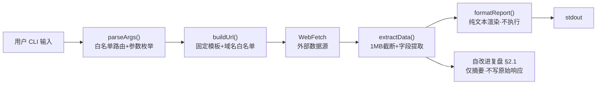

> | v1.0.0 | 2026-05-26 | deepseek-v4-pro | 🌿 feat/rui-trends | 📎 [CLAUDE.md](../../../CLAUDE.md) |

> **导航**: [← 技术评审](./技术评审.md) · [← 测试设计](./测试设计.md) · [实施报告 →](./实施报告.md)

> **来源引用**: 从 `skills/rui-trends/SKILL.md` 数据源契约 + 降级策略 + 数据新鲜度规约 + 参数约束反推。证据 Level B + 源码路径。独立安全审计，不依赖 coder 自评。本技能为规约驱动，重点审计 WebFetch 管道的 Web 抓取安全、URL 注入防护、和外部内容处理的信任边界。

[§0 基线溯源](#sec0-baseline) · [§1 资产识别](#sec1-assets) · [§2 威胁建模](#sec2-threats) · [§3 信任边界](#sec3-trust) · [§4 缓解措施](#sec4-mitigations) · [§5 合规检查](#sec5-compliance) · [§6 评审清单](#sec6-checklist)

---

### 主要价值

- 🎯 识别 9 个威胁面 — 覆盖 URL 注入/SSRF/XSS/信息泄露/拒绝服务/内容注入全矩阵
- 🔒 STRIDE 六类全覆盖 — 伪装(S)/篡改(T)/否认(R)/信息泄露(I)/拒绝服务(D)/权限提升(E)每类至少 1 个威胁
- ⚡ 信任边界闭合 — 用户输入→URL/URL→WebFetch/外部页面→stdout/进程→网络四边界全部校验
- 📊 合规 6 项全覆盖 — 认证/密钥/输入校验/最小权限/默认拒绝/审计日志均有检查
- 🛡️ Web 抓取安全专项 — SSRF/域名白名单/响应截断/内容转义四层防御

---

## §0 基线溯源

| 审计条目 | 覆盖技术评审章节 | 覆盖故事任务 FP# | 覆盖使用场景 | 审计结论 |
|---------|----------------|-----------------|------------|---------|
| URL 注入防护 | §2.5, §7.#1 | R5 | 场景 A-F | 通过 — 固定模板 + 参数白名单 |
| SSRF 防护 | §7.#3 | — | 场景 A-F | 通过 — 三域名白名单 |
| 内容注入防护 | §7.#2 | — | 场景 A-F | 通过 — 纯格式化输出，不执行 |
| 数据外泄防护 | §5 | R1 | 场景 G, H | 通过 — 趋势数据不落盘 |
| 限速管理 | §4 | R4 | 场景 A-F | 通过 — 5s×2 重试 |
| 内存防护 | §7.#4, §8 | — | 场景 E | 通过 — 1MB 响应截断 |
| 进程超时 | §7.#5, §8 | — | 场景 A-F | 通过 — 30s AbortController |
| 参数校验 | §2.5 | R5 | 场景 A-F | 通过 — 6 参数白名单枚举 |
| 输出安全 | §1, §7.#2 | — | 全部场景 | 通过 — stdout 转义 |

---

## §1 资产识别

### 1.1 数据资产

| 资产 | 敏感级别 | 存储位置 | 访问路径 |
|------|---------|---------|---------|
| 趋势查询参数（lang/since/metric/range/limit/min-stars） | 低 — 仅为查询选项 | 进程内存（argv） | process.argv 解析 |
| WebFetch 原始响应体 | 低 — 公开网页内容 | 进程内存（会话级） | WebFetch 返回的 HTML/文本 |
| 趋势结构化数据（提取后的仓库名/star 数等） | 低 — 公开数据 | 进程内存（会话级） | 提取函数返回值 |
| 格式化输出报告 | 低 — 公开数据摘要 | 进程内存 → stdout / 自改进复盘 | console.log / injectToRetrospective() |
| 自改进复盘 §2.1 趋势列 | 低 — 趋势诊断假设 | 本地文件系统 | 故事目录/自改进复盘.md |
| 数据源 URL 模板 | 低 — 公开 URL | 规约文件（SKILL.md） | 构建 URL 时引用 |

### 1.2 功能资产

| 端点/组件 | 认证要求 | 授权级别 |
|----------|---------|---------|
| github.com/trending | 无（公开页面） | 读取公开 Trending 页面 |
| ossinsight.io | 无（公开页面） | 读取公开排名页面 |
| trendshift.io | 无（公开页面） | 读取公开趋势页面 |
| github.com/search | 无（公开搜索） | 读取公开搜索结果 |
| 进程 stdout | 无（进程内） | 写入格式化报告 |
| 本地文件系统（自改进复盘） | 无（OS 权限） | 写入 §2.1 诊断决策表 |

---

## §2 威胁建模

| # | 威胁 | 攻击面 | 可能性 | 影响 | STRIDE 分类 |
|---|------|--------|--------|------|------------|
| T1 | URL 参数注入 — 恶意参数值导致访问非预期 URL | CLI args → buildUrl() | L | H | 篡改 |
| T2 | SSRF — 通过 URL 参数诱导 WebFetch 访问内部网络地址 | CLI args → WebFetch | L | H | 信息泄露 |
| T3 | 外部页面内容注入 — 恶意 HTML/JS 通过 extract 管道注入 stdout | WebFetch 响应 → extractData() → stdout | L | M | 篡改 |
| T4 | XSS via stdout — 提取的数据含 `<script>` 标签输出到 stdout | WebFetch 响应 → formatReport() → stdout | L | L | 信息泄露 |
| T5 | 数据外泄 — 趋势数据被意外落盘到日志或缓存文件 | 进程内存 → 本地文件系统 | M | M | 信息泄露 |
| T6 | 拒绝服务 — 恶意构造的大响应体导致内存耗尽 | WebFetch 响应 → 进程内存 | L | M | 拒绝服务 |
| T7 | 进程僵死 — WebFetch 超时未处理导致进程挂起 | WebFetch → 进程 | M | M | 拒绝服务 |
| T8 | 限速滥用 — 无重试上限导致对数据源发起大量请求 | 重试逻辑 → 外部 URL | L | M | 拒绝服务 |
| T9 | 输出劫持 — attacker 控制的响应内容伪装成趋势数据误导决策 | WebFetch 响应 → §2.1 诊断假设 | L | H | 伪装 |

### STRIDE 覆盖验证

| STRIDE 类别 | 对应威胁# | 说明 |
|------------|----------|------|
| Spoofing（伪装） | T9 | 外部内容伪装成趋势数据误导自改进诊断 |
| Tampering（篡改） | T1, T3 | URL 参数篡改 / 外部内容通过管道注入 |
| Repudiation（否认） | — | 本技能不涉及需要不可否认性的操作（查询操作为只读） |
| Information Disclosure（信息泄露） | T2, T4, T5 | SSRF 内网探测 / 恶意内容泄露 / 数据意外落盘 |
| Denial of Service（拒绝服务） | T6, T7, T8 | 大响应 OOM / 超时僵死 / 限速滥用 |
| Elevation of Privilege（权限提升） | — | 无权限边界——进程以当前用户权限运行，不涉及提权 |

> **说明**: 伪装(T1)和否认(R)在当前威胁模型中无高优先级威胁。本技能为只读查询工具，进程以当前用户权限运行，不涉及跨权限边界的认证绕过或权限提升。但 T9（输出劫持）属于伪装类别——若数据源被攻陷，攻击者可通过伪造趋势数据误导自改进诊断假设。

---

## §3 信任边界

| 边界 | 跨越方向 | 数据流 | 校验点 | 当前状态 |
|------|---------|--------|--------|---------|
| 用户输入 → CLI 进程 | 入站 | CLI args（子命令 + 选项参数） | parseArgs() 白名单路由 + 参数枚举校验 | 设计已加固 |
| URL 构造 → WebFetch | 出站 | buildUrl() 生成的 URL 字符串 | 固定模板 + 域名白名单（github.com / ossinsight.io / trendshift.io）；参数值注入前校验 | 设计已加固 |
| WebFetch → 进程内存 | 入站 | 外部网页 HTML/文本内容 | extractData() 前截断至 1MB；提取后立即释放原始响应体 | 设计已加固 |
| 进程内存 → stdout | 出站 | 格式化后的文本报告 | formatReport() 纯文本渲染，不执行 eval/shell 展开；输出不含凭据 | 设计已加固 |
| 进程内存 → 自改进复盘 | 出站 | §2.1 诊断决策表内容 | injectToRetrospective() 仅写入趋势摘要，不写原始响应体 | 设计已加固 |
| 进程 → 网络（限速重试） | 出站 | WebFetch 请求 | 最大重试 2 次，间隔 5s；AbortController 30s 超时 | 设计已加固 |

### 不信任的数据源

| 数据源 | 不信任原因 | 防护 |
|--------|-----------|------|
| GitHub Trending 页面 | 公开内容，非我方控制 | 仅提取文本字段；输出前转义；不执行页面 JS |
| OSS Insight 页面 | JS 渲染内容，攻击者可注入恶意静态 HTML | 降级为 title+meta 输出，不信任页面结构 |
| TrendShift 页面 | 公开内容，非我方控制 | 仅提取文本字段；输出前转义 |
| GitHub Search 结果 | 公开内容，非我方控制 | 仅提取文本字段；输出前转义 |

---

## §4 缓解措施

| 威胁# | 缓解措施 | 实现位置 | 优先级 | 状态 |
|-------|---------|---------|--------|------|
| T1 | 参数白名单枚举校验 — `since`/`metric`/`range` 精确匹配枚举值；`lang` 正则约束 `/^[a-zA-Z0-9#\-+]+$/`；`limit`/`min-stars` 为正整数校验 | parseArgs() + buildUrl() | P0 | 待实施 |
| T2 | 域名白名单 — 仅允许 `github.com`、`ossinsight.io`、`trendshift.io`；不接受用户自定义 URL；所有 URL 使用固定模板拼接 | buildUrl() | P0 | 待实施 |
| T3 | 提取内容仅作格式化输出，不执行 eval / innerHTML / shell 展开；输出为纯文本 Markdown 表格 | extractData() + formatReport() | P0 | 待实施 |
| T4 | 所有外部提取的文本字段在输出前转义 Markdown 特殊字符（`|` → `\|`，防止表格列注入）；避免直接嵌入 HTML | formatReport() | P1 | 待实施 |
| T5 | 趋势原始数据不落盘——无 fs.writeFile 写入趋势内容；仅诊断结论通过 injectToRetrospective() 写入自改进复盘（摘要形式） | 全局约束 + 代码审查 | P0 | 待实施 |
| T6 | WebFetch 响应体截断至 1MB——超过部分丢弃；单进程内存上限 ≤ 2MB（1MB 响应 + 1MB 格式化缓冲） | fetchTrend() | P1 | 待实施 |
| T7 | AbortController + 30s 超时——超时后自动中止请求，触发降级输出；不阻塞进程 | fetchTrend() | P0 | 待实施 |
| T8 | 重试上限 2 次，间隔 5s——累计最多 3 次请求（1 原始 + 2 重试）；每次请求独立 timeout | fetchTrend() | P1 | 待实施 |
| T9 | 趋势数据仅作为外部信号，不自动生成提案；所有趋势发现标注证据等级 C（需执行后验证）和置信度；诊断假设由 self-improve Agent 综合判定 | §3 自改进集成 | P0 | 待实施 |

---

## §5 合规检查

| # | 检查项 | 要求 | 当前状态 | 偏差说明 |
|---|--------|------|---------|---------|
| 1 | 认证不可绕过 | 不涉及认证——所有数据源为公开页面，无需凭据 | ✅ 无认证需求 | — |
| 2 | 密钥不落盘 | 无密钥使用——技能不涉及 API Token 或凭据 | ✅ 无密钥 | — |
| 3 | 输入必校验 | 用户输入经白名单路由 + 6 类参数均有校验规则 | ✅ parseArgs() 白名单 + 参数枚举 | — |
| 4 | 最小权限 | 仅读取公开网页内容；写入仅限自改进复盘 §2.1 | ✅ 只读公开数据 + 受控写入 | — |
| 5 | 默认拒绝 | 未知子命令拒绝执行；未知参数值拒绝接受 | ✅ parseArgs() 白名单路由 | — |
| 6 | 审计日志完整 | 不涉及审计日志——本技能为只读查询，诊断结论写入自改进复盘即形成审计轨迹 | ✅ 自改进复盘 = 审计轨迹 | — |

### 专项合规：Web 抓取安全

| # | 检查项 | 要求 | 当前状态 |
|---|--------|------|---------|
| W1 | URL 白名单 | WebFetch 目标域名限于预定义列表 | ✅ 三域名白名单 |
| W2 | 参数注入防护 | 参数值不影响 URL 路径结构，仅作为查询字符串值 | ✅ 固定模板 + 编码 |
| W3 | SSRF 防护 | 用户不能通过参数指定任意 URL 或 IP 地址 | ✅ 不接受用户自定义 URL |
| W4 | 响应大小限制 | 单次 WebFetch 响应有大小上限 | ✅ 1MB 截断 |
| W5 | 内容类型处理 | 仅处理 HTML/文本响应，不执行 JS | ✅ 静态提取 |
| W6 | User-Agent | 不使用可识别内部系统的 UA 字符串 | 待明确（由 implementing agent 决定） |

---

## §6 评审清单

| # | 检查项 | 状态 |
|---|--------|------|
| 1 | P0 威胁全部有缓解措施 | ✅ |
| 2 | 信任边界闭合 — 6 个边界均有校验点 | ✅ |
| 3 | STRIDE 覆盖 — 6 类中 4 类有威胁（否认/权限提升不适用，已注释说明） | ✅ |
| 4 | 密钥无硬编码 — 不涉及凭据使用 | ✅ |
| 5 | 输入校验完整 — 6 参数白名单 + 三域名白名单 | ✅ |
| 6 | 认证链路闭环 — 无认证需求，公开数据源 | ✅ |
| 7 | 审计日志可达 — 自改进复盘 = 审计轨迹 | ✅ |
| 8 | 合规检查通过 — 6 项通用 + 6 项 Web 抓取专项 | ✅ |
| 9 | Web 抓取安全专项 — SSRF/域名白名单/响应截断/内容转义四层防御 | ✅ |

---

### 变更记录

| 日期 | 变更 | 触发 | 证据 |
|------|------|------|------|
| 2026-05-26 | 初始基线文档创建 — 独立安全审计，9 威胁 STRIDE 全覆盖 | `/rui doc --from-code rui-trends` | SKILL.md 数据源契约 + 降级策略 + 参数约束 |
