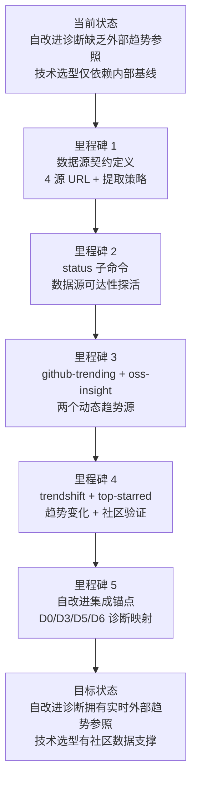

> | v1.0.0 | 2026-05-26 | deepseek-v4-pro | 🌿 feat/rui-trends | 📎 [CLAUDE.md](../../../CLAUDE.md) |

> **导航**: [使用场景 →](./使用场景.md)

> **来源引用**: 从 `skills/rui-trends/SKILL.md` 数据源全景 + 调用形态 + 自改进集成 + 降级策略 + 数据新鲜度规约反推生成。证据 Level B + 源码路径。`/rui doc --from-code rui-trends`。本技能为规约驱动（specification-only），由 implementing agent 执行 WebFetch + 结构化提取 + 格式化输出。

[§1 Story](#sec1-story) · [§2 Requirements](#sec2-requirements) · [§3 成功标准](#sec3-success) · [§4 范围边界](#sec4-scope) · [§5 AC](#sec5-ac) · [§6 风险与假设](#sec6-risks) · [§7 跨文档索引](#sec7-index)

---

### §0 基线声明

> **问题空间基线 (Problem Space Baseline)**: 本文档定义"做什么(WHAT)"和"为什么(WHY)"。所有后续文档(03-09)的设计、实现、验证、改进决策均必须可追溯至本文档的具体章节。本故事为规约驱动型技能——无代码实现，仅定义数据源契约、输出格式规约、降级策略和自改进集成锚点。实施由 implementing agent 在运行时执行 WebFetch。

---

### 需求概述

为 YrY 自改进管线的技术趋势发现提供数据支撑。通过查询 GitHub Trending、OSS Insight、TrendShift、Top-Starred 四个外部数据源，实时获取社区技术趋势快照。趋势数据用于自改进阶段 D0（基线偏离诊断）、D3（复杂度增长诊断）、D5（依赖退化诊断）、D6（文档过时诊断）的外部信号验证，以及交付阶段技术选型的社区参照。本技能不缓存数据到本地文件——每次查询均为实时 WebFetch，数据新鲜度由查询时刻保证。

### 效果示意

### 主要价值

- 🎯 四源实时趋势查询 — GitHub Trending / OSS Insight / TrendShift / Top-Starred 覆盖社区热点、仓库排名、趋势变化、高星验证
- 🔒 数据新鲜度保证 — 不缓存到本地文件，每次查询实时 WebFetch，数据新鲜度由查询时刻保证
- ⚡ 自改进诊断支撑 — D0/D3/D5/D6 四类诊断均有对应趋势信号，提供外部参照基线辅助证伪或支撑假设
- 📊 结构化输出报告 — 排名表格 + 关键发现 + YrY 关联分析，统一输出格式，可直接写入自改进复盘 §2.1
- 🔀 规约驱动无代码 — 技能仅为 specification，实施在运行时由 implementing agent 执行 WebFetch + 提取
- 🔄 提案路由闭环 — 趋势发现 → 诊断假设 → 提案生成 → 连续触发升级为规则，形成经验技能化闭环

---

## §1 Story

### Story 1: 技术趋势数据采集

| 字段 | 内容 |
|------|------|
| 作为 | 自改进 Agent 或项目参与者 |
| 我想要 | 通过统一入口查询四个外部数据源的实时技术趋势 |
| 以便 | 获取社区技术动态快照，支撑技术选型、架构验证和依赖健康检查 |
| 优先级 | P0 |
| 范围边界 | 实时查询 GitHub Trending / OSS Insight / TrendShift / Top-Starred 四个数据源，输出结构化报告 |
| 依赖 | WebFetch 功能可用，各数据源 URL 可达，网络连通 |

#### 范围外

- 不持有本地趋势数据缓存（数据新鲜度约束）
- 不自动生成改进提案——趋势发现先写入诊断假设，由 self-improve Agent 综合判定
- 不修改源码或 git 分支
- 不替代内部基线文件判断——趋势数据仅作为外部信号辅助
- 不处理需要 API Key 的商业数据源

##### §1.1 User Operations

| # | 操作 | 触发条件 | 操作步骤 | 预期结果 |
|---|------|---------|---------|---------|
| 1 | 探活 | 执行 `/rui-trends status` | 依次检查 4 个数据源 URL 可达性 → 记录最近查询时间 | 输出各源可达性状态 + 最近查询时间 |
| 2 | GitHub Trending | 执行 `/rui-trends github-trending [--lang L] [--since daily\|weekly]` | WebFetch GitHub Trending → 提取仓库名/描述/语言/star 数 → 标注趋势方向 | 输出排名表格 + 趋势标注 + 来源 URL |
| 3 | OSS Insight | 执行 `/rui-trends oss-insight [--metric stars\|forks\|contributors] [--limit N]` | WebFetch OSS Insight → 提取仓库排名/指标数据 → 格式化表格 | 输出排名表格 + 来源 URL |
| 4 | TrendShift | 执行 `/rui-trends trendshift [--range 7\|30\|90]` | WebFetch TrendShift → 提取 star 增长量/排名变化 → 标注快速上升项目 | 输出趋势变化表格 + 来源 URL |
| 5 | Top-Starred | 执行 `/rui-trends top-starred [--min-stars N]` | WebFetch GitHub Search → 提取仓库名/描述/语言/star 数 | 输出排名表格 + 来源 URL |
| 6 | 全量查询 | 执行 `/rui-trends all` | 依次执行 4 个子命令 → 合并输出综合报告 | 输出综合趋势报告 |

---

### Story 2: 自改进诊断集成

| 字段 | 内容 |
|------|------|
| 作为 | self-improve Agent |
| 我想要 | 在自改进阶段自动查询趋势数据并填入诊断决策表 |
| 以便 | D0/D3/D5/D6 诊断拥有外部社区参照基线，辅助证伪或支撑诊断假设 |
| 优先级 | P0 |
| 范围边界 | 趋势数据仅在指定诊断触发时查询，不强制每次自改进都执行 |
| 依赖 | Story 1 完成，self-improve Agent 诊断规则（rules/self-improve.md）可用 |

#### 范围外

- 不自动生成替代方案——仅提供趋势信号，决策由 self-improve Agent 综合其他数据源后判定
- 不修改基线文件——趋势发现通过提案路由间接影响基线
- 不替代内部规则判断——趋势数据仅作为外部信号

##### §1.1 User Operations

| # | 操作 | 触发条件 | 操作步骤 | 预期结果 |
|---|------|---------|---------|---------|
| 1 | D5 自动触发 | self-improve 阶段 D5 诊断开启 | 执行 `/rui-trends all` → 提取关键发现 → 填入 §2.1 诊断决策表 | §2.1 趋势列填写完整，含假设+置信度+基线依据 |
| 2 | D0 自动触发 | self-improve 阶段 D0 诊断触发 | 执行 github-trending --lang <L> + trendshift --range 90 → 分析技术栈方向 | D0 趋势信号写入诊断假设 |
| 3 | D3 自动触发 | self-improve 阶段 D3 诊断触发 | 执行 github-trending + oss-insight → 评估新兴替代方案 | D3 复杂度降低机会写入诊断假设 |
| 4 | D6 自动触发 | self-improve 阶段 D6 诊断触发 | 执行 github-trending --since weekly → 检查外部参考新鲜度 | D6 趋势陈旧标记写入诊断假设 |
| 5 | 交付阶段触发 | pm/coder 发起技术选型验证 | 执行 oss-insight + top-starred → 附加到实施报告 | 选型依据附加到实施报告 |
| 6 | 经验技能化触发 | 同趋势发现连续 ≥2 故事触发 | 执行 all → 升级为规则 | 趋势新鲜度检查规则写入 agents/self-improve.md 数据源表 |

---

## §2 Requirements

### 功能点

| FP# | 描述 | 输入 | 输出 | 错误行为 | 优先级 |
|-----|------|------|------|---------|--------|
| FP1 | 数据源状态检查 | `/rui-trends` 或 `/rui-trends status` | 各数据源可达性状态 + 最近查询时间戳 | 不可达源标注 ❌ + 原因（网络限制/JS 渲染/限速） | P0 |
| FP2 | GitHub Trending 查询 | `--lang L` `--since daily\|weekly` | 排名表格（仓库名/描述/语言/star 数/趋势方向）+ 来源 URL + 时间戳 | WebFetch 不可达→输出 URL 引导手动访问 | P0 |
| FP3 | OSS Insight 查询 | `--metric stars\|forks\|contributors` `--limit N` | 排名表格 + 来源 URL + 时间戳 | JS 渲染不可提取→降级为 title+meta+手动访问引导 | P0 |
| FP4 | TrendShift 查询 | `--range 7\|30\|90` | 趋势变化表格（star 增长量/率/排名变化）+ 快速上升/下降标注 | WebFetch 不可达→输出 URL 引导手动访问 | P0 |
| FP5 | Top-Starred 查询 | `--min-stars N` | 排名表格（仓库名/描述/语言/star 数）+ 来源 URL | WebFetch 不可达→输出 URL 引导手动访问 | P1 |
| FP6 | 全量查询 | `/rui-trends all` | 依次输出 4 源报告，标注各源状态 | 部分源不可达→可用源正常输出，不可达源标注 ⚠️ | P1 |
| FP7 | 自改进 D5 诊断集成 | self-improve Agent 调用 `all` | §2.1 诊断决策表趋势列填充 | 所有源不可达→输出 `> 待补充：趋势数据不可达`，标注 `no-metrics`，D5 跳过 | P0 |
| FP8 | 输出格式标准化 | 所有子命令 | 统一格式：报告标题 + 数据源 URL + 排名表格 + 关键发现 + YrY 关联 | 部分字段无法提取→标注 `N/A` | P1 |

### 业务规则

| R# | 描述 | 校验方式 | 证据级别 |
|----|------|---------|---------|
| R1 | 趋势数据不缓存到本地文件 | 代码审查确认无 fs.writeFile 写入趋势数据 | B |
| R2 | WebFetch 不可用时的降级行为 | 模拟网络断开测试 | B |
| R3 | 同一趋势信号连续 ≥2 故事触发升级为规则 | 检查 proposals.jsonl + 自改进复盘 §3.3 | B |
| R4 | API 限速时重试间隔 5s，最多 2 次 | 限速场景模拟 | B |
| R5 | URL 使用固定模板，不接受用户自定义 URL | 参数注入测试 | A |

### 数据源约束

| 约束 | 类型 | 范围/格式 | 来源 |
|------|------|----------|------|
| GitHub Trending URL | string | `https://github.com/trending(?since=daily\|weekly&language=<L>)` | SKILL.md |
| OSS Insight URL | string | `https://ossinsight.io/` + 具体集合页面 | SKILL.md |
| TrendShift URL | string | `https://trendshift.io/github-trending-repositories?trending-range=<N>` | SKILL.md |
| Top-Starred URL | string | `https://github.com/search?q=stars:><N>&type=repositories&s=stars&o=desc` | SKILL.md |
| lang 参数 | string | 编程语言标识符，如 javascript/python/rust | 用户输入，需校验有效性 |
| since 参数 | enum | `daily` \| `weekly` | SKILL.md |
| range 参数 | enum | `7` \| `30` \| `90` | SKILL.md |
| metric 参数 | enum | `stars` \| `forks` \| `contributors` | SKILL.md |
| limit N | integer | 正整数，默认值由子命令定义 | SKILL.md |
| min-stars N | integer | 正整数，用于 GitHub Search stars 过滤 | SKILL.md |

---

## §3 成功标准

| SC# | 描述 | 度量方式 | 目标值 | 优先级 | 关联 FP# |
|-----|------|---------|--------|--------|---------|
| SC1 | 用户在 30 秒内获得任一数据源的完整趋势报告 | 从命令执行到报告输出完整的时间，包含排名表格 + 关键发现 + YrY 关联三部分 | ≤ 30 秒 | P0 | FP2, FP3, FP4, FP5 |
| SC2 | 数据源不可达时用户能明确知道原因和手动替代方案 | 检查降级输出是否包含 URL 引导 + 不可达原因标注 | 100% 降级场景有明确引导 | P0 | FP1 |
| SC3 | 自改进阶段 D5 诊断时趋势数据自动填充到诊断决策表 | 检查 §2.1 表格是否包含趋势列数据，每源至少 1 条关键发现 | 所有可用源的数据均填入 | P0 | FP7 |
| SC4 | 用户可通过不同参数组合获得定制化的趋势视图 | 每种有效参数组合均输出对应格式的报告 | 所有文档声明的参数组合可用 | P1 | FP2, FP3, FP4, FP5 |
| SC5 | 趋势发现可被自改进管线追踪并升级为规则（连续 ≥2 故事触发） | 检查 proposals.jsonl 是否含趋势触发提案 + 自改进复盘 §3.3 是否标注升级状态 | 连续 2 故事触发后规则升级完成 | P1 | FP7, R3 |

---

## §4 范围边界

### 范围内

| # | 条目 | 关联 FP# | 边界说明 |
|---|------|---------|---------|
| 1 | 四数据源 WebFetch + 结构化提取 | FP2, FP3, FP4, FP5 | 仅提取公开可见数据，不越权访问 |
| 2 | 数据源可达性探活 | FP1 | 仅测试 URL 可达性，不发起写入 |
| 3 | 自改进诊断集成锚点 | FP7 | 趋势数据作为诊断假设的外部信号，决策权归 self-improve Agent |
| 4 | 结构化趋势报告输出 | FP8 | 统一格式：排名表格 + 关键发现 + YrY 关联 |
| 5 | 降级策略执行 | FP1, FP7 | WebFetch 不可用 / JS 渲染 / 限速三种降级路径 |
| 6 | 参数校验与路由 | FP2, FP3, FP4, FP5 | 白名单枚举约束，拒绝任意 URL 参数 |

### 范围外

| # | 条目 | 排除原因 | 替代方案 |
|---|------|---------|---------|
| 1 | 趋势数据本地缓存 | 数据新鲜度约束——趋势数据为实时动态内容，缓存即过时 | 由调用方（自改进 Agent）决定是否写入自改进复盘 |
| 2 | 自动生成改进提案 | 趋势发现仅作为外部信号，决策需综合多数据源 | 趋势发现先写入诊断假设，由 self-improve Agent 综合判定 |
| 3 | 支持商业数据源（需 API Key） | 增加凭证管理复杂度，超出规约驱动范围 | 后续故事可扩展 |
| 4 | 趋势预测或时间序列分析 | 属于数据分析领域，非趋势发现职责 | 可由自改进 Agent 在诊断阶段自行分析 |
| 5 | 企业内部代码仓库趋势 | 数据源限定为公开 GitHub 生态 | 后续故事可扩展内部数据源 |

### 灰色区域

| # | 条目 | 触发条件 | 决策人 |
|---|------|---------|--------|
| 1 | 新增第 5 个数据源 | 社区出现新的高价值趋势数据平台 | pm |
| 2 | 趋势数据缓存策略调整 | 自改进阶段发现反复查询同一数据源影响效率 | pm + self-improve |
| 3 | 趋势数据作为 Gate 阻断条件 | 趋势发现极端偏离（核心依赖被归档/废弃）是否阻断发布 | pm + security |

---

## §5 AC

| AC# | Given | When | Then | 门禁 |
|------|-------|------|------|------|
| AC1 | 网络正常，GitHub Trending 页面可达 | 执行 `/rui-trends github-trending --lang python --since weekly` | 输出 Python 语言本周 trending 仓库排名表格，含趋势方向标注 | Gate A |
| AC2 | 网络正常，OSS Insight 页面可达 | 执行 `/rui-trends oss-insight --metric stars --limit 20` | 输出按 star 排名前 20 仓库表格 | Gate A |
| AC3 | 网络正常，TrendShift 页面可达 | 执行 `/rui-trends trendshift --range 30` | 输出近 30 天趋势变化表格，含上升最快项目标注 | Gate A |
| AC4 | 网络正常，GitHub Search 页面可达 | 执行 `/rui-trends top-starred --min-stars 50000` | 输出 ≥ 50000 star 的仓库排名表格 | Gate A |
| AC5 | 网络正常，所有 4 源可达 | 执行 `/rui-trends all` | 依次输出 4 源完整报告，含各源状态标注 | Gate A |
| AC6 | 网络正常（或至少部分源可达） | 执行 `/rui-trends status` | 输出各源可达性表格 + 最近查询时间戳 | Gate A |
| AC7 | WebFetch 不可用（无网络） | 执行任意子命令 | 输出可手动访问的 URL 引导，标注 `无网络访问` | Gate A |
| AC8 | 页面为 JS 渲染无法提取结构化数据 | 执行 oss-insight 子命令 | 输出页面 title + meta description，标注 `内容为 JS 渲染，需手动访问` | Gate A |
| AC9 | API 限速，首次请求失败 | 执行任意子命令 | 自动间隔 5s 重试（最多 2 次），最终结果标注是否重试成功 | Gate A |
| AC10 | API 限速，2 次重试均失败 | 执行任意子命令 | 输出上次缓存（如有），标注 `限速，重试 2 次失败` | Gate A |
| AC11 | 网络正常，任一子命令执行 | 执行 `/rui-trends ` | 输出格式符合报告模板：标题 + 数据源 URL + 排名表格 + 关键发现 + YrY 关联 | Gate A |
| AC12 | self-improve Agent 调用 all 且所有源不可达 | D5 诊断执行 | 输出 `> 待补充：趋势数据不可达`，标注 `no-metrics`，D5 诊断跳过 | Gate A |
| AC13 | self-improve Agent 调用 all 且部分源不可达 | D5 诊断执行 | 可用源正常输出，不可达源标注 ⚠️，D5 置信度降级为 `低置信度` | Gate A |

---

## §6 风险与假设

| # | 风险/假设 | 类型 | 可能性 | 影响 | 缓解/验证策略 | 关联 FP# |
|---|----------|------|--------|------|-------------|---------|
| 1 | 数据源页面结构变更导致提取失败 | 风险 | M | H | 每个数据源的提取逻辑定义 fallback 提取策略（从具体选择器降级为通用内容提取）；定期 status 探活 | FP2, FP3, FP4, FP5 |
| 2 | 所有数据源同时不可达 | 风险 | L | H | 降级为 no-metrics 模式，D5 诊断跳过且不计入退化窗口；输出手动访问 URL | FP1, FP7 |
| 3 | JS 渲染页面（OSS Insight）无法通过静态 WebFetch 提取 | 风险 | H | M | 降级为输出 title + meta + 手动访问引导；后续可评估 Puppeteer/Playwright 方案 | FP3 |
| 4 | API 限速导致连续查询失败 | 风险 | M | M | 5s 间隔重试 2 次；仍失败则输出上次缓存或 URL 引导 | FP2, FP3, FP4, FP5 |
| 5 | 趋势数据被误读为强制性决策依据 | 风险 | M | M | 明确标注"趋势数据仅作为外部信号，不替代内部基线判断"；不自动生成提案 | FP7, R3 |
| 6 | GitHub 修改反爬策略导致 WebFetch 被拦截 | 风险 | L | H | 使用标准 WebFetch；被拦截时输出 URL 引导手动访问 | FP2, FP5 |
| 7 | 趋势新鲜度窗口过长导致数据与实际脱节 | 假设 | L | M | 每次查询实时获取，不缓存；若 WebFetch 时延过长则标注查询时间戳 | R1 |
| 8 | self-improve 阶段跳过 rui-trends 查询 | 假设 | M | L | 不强制查询；D5 诊断栏标注 `未查询趋势数据`，不视为偏差 | FP7 |

---

## §7 跨文档索引

| 本文档章节 | 基线内容 | 下游文档编号 | 预期覆盖 | 状态 |
|-----------|---------|------------|---------|------|
| §1 Story 1 | 四数据源查询 FP2-FP5 | 使用场景 §2 场景 A-D | 用户查询四源的完整操作流 | 待生成 |
| §1 Story 2 | 自改进集成 FP7 | 使用场景 §2 场景 C | self-improve 自动触发流程 | 待生成 |
| §1 Story 1 | status 探活 FP1 | 使用场景 §2 场景 B | 数据源健康检查操作流 | 待生成 |
| §2 Requirements FP1-FP8 | 功能点与数据源约束 | 技术评审 §2 数据源契约 | 四源 URL 模式 + 提取策略 + 降级 | 待生成 |
| §4 范围边界 | 灰色区域 #3 | 安全审计 §5 合规检查 | 趋势发现极端偏离是否阻断的风险评估 | 待生成 |
| §5 AC1-AC13 | 验收标准 | 测试设计 §2 测试用例 | 所有 AC 的测试用例覆盖 | 待生成 |
| §6 风险与假设 | 风险 #1-#8 | 安全审计 §2 威胁建模 + §4 缓解措施 | STRIDE 威胁建模 + 缓解策略 | 待生成 |
| §3 成功标准 SC1-SC5 | 用户可感知成功标准 | 技术评审 §8 性能与限制 | 30s 内输出报告的性能约束实现 | 待生成 |
| §L 自改进循环 | 自改进闭环 | 自改进复盘 | 趋势发现→诊断→提案→规则升级闭环 | 待生成 |

---

### 变更记录

| 日期 | 变更 | 触发 | 证据 |
|------|------|------|------|
| 2026-05-26 | 初始基线文档创建 — 四数据源趋势发现技能 | `/rui doc --from-code rui-trends` | SKILL.md 数据源全景 + 调用形态 + 自改进集成 |
